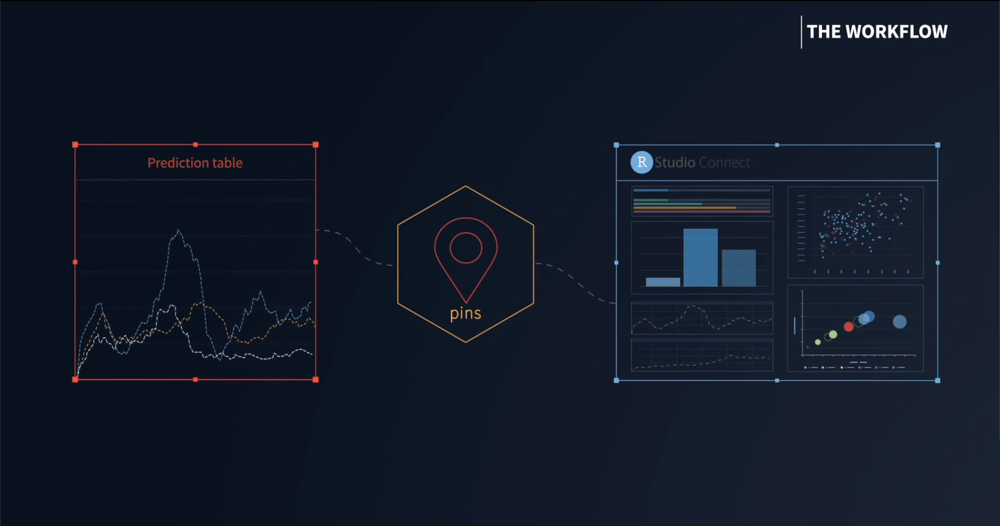
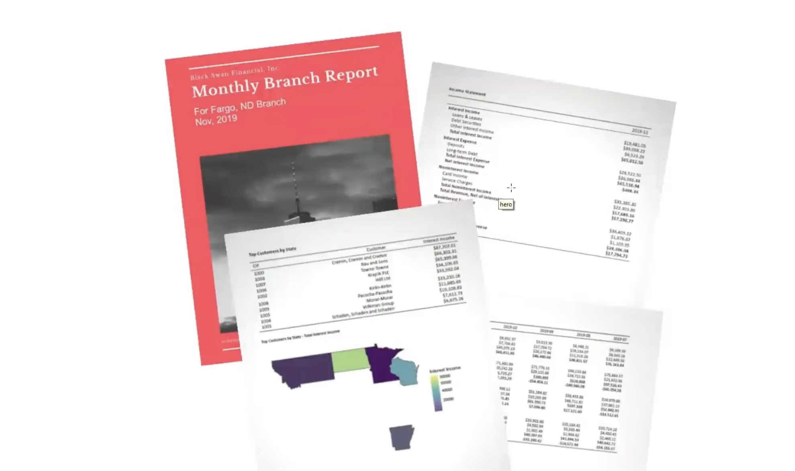
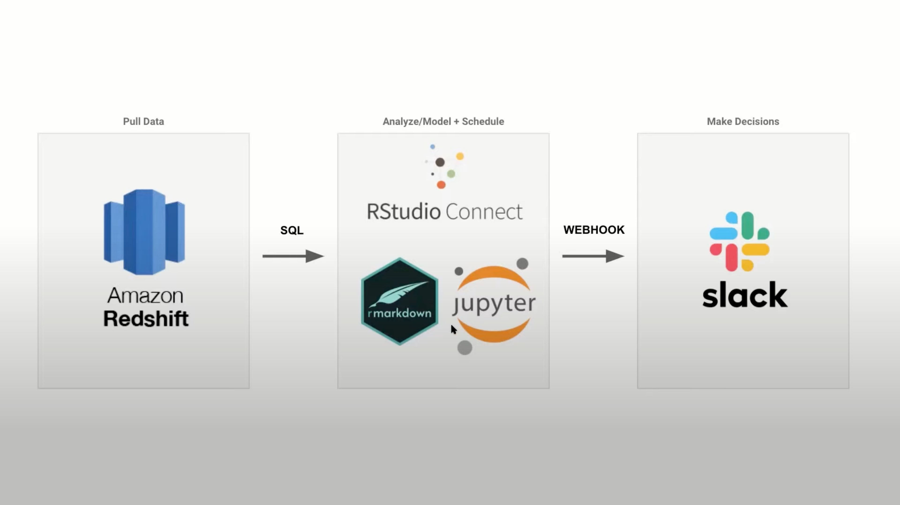
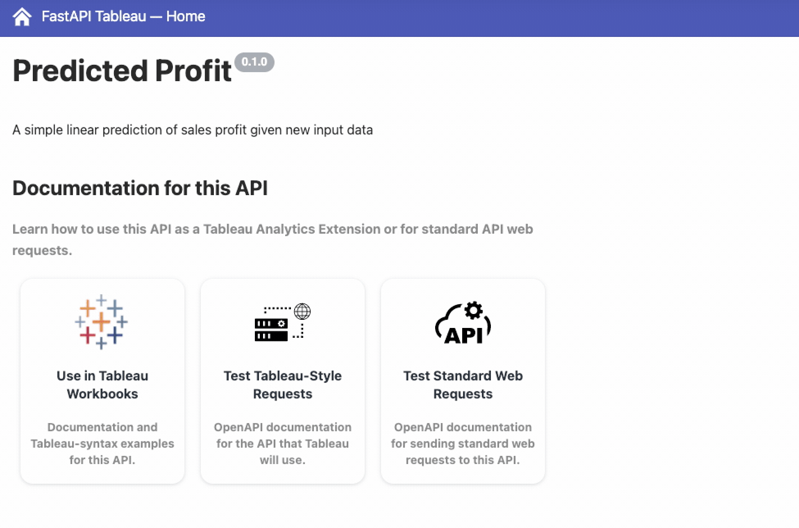
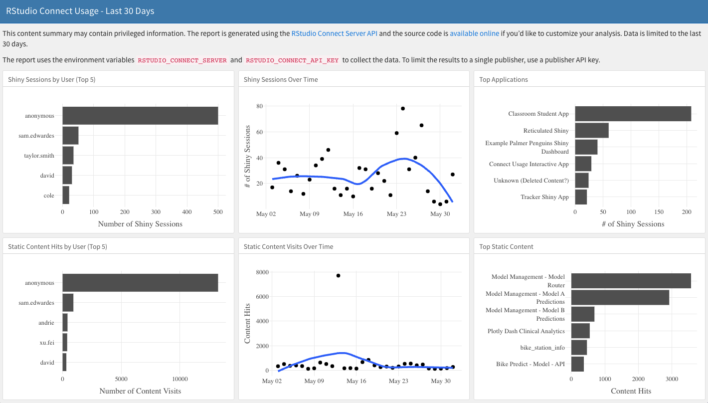
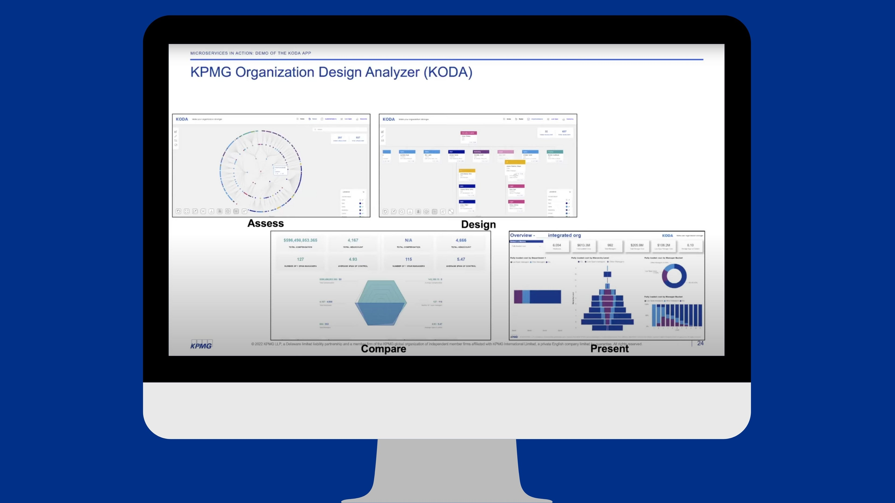

In speaking with the community, I hear about so many different ways that teams are using <a href="https://www.rstudio.com/products/connect/" target="_blank">RStudio Connect</a> and providing value across their companies.

On Twitter I posted [**10 ways RStudio Connect can give your data science team superpowers**](https://twitter.com/_RachaelDempsey/status/1532830320516546562?s=20&t=NfaSd2S66q_Zeo_a6EDvRA) and thought it'd be helpful to share here as well. 

I'd love to hear about all the other ways your team is using RStudio Connect and about the cool things you are building too! If you’re interested in sharing your work at a meetup as well, please consider filling out the <a href="https://docs.google.com/forms/d/e/1FAIpQLSexuUNx-_qOkPl8JXogf8TtCo6DyLyzB2YCtm5CjBgIGTFmhg/viewform?usp=send_form" target="_blank">speaker submission form</a>.

### So, here we go! 

How many have you done?

1.  [Start sharing Shiny applications](#Shiny)
2.  [Deploy pins to share data, models, and other R objects across projects and with your colleagues](#Pins)
3.  [Build a blog to share work & best practices among others at your company and/or help facilitate a meetup group](#Blog)
4.  [Schedule automated PDF reports with parameterized R Markdown for business stakeholders](#Parameterized)
5.  [Use RStudio with communication channels (like Slack) that are already in use by business stakeholders](#Slack)
6.  [Build a custom landing page for business stakeholders to make content discovery easier](#Landing)
7.  [Use an internally created package to standardize dashboards across the team](#Package)
8.  [Use APIs to enable Tableau users at your company to leverage work done by your data science team in R and Python](#Tableau)
9.  [Check out the Connect Server API to utilize usage data that helps answer questions like: Is my CEO using this app?](#ConnectAPI)
10. [Host microservices via Plumber APIs that connect data science work with your data engineering & development teams](#Microservices)

You can also [replace any of the examples above with Python](#Python) because RStudio Connect supports Jupyter, Flask, FastAPI, Dash, Streamlit, Bokeh, mixed R/Python content with reticulate, Python pins, etc.  

### Of course, start sharing Shiny applications

Shiny makes it easy to build interactive web applications straight from R.

Here's an [example of how Microsoft's data scientists use Shiny](https://youtu.be/07j22d4B_hA) and own the model development life cycle from data ingestion, model development, model deployment to visualization of insights with Paul Chang.

* <a href="https://youtu.be/07j22d4B_hA" target="_blank">Meetup Recording: Capacity Planning for Microsoft Azure Data Centers Using R & RStudio Connect</a>  
* <a href="https://lnkd.in/gh-hGScE" target="_blank">Meetup slides</a>  
* <a href="https://www.shiny.rstudio.com" target="_blank">Shiny website</a>  

### Deploy pins to share data, models, and other R objects across projects and with your colleagues.

The <a href="www.pins.rstudio.com" target="_blank">pins package</a> publishes data, models, and other R objects, making it easy to share them across projects and with your colleagues. Pins can be automatically versioned, making it straightforward to track changes, re-run analyses on historical data, and undo mistakes.  

Here's an [example of how the City of Reykjavík pins models that are used in their Shiny app](https://youtu.be/e2h-BVgY4VA) to show the capacity of pools with Hlynur Hallgrímsson.

* <a href="https://youtu.be/e2h-BVgY4VA" target ="_blank">Meetup recording: The data you were promised...and the data that you got</a>
* <a href="https://hlynurhallgrims.github.io/the_data_you_were_promised/#1" target = "_blank">Meetup slides</a>
* <a href="https://rstudio.com/iceland" target="_blank">Short-film featuring the City of Reykjavík's data team</a>

### Build a blog to share work & best practices among others at your company and/or to help facilitate a meetup group

Your internal data science community helps each other learn, collaborate, and share. However, you may not have a central place for your assets, making it difficult for members to find information from the past or know where to save their work.

A blog can be a lightweight way to consolidate resources, events, and other information for your internal data science community. Here's an [example of deploying a blog to RStudio Connect](https://youtu.be/MrW5XFf7aps) with Isabella Velasquez.

* <a href="https://youtu.be/MrW5XFf7aps" target="_blank">Meetup recording: Building a blog with R</a>
* <a href="https://colorado.rstudio.com/rsc/building-a-blog-with-r/Building%20a%20Blog%20With%20R.html#/section" target="_blank">Meetup slides</a>
* <a href="https://github.com/ivelasq/internal-blog-example" target="_blank">GitHub Link for Internal Blog Example</a>

### Schedule automated PDF reports with parameterized R Markdown for business stakeholders

One of the many benefits of working with R Markdown is that you can reproduce analysis at the click of a button. This makes it very easy to update any work and alter any input parameters within the report. 

Parameterized reports extend this one step further, and allow users to specify one or more parameters to customize the analysis. This is useful if you want to create a report template that can be reused across multiple similar scenarios. 

Here's an [example of creating an income statement for a group of theoretical office branches with parameterized R Markdown](https://youtu.be/JsaGSrM8aZ0) with Brad Lindblad.

* <a href="https://youtu.be/JsaGSrM8aZ0" target="_blank">Meetup recording: Professional financial reports with R Markdown</a>
* <a href="https://github.com/bradlindblad/pro_reports_talk" target="_blank">Github link</a>

### Use RStudio with communication channels (like Slack) that are already in use by business stakeholders.

Serving stakeholders data in the moment they need it in an environment where they are already talking about business performance can help in democratizing information, especially when end-users are experiencing dashboard overload.

Here's an [example of how Campaign Monitor serves individualized insights directly to stakeholders with R, Python, and RStudio Connect](https://lnkd.in/gk6GKHSR) with Matthias Mueller.

* <a href="https://youtu.be/Y2zoRCXgPwk" target="_blank">Meetup recording: Serving bespoke insights through automation</a>
* <a href="https://www.rstudio.com/blog/r-in-marketing-meetup/" target="_blank">Blog post: Democratizing Data with R, Python, and Slack</a>

### Build a custom landing page for business stakeholders to make content discovery easier

How do you make sure your audience finds what they need on RStudio Connect without paging through the dashboard, remembering the right search terms, or bookmarking every content item you share?

After deploying many pieces of related content, how do you share them as a cohesive project?

Here's a [walkthrough of using connectwidgets to build your ideal showcase of data products](https://youtu.be/GBNzhIkObyE) with Kelly O'Briant.

&nbsp;

<caption>Example of gallery created by connectwidgets</caption>
  

 

* <a href="https://youtu.be/GBNzhIkObyE" target="_blank">Meetup recording: Building your ideal showcase of data products</a>
* <a href="https://www.rstudio.com/blog/rstudio-connect-data-showcase/" target="_blank">Blog post: Curating Your Data Science Content on RStudio Connect</a>

### Use an internally created package to standardize dashboards across the team

Here's an [example of how Snap Finance ensures a reproducible development workflow with a Shiny dashboard framework](https://youtu.be/ssmwUBSpF-8) with Alan Carlson.

Using their internal package, the team is able to build dashboards the same way, reducing tech debt and simplifying code review. This allows their team to bring on new developers and have them become almost instant contributors. With standardization, their developers are spending more time actually developing instead of spending time spinning up a Shiny framework.

&nbsp;

* <a href="https://youtu.be/ssmwUBSpF-8" target="_blank">Meetup recording: Robust, modular dashboards that minimize tech debt</a>
* <a href="https://www.rstudio.com/about/customer-stories/snap-finance/" target="_blank">Snap Finance Customer spotlight</a>

### Use APIs to enable Tableau users at your company to leverage work done by your data science team in R and Python

RStudio Connect includes support for Tableau Analytics Extensions, which provide a way to create calculated fields in workbooks that can execute scripts outside of the Tableau environment. This RStudio Connect integration enables you to create R or Python HTTP API extensions for use across all your Tableau workbooks.

Compared to existing methods for integrating R and/or Python in Tableau, integration via APIs hosted on RStudio Connect provides better security and dependency management. James Blair led us through a demo of this in <a href="https://youtu.be/t25Lbi5D6kg" target = "_blank">the meetup recording here.</a>

* <a href="https://youtu.be/t25Lbi5D6kg" target = "_blank">Meetup recording: Leveraging R & Python in Tableau with RStudio Connect</a>
* <a href="https://docs.rstudio.com/rsc/integration/tableau/" target = "_blank">Tableau Integration Documentation</a>
* <a href="https://blog.rstudio.com/2021/10/21/embedding-shiny-apps-in-tableau-dashboards-using-shinytableau/" target = "_blank">Blog post: Embedding Shiny Apps in Tableau using shinytableau</a>
* <a href="https://www.rstudio.com/blog/rstudio-connect-2021-09-0-tableau-analytics-extensions/" target="_blank">Blog post: Tableau Analytics Extensions</a>

### Check out the Connect Server API to utilize usage data that helps answer questions like: Is my CEO using this app?

The <a href="https://docs.rstudio.com/connect/api/#overview--versioning-of-the-api" target="_blank">RStudio Connect Server API</a> provides easy access to your server’s instrumentation data from when users visit your server. As a publisher or administrator, you have access to these data: who logged in, when they logged in, what they looked at, and how long they spent on that piece of content. 

With this, you can extend Connect and visualize advanced usage metrics that help answer important questions and focus your data science work. Here's a <a href="https://youtu.be/0iljqY9j64U" target ="_blank">walk-through & resources to get started</a> with Cole Arendt.  

   

* <a href="https://youtu.be/0iljqY9j64Uf" target="_blank">Meetup recording: Shiny usage tracking in RStudio Connect</a>
* <a href="https://github.com/RStudioEnterpriseMeetup/Presentations/blob/2b5db2fa109458c38ba7ac2d79a66c869e0a241a/shiny-app-usage.pdf" target="_blank">Meetup slides</a>
* <a href="https://www.rstudio.com/blog/track-shiny-app-use-server-api/" target="_blank">Blog post with examples</a>

### Host microservices via Plumber APIs that connect data science work with your data engineering & development teams

As data science teams—and their applications—grow larger, teams can experience growing pains that make applications complex, difficult to customize, or challenging to collaborate across large teams. 

You can use the Plumber package to deploy APIs to RStudio Connect as part of a microservices architecture that allows your team to work with front-end development teams using their preferred framework (e.g., React, Angular, Vue).

Here's an [example of how KPMG uses microservices to scale R-based applications across the enterprise](https://youtu.be/k3PuGGmA7Hg).

 

* <a href="https://youtu.be/k3PuGGmA7Hg" target="_blank">Meetup recording: Making microservices part of your data team</a>
* <a href="https://github.com/RStudioEnterpriseMeetup/Presentations/blob/main/KPMG%20Making%20Microservices%20Part%20of%20Your%20Team%20-%20RStudio%20Meetup.pptx" target="_blank">Meetup slides</a>

### What about Python?

You can also replace any of the examples above with Python because RStudio Connect supports:  
* [Jupyter Notebooks](https://docs.rstudio.com/connect/user/jupyter-notebook/)  
* [Flask applications](https://docs.rstudio.com/connect/1.8.2/user/flask/)  
* [FastAPI applications](https://docs.rstudio.com/connect/user/fastapi/)  
* [Plotly Dash applications](https://docs.rstudio.com/connect/user/dash/)  
* [Streamlit applications](https://docs.rstudio.com/connect/user/streamlit/) 
* [Bokeh applications](https://docs.rstudio.com/connect/user/bokeh/)
* [Mixed R/Python content with the reticulate package](https://solutions.rstudio.com/r/reticulate/)  
* [Python pins](https://rstudio.github.io/pins-python/intro.html)

We'd love to highlight your Python use cases too! If you’re interested in sharing your work at a meetup, please consider filling out the <a href="https://docs.google.com/forms/d/e/1FAIpQLSexuUNx-_qOkPl8JXogf8TtCo6DyLyzB2YCtm5CjBgIGTFmhg/viewform?usp=send_form" target="_blank">speaker submission form</a>.
 
 

* <a href="https://youtu.be/o36425S1-VU" target="_blank">Meetup recording: Using Python with RStudio Team</a>
* <a href="https://lnkd.in/gyq5jZ4i" target="_blank">Integrating RStudio Connect with Python</a>

## Learn More

If you haven't had a chance to try RStudio Connect before, you can <a href="https://www.rstudio.com/products/connect/evaluation/" target="_blank">request an evaluation  here.</a> 

If you need help convincing your team that ️**you should have these superpowers too**, check out the <a href="https://www.rstudio.com/champion" target="_blank">RStudio Champion Site</a> for resources to help build a business case, grow your internal data science community, work with IT, and more.

