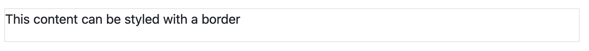
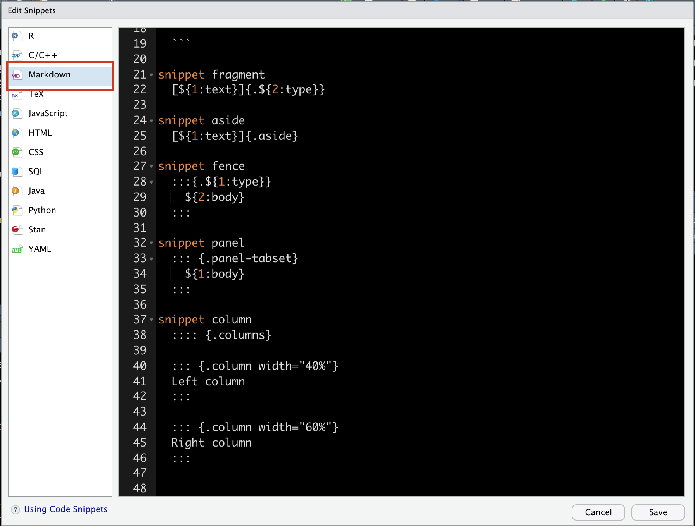
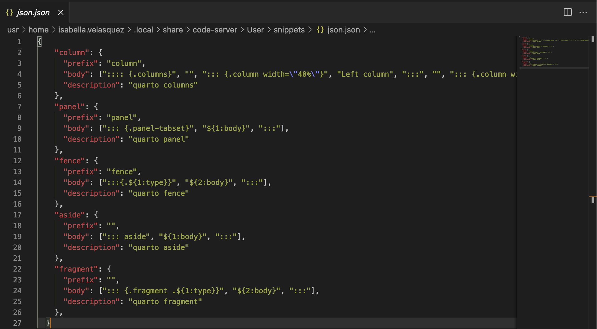
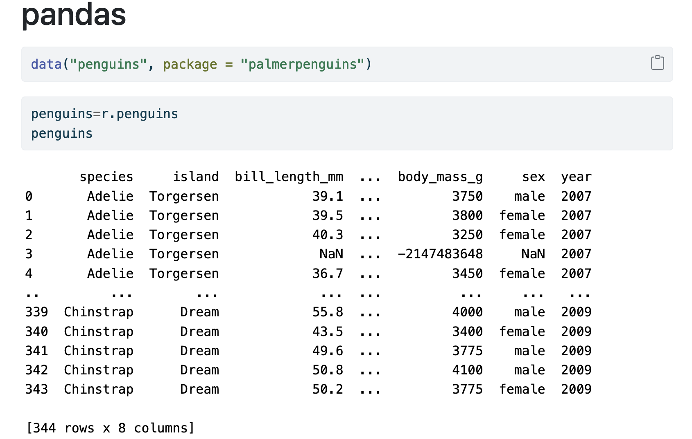
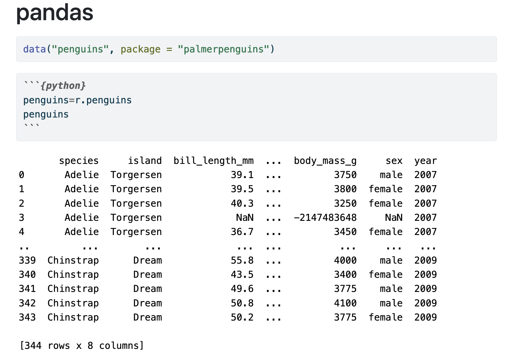
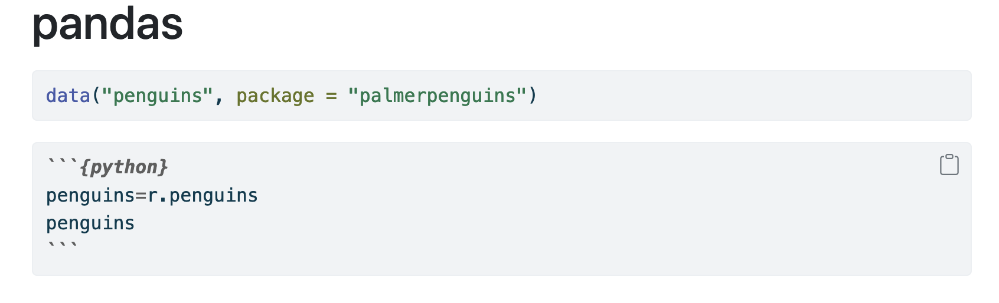
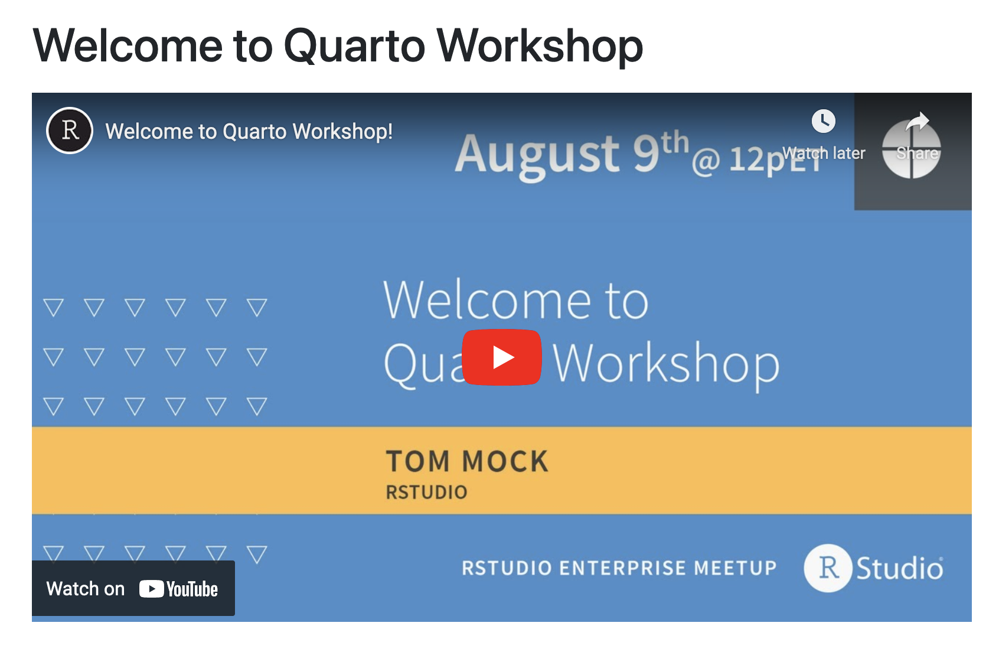
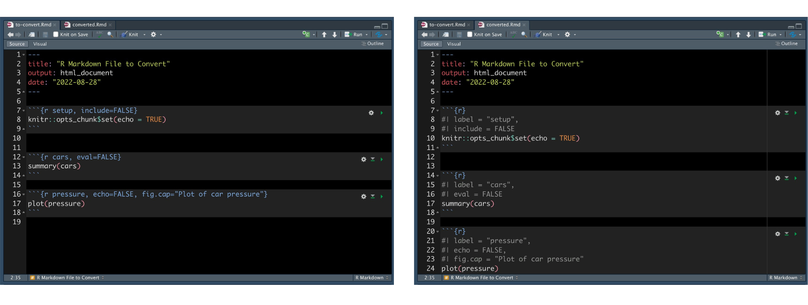

<a href="https://quarto.org/" target = "_blank">Quarto</a> is an open-source scientific and technical publishing system built on Pandoc. With Quarto, you can render plain text and mixed formats into static HTML pages, PDFs, Word documents, websites, and more. Over the past months, we've been delighted to see an explosion of Quarto use, from <a href="https://wesmckinney.com/book/" target = "_blank">the publication of books</a> to <a href="https://rpubs.com/ijlyttle/quarto-cvd-widget" target = "_blank">the creation of widgets</a>.

In this post, we wanted to highlight six productivity hacks for Quarto. We hope they are useful to you as you create content.

1. [Automate insertion of Pandoc Divs and Spans with snippets](#automate)
2. [Write verbatim code chunks with `echo: fenced`](#write-verbatim-code-chunks-with-echo-fenced)
3. [Use shortcodes for simple insertion of content](#shortcodes)
4. [Convert chunk options with `knitr::convert_chunk_header()`](#convert-chunk)
5. [Re-use content across documents](#reuse-content)
6. [Automate Quarto publishing with GitHub Actions](#github-actions)

## Automate insertion of Pandoc Divs and Spans with snippets {#automate}

In Quarto documents, you can use <a href="https://quarto.org/docs/authoring/markdown-basics.html#divs-and-spans" target = "_blank">Pandoc Divs and Spans</a> to add classes, attributes, and other identifiers to regions of content. For example, we can add a border around the text using a div:

```
::: {.border}
This content can be styled with a border
:::
```

This will render as:



A Span provides attributes to inline text:

```
[This is *some text*]{.class key="val"}
```

Snippets are a great way to automate inserting code. Thomas Mock provides a Gist with <a href="https://gist.github.com/jthomasmock/11acebd4448f171f786e01397df34116" target = "_blank">snippets for frequently-used Divs and Spans</a>, making it much faster to include them in your Quarto documents:

<script src="https://gist.github.com/jthomasmock/11acebd4448f171f786e01397df34116.js"></script>

Add them to RStudio by navigating to Tools \> Global Options \> Code \> Edit Code Snippets:


Make sure to add the snippets to the "Markdown" section of the snippet editor:



Note that you use <kbd>Shift</kbd> + <kbd>Tab</kbd> instead of <kbd>Tab</kbd> to autocomplete within Quarto documents:

<script src="https://fast.wistia.com/embed/medias/qklmv1cvsf.jsonp" async></script><script src="https://fast.wistia.com/assets/external/E-v1.js" async></script><div class="wistia_responsive_padding" style="padding:53.75% 0 0 0;position:relative;"><div class="wistia_responsive_wrapper" style="height:100%;left:0;position:absolute;top:0;width:100%;"><div class="wistia_embed wistia_async_qklmv1cvsf videoFoam=true" style="height:100%;position:relative;width:100%">&nbsp;</div></div></div>

The same Gist includes <a href="https://gist.github.com/jthomasmock/11acebd4448f171f786e01397df34116?permalink_comment_id=4269591#gistcomment-4269591" target = "_blank">snippets for VS Code</a>. Add them by going to the Command Palette <kbd>Cmd</kbd> + <kbd>Shift</kbd> + <kbd>P</kbd>, type "configure user snippets", create a snippet `.json` file, and insert the snippets:



Within a `.qmd` file, call "Insert snippet" from the Command Palette and select the respective snippet.

## Write verbatim code chunks with `echo: fenced`

When you render a code chunk within a Quarto document, you see the code contained within the chunk and the executed output by default:



However, you do not see the fenced chunk itself — that is, the <code>```{python}</code> portion. Seeing the chunk options can be helpful, especially when showing someone else how to format their document. You can do this using the `echo: fenced` option. For example, the following code chunks:

````
```{{r}}
data("penguins", package = "palmerpenguins")
```

```{{python}}
#| echo: fenced
penguins=r.penguins
penguins
```
````

Will render as:



If you would like to include an unexecuted fenced code block, you can do this by using two curly braces around the language rather than one. For example:

````
```{{python}}
penguins=r.penguins
penguins
```
````

Will render as:



Notice the data frame is not printed.

Learn more in the Quarto documentation, <a href="https://quarto.org/docs/computations/execution-options.html#fenced-echo" target = "_blank">Execution Options</a>.

## Use shortcodes for simple insertion of content {#shortcodes}

Often, we add raw HTML (e.g., a video `<iframe>`) to insert templates or content into our Markdown documents. <a href="https://quarto.org/docs/extensions/shortcodes.html" target = "_blank">Shortcodes</a> simplify the syntax and make it easier to insert what we want.

Quarto supports several shortcodes natively. For example, running the code below:

```
---
title: "My Blog Post"
---

My blog post is called .
```

Will render as:


Authors can write and distribute their own shortcodes. For example, Mark Sellors' <a href="https://github.com/sellorm/quarto-social-embeds" target = "_blank">Quarto Social Embeds</a> provides shortcodes for YouTube videos, Twitter, and more.

The shortcode:

```
---
title: "Welcome to Quarto Workshop"
---


```

Will render as:



Shortcodes are a type of Quarto extension. Find out more in the <a href="https://quarto.org/docs/extensions/" target = "_blank">Extensions chapter</a> of the Quarto documentation and check out a list of available extensions in the <a href="https://github.com/mcanouil/awesome-quarto#extensions" target = "_blank">Awesome Quarto list</a>.

## Convert chunk options with `knitr::convert_chunk_header()` {#convert-chunk}

In the <a href="https://github.com/yihui/knitr/releases/tag/v1.40" target = "_blank">1.40 release of knitr</a>, a new function called `convert_chunk_header()` converts the old in-header chunk options to the new in-body chunk options. Note that you can use the old syntax in Quarto; however, we recommend using the new syntax to make documents more portable and consistent across execution engines.



You can explicitly name the output:

```
convert_chunk_header("test.Rmd", output = "test2.Rmd")
convert_chunk_header("test.Rmd", output = "test3.qmd")
```

Or overwrite the input:

```
convert_chunk_header("test.Rmd", output = identity)
```

This function saves time converting to the new syntax.

## Re-use content across documents {#reuse-content}

Includes is a shortcode that allows you to reuse content across documents without copying and pasting. To include a file, add `` at the location in your document where you want it included (note the underscore `_` prefix for the included file):

```

```

You can also conditionally include content. Make content visible when rendering to a particular format using the  `.content-visible`class in a Div. Or, hide content when rendering to a particular format using the `.content-hidden` class.

```
::: {.content-visible when-format="html"}

Will only appear in HTML.

:::
```

Learn more about <a href="https://quarto.org/docs/authoring/includes.html#overview" target = "_blank">Includes</a> and <a href="https://quarto.org/docs/authoring/conditional.html#content-visible" target = "_blank">conditional content</a> in the Quarto documentation.

## Automate Quarto publishing with GitHub Actions {#github-actions}

GitHub Actions is a platform that allows you to automate your deployment pipeline. For Quarto users, GitHub Actions can be helpful so you do not have to remember to render your document every time you push up to your repository.

The <a href="https://github.com/quarto-dev/quarto-actions" target = "_blank">Quarto Actions repository</a> provides YAML workflow files to serve as templates.

## Learn More

We hope that you are enjoying Quarto and that these hacks are helpful to you! To learn more, check out:

* News, tips, and commentary from the <a href="https://quarto.org/docs/blog/" target = "_blank">Quarto blog</a>
* <a href="https://mine-cetinkaya-rundel.github.io/quarto-tip-a-day/" target = "_blank">A Quarto tip a day</a> by Mine Çetinkaya-Rundel

Interested in learning how to make Quarto content? Watch our [YouTube playlist](https://www.youtube.com/playlist?list=PL9HYL-VRX0oRupficE2l5DGgVIzpypTHs) of the Quarto Series. There are in-depth walkthroughs introducing Quarto, showing how to build a blog, and create beautiful reports and presentations. 

<center>
<a class="btn btn-primary" href="https://www.youtube.com/playlist?list=PL9HYL-VRX0oRupficE2l5DGgVIzpypTHs" target="_blank">Watch the Quarto Series</a>
</center>
