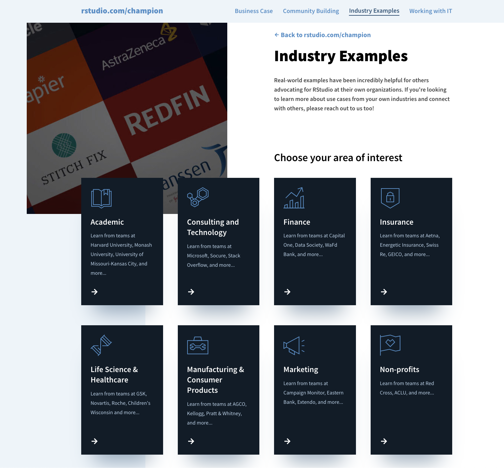

## Introducing rstudio.com/champion

Let's admit it. Getting to use the tools you want sometimes needs a little convincing.

Since coming onboard in 2017, I've had the opportunity to meet so many wonderful people from the community. People that: organize meetups in their own communities, spend time after-hours teaching their co-workers, solve business problems at work with Shiny, write blog posts to help others, and so much more.

They might be titled data scientists, but don't have to be. They are clinicians, psychologists, economists, marketers, consultants, environmentalists, investors, social workers…the list goes on.

People are doing amazing things with data science, yet so many are still in a position where they are not able to make the case for it at their own organizations. So, what can we all do to help?

As a starting point, we've created a new site: <a href="https://www.rstudio.com/champion" target = "_blank">rstudio.com/champion</a>. We've gathered resources from the community who have been through this before and have so many great tips to share. Whether you're getting pushback about using open-source, being told to use a BI tool instead, or just unable to find the other data scientists at your company - we want to make this process less frustrating.

The new site covers four main sections:

* <a href="https://www.rstudio.com/champion/business-case" target = "_blank">Building a business case for code-first data science tools</a>
* <a href="https://www.rstudio.com/champion/community-building" target = "_blank">Growing your data science community</a>
* <a href="https://www.rstudio.com/champion/use-cases" target = "_blank">Use cases gathered from various industries</a>
* <a href="https://www.rstudio.com/champion/working-with-it" target = "_blank">Tips for starting the conversation with IT</a>

A lot of this content was out there already, it just needed a bit of detective work to gather it all. We hope these tips and industry examples from webinars, meetups, data science hangouts, conference talks, and conversations with the community help as you champion data science at your own organizations.

And more!

This is just the beginning though.

This will be an evolving resource, so <a href="http://rstd.io/champion-site-feedback" target = "_blank">we'd love to hear</a> what has helped you or what you may still need to see. A special thank you to so many from the community who have shared tips and examples on this first launch of the site today.

We love chatting with people about advocating for data science. You can always schedule a time to <a href="https://rstudio.chilipiper.com/book/champions-hub" target = "_blank">speak with our team</a>.

<b><a href="https://www.addevent.com/event/dM11812539" target = "_blank">Join us for a Champion Meetup on Tuesday, April 26th at 12 ET</a></b>. Kelly O’Briant will share her own experience of advocating for analytic infrastructure and we'll open it up to a discussion with others who are going through the same. *Please note, the presentation portion of this meetup will be recorded, but the open discussion following the talk will not.*

<a class="btn-sm-block btn btn-primary btn-block pl-3 pr-3 mt-1" href="https://www.rstudio.com/champion/ " target="_blank">Visit rstudio.com/champion</a>
