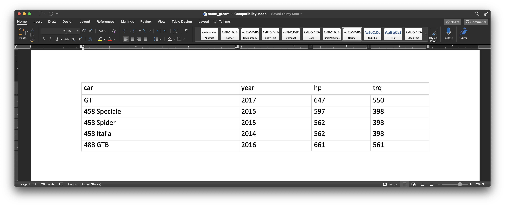

```{r setup, include=FALSE}
knitr::opts_chunk$set(echo = TRUE)
library(gt)
library(tidyverse)
```

A new version of {gt} `0.7.0` is out and there is so much goodness in this release! The goal with the package is to make building tables for publication a hassle-free process, all the while giving you plenty of powerful options to be creative. There's really a lot to cover so let's start immediately!

<h2>The New Word Table Output Format</h2>

Thanks to Ellis Hughes (otherwise known as [`@thebioengineer`, on GitHub](https://github.com/thebioengineer)), we can now export {gt} tables to Word documents. This is great if you're working on a document in Quarto or R Markdown that will be eventually exported to the `.docx` format.

Other workflows are supported as well. Say you just want to create a table in a new Word document. For that, you could use the `gtsave()` function like this:

```{r eval=FALSE}
gtcars %>%
  dplyr::select(model, year, hp, trq) %>%
  dplyr::slice(1:5) %>%
  gt(rowname_col = "model") %>%
  tab_stubhead(label = "car") %>%
  gtsave(filename = "some_gtcars.docx")
```

The key thing to know whenever using `gtsave()` is to name the output file with the appropriate file extension (for Word that is `.docx`). This is roughly what it'll look like when the new file is opened in Word:

```{r echo=FALSE, fig.alt="Word document containing a table with five rows, one for a different car model from the gtcars dataset in gt. The column names are year, hp, and trq."}

```

If you want to emit the raw OOXML that constitutes the Word table, that can be done with the new `as_word()` function. This can be useful for tinkering with the generated table code or for situations where the OOXML needs to be embedded in an existing Word document.

<h2>A whole new family of vector formatting functions (`vec_fmt_*()`) has been added!</h2>

The {gt} package has an ever-growing assortment of powerful formatting functions so that you can format your table data any way you please. We decided to bring all of that utility over to a new family of functions so that you could format vectors with a similar interface. These new functions are of the form `vec_fmt_*()` and the naming closely follows that of their column formatting counterparts (`fmt_*()`). Here's a listing of all 14 of these new vector formatting functions and what they do:

- `vec_fmt_number()`: Format a vector as numeric values
- `vec_fmt_integer()`: Format a vector as integer values
- `vec_fmt_scientific()`: Format a vector as values in scientific notation
- `vec_fmt_engineering()`: Format a vector as values in engineering notation
- `vec_fmt_percent()`: Format a vector as percentage values
- `vec_fmt_partsper()`: Format a vector as parts-per quantities
- `vec_fmt_fraction()`: Format a vector as mixed fractions
- `vec_fmt_currency()`: Format a vector as currency values
- `vec_fmt_bytes()`: Format a vector as values in terms of bytes
- `vec_fmt_date()`: Format a vector as date values
- `vec_fmt_time()`: Format a vector as time values
- `vec_fmt_datetime()`: Format a vector as datetime values
- `vec_fmt_duration()`: Format a vector of numeric or duration values as styled time duration strings
- `vec_fmt_markdown()`: Format a vector containing Markdown text

In all of these, you can control the output style of the resulting character vector with the `output` argument. This can either be `"auto"` (the default), `"plain"`, `"html"`, `"latex"`, `"rtf"`, or `"word"`. In {knitr} rendering (i.e., Quarto or R Markdown), the `"auto"` option will choose the correct output value. Put another way, if you are rendering a document to HTML then any inline R statements that use a `vec_fmt_*()` will render the vector as HTML.

If any of these functions are used interactively (like, in the R console) then we can expect `"plain"` by default.

It's always good to have some examples! Let's create a numeric vector for the next few examples: 

```{r eval=FALSE}
num_vals <- c(5.2, 8.65, 0, -5.3, NA)
```

Let's just focus on using `vec_fmt_number()`; using that function with the default options will create a character vector where the numeric values have two decimal places and `NA` values will render as `"NA"`.

```{r eval=FALSE}
vec_fmt_number(num_vals)
```

```
#> [1] "5.20" "8.65" "0.00" "-5.30" "NA"
```

We can change the decimal mark to a comma, and we have to be sure to change the digit separator mark from the default comma (in the `"en"` locale) to something else (a period works here):

```{r eval=FALSE}
vec_fmt_number(num_vals, sep_mark = ".", dec_mark = ",")
```

```
#> [1] "5,20" "8,65" "0,00" "-5,30" "NA"
```

If we are formatting for a different locale, we could supply the locale ID (here, we'll use `"fr"`) and let {gt} handle these locale-specific formatting options:

```{r eval=FALSE}
vec_fmt_number(num_vals, locale = "fr")
```

```
#> [1] "5,20" "8,65" "0,00" "-5,30" "NA"
```

There are *many* options for formatting values. Perhaps you need to have explicit positive and negative signs? Use `force_sign = TRUE` for that.

```{r eval=FALSE}
vec_fmt_number(num_vals, force_sign = TRUE)
```

```
#> [1] "+5.20" "+8.65" "0.00" "-5.30" "NA"
```

Those trailing zeros past the decimal mark can be stripped out by using the `drop_trailing_zeros` option.

```{r eval=FALSE}
vec_fmt_number(num_vals, drop_trailing_zeros = TRUE)
```

```
#> [1] "5.2" "8.65" "0" "-5.3" "NA"
```

As a last example, one can wrap the values in a pattern with the pattern argument. Note here that `NA` values won't have the pattern applied.

```{r eval=FALSE}
vec_fmt_number(num_vals, pattern = "`{x}`")
```

```
#> [1] "`5.20`" "`8.65`" "`0.00`" "`-5.30`" "NA"
```

That's just a few examples with `vec_fmt_number()` but we hope you'll use these new functions wherever you need formatted values outside of a {gt} table. We promise that any new formatting functions of the `fmt_*()` type will have a corresponding `vec_fmt_*()` counterpart, and, that the two families of functions will maintain feature parity among themselves.

<h2>Table presets/themes with the new `opt_stylize()` function</h2>

It's now incredibly easy to have colorful and stylish tables thanks to the new `opt_stylize()` function. We provide you with a carefully curated set of background colors, line colors, and line styles. There are six numbered styles and six color variations (`"blue"`, `"cyan"`, `"pink"`, `"green"`, `"red"`, and `"gray"`), giving you 36 combinations of style and color to choose from. The styling is fairly comprehensive and it tries to differentiate the various locations within a table. Here is an example of a table that contains the maximal number of parts (header, footer, stub, summary rows, etc.) and is styled with `opt_stylize()`. 

```{r eval=FALSE}
exibble %>%
  gt(rowname_col = "row", groupname_col = "group") %>%
  summary_rows(
    groups = "grp_a",
    columns = c(num, currency),
    fns = list(
      min = ~min(., na.rm = TRUE),
      max = ~max(., na.rm = TRUE)
    )) %>%
  grand_summary_rows(
    columns = currency,
    fns = list(
      total = ~sum(., na.rm = TRUE)
    )) %>%
  tab_source_note(source_note = "This is a source note.") %>%
  tab_footnote(
    footnote = "This is a footnote.",
    locations = cells_body(columns = 1, rows = 1)
  ) %>%
  tab_header(
    title = "The title of the table",
    subtitle = "The table's subtitle"
  ) %>%
  opt_stylize(style = 6, color = "cyan")
```

```{r echo=FALSE, fig.alt="A gt table that is adapted from the exibble dataset and themed with the opt_stylize function (using style 6 and the cyan color theme)."}
knitr::include_graphics("opt-stylize-cyan.png")
```

If you take the example code and experiment with different values for `style` and `color` you'll see that some styles have table borders applied, some apply darker colors to the table stub and summary sections, and, some even have vertical lines (for that retro look!). Each of the six color variations uses a range of five color tints, all fine-tuned to maximize the contrast between text and its background.

<h2>The new `tab_stub_indent()` for superfine control over row label indentation (in the stub)</h2>

Indentation of row labels can be seen as an effective way for establishing structure in a table stub. The new `tab_stub_indent()` function allows you to set row label indentation through either explicit definition of an indentation level (e.g., `1`, `2`, etc.), or, by way of an indentation directive using keywords (`"increase"` or `"decrease"`). Let's make a relatively complex {gt} table using the included `pizzaplace` data to see this new function in action:

```{r}
dplyr::bind_rows(
  pizzaplace %>%
    dplyr::group_by(type, size) %>%
    dplyr::summarize(
      sold = n(),
      income = sum(price),
      .groups = "drop_last"
    ) %>%
    dplyr::summarize(
      sold = sum(sold),
      income = sum(income),
      size = "All Sizes",
      .groups = "drop"
    ),
  pizzaplace %>%
    dplyr::group_by(type, size) %>%
    dplyr::summarize(
      sold = n(),
      income = sum(price),
      .groups = "drop"
    )
) %>%
  gt(rowname_col = "size", groupname_col = "type") %>%
  tab_header(title = "Pizzas Sold in 2015") %>%
  fmt_number(
    columns = sold,
    decimals = 0,
    use_seps = TRUE
  ) %>%
  fmt_currency(
    columns = income,
    currency = "USD"
  ) %>%
  tab_options(
    summary_row.background.color = "#ACEACE",
    row_group.background.color = "#FFEFDB",
    row_group.as_column = TRUE
  ) %>%
  tab_style(
    style = cell_fill(color = "gray95"),
    locations = list(
      cells_body(rows = matches("^All")),
      cells_stub(rows = matches("^All"))
    )
  ) %>%
  tab_stub_indent(
    rows = matches("^L|^M|^S|^XL|^XXL"),
    indent = 2
  )
```
<br />

As can be seen, all the size indicators (e.g., `"S"`, `"M"`, `"L"`, etc.) have been indented by two stops. Because we have a stub we can use select helpers to target the row labels that require indentation (here in this example, the `matches()` selecting function was used with a regular expression). 

<h2>The new `fmt_duration()` function</h2>

There's always room for more formatting functions in {gt} and to that end we've added `fmt_duration()` and `vec_fmt_duration()` to format numeric or duration values as styled time duration strings. We can use a variety of input types like those of the `numeric` or `difftime` classes. Options abound as we can specify which time units any numeric input values have (as weeks, days, hours, minutes, or seconds) and the output can be customized with a duration style (corresponding to narrow, wide, colon-separated, and ISO forms) and a choice of output units ranging from weeks to seconds.

Let's use `vec_fmt_duration()` to demonstrate this type of formatting. As we can use numeric values in the input vector, let's define one of those to use in the examples:

```{r eval=FALSE}
num_vals <- c(3.235, 0.23, 0.005, NA)
```

The necessary thing with numeric values as an input is defining what time unit those values have. We're going to use `input_units = "days"` to state that the values are days. What we get by default is the `"narrow"` version of the duration formatting: 

```{r eval=FALSE}
vec_fmt_duration(num_vals, input_units = "days")
```

```
#> [1] "3d 5h 38m 23s" "5h 31m 12s" "7m 12s" "NA"
```

We can modify this to be `"wide"` duration formatting:

```{r eval=FALSE}
vec_fmt_duration(num_vals, input_units = "days", duration_style = "wide")
```

```
#> [1] "3 days 5 hours 38 minutes 23 seconds" "5 hours 31 minutes 12 seconds"       
#> [3] "7 minutes 12 seconds"                 "NA"
```

We support the use of locales in this function. If you needed this in the German locale (`"de"`), it's just a matter to using the `locale` argument:

```{r eval=FALSE}
vec_fmt_duration(
  num_vals,
  input_units = "days",
  duration_style = "wide",
  locale = "de"
)
```

```
#> [1] "3 Tage 5 Stunden 38 Minuten 23 Sekunden" "5 Stunden 31 Minuten 12 Sekunden"       
#> [3] "7 Minuten 12 Sekunden"                   "NA"
```

There are many more options to explore. We hope this new pair of formatting functions is both easy and enjoyable to use.

<h2>An upgraded `gtsave()` that uses {webshot2}</h2>

Previously if you wanted to export a table as a PNG image, you may have been frustrated with some shortcomings (e.g., bold text curiously not working, Unicode characters looking more than a little strange, etc.). This is because, under the hood, {gt} used {webshot} to generate the image and, within {webshot}, *PhantomJS* was used to actually do the work. *PhantomJS* isn't doing so great these days but the more recent {webshot2} package uses {chromote} to do a much better job on image capture. This is basically a lot of words just to say that: (1) we're now using {webshot2}, and (2) PNG image export is much better now!

<h2>Accessibility enhancements for HTML table outputs</h2>

HTML tables as produced by {gt} can be structurally complex. Owing to that, screen readers (applications that allow blind or visually impaired users to read the text that is displayed on the computer screen) had some difficulty parsing certain tables. Through collaboration with Dr. JooYoung Seo ([`@jooyoungseo`, on GitHub](https://github.com/jooyoungseo)), we were able to make a great number of accessibility enhancements for HTML table outputs. As a result {gt} is now one of the most accessible table packages around!

<h2>Signing off</h2>

Improvements to the {gt} package are very important to us and there's so much in store (already!) for the next release (`0.7.0`). It's not just about adding new things but improving what's already there. We get a lot out of your feature requests and questions so never hesitate to [file an issue](https://github.com/rstudio/gt/issues) or talk about your ideas in the [*Discussions* page](https://github.com/rstudio/gt/discussions). Till next time!
