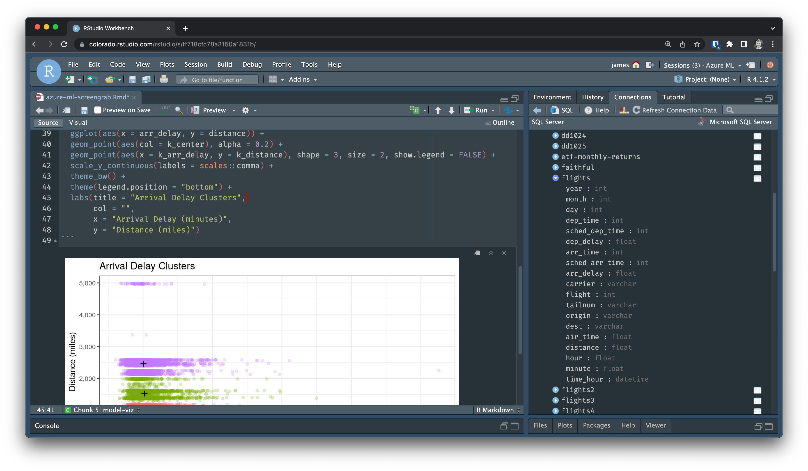

## Machine Learning Development in the Cloud

Cloud platforms enable the machine learning lifecycle with variable scaling, lower start-up costs, and centralized data lakes. Data scientists who use these resources in conjunction with their favorite tools can more efficiently build high-quality models at scale.

RStudio supports cloud strategies in <a href="https://www.rstudio.com/solutions/rstudio-in-the-cloud/" target = "_blank">various ways</a>. Our partnerships allow data scientists to operationalize machine learning on their preferred cloud platform using our professional products, built to be the best tools for open source data science.

## Announcing RStudio for Azure ML

We’re excited to announce a new partnership with <a href="https://azure.microsoft.com/en-us/services/machine-learning/#product-overview" target = "_blank">Azure ML</a> to deliver <a href="https://www.rstudio.com/products/workbench/" target = "_blank">RStudio Workbench</a> on the Azure platform. Data scientists can use the RStudio Workbench they know and love in conjunction with their Azure data sources and other Azure ML capabilities.

> RStudio is very pleased to work with the Azure Machine Learning team on this release, as we collaborate to make it easier for organizations to move their open-source data science workloads to the cloud. We are committed to helping our joint customers use our commercial offerings to bring their production workloads to their preferred cloud platforms.
>
> — Tareef Kawaf, President, RStudio PBC

## Access RStudio Workbench Within Your Azure ML Cloud Environment

RStudio Workbench is the ideal platform for code-first data science development. With this offering, data scientists can start a single-user instance of RStudio Workbench from within their Azure ML environment as part of the machine learning lifecycle.

With RStudio Workbench, data scientists can:

* Program in R or Python in your preferred IDE (RStudio, VSCode, JupyterLab, Jupyter Notebook)
* Build models with your favorite open-source tools such as the tidyverse and Shiny
* Access pre-installed packages to support your data science work
* Improve data connectivity via the RStudio Pro Drivers
* Run scripts in the background as local launcher jobs
* Select multiple versions of R and Python
* Open multiple R and Python sessions
* Receive end-user support

## Get Started With RStudio for Azure ML

We look forward to further supporting open-source data science in the cloud. Check out the <a href="https://www.rstudio.com/azure-ml" target = "_blank">RStudio for Azure ML product page</a> for more information and to purchase a license.
