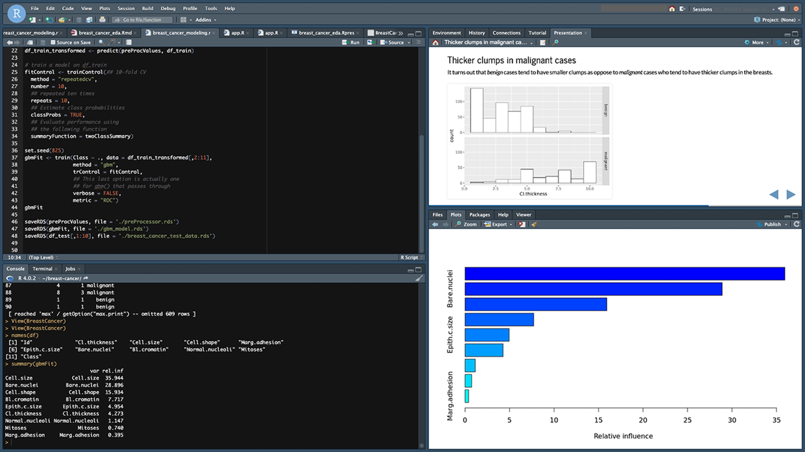
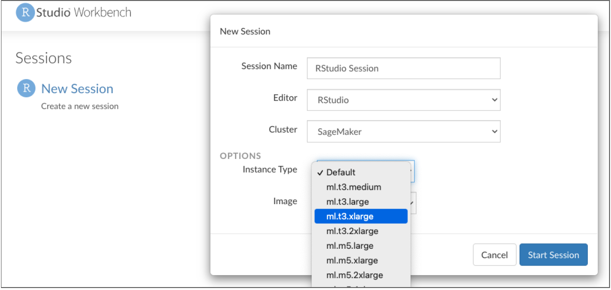
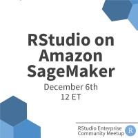

## Data Science in the Cloud

As more organizations migrate their data science work to the cloud, they naturally want to bring along their favorite data science tools, including RStudio, R, and Python. These organizations are embracing the cloud to achieve various goals, including to:

* Simplify and reduce startup costs.
* Promote collaboration between organizations or groups.
* Mitigate the high costs of maintaining their own computing infrastructure.
* Scale to meet variable demand.
* Minimize data movement.

While RStudio provides <a href="https://blog.rstudio.com/2020/11/12/cloud-strategy/" target = "_blank" rel = "noopener noreferrer">many different ways to support an organization’s cloud strategy</a>, we’ve heard from many customers who also use Amazon SageMaker. They wanted an easier way to combine RStudio’s professional products with SageMaker’s rich machine learning and deep learning capabilities, and to incorporate RStudio into their data science infrastructure on SageMaker.

## RStudio on Amazon SageMaker

Based on this feedback, we are excited to announce RStudio on Amazon SageMaker, developed in collaboration with the SageMaker team. 

<a href="https://aws.amazon.com/pm/sagemaker/" target = "_blank" rel = "noopener noreferrer">Amazon SageMaker</a>  helps data scientists and developers to prepare, build, train, and deploy high-quality machine learning models quickly by bringing together a broad set of capabilities purpose-built for machine learning.

> RStudio is excited to collaborate with the Amazon SageMaker team on this release as they make it easier for organizations to move their open-source data science workloads to the cloud. We are committed to helping our joint customers use our commercial offerings to bring their production workloads to Amazon’s SageMaker, and to further collaborations with the Amazon SageMaker team.
>
> — Tareef Kawaf, President, RStudio PBC

###  Easy Access to SageMaker for Data Scientists

Data scientists can quickly get to work, spinning up their favorite development environment on SageMaker. They can:

* **Launch RStudio Workbench** with a simple click.
* **Start a new session** with a fully-configured environment.
* **Choose an instance type** with the desired compute and memory for the job at hand, from a wide array of ML instances available.

Within that environment, they can get access to their organization’s data stored on AWS. They also have access to all of SageMaker’s deep learning capabilities, accessed via Python libraries using the <a href="https://rstudio.github.io/reticulate/" target = "_blank" rel = "noopener noreferrer">reticulate</a> package. This preconfigured environment includes all the necessary SageMaker libraries to get started.

This offering complements Amazon SageMaker Studio Notebooks, which provide access to Python coding in a Jupyter Notebook environment. This means that data scientists proficient with both R and Python can freely switch between RStudio and SageMaker Studio Notebooks. All of their work, including code, datasets, repositories, and other artifacts are synchronized between the two environments through the default Amazon Elastic File System (Amazon EFS) storage.

For more information from the data scientist perspective, see <a href="https://aws.amazon.com/blogs/aws/announcing-fully-managed-rstudio-on-amazon-sagemaker-for-data-scientists/" target = "_blank" rel = "noopener noreferrer">Announcing Fully Managed RStudio on Amazon SageMaker for Data Scientists</a>.

### Familiar Management Tools for DevOps Teams

As a fully managed offering on Amazon SageMaker, this release makes it easy for DevOps teams and IT Admins to administer, secure and scale their organization’s centralized data science infrastructure. They can: 

* **Quickly create a multi-user RStudio Workbench environment** in AWS SageMaker for their team’s data science work, without the need to install and configure RStudio Workbench.
* **Administer this environment using familiar AWS tools and frameworks**, including managing licenses, security, and domains.

For more information from the DevOps perspective, see <a href="https://aws.amazon.com/blogs/machine-learning/get-started-with-rstudio-on-amazon-sagemaker/" target = "_blank" rel = "noopener noreferrer">Getting Started with RStudio on Amazon SageMaker</a>.

### Data-Driven Insights for Organizations

For data-driven organizations already using AWS, this provides a way to migrate their self-managed RStudio environments to AWS SageMaker, using their existing RStudio Workbench licenses without an incremental cost. 

When RStudio for SageMaker is configured for use with RStudio Connect, data scientists using both RStudio for SageMaker and SageMaker Studio can easily share their R and Python insights with their decision-makers. 

<a href="/products/connect/" target="_blank">RStudio Connect</a> makes it easy to deliver key insights to decision-makers, at the right time, in the right format. Connect supports a spectrum of data products, static or dynamic, developed in R and Python: Dashboards, applications, APIs, reports, and more.

For more information, see <a href="https://aws.amazon.com/blogs/machine-learning/host-rstudio-connect-and-package-manager-for-ml-development-in-rstudio-on-amazon-sagemaker/" target = "_blank" rel = "noopener noreferrer">Host RStudio Connect and Package Manager for ML Development in RStudio on Amazon SageMaker</a>.

## Getting Started with RStudio on Amazon SageMaker

RStudio for Amazon SageMaker enables RStudio Workbench customers to bring their existing licenses to SageMaker. If you are an existing customer, or would like to learn more, please reach out to your customer success manager or <a href="https://rstudio.chilipiper.com/book/schedule-time-with-rstudio" target = "_blank" rel = "noopener noreferrer">schedule a time to talk with us</a>.

<strong>
<a href="https://www.addevent.com/event/Ch9725290" target = "_blank" rel = "noopener noreferrer">Join us on Dec. 6th for an RStudio on SageMaker Meetup</a>

</strong>

