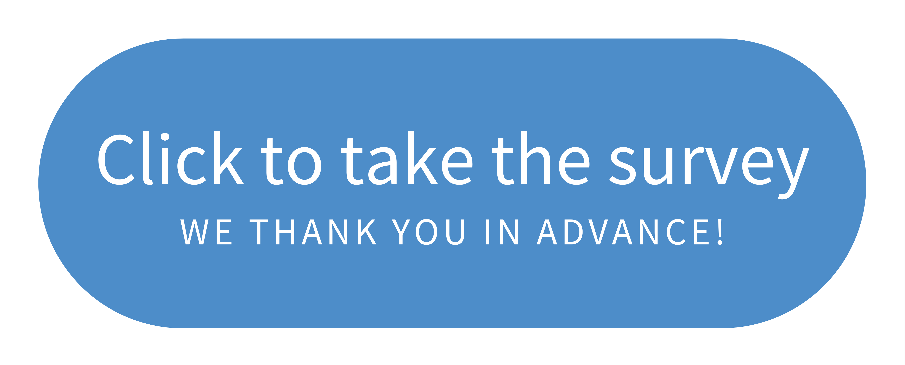

Whether you quickly scan RStudio information or are an active reader of everything we release, we want to hear from you!

We want to better communicate with you, but first we need to know what RStudio channels you are interacting with, where you are seeing content, and what you would like to see more often. **Please take the <a href="https://rstd.io/2021-com-survey" target = "_blank" rel = "noopener noreferrer">RStudio 2021 Communications Survey </a> so that you can receive RStudio information in your desired formats and channels!**

The survey should take less than 10 minutes. If you’re able, please take the time to fill out the free-form text boxes — we read each and every one! The survey is anonymous, but as a small token of appreciation, you can provide your contact information for a chance to receive RStudio swag.

Once we close the survey, we will review the results (and share our analysis process!). Then, we’ll use the information to tailor our communications to better address your data science needs.

Thank you for collaborating on this with us and we look forward to seeing your responses!
