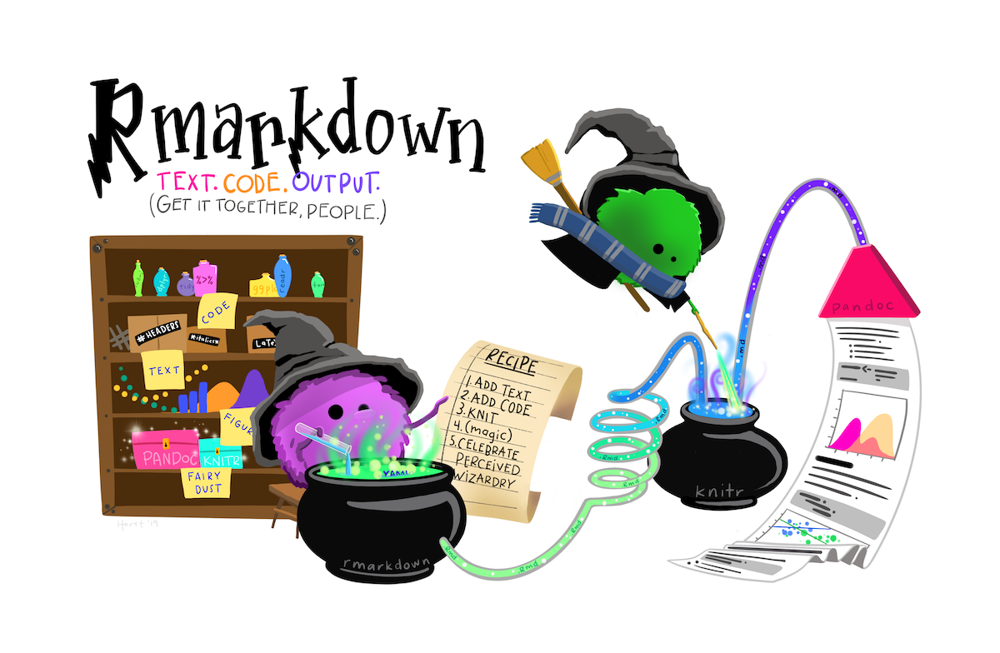
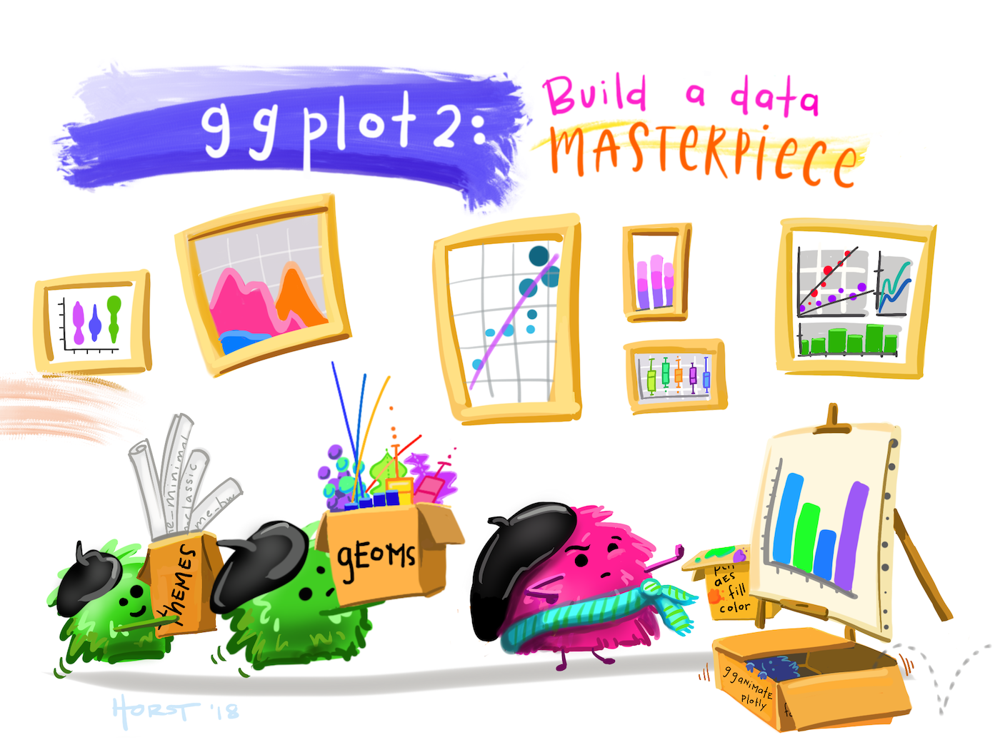
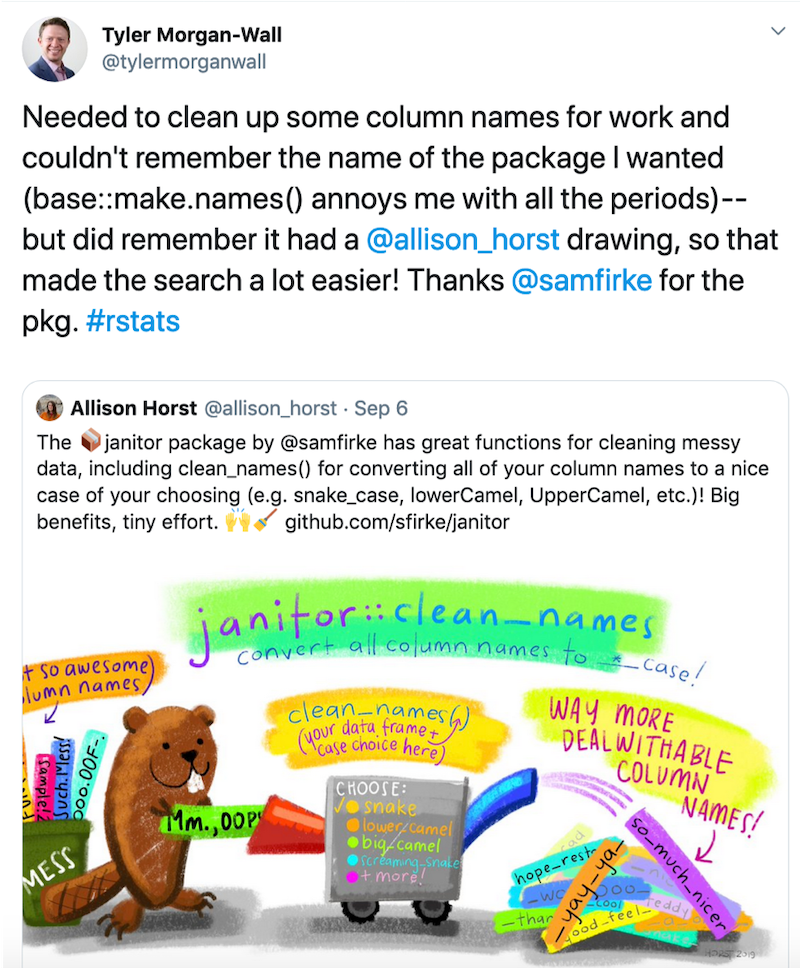

I'm very excited to announce that Allison Horst is RStudio's inaugural artist-in-residence. Allison is one of my favourite artists in the R community. Over the next year, she's going to be working with us to create even more awesome artwork. Here's a little about Allison in her own words.

--- Hadley

---

Hello everyone, I’m Allison.

Some of you might know me from my [R- and stats-inspired illustrations](https://github.com/allisonhorst/stats-illustrations) on [twitter](https://twitter.com/allison_horst)). I’m excited to share that, as of October 2019, I am an Artist-in-Residence with [RStudio](https://rstudio.com/). My goal as an RStudio Artist-in-Residence is to create useful and engaging illustrations and designs that welcome users to explore, teach, and learn about new packages and functions in R. In this post, I’ll share what motivates me to create R-related artwork, and what I'll be working on at RStudio.  

### Why did I start making R-related artwork?

My primary job is teaching data science and statistics courses to ~100 incoming students each year at the [Bren School of Environmental Science and Management](http://bren.ucsb.edu/), UC Santa Barbara.

When teaching, I’ve frequently found myself struggling to motivate students to try new R packages or functions. As an example, imagine you’re a student in an “Intro to Data Science” class learning to code for the first time. You’re already kind of intimidated by R, and then the really excited (unnamed) instructor exclaims “`dplyr::mutate()` is sooooo awesome!!!” while displaying code examples and/or R documentation on a slide behind them:

Even if the instructor is positive and encouraging, a screen full of code and documentation behind them might cast a daunting cloud over the introduction.  

That’s the position I found myself in as a teacher. There was a clear disconnect between my excitement about sharing new things in R, and what I was presenting visually as a “first glimpse” into what a package or function could do. I felt frustrated to not have educational visuals that aligned with my enthusiasm. I also felt that if I could just make a student’s first exposure to a new coding skill something positive --- funny, or happy, or intriguing, or just plain cute --- they would be less resistant to investing in a new [insert thing] in R. 

### What are my goals?

When I started creating my aRt to lower learning barriers, I kept three things in mind: 

- Focus first on the big-picture application/use of the R function or package.
- Make illustrations visually engaging, welcoming, and useful for useRs at all levels.
- Use imagery to make it feel like R is working with you, not against you.

I tried a few different styles and characters and the friendly, hardworking, colorful monsters were most representative of how I think about work done by packages and functions. All of the monsteRs illustrations are driven by the goal of creating a friendlier bridge between learners and R functions / packages that might look intimidating at first glance. 

For example, instead of showing a chunk of code while trying to encourage students to learn `dplyr::mutate()`, their first sighting of the function would be mutant monsteRs working behind the scenes to add columns to a data frame, while keeping the existing ones:

And here are the R Markdown wizard monsteRs, helping to keep text, code and outputs all together, then knitting to produce a final document: 

And of course the ggplot2 artist monsteRs are using geoms, themes, and aesthetic mappings to build masterful data visualizations:

Do the monsteRs teach code? Well, no. But I hope that they **do** provide a welcome entry point for learners, and make the use of an R function or package clear and memorable. And while I create the illustrations mostly with teachers and learners in mind, users at any level can learn something new, or remember something old, through art reminders. 

### What else am I working on? 

The monsteRs make frequent appearances in my artwork, but I’ve also enjoyed contributing to the R community through other graphic design and illustrations. Here’s an extended cut of the classic schematic from [R for Data Science](https://r4ds.had.co.nz/), updated to include environmental data and science communication bookends, that Dr. Julia Lowndes envisioned and presented in her [useR!2019 keynote](https://www.youtube.com/watch?v=Z8PqwFPqn6Y&feature=youtu.be&start=2710): 

I had a great time creating buttons and banners for the [“Birds of a Feather” sessions](https://rstudio.com/bof/) at upcoming [rstudio::conf(2020)](https://web.cvent.com/event/36ebe042-0113-44f1-8e36-b9bc5d0733bf/summary) - where I’m looking forward to meeting many of you in person!

And, I’ve been working on hex designs for R-related groups and packages! Here are a few: the hex sticker for Santa Barbara R-Ladies (our growing local chapter of [R-Ladies Global](https://rladies.org/)), the new [`rray` package](https://github.com/r-lib/rray) hex envisioned by Davis Vaughan, and a design for the [`butcher` package](https://tidymodels.github.io/butcher/) from Joyce Cahoon and the [`tidymodels`](https://github.com/tidymodels/tidymodels) team:  

I’m inspired by how RStudio and the broader R community have embraced and supported art as a means of reaching more users, improving education materials (see the beautiful [RStudio Education](https://education.rstudio.com/) site with artwork by [Desirée De Leon](https://desiree.rbind.io/)!), and simply making the R landscape a bit brighter. I am excited to continue producing aRt as an RStudio Artist-in-Residence over the next year. 

--- Allison

