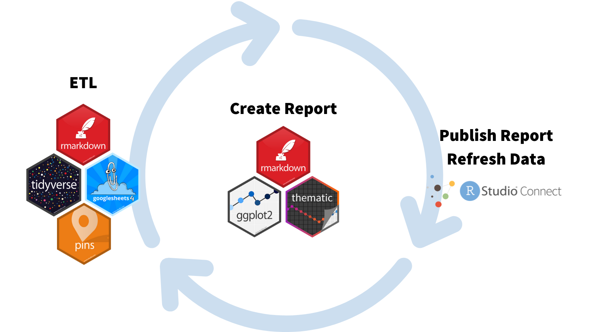

In October 2021, we released the <a href="https://www.rstudio.com/blog/announcing-the-2021-rstudio-communications-survey/" target = "_blank">RStudio Communications Survey</a>. Many thanks to all of you who replied! We received great suggestions from the community that we incorporate into our work.

We wanted to share how we shared our internal survey results. This approach is similar to one that Julia Silge used last year for <a href="https://www.rstudio.com/blog/model-monitoring-with-r-markdown/" target = "_blank">monitoring a deployed model</a>. Curtis Kephart adapted this workflow to publish the Communications Survey results on a daily basis:

* We collected results using a Google Form.
* We started our extract, load, and transform (ELT) process in an <a href="https://rmarkdown.rstudio.com/" target = "_blank">R Markdown</a> document.
    * With the <a href="https://googlesheets4.tidyverse.org/" target = "_blank">googlesheet4</a> package, we imported the results from a Google Sheet into the RStudio IDE. 
    * We then cleaned the data using the <a href="https://www.tidyverse.org/packages/" target = "_blank">tidyverse</a> and other packages.
    * Every day, we'd save the latest results to a dataframe using the <a href="https://pins.rstudio.com/" target = "_blank">pins</a> package.
* We created an R Markdown report using the pinned data.
    * We created visualizations using <a href="https://ggplot2.tidyverse.org/" target = "_blank">ggplot2</a> and other packages.
    * We styled our reports using the <a href="https://rstudio.github.io/thematic/" target = "_blank">thematic</a> and <a href="https://rstudio.github.io/bslib/" target = "_blank">bslib</a> packages.
* We published the R Markdown report to <a href="https://www.rstudio.com/products/connect/" target = "_blank">RStudio Connect</a>.
* We scheduled RStudio Connect to run this workflow and save new data daily.
* We would check out the latest results in our browser.



Thanks to this workflow, our colleagues could easily access the survey results and see an updated report every day. We would review the responses from the community to plan out future communication strategies.

Interested in automated survey reporting? Let's walk through the steps using data from the <a href="https://www.ntia.gov/data/explorer#sel=internetUser&disp=map" target = "_blank">National Telecommunications and Information Administration Data Explorer</a>. We've saved the project in this <a href="https://github.com/rstudio-marketing/automated-survey-reporting" target = "_blank">GitHub repository</a> if you would like access to the files.

Below, we'll highlight key packages and functionality, but do be aware we relied on many great tools to make this happen.


## Extract, Transform, and Load (ETL) in an R Markdown Document

First, we need to extract data from a Google Form, transform it into the proper format for analysis, and then load the data to write a report.

R Markdown is a file format for making dynamic documents with R. It's an easy way to integrate code, output, and text. For the Communications suryve, we decided to write our ETL process in an R Markdown file so that we could add headings and commentary to our code. With R Markdown, we could also schedule automatic refreshes on RStudio Connect (we will describe  this a little bit later).

### Importing data from Google Sheets

Once someone fills out a Google Form, the results are saved in a Google Sheet. The googlesheets4 package allows you to access Google Sheets from R. It helps with authentication for reading private sheets or writing new data, and provides various functions to help you work with Google.

Load our survey data by running the below:

````
```{{r}}
library(googlesheets4)

survey_dat <-
  read_sheet("https://docs.google.com/spreadsheets/d/1wnv6PM0YiYoSZ8HHDAGLAGw8ro-SAXblpJ-Aw0VtEGM/edit?usp=sharing")
```
````

Each time we run `read_sheet()`, we pull in the most recent spreadsheet from Google.

### Tidying and transforming data using the tidyverse packages (and friends)

The Google Sheet is stored as a data frame in RStudio. Great! Now, we have to make sure it's in an analyzable format. We can do this using packages like <a href="https://dplyr.tidyverse.org/" target = "_blank">dplyr</a> and <a href="https://tidyr.tidyverse.org/" target = "_blank">tidyr</a>.

Let's explore the dataset.

````
```{{r}}
library(tidyverse)
library(lubridate)

glimpse(survey_dat)
```
````

```
Rows: 753
Columns: 16
$ dataset      <chr> "Nov 1994", "Nov 1994", "Nov 1994", "Nov 1994", "O…
$ variable     <chr> "isHouseholder", "isPerson", "computerAtHome", "is…
$ description  <chr> "Household Reference Person in Universe: Non-Insti…
$ universe     <chr> NA, NA, "isHouseholder", "isPerson", NA, NA, "isHo…
$ usProp       <dbl> 1.000000, 1.000000, 0.242794, 0.810185, 1.000000, …
$ usCount      <dbl> 99708018, 248509799, 24208471, 201338994, 10274155…
$ age314Prop   <dbl> NA, 1, NA, 0, NA, 1, NA, 0, NA, 1, NA, NA, NA, NA,…
$ age314Count  <dbl> NA, 47170805, NA, 0, NA, 47960746, NA, 0, NA, 4828…
$ age1524Prop  <dbl> 1.000000, 1.000000, 0.183342, 1.000000, 1.000000, …
$ age1524Count <dbl> 5573616, 36254422, 1021876, 36254422, 5670471, 369…
$ age2544Prop  <dbl> 1.000000, 1.000000, 0.302369, 1.000000, 1.000000, …
$ age2544Count <dbl> 43123860, 83005904, 13039306, 83005904, 43481519, …
$ age4564Prop  <dbl> 1.000000, 1.000000, 0.285785, 1.000000, 1.000000, …
$ age4564Count <dbl> 29830455, 50934354, 8525086, 50934354, 32280721, 5…
$ age65pProp   <dbl> 1.000000, 1.000000, 0.076591, 1.000000, 1.000000, …
$ age65pCount  <dbl> 21180087, 31144313, 1622202, 31144313, 21308845, 3…
```

The column `dataset` contains the survey administration date, but it is a character variable. We can use `dplyr::mutate()` and to create a new column called `date` that stores the variable in a date format.

```` 
```{{r}}
survey_dat_mutate <-
  survey_dat %>%
  mutate(date =
          my(dataset),
          .before = 1)
```
````

Notice that the data is in "wide" format: each survey administration is stored in a single row, and each category is in a separate column.

We'd like our data to be in "long" format. In the long format, each row is one data point. Every survey administration will have data in multiple rows. This makes it easier to work with tidyverse packages. We can transform our data using `tidyr::pivot_longer()`.

````
```{{r}}
survey_data_transform <-
  survey_dat_mutate %>%
  pivot_longer(cols = usProp:age65pCount,
               names_to = "variables",
               values_to = "values")
```
````

Now, our data is in a format that's ready to use in our report.

We used many functions when working with the Google Form from the Communication Survey. Thankfully, packages like dplyr and tidyr make it easy to reproducibly clean the data and transform it to the format we need.

### Appending and saving data to pins

We tidied our data, but how can we ensure our report uses the latest clean dataset and not one from the previous day?

The pins package is an excellent solution to this. With pins, small R objects are published to a ‘board' so we can share them across projects or people. In this case, we pin our survey data to an <a href="https://www.rstudio.com/products/connect/" target = "_blank">RStudio Connect</a> server. At the end of our data cleaning script, we rewrite the pin. Every time we run the data cleaning script, the pin contains the latest, complete dataset.

<details>
<summary><b>Click here for an example of an ETL process in an R Markdown document.</b></summary>

````
---
title: "ETL Process"
output: html_document
---

```{{r setup}}
library(dplyr)
library(tidyr)
library(lubridate)
library(pins)

# Connect to board
board <-
  board_rsconnect(
    server = Sys.getenv("CONNECT_SERVER"),
    key = Sys.getenv("CONNECT_API_KEY")
    )
```

# Extract data

```{{r extract}}
survey_dat <- 
  googlesheets4::read_sheet("https://docs.google.com/spreadsheets/d/1iIf8vsGSlKmyYSy-FbevOBmi-c0YwI46lLzNbD_RZSQ/edit?usp=sharing")
```
```{{r}}
#| include = FALSE
glimpse(survey_dat)
```

# Transform data

```{{r mutate}}
survey_dat_mutate <-
  survey_dat %>%
  mutate(date =
           my(dataset),
          .before = 1)
```

```{{r transform}}
survey_data_transform <-
  survey_dat_mutate %>%
  pivot_longer(cols = usProp:age65pCount,
               names_to = "variables",
               values_to = "values")
```

# Load transformed data in a pin

```{{r load}}
board %>%
  pin_write(survey_data_transform, "survey_data_results", type = "rds")
```
````
</details>

We also used pins to help protect our respondents' privacy. As part of our tidying, we filtered out names or email addresses. We would pin the filtered dataset to use in the report. This way, we used as much raw data as possible without sharing any identifiable information.


### Writing an R Markdown Report with pinned data

We loaded our survey results, cleaned them up, and stored them in a pin. Now it's time to write a report!

In addition to running ETL processes, R Markdown (which contains the report-creating package knitr) is a powerful tool for creating reports. It can handle Markdown text, add custom styling, and much more.

Our survey had many different sections, each with many questions. We first created separate R Markdown documents for each section to build our report. This helped organize our code so we wouldn't get lost in what we were doing.

Let's walk through how this would look with our Census data. Our first file could look something like this:

````
---
title: "Plot 1"
---

```{{r}}
#| include = FALSE
library(tidyverse)
library(hrbrthemes)
```

## Percentage by age

-------

### Line Chart

```{{r}}
#| echo = FALSE

p <- pinned_dat %>%
  filter(variable == "noInternetAtHome",
         str_detect(variables, "Prop")) %>%
  ggplot(aes(x = date, y = values, color = variables)) +
  geom_line(size = 1) +
  labs(title = "Percentage of respondents with\nno internet at home by age group",
       xlab = "Date",
       ylab = "Percentage") +
  scale_color_ipsum() +
  theme_ipsum_ps(grid = "XY", axis = "xy")

p
```
````

Our second one can create a document for a separate section:

````
---
title: "Plot 2"
---

### Percentage by main reason

-------

### Bar Chart

```{{r}}
#| echo = FALSE
p <- pinned_dat %>%
  filter(
    str_detect(variable, "MainReason"),
    str_detect(variables, "Prop"),
    universe == "isHouseholder",
    dataset == "Nov 2021"
  ) %>%
  ggplot(aes(x = variables, y = values, fill = variables)) +
  geom_bar(stat = "identity") +
  labs(title = "Percentage With No Internet by Main Reason",
       subtitle = "November 2021",
       xlab = "Date",
       ylab = "Percentage") +
  facet_wrap( ~ variable) +
  scale_fill_ipsum() +
  theme_ipsum_ps(grid = "XY", axis = "xy") +
  theme(legend.position = "bottom",
        axis.text.x = element_blank())

p
```
````

We have separate files for these sections. We can use a third R Markdown document as the main file for our report.

The `knitr::knit_child()` function is a powerful tool to organize your R Markdown documents. You can use it to create parameterized section templates. With our survey example, we found we were creating multiple sections that broke down results by respondent demographics, and summarizing similar questions. These sections applied similar code to different subsets of the data. Rather than copy-and-pasting code, we use `knit_child()` to pass parameters into section templates. See the <a href="https://bookdown.org/yihui/rmarkdown-cookbook/child-document.html#child-document" target = "_blank">R Markdown Cookbook's discussion of child documents</a> for more information.

With R Markdown, we have many options to customize our report to match our organization's style guide. Two options are the thematic and bslib packages. Below, we're using the bslib package.

````
---
title: "Internet Use Survey Report"
output:
  html_document:
    theme:
      bootswatch: simplex
---

```{{r setup, include = FALSE}}
knitr::opts_chunk$set(warning = FALSE)

library(pins)
library(ggplot2)
library(stringr)
library(dplyr)
library(hrbrthemes)

# Connect to board
board <-
  board_rsconnect(auth = "envvar")

# Read pinned data
pinned_dat <-
  pin_read("survey_data_results",
           board = board)
```

Data from the National Telecommunications and Information Administration.

```{{r}}
#| child=c("02-plot.Rmd")
```

```{{r}}
#| child=c("03-plot2.Rmd")
```
````

When we knit this file, we have the results in a stylized report that displays output from the three `.Rmd` documents using the latest, clean survey dataset. Hooray, we created a report!

## Publishing R Markdown HTML Output to RStudio Connect

After we finished our report, we wanted to make it accessible to our team! For this, we used RStudio Connect. RStudio Connect is an enterprise-level platform from RStudio that publishes many different data science products, including the HTML output from R Markdown.

We could publish our R Markdown document directly from the RStudio IDE. Here's what it looks like with the survey report from above:

<script src="https://fast.wistia.com/embed/medias/i4dtiibepy.jsonp" async></script><script src="https://fast.wistia.com/assets/external/E-v1.js" async></script><div class="wistia_responsive_padding" style="padding:56.25% 0 0 0;position:relative;"><div class="wistia_responsive_wrapper" style="height:100%;left:0;position:absolute;top:0;width:100%;"><div class="wistia_embed wistia_async_i4dtiibepy videoFoam=true" style="height:100%;position:relative;width:100%">&nbsp;</div></div></div>
<center><caption><i>Publishing a report to RStudio Connect</i></caption></center>

We mentioned that our report was *daily*. With RStudio Connect, we scheduled our ETL, reporting, and publishing cycle to occur every day. When our team members opened the dashboard, they would see the results up until the last scheduled refresh.


<center><caption><i>Scheduling options on RStudio Connect</i></caption></center>

We wanted to make sure that results were available to everybody within RStudio but not shareable outside of the company. Thanks to the access settings of RStudio Connect, we could make sure that only those with permission could view our dashboard.


<center><caption><i>Security options on RStudio Connect</i></caption></center>

## Learn More

Thank you again for your responses to the Communications survey. We're excited to have shown you our process for reporting the results using RStudio tools: R Markdown, the tidyverse packages, googlesheets4, RStudio Connect, and many others.

* Check out the complete workflow in this <a href="https://github.com/rstudio-marketing/automated-survey-reporting" target = "_blank">GitHub repo</a>.
* Learn more about <a href="https://www.rstudio.com/products/connect/" target = "_blank">RStudio Connect</a>, the enterprise-level publishing platform from RStudio.
* Read about more R Markdown features in the <a href="https://bookdown.org/yihui/rmarkdown-cookbook/child-document.html" target = "_blank">R Markdown Cookbook</a>.
