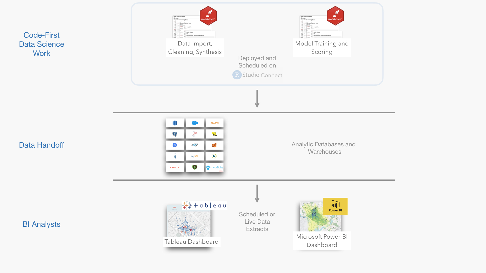
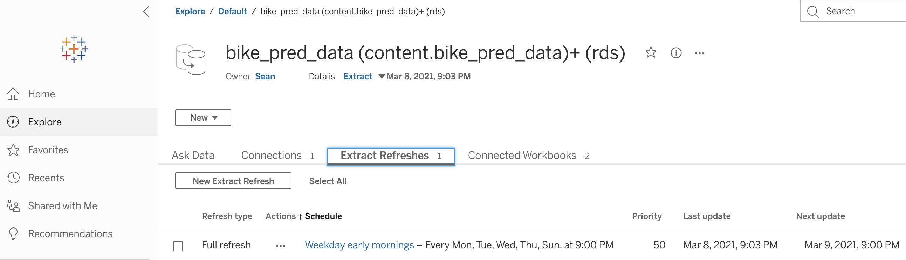

In <a href="https://www.rstudio.com/tags/bi-tools/" target="_blank" rel="noopener noreferrer">recent posts</a> we have explored how organizations can make better decisions by focusing on data science and BI collaboration. In this post, we will look at one type of collaboration accomplished through *data handoffs*, which we define as

> Datasets stored in databases that are created by data scientists and shared with BI analysts 

In future posts we will explore additional collaboration techniques that enable real-time interactions between BI tools and data science work.

### Why Data Handoffs?

Often data science teams are created to answer particularly hard questions. They work with large messy data, often from unstructured or novel sources, and then apply advanced analytical methods and statistical rigor. As part of this work, data science teams create visualizations, dashboards, and interactive applications to influence decisions. While data scientists can usually accomplish these tasks most effectively using reproducible code, they are typically resource constrained and discover they can't:

-   Address every question posed by the data.
-   Adapt results to each audience in the organization.
-   Satisfy audiences who wish to quickly explore the data themselves.

In these scenarios, data scientists can use data handoffs to address these issues and leverage existing BI capabilities. By exporting the novel data sources, predictions, and calculated features they have created, data scientists can:

- Collaborate with larger BI teams.
- Increase the visibility and re-use of their work.
- Broaden and democratize the access to advanced data.

These benefits create a virtuous cycle. Data scientists can share novel data, and then BI teams can explore that data, identify new problems, and propose solutions that require further validation from the data science team.
  

### How Data Handoffs Work

Data scientists typically begin by building analytic notebooks that do the hard work of cleaning unstructured data, generating calculated features, applying model predictions, or pre-processing big data. These notebooks can conclude by writing final <a href="https://cran.r-project.org/web/packages/tidyr/vignettes/tidy-data.html" target="_blank" rel="noopener noreferrer">tidy datasets</a> to an analytics data warehouse. The notebooks are then deployed into a production environment where they can monitored and scheduled. An illustrative workflow using data handoffs for the Washington, D.C. bikeshare program is shown below in Figure 1. The <a href="https://github.com/sol-eng/bike_predict" target="_blank" rel="noopener noreferrer">bike-predict GitHub repository</a> contains a more detailed description and all the code behind this workflow.

<figure>

  <figcaption>Figure 1: Illustration of the use of handoff data for forecasting Washington, D.C. bikeshare</figcaption>
</figure>
  
The R Markdown notebook in this example uses <a href="https://dbplyr.tidyverse.org/" target="_blank" rel="noopener noreferrer">dbplyr</a> to query data from a database, and then uses a trained xgboost model to create a forecast. The resulting forecast is written back to the database. This document is then deployed and scheduled on <a href="http://rstudio.com/connect" target="_blank" rel="noopener noreferrer">RStudio Connect</a>, which also supports scheduling Jupyter Notebooks. While this example focuses on creating batch model predictions, other common tasks could include <a href="https://spark.rstudio.com" target="_blank" rel="noopener noreferrer">data wrangling in Spark</a>, accessing novel data sources such as <a href="https://www.tidyverse.org/blog/2021/03/rvest-1-0-0/" target="_blank" rel="noopener noreferrer">web scraping</a>, <a href="https://www.tidymodels.org/tags/recipes/" target="_blank" rel="noopener noreferrer">feature generation</a>, or <a href="https://rich-iannone.github.io/pointblank/" target="_blank" rel="noopener noreferrer">advanced data verification</a>.

Data scientists are able to create analytic pipelines that generate rich and tidy data. This activity often complements the existing work of data engineering teams responsible for wrangling data across the entire organization.

  
Once the data is written to the database it becomes easily accessible to the BI team. BI tools such as Tableau or Power BI have robust support for querying relational databases that contain tidy data. BI analysts can access the tidy data and conduct exploratory analysis or generate visualizations and dashboards that can be broadly consumed by stakeholders. BI admins can set up data extracts to occur on a scheduled basis, ensuring that newly processed data from the data science team is automatically available to BI users. Dashboards and workbooks that are tied to these data extracts can register updates automatically and take advantage of the latest BI features such as <a href="https://www.tableau.com/about/blog/2020/2/introducing-dynamic-parameters-viz-animations-buffer-calcs" target="_blank" rel="noopener noreferrer">dynamic parameters</a>.

<figure>

<figcaption>Figure 2: A scheduled Tableau data extractions</figcaption>
</figure>

### The Pros and Cons of Data Handoffs

The above example demonstrates the flexibility of data handoffs. However, like any technology, data handoffs have their advantages and disadvantages as shown in the Table 1 below.

<figure>
<table>
  <thead>
  <tr>
    <th class="Approach"></th>
    <th class="Pros"> Pros </th>
    <th class="Cons"> Cons </th>
  </tr>
  </thead>
  <tr><td class="approach"><strong>Data Handoff Approach</strong></td>
      <td><ul><li>The data hand-off technique allows ready access from tools in both the data science and BI stack. R, Python, Tableau, and Power BI all support reading and writing to databases which means setup is easy and ongoing maintenance is limited.</li>
      <li>Data handoffs cleanly isolate interactions between tools, allowing developers to collaborate quickly while still making it easy to troubleshoot errors.</li>
    </ul>
  </td>
  <td>
    <ul>
        <li>Data handoffs rely on batch schedules which aren't ideal for data workflows that require near real-time data updates.</li>
        <li>The flow of data in this approach is uni-directional starting with the data science team and flowing into the BI tool. Bi-directional data flows would require additional techniques.</li>
    </ul>
    </td>
  </tr>
</table>
<figcaption style = "font-size: 90%; caption-side:bottom; text-align:left">Table 1: Summary of some of the pros and cons of data handoffs.</figcaption>
</figure>

## To Learn More

Future posts will address how data scientists and BI teams can overcome the limitations in the data handoff technique, and <a href="https://blog.rstudio.com/2021/03/04/bi-and-ds-part1/" target="_blank" rel="noopener noreferrer">prior posts</a> explore the relationship between BI and data science in more details. If you'd like to learn more about how RStudio products can help augment and complement your BI approaches, you can <a href="https://rstudio.chilipiper.com/book/schedule-time-with-rstudio" target="_blank" rel="noopener noreferrer">set up a meeting with our Customer Success team</a>.
