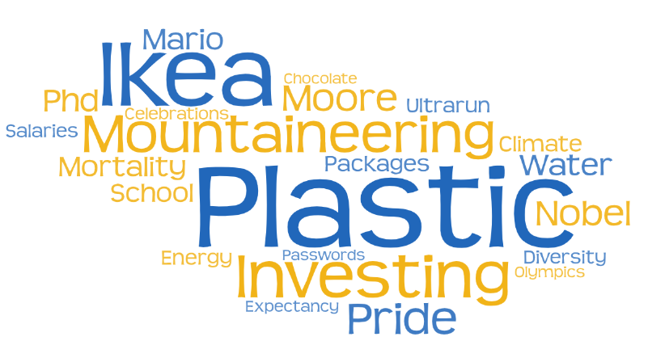
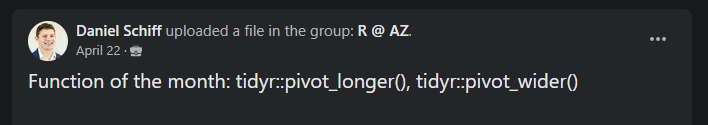
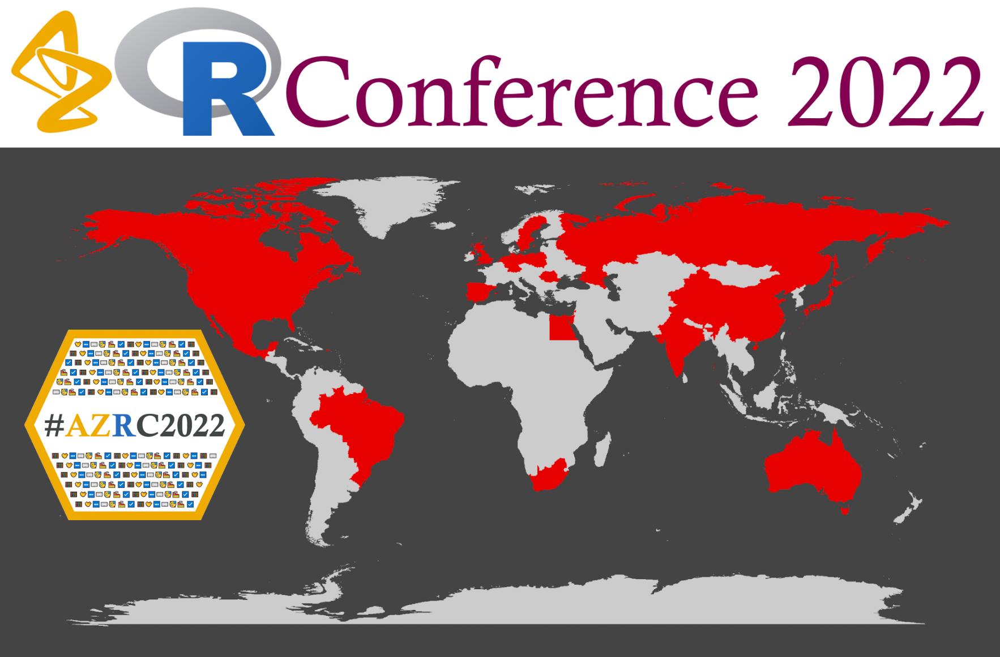
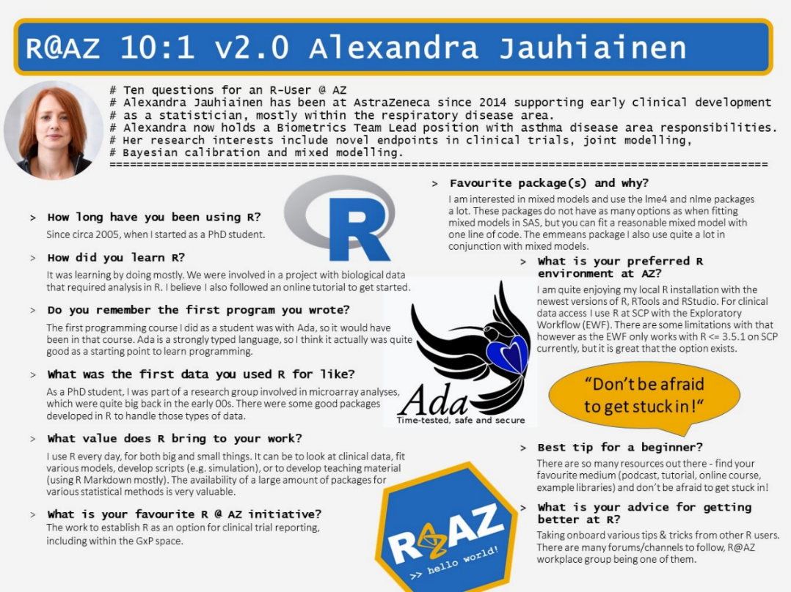
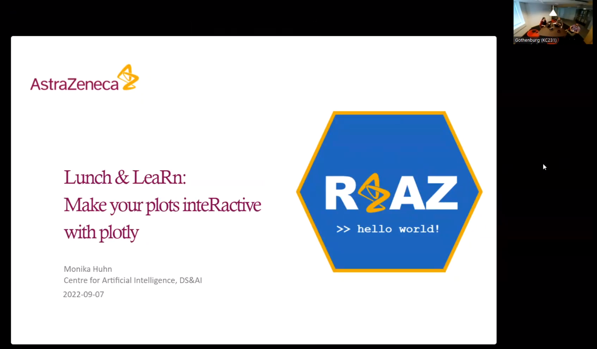
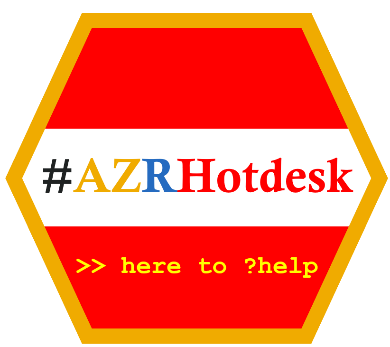
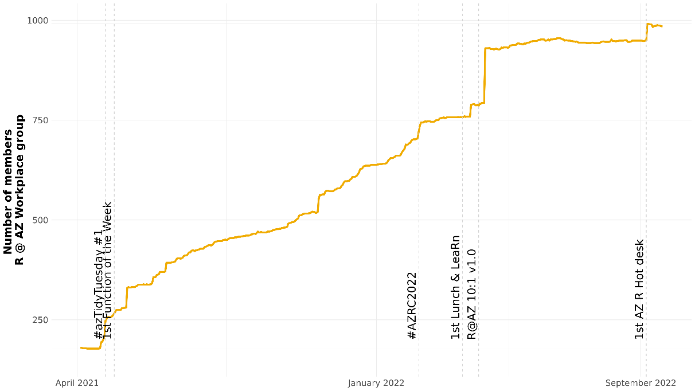

This is a guest post from Guillaume Desachy, Statistical Science Director at AstraZeneca. Since March 2022, Guillaume has been leading a team of 15 collaborators focusing on building the community of R users at AstraZeneca, called R @ AZ.
Get in touch on <a href="https://www.linkedin.com/in/guillaume-desachy/" target = "_blank">LinkedIn</a>.

Back in early 2021, a few of us at AstraZeneca got together and reflected on the growing importance of R in our organization. R was far from being a new thing at AstraZeneca and a long way from being a fad.

However, we didn't know who the R users at AstraZeneca were, and there wasn't any kind of forum where R users could meet.

So we decided **it was time to start a community of R users at AstraZeneca**. 

Since 2016, AstraZeneca has been using an internal social media platform called Workplace, a Facebook-equivalent for companies and the main mode of communication between groups. 

If we wanted to develop a community of R users at AstraZeneca, it was immediately clear that it would center around this software. **But then the question was: how to get started?**

We decided to steal with pride an ongoing initiative in the external world: <a href="https://github.com/rfordatascience/tidytuesday" target = "_blank">TidyTuesday</a>. But we were not going to just steal with pride; we were going to make it our very own.

The principle would remain the same as TidyTuesday, but with a twist. Each time we promoted a dataset, we framed it around **an upcoming internal or external event** or <a href="https://www.astrazeneca.com/our-company/our-strategy/be-a-great-place-to-work/our-values-and-behaviours.html" target = "_blank">one of the AZ values</a>.

**We decided to call this initiative #azTidyTuesday**.

#azTidyTuesday proved to be a very popular starting point to promote and grow the community. It also highlighted that if we wanted to meet the community's diverse needs, we needed to develop other initiatives.

**Shortly after, we launched a monthly initiative promoting a publicly available R package or function** **as a blog post.** This initiative showcased some well-known packages and functions, as well as some less well-known ones. It also came with a few lines of code that the readers could try out in their own time and at their own pace.

It also became apparent early on that we needed to federate this community of R users and that an internal R conference would enable us to do this. Such an event would be an outstanding testimony of the importance of R for our organisation and send a powerful message, both internally and externally.

The **very first AstraZeneca R Conference**, **#AZRC2022**, **took place in February 2022**. The community was growing but still nascent at the time, so we didn't know if people would be interested in such an event, what topics would appeal to them, and who would want to help organise it.

Well, **we were blown away as more than 500 collaborators from 22 countries attended the inaugural AZ R Conference!**

#AZRC2022 was a fully virtual, half-day conference with <a href="https://www.rstudio.com/authors/max-kuhn/" target = "_blank">Max Kuhn</a> as a keynote speaker, more than 30 speakers, and close to 100 poster authors!

We ran three parallel tracks: governance, machine learning, and reproducibility.

The response to the conference gave us a clear message that we could not deny the importance of the community of R users at AstraZeneca. 

Not sitting on our laurels in the afterglow of a successful conference, we realised we could do a better job in terms of inclusion and diversity when it came to meeting the needs of the community. We needed to keep building that sense of belonging, and we needed to keep fostering connections across departments. 

**We then launched R @ AZ 10:1.** The idea was to showcase an R user in the organization and ask them ten questions.

Some feedback we received from the community after #AZRC2022 was that members were also willing to see more recurrent, conference-like events.

We heard that and, at the same time, recognised that everyone is very busy, leading to the **creation of Lunch & LeaRns**. The idea was to invite an AstraZeneca R user and let them showcase one cool thing they did with R. 

There was one rule: each Lunch & LeaRn would last 30 minutes. Again, we kept inclusion & diversity in mind. The Lunch & LeaRns take place at lunchtime, alternating between Europe and the U.S. time zones.

With more and more of our collaborators returning to offices, we knew we could go further. All these connections made virtually could be nurtured in person.

**We recently launched the R Hot Desk** at our <a href="https://www.astrazeneca.com/our-company/our-locations/gothenburg.html" target = "_blank">Gothenburg site</a>. The principle is the following: once a month, some R experts meet in an open area of our offices and dedicate two hours of their time to answer R-related questions.

Now, a virtual community is very much like an in-person community. For it to be vibrant, its steering committee has to build some kind of cadence. Community members need to know when they will meet their friends again. At the moment, there is one R @ AZ initiative per week.

But a steering committee also has to know when to retire some initiatives. After 25 editions, we decided to retire #azTidyTuesday. This will free some time to develop new initiatives: maybe some R @ AZ Meetups at some of the AstraZeneca sites, maybe some crazy new ideas, who knows? \
 \
This has been an absolutely fabulous journey, and the community has seen a 5-fold increase in just a year!

But it is really not about the numbers. \
 \
**At AstraZeneca, one of our values is “We do the right thing.”** Well, it seems like we are doing the right thing with the R @ AZ community, as we will never forget the testimony of one community member: 

> “#azTidyTuesday helped me during the COVID-19 pandemic.”
>
> --- An R @ AZ member

Learn more about the R @ AZ story by watching our <a href="https://bit.ly/3wcy4yI?" target = "_blank">Building the R Community presentation</a> at the useR! 2022 Conference.
