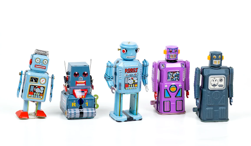

<b>Guten Tag!</b> On June 16th, we’ll be teaming up with <a href="https://www.eoda.de/" target="_blank" rel="noopener noreferrer">eoda</a> and <a href="https://www.covestro.com/en" target="_blank" rel="noopener noreferrer">Covestro</a> to discuss—in German—how  they put their data science into production by developing a unified infrastructure. In addition to learning about Covestro’s success, participants will also receive hands-on guidance on deploying data products in highly structured environments. 

<small><i>Photo by <a href="https://unsplash.com/@ekrull" target="_blank" rel="noopener noreferrer">Ekrull</a> on Unsplash</i></small>

The primary problem for Covestro, a leading manufacturing company in Germany, was that they lacked a centralized development environment. Data scientists that used R and Python did complex analyses on their laptops and used a variety of tools to analyze and share results. The team decided that they wanted to deliver a greater impact at faster speeds, and so with the help of eoda and RStudio, they created a centralized, reproducible analytics infrastructure. Although R and Python represent the core of their environment, many other techniques and tools were integrated such as H2O for machine learning, scaling with kubernetes, CI/CD with GitLab, and version control with SVN. Not only did this framework increase the collaboration of Covestro's data science teams, but compliance guidelines could also be better fulfilled. A centralized infrastructure, incorporating statistics, IT support, machine learning and artificial intelligence, enables decentralized teams to solve problems and achieve long-term success. 

The second half of this 2-hour German webinar will be a hands-on workshop that participants can follow along with. The instructors will discuss how to use RStudio products, including native git integration and multiple approaches to deploying with <a href="https://www.rstudio.com/products/connect/" target="_blank" rel="noopener noreferrer">RStudio Connect</a>. This workshop will provide teams with an excellent collaborative workflow for building, maintaining, and scaling projects in a growing data science environment.

## What you will learn

- Insights into the pain points and solutions for the data science initiatives of Covestro. What is a centralized analytics system? What tools and techniques are needed?

- How to identify existing building blocks in your infrastructure and successfully address them. What is infrastructure as code? What is the business value for your company? 

- Exclusive insights into RStudio products. How to use the native git integration of RStudio products? How does deployment work with RStudio Connect?

Please note: This live webinar will be presented in German, and English subtitles will be provided approximately 3 weeks following the recording. 

Register here: [https://www.eoda.de/webinar-data-science-in-production/](https://www.eoda.de/webinar-data-science-in-production/)
