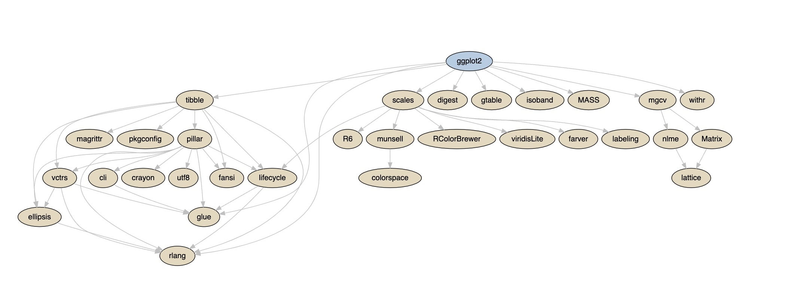

<center>

<font size="2">Photo courtesy of [Pexels](<https://www.pexels.com/photo/business-cargo-cargo-container-city-262353/>)</font>

</center>

Installing software packages from public repositories like [CRAN](https://cran.r-project.org/) or [PyPI](https://pypi.org/) is easy until it isn't. New developers and veterans reading this are likely familiar with the frustration of a lost afternoon from a package failing to install accompanied by an indecipherable error message—spending hours scouring the web only to find that the instructions were missing a crucial step. Did the package maintainers miss this, or could there be more going on?

From the outside, it might feel like it should be easier than it is, but digging a little deeper can lead to a sea of complexity and confusion. So let's look at some of the common challenges associated with package management, understand why it's difficult, and how we can do better.

## What is Package Management

Package management is the entire ecosystem of tools and processes that install, upgrade, delete, and generally manage software programs for a computer. Here, we'll focus on the challenges related to the systems that manage software dependencies, also called software packages, for data scientists and software engineers.

Software packages are shared and installed to extend or enhance existing language functionality. For example, there are packages to serve HTTP requests, plot complex graphs, perform sophisticated statistical functions, and many more.

Most programming languages will have public repositories that host these packages like CRAN for R, or PyPI and Anaconda for Python. If you're familiar with R, then anytime you've run the `install.packages` command, you've probably downloaded a package from the CRAN repository. Similarly, if you've used `pip` for Python, you've likely interfaced with the PyPI repository.

## A Simple Example

Say you want to install the data visualization dependency [`ggplot2`](https://packagemanager.rstudio.com/client/#/repos/2/packages/ggplot2) to plot a graph. R can accomplish this by running the `install.packages` function. The output of which looks something like this:

```{{r}}
> install.packages("ggplot2")
Installing package into ‘/usr/local/lib/R/site-library’
(as 'lib' is unspecified)
also installing the dependencies' colorspace', 'cli', 'crayon', 'utf8', 'farver', 'labeling', 'lifecycle', 'munsell', 'R6', 'RColorBrewer', 'viridisLite', 'ellipsis', 'fansi', 'magrittr', 'pillar', 'pkgconfig', 'vctrs', 'digest', 'glue', 'gtable', 'isoband', 'rlang', 'scales', 'tibble', 'withr'

trying URL 'https://packagemanager.rstudio.com/all/__linux__/focal/latest/src/contrib/colorspace_2.0-2.tar.gz'
Content type 'binary/octet-stream' length 2621589 bytes (2.5 MB)
==================================================
downloaded 2.5 MB
... omitted for brevity ...
* installing *binary* package 'ggplot2'...
* DONE (ggplot2)

The downloaded source packages are in
	‘/tmp/RtmpXOEyc3/downloaded_packages’
```

So what is even happening here? We wanted to download the package `ggplot2` and ended up also downloading `colorspace`, `cli`, and a bunch of others! It turns out that software packages usually require or recommend other software packages.

These recursive dependencies are called a package's **dependency graph**. These dependency graphs can quickly get complicated, as we can see in this visualization:

<center>



<font size="2">A complex dependency graph showing the required and recommended dependencies for the `ggplot2` package</font>

</center>

Beyond this graph, a package can also require system dependencies. You may have installed these in the past using tools like `brew` for macOS, `apt` for Linux's Ubuntu distribution, or  `choco` for Windows.

At this point, you may be saying to yourself, "install the system dependencies, install the package's dependencies and those package's dependencies, and finally install the package." It sounds challenging, but it should be doable, right? Unfortunately, we still have a few more challenges to face in this recursive rabbit hole.

## Versioning and Dependency Solvers

In general, adding software dependencies to a project happens naturally as the project evolves. That is, on day one, you may install `tibble`, the next day `rmarkdown`, and so on. However, these projects could also be evolving, so on that first day, `tibble` was version `3.1.4`, and the next day it's `3.1.5`.

In this example, a problem could arise where the installed version of `rmarkdown` was developed using the `3.1.5` version and may not be compatible with older versions.

You could update `tibble`, but it might depend on another package that is not compatible with the newer version. This problem also extends to the requisite system dependencies, which can be more challenging to reconcile.

<center>


<font size="2">An example graph showing an incompatible dependency cycle, assuming we already have `tibble-3.1.4` and `apollo` installed, and we want the latest version of `rmarkdown`</font>

</center>

Different package management systems deploy various strategies to solve this problem. For example, CRAN employs an approach that enforces that all packages are compatible with one another at any given point in time. Another option is to include a dependency solver like Python's [`pip`](https://pip.pypa.io/en/stable/topics/dependency-resolution/) and [`conda`](https://www.anaconda.com/blog/understanding-and-improving-condas-performance) tools do.

A dependency solver systematically works out which packages and versions of those packages are most likely to be compatible. This process can be immensely challenging and take an indeterminate amount of time to get perfect, so most projects tend to rely on heuristics or a guess-and-check method to get it right. For example, `pip` now uses a backtracking algorithm to perform this operation. This change happened as recently as November 2020, and I recommend [looking back](https://pyfound.blogspot.com/2019/12/moss-czi-support-pip.html) at why it was necessary in the first place.

Let's look at one more wrinkle in installing these dependencies.

## Operating System and CPU Architecture

So far, we've only talked about problems related to dependencies playing nicely with one another, but after we know what packages and package versions we need, is there anything else that can go wrong? Some of you may have noticed this peculiar line in the simple example above:

```bash
* installing *binary* package 'ggplot2'...
```

This statement means we are installing a compiled binary software package. Most of the software we install today is a "binary" distribution which means it is pre-built for a specific operating system and CPU architecture. These distributions install more quickly, and require less work than configuring our computers to build from the source code.

The problems start when our computer differs from the machine used to build the packages. For example, you may have heard of Apple's new M1 apple laptops that use the [ARM64 CPU](https://developer.apple.com/documentation/xcode/writing-arm64-code-for-apple-platforms) architecture. As a result of this release, existing package binaries compiled for macOS Intel x86 computers will not work on these new machines. Some package managers attempt to solve this by building packages for as many operating systems and CPU architectures as possible, while others try to maximize compatibility through portable build distributions like [Python's manylinux system](https://www.python.org/dev/peps/pep-0513/).

However, the situation gets more problematic when we again consider system dependencies, but I'll leave that topic for another time as it warrants an article in itself.

## More Information

We covered many topics, including package management, versioning, dependency resolvers, and compiling pre-built package binaries. Of course, there's so much more to say about these subjects, but hopefully, this helps shed light on why package management is challenging and the problems engineers face every day.

RStudio recognizes these challenges and has a couple of ways to help with our [Package Manager](https://www.rstudio.com/products/package-manager/) product which:

* provides an easy way to pin to CRAN dates to ensure compatibility and determinism
* supports internal, non-CRAN R packages to make sharing and collaboration as simple as possible
* provides pre-built R package binaries for Windows and Linux operating systems and CPU architectures
* and much more

If these challenges sound exciting or you'd like to learn more, the RStudio Package Manager team is hiring! See our [careers page](https://www.rstudio.com/about/careers/) for more information.

## References

* [https://cran.r-project.org/](https://cran.r-project.org/)
* [https://pypi.org/](https://pypi.org/)
* [https://pip.pypa.io/en/stable/topics/dependency-resolution/](https://pip.pypa.io/en/stable/topics/dependency-resolution/)
* [https://www.anaconda.com/blog/understanding-and-improving-condas-performance](https://www.anaconda.com/blog/understanding-and-improving-condas-performance)
* [https://pyfound.blogspot.com/2019/12/moss-czi-support-pip.html](https://pyfound.blogspot.com/2019/12/moss-czi-support-pip.html)
* [https://developer.apple.com/documentation/xcode/writing-arm64-code-for-apple-platforms](https://developer.apple.com/documentation/xcode/writing-arm64-code-for-apple-platforms)
* [https://www.python.org/dev/peps/pep-0513/](https://www.python.org/dev/peps/pep-0513/)
