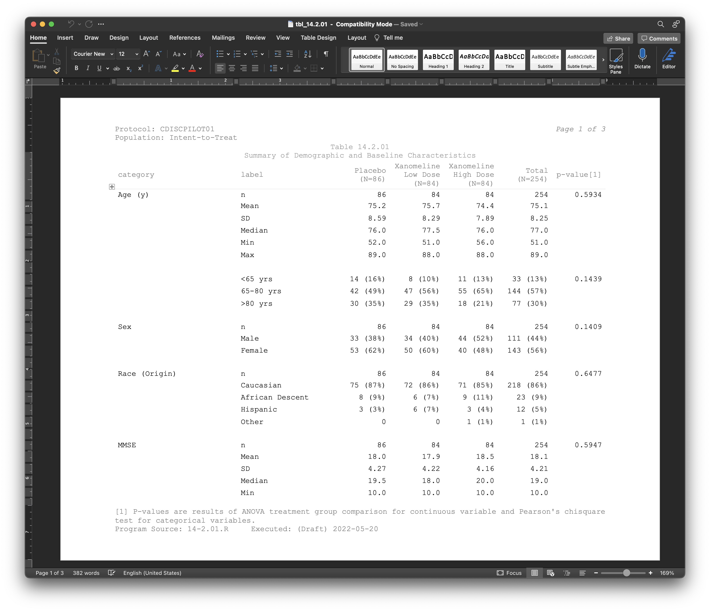

```{r setup, include=FALSE}
knitr::opts_chunk$set(echo = TRUE)
library(gt)
library(tidyverse)
```

A new version of the R package {gt} has been released! We are now at version `0.6.0` and there are now even more features that'll make your display/summary tables look and work much, much better. In this post, let's run through some of the bigger changes and see the benefits they can bring!

<h2>Better RTF output tables for Pharma</h2>

If you're in the pharmaceutical industry and have a hand in generating tabular reporting for regulatory submissions, the new RTF rendering features will output tables in a more suitable format. Some of the key changes include:

1. default table styling with far fewer table borders (a more common look and feel)
2. page-layout options (`page.*`) added to the `tab_options()` function (like `page.orientation`, `page.numbering`, etc.)
3. the addition of pre-header text fields in `tab_header()` (the `preheader` argument)

I won't show all the code required for generating a Pharma-specific table here. For detailed examples, it's better to look at the examples in Phil Bowsher's [Clinical-Tables-in-R-with-gt repository on GitHub](https://github.com/philbowsher/Clinical-Tables-in-R-with-gt), particularly the .Rmd files beginning with `gt-`. What *I will* show you here is a screen capture of how one of those tables looks when opened in Word.

```{r echo=FALSE, fig.alt="Word document containing a pharmaceutical table, the title is Summary of Demographic and Baseline Characteristics  and it has data on category, labels, whether or not the subjects were placebo, number, and p-values."}

```

<h2>New functions for substituting cell data</h2>

We now have four new functions that allow you to make precise substitutions of cell values with perhaps something more meaningful. They all begin with `sub_` and that's short for substitution!

<h3>`sub_zero()`</h3>

Let's begin with the `sub_zero()` function. It allows for substituting zero values in the table body. Here are all the options:

```r
sub_zero(
    data,
    columns = everything(),
    rows = everything(),
    zero_text = "nil"
)
```

Let's generate a simple, single-column tibble that contains an assortment of values that could potentially undergo some substitution.

```{r, paged.print=FALSE}
tbl <- dplyr::tibble(num = c(10^(-1:2), 0, 0, 10^(4:6)))
tbl
```

With this table, we can format all of the numbers in the single `num` column *and* replace the zero values with `"nil"` text with separate call of `sub_zero()`.

```{r}
tbl %>%
  gt() %>%
  fmt_number(columns = num) %>%
  sub_zero()
```
<br />

<h3>`sub_missing()` (formerly known as `fmt_missing()`)</h3>

Here's something that's both old and new. The `sub_missing()` function (for replacing `NA`s with... something) is **new**, but it's essentially replacing a function that is **old** (`fmt_missing()`). Let's have a look at this function anyway!

```r
sub_missing(
    data,
    columns = everything(),
    rows = everything(),
    missing_text = "---"
)
```

The `missing_text` replacement of `"---"` is actually an em dash (the longest of the dash family). This can be downgraded to an en dash with `"--"` or we can go further with `"-"`, giving us a hyphen replacement. Or, you can use another piece of text. Let's get to an example of that. The `exibble` dataset (included in {gt}) has quite a few `NA`s and we'll either replace with the text `"missing"` (in columns 1 and 2) or `"nothing"` (in the remaining columns).

```{r}
exibble %>%
  dplyr::select(-row, -group) %>%
  gt() %>%
  sub_missing(
    columns = 1:2,
    missing_text = "missing"
  ) %>%
  sub_missing(
    columns = 4:7,
    missing_text = "nothing"
  )
```
<br />
If you're using and loving `fmt_missing()`, it's okay! You'll probably receive a warning about it when you upgrade to {gt} `0.6.0` though. Best to just substitute `fmt_missing()` with `sub_missing()` anyway!

<h3>`sub_small_vals()`</h3>

Next up is the `sub_small_vals()` function. Ever have really, really small values and really just want to say they are small? You can do this in multiple ways with this new function. Here are all the options:

```r
sub_small_vals(
    data,
    columns = everything(),
    rows = everything(),
    threshold = 0.01,
    small_pattern = if (sign == "+") "<{x}" else md("<*abs*(-{x})"),
    sign = "+"
)
```

Whoa! That's a lot of options. We can unpack all this though, and we'll do it with a few examples. First, we need a table so let's generate a simple, single-column tibble that contains an assortment of values that could potentially undergo some substitution.

```{r, paged.print=FALSE}
tbl <- dplyr::tibble(num = c(10^(-4:2), 0, NA))
tbl
```

The `tbl` contains a variety of smaller numbers and some might be small enough to reformat with a
threshold value. With `sub_small_vals()` we can do just that with the default `threshold` of `0.01`, and you'll see that the targeted cells read `<0.01`.

```{r}
tbl %>%
  gt() %>%
  fmt_number(columns = num) %>%
  sub_small_vals()
```
<br />
The `small_pattern` combines the threshold value and other literal text to generate an informative and accurate label. Here's a more concrete example that shows how the `threshold` and `small_pattern` work together (it's also Markdownified with `md()`, for *extra fun*).

```{r}
tbl %>%
  gt() %>%
  fmt_number(columns = num) %>%
  sub_small_vals(
    threshold = 0.1,
    small_pattern = md("**Smaller** than {x}")
  )
```
<br />
Small and negative values can also be handled but they are handled specially by the `sign`
parameter. Setting that to `"-"` will format only the small, negative values.

```{r}
tbl %>%
  dplyr::mutate(num = -num) %>%
  gt() %>%
  fmt_number(columns = num) %>%
  sub_small_vals(sign = "-")
```
<br />
You don't have to settle with the default `threshold` value or the default replacement pattern
(in `small_pattern`). This can be changed and the `"{x}"` in `small_pattern` (which uses the
`threshold` value) can even be omitted.

```{r}
tbl %>%
  gt() %>%
  fmt_number(columns = num) %>%
  sub_small_vals(
    threshold = 0.0005,
    small_pattern = "smol"
  )
```
<br />

<h3>`sub_large_vals()`</h3>

Okay, there's one more substitution function to cover, and this one's for all the large values in your table: `sub_large_vals()`. With this you can substitute what you might consider as *too large* values in the table body.

```r
sub_large_vals(
    data,
    columns = everything(),
    rows = everything(),
    threshold = 1E12,
    large_pattern = ">={x}",
    sign = "+"
)
```

Let's generate a simple, single-column tibble that contains an assortment of values that could
potentially undergo some substitution.

```{r}
tbl <- dplyr::tibble(num = c(0, NA, 10^(8:14)))
tbl
```

The `tbl` contains some really large numbers and some might be big enough to reformat with a threshold value (the default `threshold` is `1E12`). Here's how it's done with `sub_large_vals()`.

```{r}
tbl %>%
  gt() %>%
  fmt_number(columns = num) %>%
  sub_large_vals()
```
<br />
Large negative values can also be handled but they are handled specially by the `sign` parameter. Setting that to `"-"` will format only the large values that are negative. Notice that with the default `large_pattern` value of `">={x}"` the `">="` is automatically changed to `"<="`.

```{r}
tbl %>%
  dplyr::mutate(num = -num) %>%
  gt() %>%
  fmt_number(columns = num) %>%
  sub_large_vals(sign = "-")
```
<br />
You don't have to settle with the default `threshold` value or the default replacement pattern (in `large_pattern`). This can be changed and the `"{x}"` in `large_pattern` (which uses the `threshold` value) can even be omitted.

```{r}
tbl %>%
  gt() %>%
  fmt_number(columns = num) %>%
  sub_large_vals(
    threshold = 5E10,
    large_pattern = "hugemongous"
  )
```
<br />

<h2>Wrapping Up</h2>

We are always trying to improve the {gt} package with a mix of big features (some examples: improving rendering, adding new families of functions) and numerous tiny features (like improving existing functions, clarifying documentation, etc.). It's hoped that the things delivered in {gt} `0.6.0` lead to improvements in how you create and present summary tables in R. If there are features you *really* want, always feel free to [file an issue](https://github.com/rstudio/gt/issues) or talk about your ideas in the [*Discussions* page](https://github.com/rstudio/gt/discussions)!
