
Photo by <a href="https://unsplash.com/@patrickperkins?utm_source=unsplash&utm_medium=referral&utm_content=creditCopyText">Patrick Perkins</a> on <a href="https://unsplash.com/s/photos/study-sheet?utm_source=unsplash&utm_medium=referral&utm_content=creditCopyText">Unsplash</a>  

Hello! This summer I worked as one of the education interns, working with Mine Çetinkaya-Rundel and Garrett Grolemund on the [RStudio Cheatsheets](https://www.rstudio.com/resources/cheatsheets/). I'm excited to share my work from this summer. Many RStudio cheatsheets have been updated or reworked based on recent package updates, and we've updated the cheatsheet contribution process as well. You'll also see some small changes to the cheatsheet website reflecting these changes.

## RStudio Cheatsheet Updates

Cheatsheets for [dplyr](https://github.com/rstudio/cheatsheets/blob/master/data-transformation.pdf), [ggplot2](https://github.com/rstudio/cheatsheets/blob/master/data-visualization.pdf), [lubridate](https://github.com/rstudio/cheatsheets/blob/master/lubridate.pdf), [forcats](https://github.com/rstudio/cheatsheets/blob/master/factors.pdf), [reticulate](https://github.com/rstudio/cheatsheets/blob/master/reticulate.pdf), [the RStudio IDE](https://github.com/rstudio/cheatsheets/blob/master/rstudio-ide.pdf), [Shiny](https://github.com/rstudio/cheatsheets/blob/master/shiny.pdf), and [stringr](https://github.com/rstudio/cheatsheets/blob/master/strings.pdf) have been updated to reflect the most recent package updates. This includes dplyr's row-wise grouping, the RStudio Visual Editor, and more. 

<table>
  <tr>
    <td style="background-color:#FFFFFF">
      <a href="https://github.com/rstudio/cheatsheets/blob/master/data-transformation.pdf">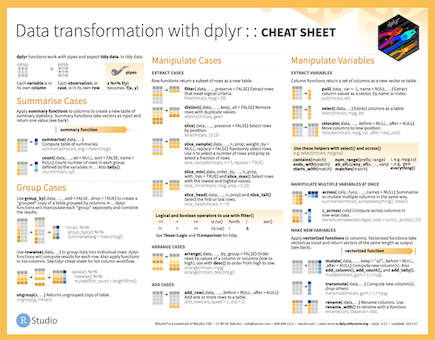</a>
    </td>
    <td style="background-color:#FFFFFF">
      <a href="https://github.com/rstudio/cheatsheets/blob/master/data-visualization.pdf">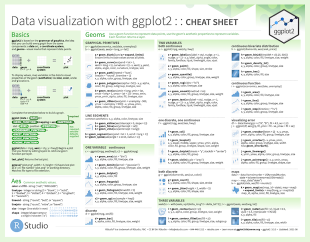</a>
    </td>
    <td style="background-color:#FFFFFF">
      <a href="https://github.com/rstudio/cheatsheets/blob/master/lubridate.pdf">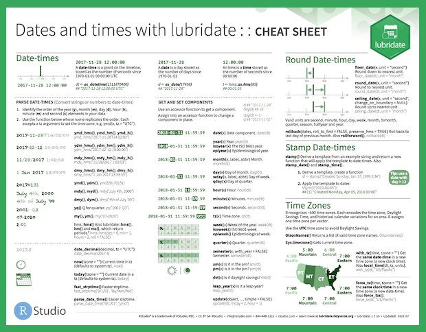</a>
    </td>
    <td style="background-color:#FFFFFF">
      <a href="https://github.com/rstudio/cheatsheets/blob/master/factors.pdf">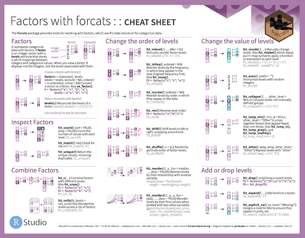</a>
    </td>
  </tr>
  <tr>
    <td style="background-color:#FFFFFF">
      <a href="https://github.com/rstudio/cheatsheets/blob/master/reticulate.pdf">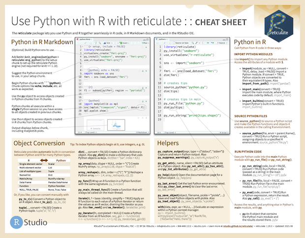</a>
    </td>
    <td style="background-color:#FFFFFF">
      <a href="https://github.com/rstudio/cheatsheets/blob/master/rstudio-ide.pdf">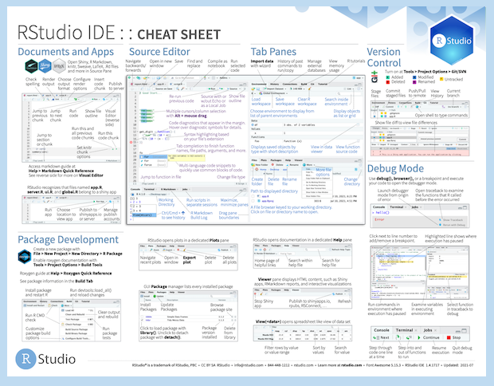</a>
    </td>
    <td style="background-color:#FFFFFF">
      <a href="https://github.com/rstudio/cheatsheets/blob/master/shiny.pdf">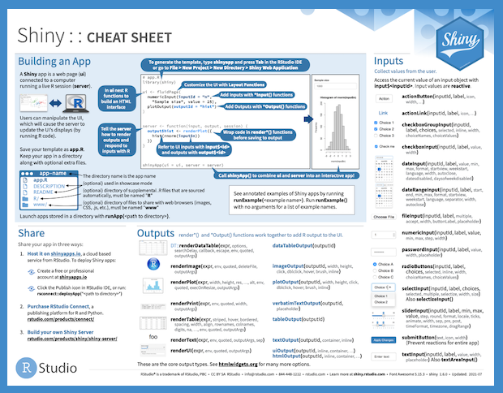</a>
    </td>
    <td style="background-color:#FFFFFF">
      <a href="https://github.com/rstudio/cheatsheets/blob/master/strings.pdf">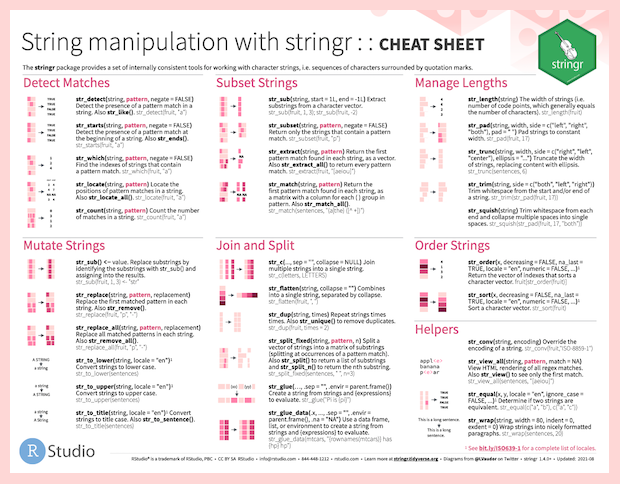</a>
    </td>
  </tr>
</table>

[R Markdown](https://github.com/rstudio/cheatsheets/blob/master/rmarkdown.pdf) and [Apply functions with purrr](https://github.com/rstudio/cheatsheets/blob/master/purrr.pdf) received more substantial redesigns. R Markdown was updated to match the new hex sticker colors and include new features related to the RStudio IDE Visual Editor. With the addition of row-wise grouping to dplyr, the list-column workflow on the previous purrr cheatsheet also needed to be updated and was moved to a new cheatsheet featuring tidyr and nested data. The new purrr cheatsheet focuses more on the many different `map()` functions available in the package on the first page, and all of the more general list functions on the second page.

<a href="https://github.com/rstudio/cheatsheets/blob/master/rmarkdown.pdf">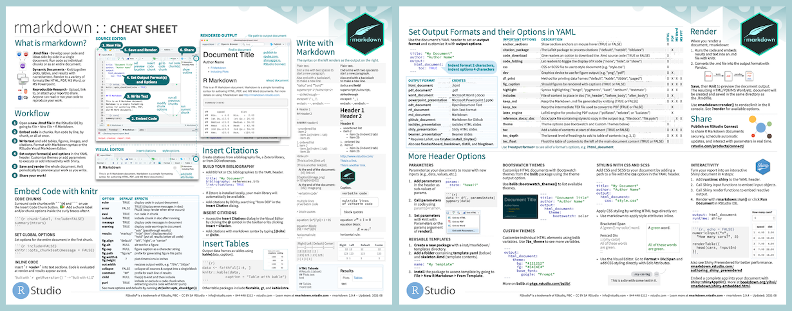</a>

<a href="https://github.com/rstudio/cheatsheets/blob/master/purrr.pdf">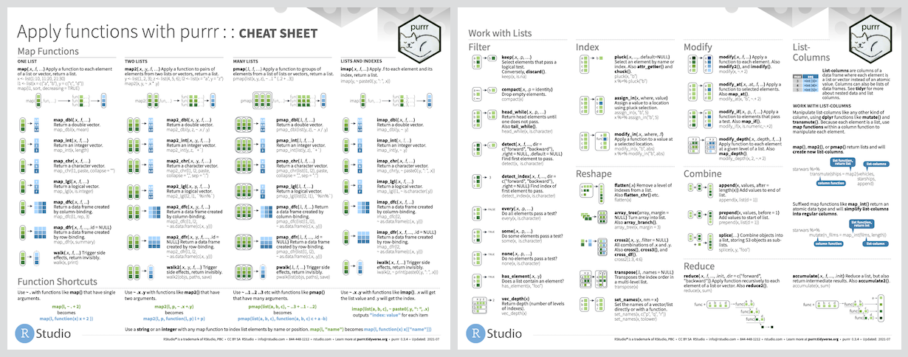</a>

Speaking of new cheatsheets, tidyr now has it’s own cheatsheet! [Data tidying with tidyr](https://github.com/rstudio/cheatsheets/blob/master/tidyr.pdf) features an overview of tibbles and how to reshape and work with tidy data on the first page, and a redesign of the nested data and list-column workflow from the previous purrr cheatsheet on the second page. The new page provides an overview of creating, reshaping, and transforming nested data and list-columns with tidyr, tibble, and dplyr. Previously tidyr was featured on the second page of the Data import with tidyr cheatsheet, and with the space provided by this change [Data import with readr, readxl, and googlesheets4](https://github.com/rstudio/cheatsheets/blob/master/data-import.pdf) now includes a second page covering spreadsheets, with readxl and googlesheets4.

<a href="https://github.com/rstudio/cheatsheets/blob/master/tidyr.pdf">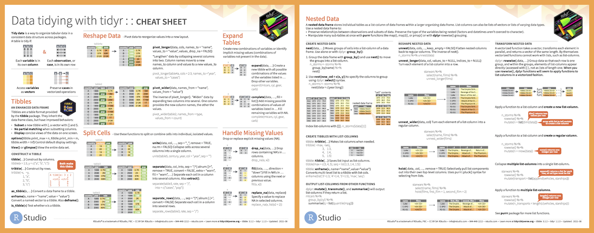</a>

<a href="https://github.com/rstudio/cheatsheets/blob/master/data-import.pdf">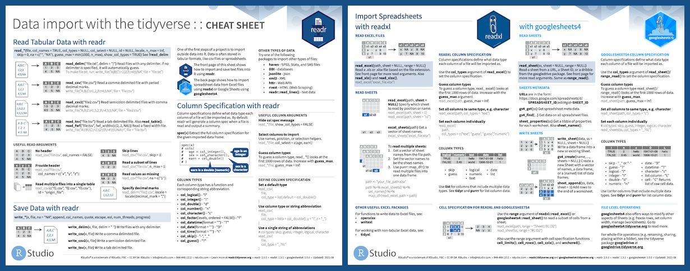</a>

See all of the current RStudio cheatsheets, as well as user contributed cheatsheets and translations on the [RStudio website](https://www.rstudio.com/resources/cheatsheets/).

## New Contribution Process

Another big project completed during my internship was reworking the process for handling user contributed cheatsheets. The [Cheatsheet GitHub Repository](https://github.com/rstudio/cheatsheets) now includes a [Contributing Guidelines page](https://github.com/rstudio/cheatsheets/blob/master/.github/CONTRIBUTING.md) outlining how to submit a new cheatsheet, or a new or updated translation. Both can now be submitted directly to GitHub via pull request, and you'll see a template outlining everything to include.

Questions on the cheatsheets can now be submitted as issues on the Cheatsheet GitHub Repository. We have included issue templates to help guide this process, which can be particularly helpful if you're new to GitHub. Just go to the [Issues tab](https://github.com/rstudio/cheatsheets/issues) and choose the option that’s most relevant to your question!

## Call for Translations

If you’re interested in translating a cheatsheet, please feel free to submit any updates using the new process! With the changes to so many cheatsheets, many translations would benefit from updates as well. 

We really appreciate the work and care that goes into these translations. The first eight cheatsheets mentioned could be great starting points if you’re new to the process, since the changes were much smaller, and for many languages will require updating existing translations, instead of starting from scratch. If you’re interested in translating a cheatsheet, but have limited time or aren’t sure where to start, we’ve listed cheatsheets in each language that we think would be good first contributions as [issues in the GitHub repo](https://github.com/rstudio/cheatsheets/issues).

