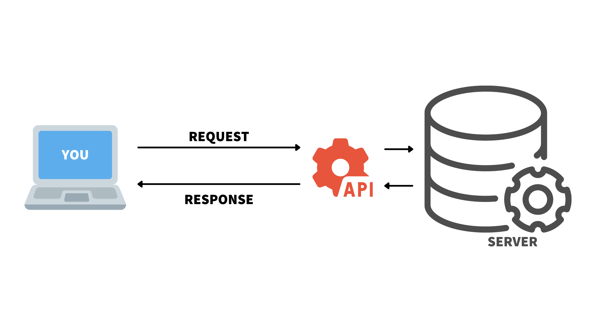

<sup>Photo by <a href="https://unsplash.com/@kharaoke?utm_source=unsplash&utm_medium=referral&utm_content=creditCopyText">Khara Woods</a> on <a href="https://unsplash.com/">Unsplash</a></sup>

Whether it's pulling <a href="https://developer.twitter.com/en/docs/twitter-api" target = "_blank">data from Twitter</a>, accessing <a href="https://openweathermap.org/api" target = "_blank">the most recent weather information</a>, or tracking <a href="https://openflights.org/data.html" target = "_blank">where a particular plane is going</a>, application programming interfaces (APIs) are often part of our data science pipeline. But why would you want to _create_ an API? And how difficult is it to do?

APIs make it easy to scale the reach of your work. They allow your data science results to be responsive, accessible, and automated. And thanks to the <a href="https://www.rplumber.io/" target = "_blank">plumber</a> package, you can convert your R functions into API endpoints using just a few special comments.

## What is an API?

APIs are messenger systems that allow applications to communicate with one another. You send a request to the API. The API takes your request to the server and receives a response. Then, the API delivers the response back to you.

You may already use APIs to retrieve data as part of your data science pipeline. For example, the <a href="https://cran.r-project.org/web/packages/rtweet/index.html" target = "_blank">rtweet</a> package allows R users to interact with Twitter's API. You request data through the package and then receive the API's data as a response.



APIs communicate via "endpoints".  The endpoint receives a request to take an action. For example, when you run `usrs <- search_users("#rstats", n = 1000)` from rtweet, you are interacting with an endpoint that returns a list of users.

Since APIs allow different systems to interact when they wouldn't be able to otherwise, they are incredibly powerful tools to increase interactivity and reach.

## Why would a data scientist want to create an API?

At some point, you may want to share your R output with others. If the other person is not an R user, they may not be able to use your work without translating it into their language of choice.

If your results are available in the form of an API, then anybody can import your results without this difficult translation step. API responses are readable across platforms and applications. Just as you use R to interact with the Twitter API, others can access the Twitter API with other tools.

Let's say you are working with a website developer who uses Javascript. You just developed a model in R and you'd like to share the results. You can send the developer an API so that they can display the results on a website without reconstructing your model in another language. The website can show updated results because it is communicating with your API in real-time. You do not have to manually refresh your code each time there's a change in the data. For example, RStudio's <a href="https://www.rstudio.com/pricing/" target = "_blank">pricing calculator</a> uses an API created from a backend R model to feed the results into our website!

Making your data science work available through an API reduces the handoff between R and other tools or technologies. More people can access your results and use them to make data-driven decisions.

<div class="lt-gray-box">
We recommend reading James Blair's post on how APIs increase the impact of your analyses, <a href="https://www.rstudio.com/blog/rstudio-and-apis/" target = "_blank">RStudio and APIs</a>.
</div>
  
## Creating an API with plumber

The plumber package allows you to create APIs from your R code. It does this through special comments that give instructions on how to turn the functions in your script into API endpoints. It's pretty amazing — with this package, your R code is easily accessible from other tools and frameworks.

Here's an example plumber script. Notice how familiar it looks:


Let's walk through how to convert this R function into an API.

**1. Write standard R code**

Let's say we want to randomly choose 100 numbers and create a histogram. We write out a function in R:

```{{r}}
function() {
  rand <- rnorm(100)
  hist(rand)
}
```

Notice that the function is not assigned to an object. We can test it out by running the below:

```{{r}}
test <- function() {
  rand <- rnorm(100)
  hist(rand)
}

test()
```

**2. Add special comments**

Now, we instruct plumber on how to turn the function into an API endpoint. Plumber parses your script to identify special comments beginning in the  `#*` or `@` symbols. It uses them to convert your script into an API.

Let's give our function a description using `#*`. Here, we're telling plumber to call this function "Plot a histogram":

```{{r}}
#* Plot a histogram
```

Now, let's tell plumber that when we get a request, execute this function and return the plot:

```{{r}}
#* @get /plot
```

By default, plumber will turn your response into JSON format. You can adjust the type of response if that is not the output you would like. For example, our function outputs an image. It doesn't make sense to return an image in JSON format. We can "serialize" our result so that the API returns a PNG rather than JSON.

```{{r}}
#* @serializer png
```

This is just one example of what an API can do. To learn more, check out the <a href="https://www.rplumber.io/articles/rendering-output.html" target = "_blank">plumber documentation on rendering output</a>.

Now, our script looks like this:

```{{r}}
# plumber.R
library(plumber)

#* Plot a histogram
#* @serializer png
#* @get /plot
function() {
  rand <- rnorm(100)
  hist(rand)
}
```

Congratulations! We wrote an API using R.

**3. Plumb it**

Now that we've created an API, it's time to "plumb" (run) it!

After we write our plumber script in the RStudio IDE, a special button appears that allows us to "Run API":


Running the API generates an interface for our API.

<script src="https://fast.wistia.com/embed/medias/ioibdyrv6e.jsonp" async></script><script src="https://fast.wistia.com/assets/external/E-v1.js" async></script><div class="wistia_responsive_padding" style="padding:60.63% 0 0 0;position:relative;"><div class="wistia_responsive_wrapper" style="height:100%;left:0;position:absolute;top:0;width:100%;"><div class="wistia_embed wistia_async_ioibdyrv6e videoFoam=true" style="height:100%;position:relative;width:100%">&nbsp;</div></div></div>
<center><caption>Plumbing an API in RStudio</caption></center>

The interface provides a way to interact with our API's endpoints. We can test out different calls to make sure that everything runs as expected.


<center><caption>Endpoint in our code and the interface</caption></center>

Run 'try it out' and then 'execute' to see what the API returns (in our case, an image of a histogram):

<script src="https://fast.wistia.com/embed/medias/b0d0wt7ji7.jsonp" async></script><script src="https://fast.wistia.com/assets/external/E-v1.js" async></script><div class="wistia_responsive_padding" style="padding:60.83% 0 0 0;position:relative;"><div class="wistia_responsive_wrapper" style="height:100%;left:0;position:absolute;top:0;width:100%;"><div class="wistia_embed wistia_async_b0d0wt7ji7 videoFoam=true" style="height:100%;position:relative;width:100%">&nbsp;</div></div></div>
<center><caption>Testing out our API through the interface</caption></center>

Notice that you never left RStudio to create, run, and test your API!

**4. Deploy the API**

We can develop and test an API on our laptop, but how do we share it with others (for example, the website developer we mentioned previously)? We do not want our laptop to be serving the requests for a variety of reasons, including maintenance and security concerns.

<a href="https://www.rstudio.com/products/connect/" target = "_blank">RStudio Connect</a> is an enterprise publishing platform that deploys APIs created by plumber with versioning, dependency management, and authentication. RStudio Connect also supports the deployment of many other data product formats, including Python APIs developed using frameworks such as Flask, FastAPI, Quart, Falcon, and Sanic. See the <a href="https://www.rstudio.com/blog/rstudio-connect-2021-08-python-updates/" target = "_blank">RStudio Connect Python Updates blog post</a> for more info on deploying Python APIs on Connect.

<script src="https://fast.wistia.com/embed/medias/znvyytmc1u.jsonp" async></script><script src="https://fast.wistia.com/assets/external/E-v1.js" async></script><div class="wistia_responsive_padding" style="padding:60.83% 0 0 0;position:relative;"><div class="wistia_responsive_wrapper" style="height:100%;left:0;position:absolute;top:0;width:100%;"><div class="wistia_embed wistia_async_znvyytmc1u videoFoam=true" style="height:100%;position:relative;width:100%">&nbsp;</div></div></div>
<center><caption>Editing access settings in RStudio Connect</caption></center>

RStudio Connect also ensures that you are not consuming more system resources than is necessary. It automatically manages the processes necessary to handle the current load and balances incoming traffic across all available processes. It will also shut down idle processes when they're not in use.

Learn more about <a href="https://www.rplumber.io/articles/hosting.html" target = "_blank">hosting Plumber APIs</a>.

Now that our API is hosted, anybody can use it in their application! Access it on RStudio Connect: <a href="https://colorado.rstudio.com/rsc/plumber-histogram-example/" target = "_blank">https://colorado.rstudio.com/rsc/plumber-histogram-example/</a>.

## Learn More

APIs increase the impact of your data science work by making your code accessible to a larger audience. Thanks to plumber, you can create them by providing a few special comments in your R code.

* Read the <a href="https://www.rplumber.io/index.html" target = "_blank">plumber documentation</a>.
* Want a more in-depth example? Watch James Blair convert a data science model into an API in his excellent talk, <a href="https://www.rstudio.com/resources/webinars/expanding-r-horizons-integrating-r-with-plumber-apis/" target = "_blank">Expanding R Horizons: Integrating R with Plumber APIs</a>.
* Want to see more plumber examples? The Solutions Engineering team shares some in their <a href="https://github.com/sol-eng/plumberExamples" target = "_blank">GitHub repository</a>.
* Learn more about <a href="https://www.rstudio.com/products/connect/" target = "_blank">RStudio Connect</a>.
