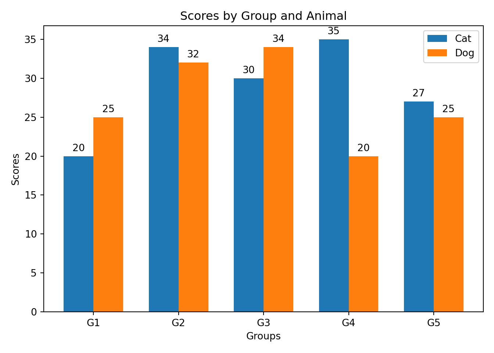
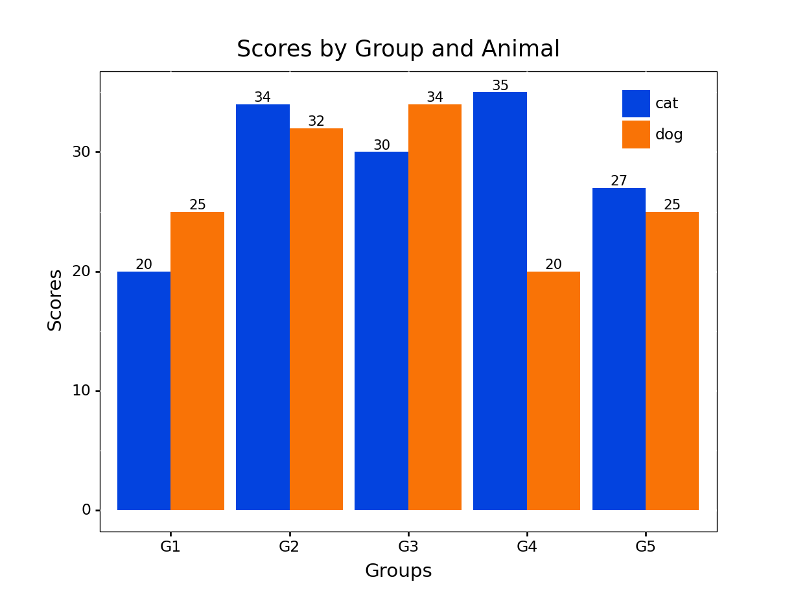

Bilingual teams that want to do serious data science require collaboration, transparency, and reproducibility across R and Python workflows while empowering professionals to work in their preferred language(s). Accomplishing this requires tools built for interoperability at scale and a shared standard between data science languages.

Here are a few recommendations to achieve this:

- [Adopt a bilingual IDE](#ide)
- [Embrace an interoperable enterprise ecosystem](#ecosystem)
- [Use packages that enable bilingual data science teams](#packages)
- [Instill syntactic consistency between R and Python](#consistency)

Let's dive into each of these recommendations!

## 1. Adopt a Bilingual IDE {#ide}

Bilingual teams should adopt a standard IDE that enables work to be done in Python and R, both separately and simultaneously. The [RStudio IDE](https://posit.co/products/open-source/rstudio/) is perfect for this. It allows data professionals to work in either or both languages without sacrificing modern IDE features such as syntax highlighting, debugging tools, workspace management, git integration, markdown support, and more. Adopting a single IDE can lead to a more straightforward setup, better documentation, and smoother troubleshooting than if multiple IDEs are used across the team.

The RStudio IDE can:
-   Combine R and Python in a single script
-   Source and use Python functions in R
-   Edit and run Python or R scripts
-   Create Quarto documents that can embed R and Python code chunks (like this blog post!)

If a data scientist receives a Python script, they can open and run it in the RStudio IDE:

Or, they could hand off an output from one language to the other:

## 2. Interoperable Enterprise Ecosystem {#ecosystem}

Enterprise tools should promote collaboration and interoperability. [Posit Workbench](https://posit.co/products/enterprise/workbench/) is a secure, scalable, and centralized environment that enables R and Python code collaboration by providing:

-   Support for multiple IDEs (RStudio, Jupyter Notebooks, and VSCode)
-   Real-time project sharing
-   Concurrent sessions
-   Scalable resources
-   Maintenance of different environments

[Posit Workbench](https://posit.co/products/enterprise/workbench/) empowers bilingual data professionals to collaborate across projects regardless of the language or IDE. Combining Workbench with [Posit Package Manager](https://posit.co/products/enterprise/package-manager/) ensures that everyone has the same software and packages across projects. Bilingual data professionals can focus on generating insights instead of managing software or package dependencies and versions, which can be an arduous task for one language, let alone two.

[Posit Connect](https://posit.co/products/enterprise/connect/) allows insights of varying formats to be shared with the push of a button. APIs, dashboards, models, and reports can be automatically shared or provided on demand using Connect.

Posit Workbench, Package Manager, and Connect combine to form [Posit Team](https://posit.co/products/enterprise/team/). Posit Team is a robust end-to-end bilingual ecosystem that creates a seamless, interoperable environment where collaboration is easy and preference is respected. Workbench, Package Manager, and Connect all support R and Python and are available separately or collectively.

-   Workbench is a secure and scalable environment (on-premises or cloud) that enables R and Python code collaboration. It simplifies IT administration while empowering data professionals to do their best work.
-   Connect is a push-button publishing platform that enables insights to be shared through dashboards, on-demand and scheduled reports, interactive applications, presentations, model deployments, and APIs.
-   Package Manager allows offline access to CRAN, PyPi, and Bioconductor, as well as the sharing of local packages, restriction of package access, the ability to find packages across repositories, and more.

## 3. Use Packages that Enable Bilingual Teams {#packages}

R and Python workflows can be developed using packages that exist in both languages. Bilingual packages make collaboration more accessible and reduce the potential for error by eliminating the differences and incompatibilities that can arise when using a highly varied package stack. The list of bilingual packages is rapidly growing, so be sure to check the blog frequently for more updates!

An example workflow would be built like this:

<table class="tg">
<thead>
  <tr>
    <th class="tg-c3ow">Workflow Action</th>
    <th class="tg-c3ow">R</th>
    <th class="tg-c3ow">Python</th>
  </tr>
</thead>
<tbody>
  <tr>
    <td class="tg-c3ow">Data Manipulation</td>
    <td class="tg-c3ow">dplyr</td>
    <td class="tg-c3ow">siuba</td>
  </tr>
  <tr>
    <td class="tg-c3ow">Data Visualization</td>
    <td class="tg-c3ow">ggplot2</td>
    <td class="tg-c3ow">plotnine</td>
  </tr>
  <tr>
    <td class="tg-c3ow">Data Object Publishing</td>
    <td class="tg-c3ow">pins</td>
    <td class="tg-c3ow">pins</td>
  </tr>
  <tr>
    <td class="tg-c3ow">Reporting</td>
    <td class="tg-c3ow">quarto</td>
    <td class="tg-c3ow">quarto</td>
  </tr>
  <tr>
    <td class="tg-c3ow">Model Deployment</td>
    <td class="tg-c3ow">vetiver</td>
    <td class="tg-c3ow">vetiver</td>
  </tr>
  <tr>
    <td class="tg-c3ow">Dashboarding</td>
    <td class="tg-c3ow">Shiny for R</td>
    <td class="tg-c3ow">Shiny for Python (in Alpha)</td>
  </tr>
</tbody>
</table>

Note: Some packages have different names but similar functionality

## 4. Adopt Syntactical Consistency {#consistency}

The final recommendation is to adopt syntactical consistency between languages. Collaboration, training, and process resiliency are more manageable when a well-established standard operating procedure exists. Code can be written consistently between users and languages by embracing well-defined grammar.

A well-defined grammar provides a consistent structure and opinionated syntax to perform actions enabling standardization across code bases. This yields the following benefits:

-   Cohesive code between tasks and functions
-   Clean and simple code that is consistently written between users
-   Code that is easy to learn, understand, and share

R and Python have packages that help users adopt a consistent grammar for data manipulation: dplyr and siuba, and visualization: ggplot2 and plotnine, respectively.

Imagine we have a dataset with three columns of values (a,b,c) and a category column. We want to do the following:
- Create a column that doubles the values of column a
- Create a column that triples the values of column b
- Create a column that halves the values of column c
- Create a column that subtracts column b by column c
- Filter the data where output of column b - column c is greater than 3
- Group by the category column to find the average of the four created columns

Click through the tabs to compare Pandas, siuba and dplyr syntax for these actions.
<html>

  <button class="tablinks" onclick="clickHandle(event, 'Task 1_1', 'Task 1')" id="defaultOpen">pandas 1</button>
  <button class="tablinks" onclick="clickHandle(event, 'Task 1_2', 'Task 1')">pandas 2</button>
  <button class="tablinks" onclick="clickHandle(event, 'Task 1_3', 'Task 1')">siuba</button>
  <button class="tablinks" onclick="clickHandle(event, 'Task 1_4', 'Task 1')">dplyr</button>

The pandas code is relatively clean despite some reference duplication and syntax inconsistency between functions. The example code below is one of several ways in pandas to write the ordered series of steps, many of which would look foreign to an R user (and even some Python users). Select the next tab to see a different variation of pandas code executing the same steps.

    # pandas method 1
     (
        example_df
          .assign(a_dbl = example_df.a * 2)
          .assign(b_tri = example_df.b * 3)
          .assign(c_half = example_df.c / 2)
          .assign(b_min_c = example_df.b - example_df.c)
          .query('b_min_c > 3')
          .groupby('category', as_index=False)
          .agg(
              avg_a_dbl = pd.NamedAgg(column='a_dbl', aggfunc=np.mean),
              avg_b_tri = pd.NamedAgg(column='b_tri', aggfunc=np.mean),
              avg_c_half = pd.NamedAgg(column='c_half', aggfunc=np.mean),
              avg_b_min_c = pd.NamedAgg(column='b_min_c', aggfunc=np.mean)
         )
      )

Here we execute the same ordered series of steps as in the previous tab with noticeably different code. While this solution gives the same output as before, the code is more difficult to read and invokes concepts the average R user would be unfamiliar with.

      # pandas method 2
      example_df['a_dbl'] = example_df['a'].mul(2)
      example_df['b_tri'] = example_df['b'] * 3
      example_df['c_half'] = example_df['c'].div(2)
      example_df['b_min_c'] = example_df['b'].sub(example_df['c'], axis = 0)
      example_df = example_df[example_df['b_min_c'] > 3]
      example_df['avg_a_dbl'] = example_df['a_dbl'].groupby(example_df['category']).transform('mean')
      example_df['avg_b_tri'] = example_df['b_tri'].groupby(example_df['category']).transform('mean')
      example_df['avg_c_half'] = example_df['c_half'].groupby(example_df['category']).transform('mean')
      example_df['avg_b_min_c'] = example_df['b_min_c'].groupby(example_df['category']).transform('mean')

With siuba, the syntax remains consistent between functions and actions. Adding columns, filtering, grouping, etc., is always done in the same manner, regardless of the user. The syntax is standard across all Python scripts and immediately readable by R users who work with a nearly identical syntax, as shown in the R code snippet on the next tab. Siuba has added benefits over pandas, like integration with plotnine and the ability to generate SQL.

    (
    example_df
      >> mutate(
        a_dbl = _.a * 2,
        b_tri = _.b * 3,
        c_half = _.c / 2,
        b_min_c = _.b - _.c )
      >> filter(_.b_min_c > 3)
      >> group_by(_.category)
      >> summarize(
        avg_a_dbl = _.a_dbl.mean(),
        avg_b_tri = _.b_tri.mean(),
        avg_c_half = _.c_half.mean(),
        avg_b_min_c = _.b_min_c.mean() )
      )

The R code is nearly identical to the Siuba code on the previous tab. Siuba makes a few modifications to accommodate Python syntax, such as denoting columns with _.

    example_df %>%
      mutate(
        a_dbl = a * 2,
        b_tri = b * 3,
        c_half = c / 2,
        b_min_c = b - c) %>%
      filter(b_min_c > 3) %>%
      group_by(category) %>%
      summarize(
        avg_a_dbl = mean(a_dbl),
        avg_b_tri = mean(b_tri),
        avg_c_half = mean(c_half),
        avg_b_min_c = mean(b_min_c)
      )

</html>

Let's look at another example where we create a grouped bar chart in matplotlib and plotnine. Shortened ggplot2 code is provided for comparison.

<html>

<button class="tablinks" onclick="clickHandle(event, 'Task 2_1', 'Task 2')" id="defaultOpen2">matplotlib</button>
<button class="tablinks" onclick="clickHandle(event, 'Task 2_2', 'Task 2')">plotnine</button>
<button class="tablinks" onclick="clickHandle(event, 'Task 2_3', 'Task 2')">ggplot2</button>

The matplotlib code requires additional steps over plotnine. It can also be written in multiple ways, making it hard for non-Python users to follow. As a result, matplotlib can often be in-cohesive and cumbersome. Plotnine addresses this by using the grammar of graphics built into ggplot2. The grammar of graphics takes a layered approach, making creating custom and often complex visuals simple in syntax. Take a look at the next tab to see this point demonstrated.

    x = np.arange(len(example_df.labels.unique()))
    width = 0.35

    fig, ax = plt.subplots()
    rects1 = ax.bar(x - width/2, np.array(example_df['means'][example_df.category== 'cat']), width, label='Cat')
    rects2 = ax.bar(x + width/2, np.array(example_df['means'][example_df.category== 'dog']), width, label='Dog')

    ax.set_ylabel('Scores')
    ax.set_title('Scores by Group and Animal')
    ax.set_xticks(x, example_df.labels.unique())
    ax.set_xlabel('Groups')
    ax.legend()

    ax.bar_label(rects1, padding=3)
    ax.bar_label(rects2, padding=3)

    fig.tight_layout()
    plt.show()

Creating the grouped bar chart is more straightforward in plotnine compared to matplotlib. More importantly, the syntax remains consistent no matter how complex a plot we generate.

    (
    ggplot(example_df, aes(x='labels', y='means', fill='category'))
     + geom_col(stat='identity', position='dodge')
     + scale_fill_manual(values=['#0343DF', '#F97306'])
    + labs(title='Scores by Group and Animal',x='Groups',y='Scores')
    + geom_text(aes(label='means'), position=position_dodge(width=0.9),size=8, va='bottom')
    + theme(
      panel_background = element_blank(),
      panel_border = element_rect(color = "black", size=.5),
      axis_text_y=element_text(color='black'),
      axis_text_x=element_text(color='black'),
      legend_title=element_blank(),
      legend_position=(0.82, .8),
      legend_background = element_blank()
      )
    )

plotnine and ggplot2 code is nearly identical. There are some minor differences to accommodate for Python syntax.

    ggplot(example_df, aes(x=labels, y=means, fill=category)) +
     geom_bar(stat='identity', position='dodge') +
     scale_fill_manual(values=c('#0343DF', '#F97306')) +
     labs(title='Scores by Group and Animal',x='Groups',y='Scores')

</html>

As demonstrated, the siuba and plotnine packages create a familiar syntax between R and Python for data manipulation and visualization. Using siuba and plotnine leads to a significant portion of the code base being written consistently and readable by both R and Python users.

## Learn More About How Posit is Enabling Bilingual Teams

Anyone interested in building a collaborative bilingual team is highly encouraged to explore the tools this blog post covers. All of the recommendations in this blog can be taken individually but are ideally applied concurrently. To learn more, check out the links below.

- RStudio as a bilingual IDE
  - [R & Python: A Data Science Love Story](https://www.youtube.com/watch?v=_50yZxOome4)
  - [Using Python with RStudio](https://posit.co/blog/three-ways-to-program-in-python-with-rstudio/)
  - [Using Python with Posit Team](https://www.youtube.com/watch?v=o36425S1-VU)

- Posit Team
  - [Posit Team Demo](https://www.youtube.com/watch?v=VrF9EdgiSy8)

- Bilingual Packages
  - [siuba](https://siuba.readthedocs.io/en/latest/)
  - [siuba R Conference Talk](https://www.youtube.com/watch?v=w4Mi0u4urbQ)
  - [plotnine](https://plotnine.readthedocs.io/en/stable/)
  - [Pins](https://pins.rstudio.com)
  - [Vetiver](https://vetiver.rstudio.com)
