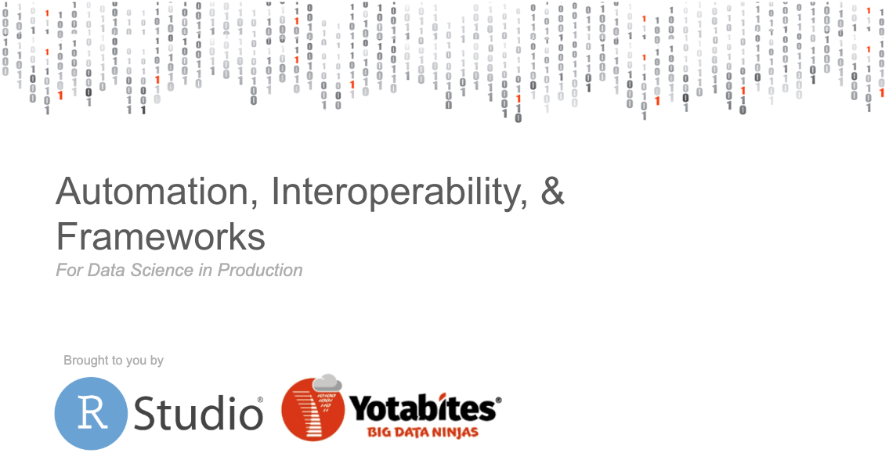

Join us Wednesday, October 23rd, in Austin, Texas as RStudio teams up with [Yotabites](https://yotabites.com/), to host a free half-day event on using open source data science languages and RStudio in production. Yotabites is an RStudio [Full Service Certified Partner](https://www.rstudio.com/certified-partners/) that provides consulting and professional services for RStudio products. 

This event is for RStudio and Jupyter users and their IT colleagues who enable them. We will show how RStudio products can be incorporated into robust business processes and how Yotabites can help simplify the process. We will discuss using R and Python with RStudio, data engineering workflows, scaling container orchestration with kubernetes and Slurm resource managers, and deploying data products into production with CI/CD pipelines and model management.

This is a great chance to test drive some of the newest features in RStudio’s professional products and to hear stories of businesses like yours who have incorporated open source data science languages in production successfully.

- 11:30 am Arrival & Registration
- 12:00 pm Lunch 
- 12:30 pm Welcome & Introduction by Express Scripts 
- 1:00 pm Shiny App Framework for Machine Learning & Mass Migration of Shiny Apps
- 2:00 pm	Coffee Break
- 2:15 pm Improving Efficiency in Production Environments with Automation
- 3:00 pm Using Python with RStudio 
- 4:00 pm Closing Remarks & Networking

The event will take place at the [Capital Factory](https://www.google.com/maps/place/Capital+Factory/@30.2689645,-97.7430044,17z/data=!3m1!4b1!4m5!3m4!1s0x8644b5a741a48747:0x3c7ccf742ba7769d!8m2!3d30.2689645!4d-97.7408104) in Austin, Texas. 
Space is limited, so secure your spot on the Yotabites registration page: http://bit.ly/2khDaYY

