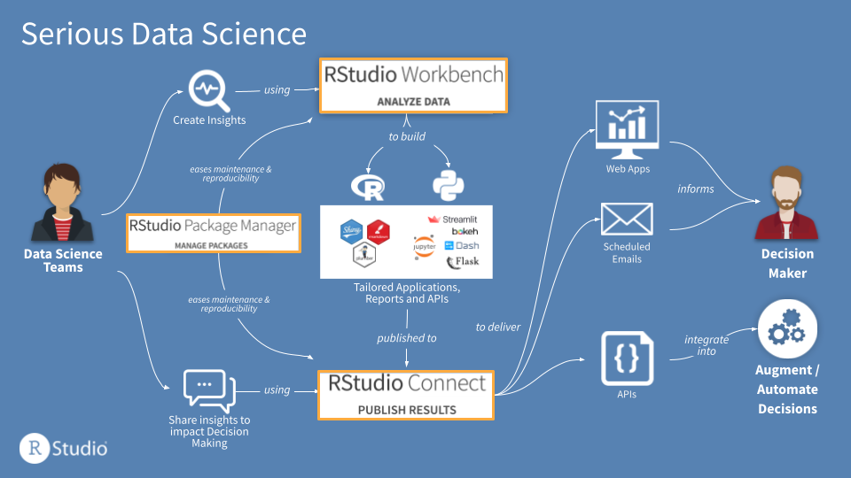

Data science teams sometimes believe that they must standardize on R or Python for efficiency, at the cost of forcing individual data scientists to give up their preferred, most productive language. RStudio’s professional products provide the best single home for R and Python data science, so teams can optimize the impact their team has, not the language they use.

# R, Python and Serious Data Science

RStudio’s mission is to create free and open-source software for data science, analytic research, and technical communication. This mission is expressed in [our charter as a Public Benefits Corporation](https://blog.rstudio.com/2020/01/29/rstudio-pbc/){target="_blank"}, and funded by the revenue from our professional products. These products, such as [RStudio Team](https://www.rstudio.com/products/team/){target="_blank"}, enable teams and organizations to scale, secure and operationalize their open source data science.

In working with many different organizations that want to maximize the impact of their data science work, we’ve seen three recurring attributes that contribute to success--which collectively we call Serious Data Science:

* **Open source**: It’s better for everyone if the tools used for data science are free and open. This enhances the production and consumption of knowledge and facilitates collaboration. The widespread use of open source software makes recruiting, retention and training of data science team members easier, and comprehensive open source ecosystems ensure you have the right tool for any analytic challenge.
* **Code-first**: Coding is the most powerful and efficient path to tackle complex, real-world data science challenges. It gives data scientists superpowers to tackle the hardest problems because code is flexible, reusable, inspectable, and reproducible. With code, the answer is always yes.
* **Centralized**, on premises or in the cloud: Centralizing the infrastructure for data science work reduces unnecessary headaches for data science teams, promotes collaboration and sharing self-service applications, supports reproducibility and eases administration.

RStudio’s professional products deliver a platform on which to centralize, secure and scale your data science, but there are two prominent choices for open source, code-first environments: R and Python. Teams sometimes believe that they must standardize on one or the other for efficiency, at the cost of forcing individual data scientists to give up their preferred, most productive language.

# Myths about R vs. Python

There are a few common myths that we frequently hear from different organizations struggling with the decision of R vs. Python:

* **Cognitive overload for Data Scientists**: Practitioners often fear that using more than one language will add overhead and context switching, forcing them to use different development environments.
* **Unnecessary burden on IT**: The DevOps and IT teams are concerned that supporting two languages will mean supporting twice the infrastructure for development and deployment, and answering twice as many support tickets for help.
* **Blockers to collaboration, reuse and sharing**: The leaders of data science teams worry that allowing multiple different languages will make it harder for the team to collaborate, re-use each other’s work, and deliver that work to the rest of the organization.

# Debunking the Myths

While these myths are common, they are nonetheless myths. Advancements in tools in the last few years have made it far easier for a data science team to use both R and Python, side by side.

* **Data scientists can easily combine R and Python**: The RStudio IDE makes it easy to combine R and Python in a single data science project. The [reticulate package](https://rstudio.github.io/reticulate/){target="_blank"} provides a comprehensive set of tools for interoperability between Python and R, and the RStudio IDE has added new capabilities to make Python coding easier, including the display of Python objects in the Environment pane, viewing of Python data frames, and tools for configuring Python versions and conda/virtual environments. (See this [blog post on RStudio 1.4](https://blog.rstudio.com/2020/10/07/rstudio-v1-4-preview-python-support/){target="_blank"}, and the [recent RStudio 1.4 update](https://blog.rstudio.com/2021/06/09/rstudio-v1-4-update-whats-new/){target="_blank"}, for more information).

*Video: Recent improvements to Python integrations in the RStudio 1.4 release.*

* **Common infrastructure can support multiple languages and reduce support costs**: By using a platform that supports both R and Python, such as [RStudio Team](https://www.rstudio.com/products/team/){target="_blank"}, DevOps and IT teams can enable data scientists to use their preferred languages and development environments, while supporting a single infrastructure for both development and deployment. For example, RStudio Workbench ([recently renamed from RStudio Server Pro](https://blog.rstudio.com/2021/06/02/announcing-rstudio-workbench/){target="_blank"}) allows data science teams to use the RStudio IDE, Jupyter or [VS Code](https://blog.rstudio.com/2021/06/02/rstudio-workbench-vscode-sessions/){target="_blank"} on the same infrastructure, so data scientists can use their IDE of choice without putting an additional burden on IT.

* **Optimize your team’s impact, not the language they use**: Data science teams are most effective when they are sharing work with their fellow team members and with their key stakeholders, as was discussed [in this recent panel webinar](https://www.rstudio.com/resources/webinars/building-effective-data-science-teams/){target="_blank"} with leaders of data science teams. By supporting both languages, teams have access to more tools for distributing work and making an impact. Frameworks like Shiny, Dash, Streamlit, plumber, Flask, and R Markdown allow data scientists to focus on communication regardless of the language they use.

Figure: RStudio Team provides a single infrastructure for data science teams to develop, share and manage their work, whether it is built in R or Python.

# For More Information

* If you’d like to learn more about how RStudio provides a single home for R and Python Data Science, watch [this recent webinar](https://www.rstudio.com/resources/webinars/rstudio-a-single-home-for-r-and-python/){target="_blank"}, or get an overview on our website at the [R and Python Solutions](https://www.rstudio.com/solutions/r-and-python/){target="_blank"} page.
* If you’d like to catch up on all the product feature details, check out [this overview of RStudio’s ongoing efforts around Python](https://blog.rstudio.com/2021/01/13/one-home-for-r-and-python/){target="_blank"}, as well as the latest Python features in the [RStudio IDE in this post](https://blog.rstudio.com/2021/01/19/announcing-rstudio-1-4/){target="_blank"}, [this update](https://blog.rstudio.com/2021/06/09/rstudio-v1-4-update-whats-new/){target="_blank"}, and [this post on VSCode](https://blog.rstudio.com/2021/06/02/rstudio-workbench-vscode-sessions/){target="_blank"}.
* For advice on reference architectures, usage patterns and configuration, check out the [Python section](https://solutions.rstudio.com/python/){target="_blank"} of solutions.rstudio.com.
