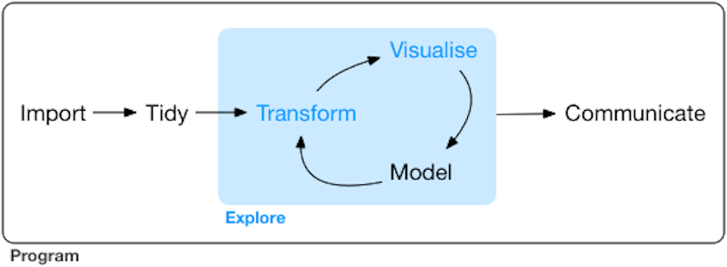

Here's a quick quiz: which of the following statements are true:

1.  Henry Ford invented the automobile.
2.  Bob Marley recorded and sang the song, *Don't Worry; Be Happy*.
3.  Medieval Europeans believed the earth was flat.

All of these statements are common myths and are false (see the end of this article for sources for the true answers). It was in this context that members of the RStudio team sat down with partner Lander Analytics to tackle another modern-day myth, namely that data scientists must choose between R and Python for their data science work.

<em>Photo by <a href="https://unsplash.com/@jamesponddotco" target="_blank" rel="noopener noreferrer">James Pond</a> on <a href="https://unsplash.com/photos/26vBUtlufFo" target="_blank" rel="noopener noreferrer">Unsplash</a></em>

Our panelists for this webinar were:

-   **Daniel Chen**, Ph.D. student and author of *Pandas for Everyone*, the Python/Pandas complement to *R for Everyone*.
-   **Jared P. Lander**, Chief Data Scientist of Lander Analytics
-   **Sean Lopp**, Product manager at RStudio
-   **Carl Howe**, Content lead at RStudio
-   **Samantha Toet**, Partner marketing specialist at RStudio.

You can view the recording of our webinar at <a href="https://rstudio.com/resources/webinars/debunking-the-r-vs-python-myth/" target="_blank" rel="noopener noreferrer">Debunking the R vs. Python Myth</a>. That site also has complete biographies of our panelists.

The sections below summarize many of the questions and answers brought up during the panel. We have paraphrased and distilled many of these responses for brevity and narrative quality. We've also added answers to questions that were asked by our attendees but that we answered after the webinar aired.

## What's behind the R and Python Myth?

### What is interoperability?

**Samantha:** I like starting with this question because it gets at the heart of the R and Python myth. The myth assumes that data scientists must choose between R or Python. The reality is that interoperability allows the two languages to work together.

This interoperability idea aligns with the concept of serious data science (see <a href="https://blog.rstudio.com/2020/05/19/driving-real-lasting-value-with-serious-data-science/" target="_blank" rel="noopener noreferrer">this article</a> and its successor posts for definitions and details) in that we gain credibility because the prior work has already been proven, we gain agility because we don't have to reinvent the wheel, and we gain durability because the work is built on existing knowledge. While this concept of interoperability and its importance isn't new, it's especially significant right now with the wealth of different open source tools at hand.

**Jared:** The user of the tool doesn't need to know that there are other languages at play under the hood. For example, the R language itself is built on C and FORTRAN code and libraries.

**Carl:** I like to think of interoperability as our ability to build on prior work. This isn't a new idea -- it's the foundation of all science. However, data science is one of the first scientific disciplines to be built on a foundation of code. Eliminating building blocks for our work simply because they aren't written in our favorite language leads toward reinventing the wheel again and again. The good news is that R and Python now both have features that facilitate interoperability, and that means we can build on top of them faster.

### Are there any specific best practices for interoperability and building a multi-lingual team?

**Daniel:** In terms of tooling, some of the best things you can do is to use a version control system, the most popular one of which is `git`. That's a powerful way to create data science that's credible. Version control literally leaves you an audit of your code and allows you to go back in time to track down bugs.

**Jared:** I always like to keep all the steps in my process as isolated as possible. You can use git to keep everything under control and then apply a CI/CD (Continuous Integration/Continuous Delivery) system as a way to kick off workflows.

Workflows have become more popular for managing data science, especially working in a multi-tool environment. We use documents like RMarkdown to kick off many individual steps and run those in sequence. And best of all, you don't care what language your steps are using. You can have one step in R, another in Python, and yet another in Julia. That allows you to take advantage of parallelism, and, when combined with Docker, allows you to dictate the appropriate execution environment for each step.

**Sean:** If we take a step back, best practices are the same in any language. Most were refined by software developers way before data science was a thing, and now they are being adopted by data scientists. Those practices include using tools such as version control systems, testing infrastructure, continuous integration tools, and a documented workflow such as Jared was referring to.

More interesting is thinking about the potential differences between practices for software engineering and for data analysts. It's kind of a lot to take someone graduating from Excel to R and Python and convince them to adopt all these complex tools. So for me, the first steps for analytic software come down to two things:

1.  **Working in a common server environment.** The server environment gives us a centrally managed execution environment that provides a shared playbook for folks to work in. Using a server allows everyone to share software versions, packages, and network access, all under a consistent set of organizational policies.
2.  **Having a safety net that tracks the common environment.** That safety net includes having version control for the source code and a system for managing the execution environment. We recently released a package called `renv` for R; on the Python side, you might be familiar with `virtualenv` or perhaps `conda` to do something similar.

**Carl:** It's important to ask where is your data going to live and in what format. An unsung open source project trying to create better answers to those questions for R, Python, C++, Rust, and a host of other systems is the <a href="https://arrow.apache.org/docs/python/feather.html" target="_blank" rel="noopener noreferrer">Feather file format</a>, which is part of <a href="https://arrow.apache.org/" target="_blank" rel="noopener noreferrer">Apache Arrow</a>. The project's goal is to implement a fast common data representation which can be used in memory and doesn't require serialization steps. When both languages can read and write data in a common format, interoperability becomes both easier and faster.

## What are the preferred tools for each step in the data science lifecycle?

**Daniel:** I don't really think projects are language-specific. Short of programming microcontrollers, which tends to be done in Python or C, both languages can do pretty much anything. If you find yourself asking, "which language should I use for this project?", you should also ask yourself:

1.  **Who am I developing this *for*?** Think about who will use the results you create. Will they just be looking at them or will they want to tinker with them?
2.  **Who am I developing this *with*?** If I'm part of a team or group, what is their preferred language? Who will provide support long-term and what language skills do they have?

For me, I really like how R does publication and communication, including R Markdown report generation, Shiny dashboards, `ggplot` for plotting, I personally find that ecosystem easier to use. So when I'm doing a final presentation, I usually drop down into those tools.

Prior to presentation though, I find I think more about the people on the team and not so much about the tools or data. You have to even think beyond your team; your IT department that has to manage the infrastructure, for example. Waging a language "holy war" within a team sets the stage for an attitude that does not embrace learning and makes creating value less efficient. And at the end of the day, we can call R from Python and Python from R, so the choice isn't nearly as critical as you think.

**Carl:** When I think about preferred tools, I like to break it down into the process that Garrett Grolemund and Hadley Wickham put forth in <a href="https://r4ds.had.co.nz/explore-intro.html" target="_blank" rel="noopener noreferrer">*R for Data Science*</a>. They have a 5 step process where you start with data ingestion, you tidy up your data, you then go through a loop of transformation and analysis, and you finally do the presentation.

Before we get there, I think we all usually start with the RStudio Integrated Development Environment (IDE) or some other equivalent tool that helps us be more productive writing code, regardless of language. Not everyone has to -- I spent a lot of my career writing R in emacs

Now I'm a mostly R guy, so when I think of this process, I have some favorite R packages:

1.  **ingestion**: `readr` for ingesting all kinds of files, not just .csv files. There are also other important packages like `DBI` and `odbc` that provide access to databases, which is a best practice for doing ingestion.
2.  **tidy**: `tidyr` is an awesome package for a variety of tidying tools
3.  **analysis**: This is pretty wide open. Many of the 17,000+ packages available in R live in this category, so I'm not going to arbitrarily choose a few.
4.  **communication**: My go-to packages here are `ggplot2`, `rmarkdown`, `flexdashboard`, and `Shiny`. These are killer apps for presenting to business people because they provide pictures and text. I'll also provide a shout out for the daily build versions of the RStudio IDE which feature what-you-see-is-what-you-get editing for R Markdown. They make it as easy to edit R Markdown as it is to edit ordinary text in Microsoft Word. If you have anyone who is allergic to all the funny annotations to use R Markdown, get the latest version of the RStudio IDE.

### What should a data science manager think about team composition when considering interoperability?

**Jared:** The first and most important thing is that the team is the people and you have to manage the people more than the tools and more than the data and everything else. They are everything. That might sound a little saccharine, but they are the people who get the work done.

It's only recently that we have companies who say that "Everything has to be done in the same language." Banks have been operating for decades and they're running C, COBOL, Java, SQL, and a host of others. It's very common in most industries to have a multitude of languages. It may not be as common for a single team as we're seeing in data science teams, but it happens.

There's often talk of this holy war between R and Python in data science. You've got to stop that. You can't make any one employee feel worse or better based on their language choice. It may come down from the leader of the team that one language is better than another, but you can't make your team members feel like second-class citizens. It's not good for the people.

The most important thing is for everyone to feel valued and not to defer to pseudo-standardization.

**Sean:** There is an assumption that if we can standardize on a single tool, our team will be more efficient. That is, there will be less costs associated with infrastructure, maintenance, and development. This is entirely false.

If you look at your costs, the most valuable and expensive resource on a data science team is the data scientist. They are what bring differentiating capabilities to the business. For that reason, providing them with the right tools for them to be successful is significant. You wouldn't tell a mechanic not to use all the tools in their toolbox, or a musician not to play different instruments, so why should a data scientist standardize on one programming language?

We see this a lot at RStudio, this myth that if data scientists would only converge on one tool, it will be cheaper. In reality, by converging on a single tool you may be missing out on being able to recruit a diverse group of team members that bring a wealth of different skills and backgrounds.

## What are some real-world examples of R and Python working together?

Finally, we discussed some examples of successful R and Python data products. Daniel walked us through a <a href="https://github.com/chendaniely/2020-08-26-rstudio_debunk" target="_blank" rel="noopener noreferrer">Shiny app that has a Python sci-kit learn machine learning model</a> running inside of it. Carl shared some insights about <a href="https://blog.rstudio.com/2020/07/28/practical-interoperability/" target="_blank" rel="noopener noreferrer">3 wild-caught R & Python interoperability examples</a>, including an example he built to monitor solar panel and weather data using asynchronous interoperability on a Raspberry Pi.

The key takeaway from this discussion is that data science should not be stifled for the sake of language loyalty. By embracing the differences between R and Python data science teams can expand their capabilities and therefore deliver the most significant results.

## Attendee Questions

We didn't have time during the webinar to address attendee questions, so we thought we'd follow up on a few of what we thought were the most important here. Multiple questions on the same topic have been consolidated into one whenever possible.

### Languages for data science

Despite our best efforts, our attendees still wanted us to recommend a single best language.

#### Can you share the blog where you define "serious data science"?

**Carl:** Absolutely. The initial article is titled, <a href="https://blog.rstudio.com/2020/05/19/driving-real-lasting-value-with-serious-data-science/" target="_blank" rel="noopener noreferrer">Driving Real, Lasting Value with Serious Data Science </a> and it defines serious data science work as having 3 essential attributes, each of which we discussed in detail in subsequent articles. RStudio believes that for work to be considered serious data science, the work has to be:

1.  **Credible:** <a href="https://blog.rstudio.com/2020/06/02/is-your-data-science-credible-enough/" target="_blank" rel="noopener noreferrer">Is Your Data Science Credible Enough?</a>.
2.  **Agile:** <a href="https://blog.rstudio.com/2020/06/09/is-your-data-science-team-agile/" target="_blank" rel="noopener noreferrer">Is Your Data Science Team Agile?</a>
3.  **Durable:** <a href="https://blog.rstudio.com/2020/06/24/delivering-durable-value/" target="_blank" rel="noopener noreferrer">Does your Data Science Team Deliver Durable Value?</a>

#### When trying to help an analyst move from Excel to R or Python, which would you suggest teaching first? For a beginner who is trying to learn Data Analytics. Which tool would you recommend? R or Python?

**Carl:** Either will work. If the analyst has written code before, then Python may appear more familiar. If the analyst has not been a programmer in the past, I'd have them learn R first because it is easier to learn for non-programmers who just want to get something done and don't want to learn computer science along the way.

#### We've focused on R and Python here. What about Julia?

**Carl:** In my view, Julia turns the 2 language problem into a 3 language problem. Once again, if Julia is the fastest way for you to solve a problem, use it. However, I don't think most people believe that Julia eliminates the 2 (or 3 or N) language problem.

The good news, though, is that you can call Julia within R and Python as well. Both R Markdown and Jupyter notebooks allow you go create notebooks and chunks that run Julia code.

### Tooling

#### What's the easiest way to set up a shared environment for my team (assuming I'm the only one with programming experience)

**Daniel:** If you're in a shared cloud environment, `renv` can be used to completely set up the R environment. Python has `virtualenv` and `conda` environments that you would set up for everyone to use on the Python side. You then need to tell people to run a few lines of code, in the beginning, to "set everything up".

Fortunately, many companies and people have their own internal R packages to make the set up part easier for everyone. If you don't have such a system at your organization, then you should build such a standard setup package. While it may take more time now, it will save huge amounts of time later.

#### Are we talking purely about using the Open Source tools R Studio offers?

**Carl:** Everything we discussed applies to the open source tools and to RStudio's professional tools. The differences between the two are largely related to enterprise features and scalability for large installations. Functionally, though, they cover almost all the same capabilities.

#### Are there other ways to incorporate Python in R other than with the `reticulate` package?

**Carl:** While \`reticulate\` is probably the best known, `rPython`, `SnakeCharmR`, and `PythonInR` all provide the same functionality for R to call Python. You can also use R from Python with the `PypeR`, `pyRserve`, and `rpy2` packages. You might find <a href="https://towardsdatascience.com/from-r-vs-python-to-r-and-python-aa25db33ce1" target="_blank" rel="noopener noreferrer">this site helpful</a> in sorting out the pros and cons of each language.

#### I don't understand. How does version control affect the development process?

**Daniel:** Version control is related in the sense that when you have teams working in different languages in the same project. you need some way to coordinate the work of multiple people. Version control systems like `git` allow for multiple developers to work together without stepping on each other's toes by keeping track of who has changed what and detecting when changes are likely to conflict. They also are often used to drive automated testing and continuous integration tools farther down the deployment pipeline.

#### Do you guys containerize models e.g. using Docker and k8s? Does anyone have any other good ways of exposing models in production?

**Daniel:** Yes, containers are a common way to share models. You can expose those containerized models in production with the `plumber` package in R and make the model callable with a REST API. Depending on how frequently the model needs to be updated, you can also just save out the model object once it is trained and reference that saved model in production.

**Carl:** While this may not seem to directly answer your question, I recently wrote an article titled <a href="https://blog.rstudio.com/2020/08/27/expand-your-data-science-resources/" target="_blank" rel="noopener noreferrer">*3 Ways to Expand Your Data Science Compute Resources*</a> which talks about how the Launcher feature in RStudio Server Pro can run R jobs independently of interactive sessions. That same Launcher feature also is capable of launching containerized versions of R applications on SLURM and Kubernetes, allowing you to train models using a centralized computational cluster.

### Applications and Use

#### I heard from "Python people" that Python is better at doing ML at scale on large datasets and that Python is better at creating ML models that can be put into production. Can you comment on those claims?

**Carl**: I think this is one of the myths that keeps getting promoted without any evidence to support it. Yes, Python has many machine learning libraries. So does R. Yes, Python can use the `keras` and `tensorflow` packages for building models. So can R. Yes, Python can run on large Spark clusters at scale. So can R (and we might argue that the `sparklyr` package provides a more programmer-friendly way of doing so than the native Python and SparkR interfaces).

To my mind, the key to any sort of lasting and robust solution to a computational problem is to decompose the problem into clear components and to provide simple elegant interfaces to those components. That sort of solution design doesn't care whether you create the solution in R, Python, Basic, COBOL, or System 370 assembly code. And as Jared noted in our webinar, multi-billion-dollar banks around the world run production systems written in all those languages every day of the week. That suggests to me that the key to good production systems is in how you build them, not what language you write them in.

#### At present, how efficiently is R optimized for running Deep Learning algorithms in TensorFlow as compared to Python ?

**Carl:** I don't think any of us feel like we know a definitive answer to that question. Both R and Python have Tensorflow interface libraries. The Tensorflow code they run is actually identical; the interface libraries are simply wrappers around the native Tensorflow code. So to first order, I'd expect the two languages to be roughly the same in terms of efficiency if you are invoking Tensorflow directly.

For those interested in the efficiency of solving AI problems using R and Python, I highly recommend visiting the <a href="https://blogs.rstudio.com/ai/" target="_blank" rel="noopener noreferrer">RStudio AI blog</a> which has regular articles on this topic and more.

With that said, though, I'd emphasize that for many problems, your real challenge is not the efficiency of the code, but how clearly and quickly you can express the problem you are going to solve in whatever programming language you use. In most applications, the bottleneck to finding a solution to a problem is not the computer, but the person at the keyboard trying to write the program to solve the problem. You'll ultimately achieve the greatest efficiency if you use the best tool for the job in expressing that program first and worry about optimizing how fast it runs only when you find you need to.

## Debunking R and Python Myths Summary

All of us find it difficult to fight conventional wisdom. In this article, we've argued that not everything that people believe is true. Specifically, we've debunked the following myths:

1.  Henry Ford invented the automobile. Actually, <a href="https://www.daimler.com/company/tradition/company-history/1885-1886.html"  target="_blank" rel="noopener noreferrer">Karl Benz invented the automobile in 1886</a>, many years prior to <a href="https://www.thehenryford.org/collections-and-research/digital-collections/artifact/252049/l"  target="_blank" rel="noopener noreferrer">Henry Ford's 1896 Runabout.</a>
2.  Bob Marley recorded and sang the song, *Don't Worry; Be Happy*. <a href="https://en.wikipedia.org/wiki/Bob_Marley"  target="_blank" rel="noopener noreferrer">Bob Marley died in 1981</a>, roughly 7 years before <a href="https://en.wikipedia.org/wiki/Bobby_McFerrin"  target="_blank" rel="noopener noreferrer">Bobby McFerrin wrote the song in 1988</a>. Most people remember a YouTube video featuring Bob Marley that was overdubbed with the Bobby McFerrin song in 2011.
3.  Medieval Europeans believed the earth was flat. Actually, <a href="https://www.washingtonpost.com/blogs/answer-sheet/post/busting-a-myth-about-columbus-and-a-flat-earth/2011/10/10/gIQAXszQaL_blog.html"   target="_blank" rel="noopener noreferrer">Pythagoras and later Aristotle and Euclid wrote about the earth being round</a> in the sixth century B.C.
4.  Data science teams have to choose between R and Python. Successful data scientist teams know that development time is almost always the most costly part of any solution and will therefore use the best tools and environments for their particular job, regardless of language.

### **Packages Discussed & Supplemental Resources**

-   <a href="https://rstudio.github.io/renv/articles/renv.html" target="_blank" rel="noopener noreferrer">Renv:</a> A package for managing R environments for reproducibility.
-   <a href="https://rstudio.github.io/reticulate/" target="_blank" rel="noopener noreferrer">Reticulate:</a> A package for running Python from R
-   <a href="https://github.com/chendaniely/2020-08-26-rstudio_debunk" target="_blank" rel="noopener noreferrer">Sample code for Python ML model with Shiny: </a> Daniel Chen's github repository for the programs he references in his examples.
-   <a href="https://blog.rstudio.com/2020/07/28/practical-interoperability/" target="_blank" rel="noopener noreferrer">3 wild-caught R & Python interoperability examples: </a> Carl Howe's blog post illustrating 3 R and Python interoperability applications submitted by other data scientists.
-   <a href="https://rstudio.com/resources/webinars/debunking-the-r-vs-python-myth/" target="_blank" rel="noopener noreferrer">Debunking the R vs. Python Myth: </a> The original webinar from which this article summarizes and expands on.
-   <a href="https://blogs.rstudio.com/ai/" target="_blank" rel="noopener noreferrer">The RStudio AI blog: </a> The RStudio blog that discusses machine learning applications with both R and Python.
