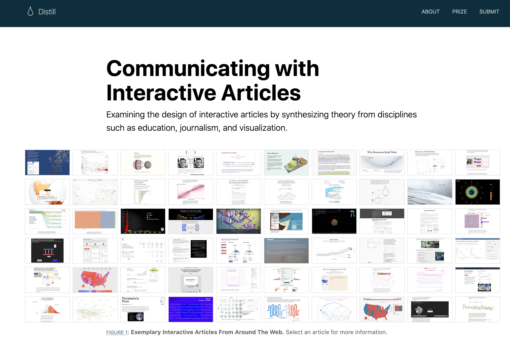

<blockquote>
<p class="body-md-regular body-sm-regular">
Please note that the information presented in this post reflects the package as it stood when initially released, and may now be outdated. For the most up-to-date information, kindly refer to <https://rstudio.github.io/distill/>.
</p>
</blockquote>

We are proud to announce that version 1.0 of the [distill package](https://pkgs.rstudio.com/distill/) is now on [CRAN](https://cran.r-project.org/web/packages/distill/index.html). While Distill has been around for awhile (and you may remember it by its original name, [Radix](https://www.rstudio.com/blog/radix-for-r-markdown/)), this latest version includes so many new features that we wanted to take a moment to re-introduce you to Distill.

If you just want to jump in and get starting using Distill, you can install the latest version from CRAN:

```{r eval=FALSE}
install.packages("distill")
```

The package website (also built with Distill) is the best place to start: <https://rstudio.github.io/distill/>

<br>

```{r echo=FALSE, out.width="50%", fig.align='center', fig.cap= "The Distill website"}
knitr::include_graphics("site.png")
```

<br>

If you are not ready to commit *just* yet, read on to [find out more about Distill](#what-is-distill) and [discover new features](#distill-v1.0) from the latest release.

<br>

## What is Distill? {#what-is-distill}

Distill is a package built for [R Markdown](https://rmarkdown.rstudio.com/), an ecosystem of packages for creating computational documents in R. The goal of the Distill package is to provide an output format optimized for online scientific and technical communication. The Distill R package provides two HTML [output formats](https://pkgs.rstudio.com/distill/reference/index.html#section-output-formats) for R Markdown documents:

-   Single HTML articles ([`distill_article`](https://pkgs.rstudio.com/distill/reference/distill_article.html)), and

-   Multi-page HTML websites, including blogs ([`distill_website`](https://pkgs.rstudio.com/distill/reference/distill_website.html)).

These formats are based on the Distill web framework used by the Distill Machine Learning Journal [@olah2018the]. The Distill web framework was originally developed to catalyze more engaging and effective scientific, technical communication. The idea was to create a platform to help scientists harness the benefits of modern HTML-based communication, which digital designers and journalists have been using to create interactive and engaging articles that meet readers where they are: online.

<br>

```{r echo=FALSE, out.width='75%', fig.align='center', fig.cap= "A Distill publication"}

```

<br>

If you are keen to learn more about how visual aesthetics and interactivity can improve readers' engagement and learning, we recommend reading @hohman2020communicating.

<br>

### Distill for single HTML articles {#distill-article}

If you have ever knit an R Markdown file to `html_document()`, then you can think of `distill_article()` as its scientific alter-ego.

<br>

```{r echo=FALSE, fig.align='center', fig.cap= "PBS Full-Time Kid Egg in a Bottle Experiment"}
knitr::include_graphics("https://media.giphy.com/media/w73hhH9c8vmbS/giphy.gif")
```

<br>

Distill articles offer users an R Markdown format with built-in bells and whistles that make scientific communication easier, including:

-   Ability to incorporate JavaScript and D3-based [interactive visualizations](https://rstudio.github.io/distill/interactivity.html) made with R.

-   Support for [citations](https://rstudio.github.io/distill/#citations), [appendices](https://rstudio.github.io/distill/#appendices), [hover-able footnotes, and asides.](https://rstudio.github.io/distill/#footnotes-and-asides)

-   Tools for making articles [easily citeable](https://rstudio.github.io/distill/citations.html), as well as for generating [Google Scholar](https://rstudio.github.io/distill/citations.html#google-scholar) compatible citation metadata.

-   Auto-numbering of [figures](https://bookdown.org/yihui/rmarkdown-cookbook/figure-number.html) and [tables](https://bookdown.org/yihui/bookdown/tables.html), and [cross-referencing](https://bookdown.org/yihui/rmarkdown-cookbook/cross-ref.html) of figures and tables.

-   Built-in support for [multiple authors](https://rstudio.github.io/distill/basics.html#creating-an-article) with affiliations and [ORCID iD](https://orcid.org/).

-   Adding [creative commons licensed content](https://rstudio.github.io/distill/metadata.html#creative-commons) with specific reuse instructions.

Each of these features are designed to help scientists use the web and R to communicate about their work more effectively. But you can also use Distill to publish any HTML content, like [instructions for making bagels](https://stats.andrewheiss.com/bread/bagels.html)- Distill works great for that too.[^1]\

[^1]: Thank you, [Andrew Heiss](https://www.andrewheiss.com/)!

<br>

### Distill for websites and blogs {#distill-site}

While a single article may often be all that you need, many data science projects involve a *collection* of multiple R Markdown documents. When you have more than one R Markdown file knitted to HTML in your collection, it's a good time to think about knitting them together into a single, navigable website. It is much easier for folks to engage with your work when you can share a link directly to it that they can see and explore it themselves.

<br>

```{r echo=FALSE, fig.align='center', out.width='50%', fig.cap="PBS Full Time Kid DIY Bird Feeder"}
knitr::include_graphics("https://media.giphy.com/media/3ohze1V5m8q6Fs2d7a/giphy.gif")
```

<br>

Distill can knit together a collection of distill articles into a cohesive and navigable website. Distill sites feature an [upper navigation bar](https://rstudio.github.io/distill/website.html#site-navigation) with links (which may also include dropdown menus). In addition, Distill blogs offer page layout options like [listing pages](https://rstudio.github.io/distill/blog.html#listing-pages) and the ability to [customize them](https://rstudio.github.io/distill/blog.html#custom-listings). A listing page doesn't have to be populated manually; instead, it creates a clickable, sequential list of all your posts (usually with nice thumbnail images and some post metadata like author, date, etc.). Blog posts also get [special treatment](https://rstudio.github.io/distill/blog.html#website-or-blog) by Distill &mdash; they are never automatically re-rendered when your site is re-built.

Here is a Distill blog in action, from the [RStudio AI blog](https://blogs.rstudio.com/ai/):

<br>

```{r echo=FALSE, out.width="75%", fig.align="center", fig.cap= "The RStudio AI blog, built with distill"}
knitr::include_graphics("https://pkgs.rstudio.com/distill/articles/images/rstudio-ai.png")
```

<br>

Distill adds several built-in features to make websites better-suited for scientific communication:

-   [Site-wide search.](https://rstudio.github.io/distill/website.html#site-search)

-   [Per-article sharing preview images](https://rstudio.github.io/distill/metadata.html#preview-images) (for OpenGraph, Twitter, Slack, etc.).

-   [Import posts from other external sources.](https://rstudio.github.io/distill/blog_workflow.html#importing-posts)

-   [Canonical urls](https://rstudio.github.io/distill/blog_workflow.html#canonical-urls) - handy for when your own post is re-published elsewhere.

-   Customizable [RSS feeds](https://rstudio.github.io/distill/blog.html#rss-feed) (either with summaries or full post content).

-   [Site logo](https://rstudio.github.io/distill/website.html#site-navigation) in the upper navbar.

-   Integrated [Google Analytics](https://rstudio.github.io/distill/website.html#google-analytics) support.

-   [Favicon support](https://rstudio.github.io/distill/website.html#site-metadata).

These are all on top of the features we listed for individual [Distill articles](#distill-article). You can also use RStudio's [visual markdown editor](https://www.rstudio.com/blog/rstudio-v1-4-preview-visual-markdown-editing/)[^2] to compose Distill articles, which provides a WYSIWYG (What You See Is What You Get) writing experience as well as the ability to [insert citations](https://www.rstudio.com/blog/rstudio-1-4-preview-citations/) from a document bibliography, reference management software, and even open-source bibliographic databases like [PubMed](https://pubmed.ncbi.nlm.nih.gov/).

[^2]: At the time of publishing, the visual markdown editor is included in the RStudio IDE Preview v1.4. Read the documentation for the most up-to-date status of the editor: <https://rstudio.github.io/visual-markdown-editing/#/>

Importantly, Distill websites are built without any kind of static site generator (like [Jekyll](https://jekyllrb.com/) or [Hugo](https://gohugo.io/)), which means that Distill websites offer users the bliss of building a website without any additional software dependencies (this means, all you need is R and the distill package to make it work).

<br>

## Distill version 1.0 {#distill-v1.0}

So, what is new with Distill? In the rest of this post, we'll share some highlights from the latest release, but you might want to look at the [release notes](https://pkgs.rstudio.com/distill/news/index.html#distill-v10-cran) for the full details.

### Theming

In this latest release, we have introduced the ability to theme your Distill article, website, or blog without needing to write your own [CSS](https://en.wikipedia.org/wiki/CSS) from scratch. Distill output formats have a modern and streamlined theme "out of the box", but we also know that it is important for users to be able to create a non-cookie-cutter site with less friction (i.e., less CSS).

<br>

```{r echo=FALSE, fig.align='center', out.width='30%', fig.cap='A totally relatable CSS editing experience.'}
knitr::include_graphics("https://media.giphy.com/media/13FrpeVH09Zrb2/giphy.gif")
```

<br>

To sidestep CSS wrangling, you can now [create](https://rstudio.github.io/distill/website.html?panelset=themed-site&panelset1=theme.css#create-theme) and [apply](https://rstudio.github.io/distill/website.html?panelset=themed-site&panelset1=theme.css#apply-theme) a Distill theme, which allows you to customize common elements without needing to create a CSS file from scratch. To get started, you can use the new [`create_theme()`](https://distill.netlify.app/reference/create_theme.html) function:

```{r eval=FALSE}
create_theme(name = "bespoke-theme") 

```

<br>

Follow the docs on [theming](https://rstudio.github.io/distill/website.html#theming) to learn more. There, we provide a demo with code for going from the default theme (left) to a bespoke theme (right) by changing only a few fields in `bespoke-theme.css`:

<br>

```{r out.width="49%", echo=FALSE}
knitr::include_graphics(c("theme-before.png", "theme-after.png"))
```

<br>

But themes aren't just for full websites! You can also theme a [single Distill article](https://rstudio.github.io/distill/basics.html#theming), and you can change the theme for an [individual article](https://rstudio.github.io/distill/website.html#apply-theme) within a Distill website. As before, you can always use [custom CSS styles](https://rstudio.github.io/distill/website.html#custom-style) to go fully custom; the theme allows you to bypass the detective work typically involved in discovering which CSS selectors are needed to change the key elements most users wish to control. Finally, we provided some [example Distill themes](https://rstudio.github.io/distill/website.html#example-themes) for inspiration.

<br>

### Other highlights

-   Added built-in search functionality, based on [Fuse.js](https://fusejs.io/). Search will be enabled by default for new distill blogs, and can be [enabled](https://rstudio.github.io/distill/website.html#site-search) on websites as well.

-   Headings provide anchor links upon hover, making it easier to find and share the URL for a specific section of a webpage or article.

-   Improved default syntax highlighting theme, optimized for accessibility based on the [a11y syntax highlighting themes](https://github.com/ericwbailey/a11y-syntax-highlighting) by Eric Bailey. All colors in the theme meet the minimum [WCAG 2.0 guidelines for contrast accessibility](https://www.w3.org/TR/UNDERSTANDING-WCAG20/visual-audio-contrast-contrast.html) of \> 4.5 (AA).

-   Improved handling and display of article categories for blogs, allowing readers to more easily see the categories for each individual post on listing pages.

-   Support for ORCID integration in article metadata:

    ```{r echo=FALSE}
            library(ymlthis)
            yml_empty() %>%
              yml_author("Dianne Cook", 
                         affiliation = "Monash University", 
                         orcid_id = "0000-0002-3813-7155") %>% 
              asis_yaml_output()
    ```

-   [Downlit](https://downlit.r-lib.org/) integration for automatic linking of R code in code chunks to function reference documentation.

    

<br>

## Distill reference site

In addition to the [documentation site](https://rstudio.github.io/distill/), Distill also gained a [reference site](https://pkgs.rstudio.com/distill), built with [pkgdown](https://pkgdown.r-lib.org/). There, you'll find a [reference section](https://pkgs.rstudio.com/distill/reference/index.html), [example gallery](https://pkgs.rstudio.com/distill/articles/examples.html), and the [latest news](https://pkgs.rstudio.com/distill/news/index.html). Our sincere thanks to the members of the \#rstats community who agreed to have their sites featured in the [example gallery](https://pkgs.rstudio.com/distill/articles/examples.html):

```{r echo=FALSE, out.width="75%", fig.align="center", fig.cap="The Distill example gallery"}
knitr::include_graphics("examples.png")

```

<br>

## A hex sticker

Last but definitely not least, distill also gained a hex sticker --- thanks to our artist [Julie Jung](https://www.jungjulie.com/)!

```{r echo=FALSE, fig.align='center', fig.cap="distill hex by Julie Jung", out.width='25%'}
knitr::include_graphics("distill.png")
```

<br>

Phew! If you've made it this far, thanks for reading and we hope you give Distill version 1.0 a whirl!

<br>

```{r echo=FALSE, fig.align='center', fig.cap="PBS Full Time Kid", out.width='50%'}
knitr::include_graphics("https://media.giphy.com/media/ToMjGpns6x9Fv3b5C00/giphy.gif")
```

<br>

## Acknowledgements

A big thanks to the 31 contributors who helped with this release by discussing problems, proposing features, and contributing code:

```{r eval=FALSE, include=FALSE}
usethis::use_tidy_thanks("rstudio/distill", from = "2020-06-04")
```

[\@ADernild](https://github.com/ADernild), [\@clauswilke](https://github.com/clauswilke), [\@CRLNP](https://github.com/CRLNP), [\@henry090](https://github.com/henry090), [\@jarrodscott](https://github.com/jarrodscott), [\@javierluraschi](https://github.com/javierluraschi), [\@jenrichmond](https://github.com/jenrichmond), [\@jmbuhr](https://github.com/jmbuhr), [\@jthomasmock](https://github.com/jthomasmock), [\@kevinushey](https://github.com/kevinushey), [\@m-clark](https://github.com/m-clark), [\@maelle](https://github.com/maelle), [\@mfdf](https://github.com/mfdf), [\@michiexile](https://github.com/michiexile), [\@mihagazvoda](https://github.com/mihagazvoda), [\@MilesMcBain](https://github.com/MilesMcBain), [\@mondpanther](https://github.com/mondpanther), [\@mrcaseb](https://github.com/mrcaseb), [\@mrworthington](https://github.com/mrworthington), [\@mvuorre](https://github.com/mvuorre), [\@nunompmoniz](https://github.com/nunompmoniz), [\@pneuvial](https://github.com/pneuvial), [\@relund](https://github.com/relund), [\@RodrigoCerqueira](https://github.com/RodrigoCerqueira), [\@RRemelgado](https://github.com/RRemelgado), [\@slopp](https://github.com/slopp), [\@stared](https://github.com/stared), [\@taraskaduk](https://github.com/taraskaduk), [\@tonytrevisan](https://github.com/tonytrevisan), [\@umarcor](https://github.com/umarcor), and [\@wordsmith189](https://github.com/wordsmith189).

## References
