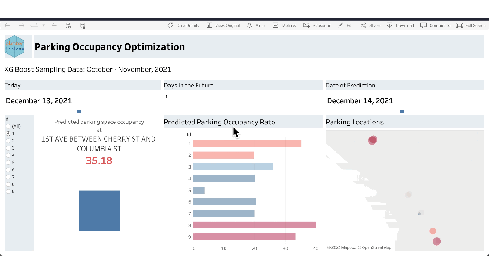

RStudio believes that you can attain greater business intelligence with interoperable tools that <a href="https://www.rstudio.com/solutions/interoperability/" target = "_blank">take the full advantage of open-source data science</a>. Your organization may rely on Tableau for reporting purposes, but how can you ensure that you're using the full power of your data science team's R and Python models in your dashboards?

With the <a href="https://rstudio.github.io/plumbertableau/index.html" target = "_blank">plumbertableau</a> package (and its corresponding Python package, <a href="https://rstudio.github.io/fastapitableau/" target = "_blank">fastapitableau</a>), you can use functions or models created in R or Python from Tableau through an API. These packages allow you to showcase cutting-edge data science results in your organization’s preferred dashboard tool.

While this post mentions R, anything possible with R and plumbertableau is also doable with Python and fastapitableau.

## Foster Data Analytics Capabilities With plumbertableau

With plumbertableau, you can fully develop your model with code-first data science. The package uses <a href="https://www.rplumber.io/" target = "_blank">plumber</a> to create an API directly from your code. Since your model is fully developed in your data science editor, it can use all the packages and complex calculations it needs.

You can extract the best data science results using R's capabilities as your model will not be constrained by Tableau's environment.

## Improve Data Quality With APIs for Continuous Use

Seamless integration between analytic platforms prevents issues like using outdated, inaccurate, or incomplete data. Rather than depending on a manual process, data scientists can depend on their data pipelines to ensure data integrity.

With plumbertableau, your tools are integrated through an API. The Tableau dashboard displays results without any intermediate manipulation like copy-and-pasting code or uploading datasets. You can work in confidence knowing your results are synchronized, accurate, and reproducible.

## Increase Deliverability by Streamlining Data Pipelines
 
If your model has many dependencies or versioning requirements, it can be difficult to handle them outside of the development environment. Debugging is even more time-consuming when you need to work in separate environments to figure out what went wrong.

With <a href="https://connect.rstudioservices.com/connect/" target = "_blank">RStudio Connect</a>, you can publish directly plumbertableau extensions directly from the RStudio IDE. RStudio Connect automatically manages your API's dependent packages and files to recreate an environment closely mimicking your local development environment. And since all your R code remains in R, you can use your usual data science techniques to efficiently resolve issues.

Read more on the <a href="https://www.rplumber.io/articles/hosting.html/" target = "_blank">Hosting</a> page of the plumber package.

## How to Use plumbertableau: XGBoost with Dynamic Model Output Example



In this walkthrough, we will be using data from the <a href="https://data.seattle.gov/" target = "_blank">Seattle Open Data Portal</a> to predict the paid parking occupancy percentage in various areas around the city. We will run an XGBoost model in RStudio, create a plumbertableau extension to embed into Tableau, and visualize and interact with the model in a Tableau dashboard. The code is here for reproducibility purposes; however, it will **require** an RStudio Connect account to complete.

The plumbertableau and fastapi packages have wonderful documentation. Be sure to read them for more information on:

* The anatomy of the extensions
* Details on setting up RStudio Connect and Tableau
* Other examples to try out in your Tableau dashboards


### 1. Build the model

First, we need to build a model. This walkthrough won’t be covering how to create, tune, or validate a model. If you'd like to learn more on models and machine learning, check out the <a href="https://www.tidymodels.org/" target = "_blank">tidymodels</a> website and Julia Silge's fantastic <a href="https://juliasilge.com/category/tidymodels/" target = "_blank">screencasts and tutorials</a>.

**Load Libraries**

```{{r}}
library(tidyverse)
library(RSocrata)
library(lubridate)
library(usemodels)
library(tidymodels)
```

**Download and Clean Data**

The Seattle Open Data Portal uses <a href="https://www.tylertech.com/products/socrata" target = "_blank">Socrata</a>, a data management tool, for its APIs. We can use the <a href="https://cran.r-project.org/web/packages/RSocrata/index.html" target = "_blank">RSocrata</a> package to download the data.

```{{r}}
parking_data <-
  RSocrata::read.socrata(
    "https://data.seattle.gov/resource/rke9-rsvs.json?$where=sourceelementkey <= 1020"
  )

parking_id <-
  parking_data %>%
  group_by(blockfacename, location.coordinates) %>%
  mutate(id = cur_group_id()) %>%
  ungroup()

parking_clean <-
  parking_id %>%
  mutate(across(c(parkingspacecount, paidoccupancy), as.numeric),
         occupancy_pct = paidoccupancy / parkingspacecount) %>%
  group_by(
    id = id,
    hour = as.numeric(hour(occupancydatetime)),
    month = as.numeric(month(occupancydatetime)),
    dow = as.numeric(wday(occupancydatetime)),
    date = date(occupancydatetime)
  ) %>%
  summarize(occupancy_pct = mean(occupancy_pct, na.rm = TRUE)) %>%
  drop_na() %>%
  ungroup()
```

We will also need information on the city blocks, so let's create that dataset.

```{{r}}
parking_information <-
  parking_id %>%
  mutate(loc = location.coordinates) %>%
  select(id, blockfacename, loc) %>%
  distinct(id, blockfacename, loc) %>%
  unnest_wider(loc, c('loc1', 'loc2'))
```

**Create Training Data**

Now, let's create the training set from our original data.

```{{r}}
parking_split <-
  parking_clean %>%
  arrange(date) %>%
  select(-date) %>%
  initial_time_split(prop = 0.75)
```

**Train and Tune the Model**

Here, we train and tune the model. We select the model with the best RSME to use in our dashboard.

```{{r}}
xgboost_recipe <-
  recipe(formula = occupancy_pct ~ ., data = parking_clean) %>%
  step_zv(all_predictors())  %>%
  prep()

xgboost_folds <-
  recipes::bake(xgboost_recipe,
                new_data = training(parking_split)) %>%
  rsample::vfold_cv(v = 5)

xgboost_model <-
  boost_tree(
    mode = "regression",
    trees = 1000,
    min_n = tune(),
    tree_depth = tune(),
    learn_rate = tune(),
    loss_reduction = tune()
  ) %>%
  set_engine("xgboost", objective = "reg:squarederror")

xgboost_params <-
  parameters(min_n(),
             tree_depth(),
             learn_rate(),
             loss_reduction())

xgboost_grid <-
  grid_max_entropy(xgboost_params,
                   size = 5)

xgboost_wf <-
  workflows::workflow() %>%
  add_model(xgboost_model) %>%
  add_formula(occupancy_pct ~ .)

xgboost_tuned <- tune::tune_grid(
  object = xgboost_wf,
  resamples = xgboost_folds,
  grid = xgboost_grid,
  metrics = yardstick::metric_set(rmse, rsq, mae),
  control = tune::control_grid(verbose = TRUE)
)

xgboost_best <-
  xgboost_tuned %>%
  tune::select_best("rmse")

xgboost_final <-
  xgboost_model %>%
  finalize_model(xgboost_best)
```

We bundle the recipe and fitted model in an object so we can use it later.

```{{r}}
train_processed <-
  bake(xgboost_recipe, new_data = training(parking_split))

prediction_fit <-
  xgboost_final %>%
  fit(formula = occupancy_pct ~ .,
      data    = train_processed)

model_details <- list(model = xgboost_final,
                      recipe = xgboost_recipe,
                      prediction_fit = prediction_fit)
```

**Save Objects for the plumbertableau Extension**

We'll want to save our data and our model so that we can use them in the extension. If you have an RStudio Connect account, the <a href="https://pins.rstudio.com/" target = "_blank">pins</a> package is a great choice for saving these objects.

```{{r}}
rsc <-
  pins::board_rsconnect(server = Sys.getenv("CONNECT_SERVER"),
                        key = Sys.getenv("CONNECT_API_KEY"))

pins::pin_write(
  board = rsc,
  x = model_details,
  name = "seattle_parking_model",
  description = "Seattle Occupancy Percentage XGBoost Model",
  type = "rds"
)

pins::pin_write(
  board = rsc,
  x = parking_information,
  name = "seattle_parking_info",
  description = "Seattle Parking Information",
  type = "rds"
)
```

### 2. Create a plumbertableau Extension

Next, we will use our model to create a plumbertableau extension. As noted previously, the plumbertableau extension is a Plumber API with some special annotations.

Create an R script called `plumber.R`. At the top, we list the libraries we'll need.

```{{r}}
library(plumber)
library(pins)
library(tibble)
library(xgboost)
library(lubridate)
library(dplyr)
library(tidyr)
library(tidymodels)
library(plumbertableau)
```

We want to bring in our model details and our data. If you pinned your data, you'll change the name of the pin below.

```{{r}}
rsc <-
  pins::board_rsconnect(
    server = Sys.getenv("CONNECT_SERVER"),
    key = Sys.getenv("CONNECT_API_KEY")
  )

xgboost_model <-
  pins::pin_read("isabella.velasquez/seattle_parking_model", board = rsc)
```

Now, we add our <a href="https://www.rplumber.io/articles/annotations.htm" target = "_blank">annotations</a>. Note that we use plumbertableau annotations, which are slightly different than the ones from plumber.

* We use `tableauArg` rather than `params`.
* We specify what is returned to Tableau with `tableauReturn`.
* We must use `post` for what is being returned.

```{{r}}
#* @apiTitle Seattle Parking Occupancy Percentage Prediction API
#* @apiDescription Return the predicted occupancy percentage at various Seattle locations

#* @tableauArg block_id:integer numeric block ID
#* @tableauArg ndays:integer number of days in the future for the prediction

#* @tableauReturn [numeric] Predicted occupancy rate
#* @post /pred
```

Now, we create our function with the arguments `station_id` and `ndays`. These will have corresponding arguments in Tableau. The function will output our predicted occupancy percentage, which will be what we visualize and interact with in the dashboard.

This function takes the city block and number of days in the future to give us the predicted occupancy percentage at that time.

```{{r}}
function(block_id, ndays) {
  times <- Sys.time() + lubridate::ddays(ndays)
  
  current_time <-
    tibble::tibble(times = times,
                   id = block_id)
  
  current_prediction  <-
    current_time %>%
    transmute(
      id = id,
      hour = hour(times),
      month = month(times),
      dow = wday(times),
      occupancy_pct = NA
    ) %>%
    bake(xgboost_model$recipe, .)
  
  parking_prediction <-
    xgboost_model$prediction_fit %>%
    predict(new_data = current_prediction)
  
  predictions <-
    parking_prediction$.pred
  
  predictions[[1]]
  
}
```

Finally, we finish off our script with the extension footer needed for plumbertableau extensions.

```{{r}}
#* @plumber
tableau_extension
```

Here is the full `plumber.R` script:

```{{r}}
library(plumber)
library(pins)
library(tibble)
library(xgboost)
library(lubridate)
library(dplyr)
library(tidyr)
library(tidymodels)
library(plumbertableau)

rsc <-
  pins::board_rsconnect(server = Sys.getenv("CONNECT_SERVER"),
                        key = Sys.getenv("CONNECT_API_KEY"))

xgboost_model <-
  pins::pin_read("isabella.velasquez/seattle_parking_model", board = rsc)

#* @apiTitle Seattle Parking Occupancy Percentage Prediction API
#* @apiDescription Return the predicted occupancy percentage at various Seattle locations

#* @tableauArg block_id:integer numeric block ID
#* @tableauArg ndays:integer number of days in the future for the prediction

#* @tableauReturn [numeric] Predicted occupancy rate
#* @post /pred

function(block_id, ndays) {
  times <- Sys.time() + lubridate::ddays(ndays)
  
  current_time <-
    tibble::tibble(times = times,
                   id = block_id)
  
  current_prediction  <-
    current_time %>%
    transmute(
      id = id,
      hour = hour(times),
      month = month(times),
      dow = wday(times),
      occupancy_pct = NA
    ) %>%
    bake(xgboost_model$recipe, .)
  
  parking_prediction <-
    xgboost_model$prediction_fit %>%
    predict(new_data = current_prediction)
  
  predictions <-
    parking_prediction$.pred
  
  predictions[[1]]
  
}

#* @plumber
tableau_extension
```

### 3. Host your API

We have to host our API so that it can be accessed in Tableau. In our case, we publish it to RStudio Connect.

Once hosted, plumbertableau automatically generates a documentation page. Notice that the `SCRIPT_*` value is not R code. This is a Tableau command that we will use to connect our extension and Tableau.


<caption><center><i>Automatically generated plumbertableau documentation page</center></i></caption>

### 4. Create a calculated field in Tableau

There are a few steps you need to take so that Tableau can use your plumbertableau extension. If you are using RStudio Connect, read the documentation on how to <a href="https://docs.rstudio.com/rsc/integration/tableau/" target = "_blank">configure RStudio Connect as an analytic extension</a>.

Create a new workbook and upload the `station_information` file. Under Analysis, turn off Aggregate Measures. Drop `Lat` into Rows and `Lon` into Columns, which will create a map. Save the workbook.

Make sure your workbook knows to connect to RStudio Connect by going to Analysis > Manage Analytic Extensions Connection > Choose a Connection. Then, select your Connect account.

Drag `Id` into the "Detail" mark. Create a parameter called "Days in the Future". We're using our model to predict parking occupancy percentage for that date. Show the parameter on the worksheet.


Create a calculated field using the `SCRIPT` from the plumbertableau documentation page:

```
SCRIPT_REAL("/plumbertableau-xgboost-example/pred", block_id, ndays) 
```

For each `tableauArg` we have listed in the extension, we will replace it with its corresponding Tableau value. If you're following along, this means `block_id` will become `ATTR([Id])` and `ndays` will become `ATTR([Days in the Future])`.

```
SCRIPT_REAL("/plumbertableau-xgboost-example/pred", ATTR([Id]), ATTR([Days in the Future]))
```


### 5. Run model and visualize results in Tableau

That's it! Once you embed your extension in Tableau’s calculated fields, you can use your model's results in your Tableau dashboard like any other measure or dimension.


We can change the `ndays` argument to get new predictions from our XGBoost model and display them on our Tableau dashboard.


You can style your Tableau dashboard and then provide your users something that is not only aesthetically pleasing, but is dynamically calculating predictions based on a model you have created in R.

## Conclusion

With plumbertableau, you can showcase sophisticated model results that are easy to integrate, debug, and reproduce. Your work will be at the forefront of data science while being visualized in Tableau's easy, point-and-click interface.

## Learn More

Watch James Blair showcase plumbertableau in Leveraging R & Python in Tableau with RStudio Connect:

<script src="https://fast.wistia.com/embed/medias/hl37qvfnml.jsonp" async></script><script src="https://fast.wistia.com/assets/external/E-v1.js" async></script><div class="wistia_responsive_padding" style="padding:56.25% 0 0 0;position:relative;"><div class="wistia_responsive_wrapper" style="height:100%;left:0;position:absolute;top:0;width:100%;"><div class="wistia_embed wistia_async_hl37qvfnml videoFoam=true" style="height:100%;position:relative;width:100%"><div class="wistia_swatch" style="height:100%;left:0;opacity:0;overflow:hidden;position:absolute;top:0;transition:opacity 200ms;width:100%;"></div></div></div></div>

More on how RStudio supports interoperability across tools can be found on our <a href="https://www.rstudio.com/solutions/bi-and-data-science/" target = "_blank">BI and Data Science Overview Page</a>.
