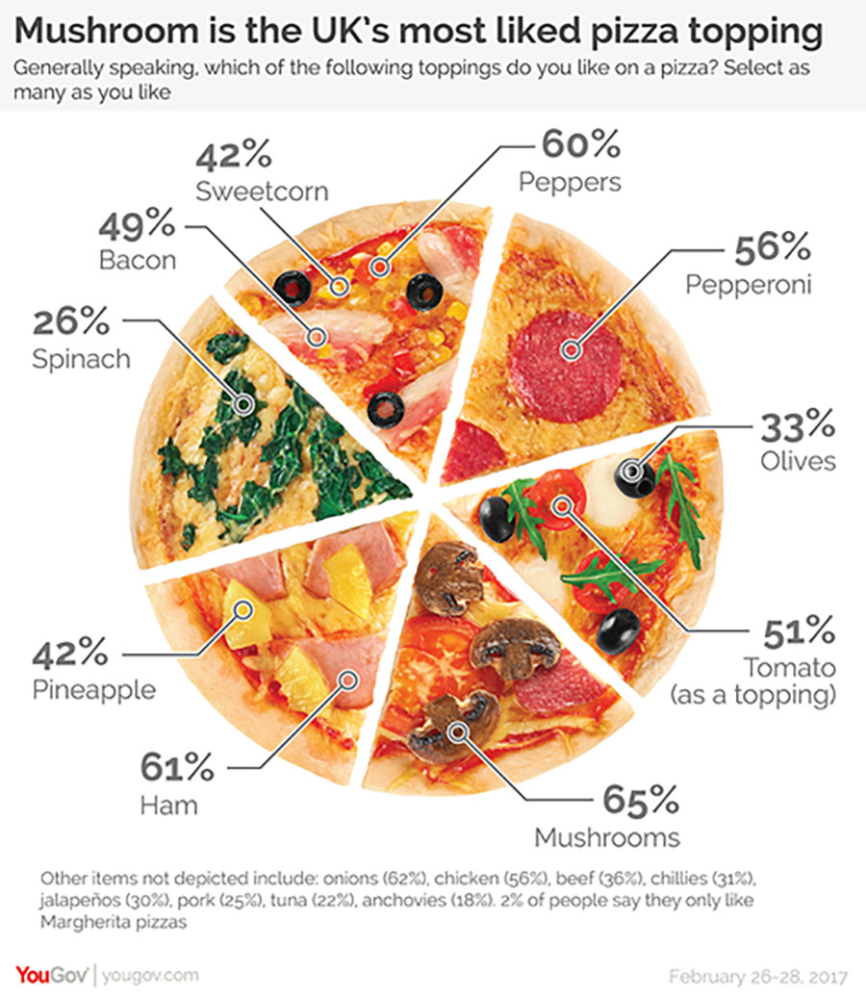

Recently, we were joined by the smart folks at Roche & Novartis to present a webinar on effective data visualization. You can watch the recording of the [full presentation here](https://resources.rstudio.com/webinars/effective-visualizations-for-data-driven-decisions). It was the latest installment in a series of webinars highlighting industry leaders in the Pharmaceutical and Life Science spaces that are doing world-changing data science work.  

They presented many great insights, most of which are relevant to data scientists in every industry, and we wanted to share our learnings.  

**“Graphics and visuals are such an important component of the work that we do as quantitative data scientists.”**  

[Marc Vandemeulebroecke](https://www.linkedin.com/in/marc-vandemeulebroecke-b394046/), biostatistician at Novartis, stated this, then went on to say that effective visualizations help data scientists achieve two important things:  

  1. better insight into data and
  2. the ability to communicate results and conclusions to stakeholders.  

Imagine you have only 3 minutes to present your hard work to stakeholders. You’re probably going to rely on some sort of visualization. The stakeholders are then going to use the conclusions they draw from that presentation to make important decisions, such as what product to invest in or what initiative to approve. The stakes are set. Marc is clearly right: being able to effectively visualize data is an important part of any data scientist’s job.  

So what’s the issue? Why spend an hour presenting on this topic? 

**“Unfortunately we’re not always good at creating effective visualizations.”**  

And the consequences can be brutal. “When we get [data visualization] wrong, it can lead to misinformation, confusion, or harm, especially in clinical and medical research”, [Mark Baillie](https://www.linkedin.com/in/mark-baillie-52486735/), Director of Statistical Methodology at Novartis, continues.  

He says this while displaying a graphic recently published by the New York Times that shows the importance of social distancing during COVID 19. To be clear: this was an example of a good data visualization, one that potentially contributed to lives being saved.  

He transitioned to a lighter example, a bad data visualization: a confusing graphic that attempts to relay the results of a pizza topping survey by YouGov, a government entity in the UK:

Certainly no harm was inflicted by botching a pizza graphic, but the graphic is confusing. The results were posted on [Twitter](https://twitter.com/yougov/status/838720989991223297?lang=en) and the most popular reply questioned how YouGov managed to poll 695% _of the population_. YouGov had to make another post clarifying its analysis.  

So why aren’t we great at data visualizations? Back to Marc’s introduction: The focus in advanced education is primarily on doing the analysis, not communicating and visualizing the results. Rightfully so or not, that in turn means data visualization is a skill frequently learned on the job. 

**“So what do we mean by effective? We don’t necessarily mean beautiful.”**

We also make common missteps when creating data visualizations. These missteps include selecting the wrong graph type, misusing color, and not considering scale. The singular error that most of these missteps roll up into: we’re overly concerned with making visualizations that are beautiful, so much so that we’re willing to sacrifice the visualization’s effectiveness. 

**“Effective visualization = effective communication” and the 3 laws for improving visual communication.**

The teams at Roche & Novartis distill the goal of effective visualization down to effective communication. The purpose of any data visualization is to communicate with stakeholders in a way that results in true understanding and better decision making.  

So, how do we achieve that? This has been such a focus at Novartis that they actually penned the Three Laws for Improving Visual Communication org-wide:

## Law 1: Have a Clear Purpose  

Mark introduces this law by calling it “just advanced common sense”. Before jumping into your visualization, you should work through a why, what, who, and where mental framework:  

**Why** do you need a graph? You should be able to identify a specific purpose for the graph, such as delivering a message or exploration.  

**What** quantitative evidence do you have to support the purpose?

**Who** is the intended audience? Once you figure that out, you can adjust the design to support their needs.  

**Where** is your visualization going to live? Once you know that, you should make design choices that fit formatting constraints.  

Your decisions when creating a visualization should work in harmony to achieve its purpose. You may opt for a tool like RMarkdown when distributing a visualization to senior stakeholders internally, with the purpose of quickly showing clinical trial results without the need for deep exploration. The choices you make for this data visualization are likely different than the choices you’d make for a visualization that you were to submit to the FDA or teammates that you work with.  

Mark expands on this law with a slide dedicated to a quote by John Tukey, who argues that the quality of an analysis is related to the quality of the question being asked.

_“An approximate answer to the right question is worth a great deal more than a precise answer to the wrong question.”_ 

The message here is to spend more time thinking about the questions that set your analysis and visualization building process in motion. 

## Law 2: Show the Data Clearly  

Mark’s recommendation for this rule: do not lie or misrepresent with data. Your reporting should be open and transparent. When you’re clear, open, and transparent, you build trust with your audience, a necessary ingredient that enables your analysis to drive decision-making.  

Once you make the decision to be open and transparent, you can start thinking about the design and the graph type of your visualizations. Choosing the correct graph type aids in interpretation. “Often, we don’t need to reinvent the wheel here”, Mark adds. If you want to show a deviation, correlation, or ranking, there are common graph types you can usually select from to achieve your visualization’s purpose in a clear way.  

Additionally, you don’t want to make your audience members have to work when looking at a particular graph type. Unnecessary components in data visualizations, or overly stylistic choices, may do more harm than good.  

More specifically, you should carefully consider the scaling and spacing of your data visualizations. “Avoid plotting log-normally distributed variables on a linear scale”, Mark presents, then goes on to add, “measurements displayed close together are perceived to be closer in time.”

## Law 3: Make the Message Obvious  

The key to this law is: do not assume your reader understands what message your data visualization is trying to portray. Instead, really work at your visualization to make the takeaway obvious.  

What are some best-practices you can follow to achieve this? Mark highlights several: 

  * **Try not to set text at angle.** Instead, think of alternatives such as transposing the graph.  

  * **Avoid unnecessary color.** Don’t use color to differentiate between categories of the same variable. Doing so can contribute to confusion.  

  * **Only use color when it adds value.**  Use bold, saturated, or contrasting color to emphasize important details.  

  * **Use informative labels and annotations to support the message.** Emphasize the components of your data visualization that will make your message most obvious.  

All of your design choices should be made with the purpose of making your message more obvious to the audience. There are lots of bells and whistles you can add to your data visualizations. What you don’t want to do is add unnecessary or confusing distractions to your visualization. 

## Closing Thoughts  

We’re grateful for the teams at Roche & Novartis for giving a fantastic presentation and the 1,400 live attendees that chose to spend an hour with us during truly strange times. If you were one of those live attendees, thank you. If you are interested in watching the full recording of the presentation, [you can find it here](https://resources.rstudio.com/webinars/effective-visualizations-for-data-driven-decisions).  

Many of the lessons from this webinar are core to RStudio’s mission: we love helping data scientists maximize the impact of their work. We also believe that it shouldn’t be difficult for data scientists to reproduce that impact time and time again as projects change.  

If you’re hungry for more resources that may enhance your data visualization skills and ability to drive value at your organization, you should consider the following resources:  

  * [Reproducibility in Production](https://resources.rstudio.com/webinars/reproducibility-in-production) - a webinar presentation by Garrett Grolemund
  * [The Tidyverse and RStudio Connect](https://resources.rstudio.com/webinars/the-tidyverse-and-rstudio-connect) -  a webinar presentation by Nathan Stephens
  * [Introducing Flexdashboards](https://rstudio.com/resources/webinars/introducing-flexdashboards/) - a webinar presentation by Garrett Grolemund
  * [Our Data Visualization cheat sheets](https://rstudio.com/resources/cheatsheets/) - located on our cheat sheet page under the resource tab in the navigation bar  

Finally, if you want to watch the other episodes in this webinar series, you can find them here:  

  * [Scaling Data Science with R at Janssen Pharmaceuticals](https://resources.rstudio.com/webinars/scaling-data-science-with-r-at-janssen-pharmaceuticals)  
  * [Scaling Data Science at the EPA](https://resources.rstudio.com/webinars/scaling-data-science-at-the-epa)  
  * [The Role of R in Drug Discovery, Research, and Development](https://resources.rstudio.com/webinars/the-role-of-r-in-drug-discovery-research-and-development)

