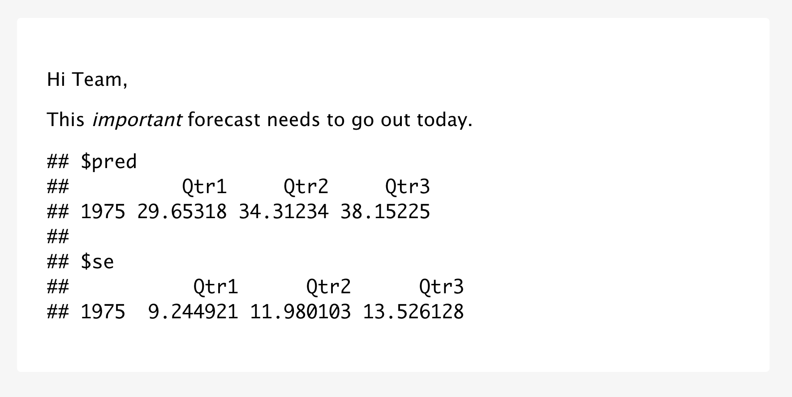
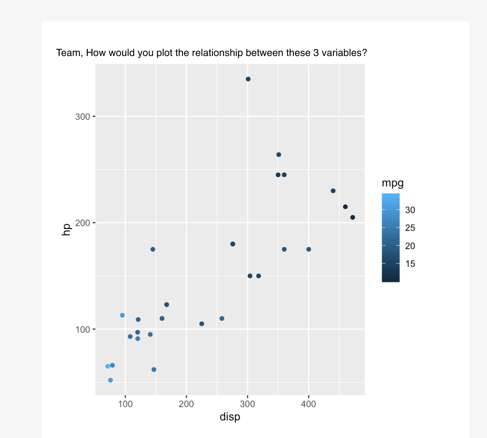
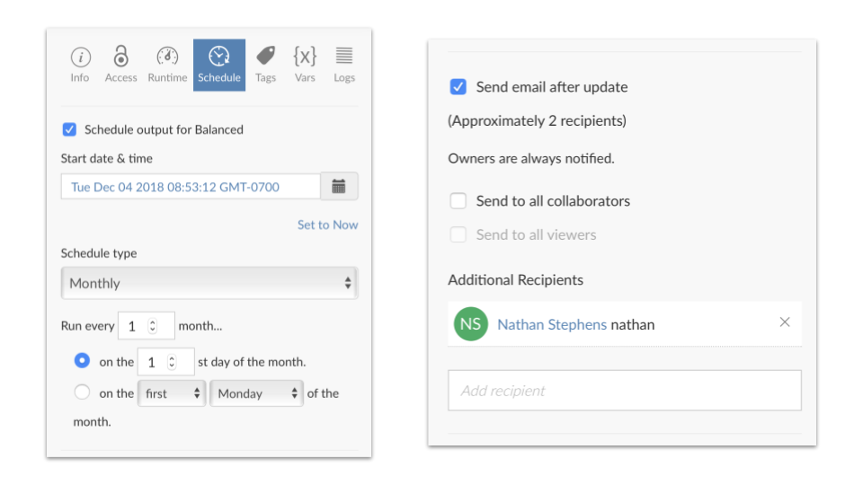

<blockquote>
<p class="body-md-regular body-sm-regular">
Please note that the information presented in this post reflects the package as it stood when initially released, and may now be outdated. For the most up-to-date information, kindly refer to <https://pkgs.rstudio.com/blastula/>.
</p>
</blockquote> 

We're pleased to announce blastula, a package for creating beautiful custom
emails in R. At RStudio, we love interactive dashboards, but some situations
call for a different communication mechanism. Use blastula to:  

- **Compose** custom email bodies based on code, code output, and markdown  
- **Send** emails using SMTP servers - even GMail - or integrate with production services like RStudio Connect  

Blastula makes it easy to send notifications for everything from anomaly detection to fantasy basketball results, all without leaving R.

To get started, install blastula from CRAN:

```r
install.packages('blastula')
```

# Creating Email 

Blastula's unique strength is creating custom HTML email bodies that render in a
variety of email clients, including mobile. The recommended way to create email
is using blastula's R Markdown output format. `blastula::blastula_email`. The
body of the email will respect the R Markdown output, including markdown syntax
and code chunk outputs.

````markdown
---
output: blastula::blastula_email 
--- 

Hi Team,

This *important* forecast needs to go out today.

`r ''````{r echo=FALSE}
model <- arima(presidents, c(1, 0, 0))
predict(model, 3)
```
````

To create the email from the R Markdown document, use `render_email`:

```r
email <- render_email('email.Rmd')
```

The resulting email object can be previewed in RStudio.



Alternatively, it is possible to create an email without R Markdown, by using
the `compose_email` function to combine text, images, and even plots:

```r
library(blastula)
library(ggplot2)
library(glue)
plot <- qplot(disp, hp, data = mtcars, colour = mpg)
plot_email <- add_ggplot(plot)

email <- compose_email(
  body = md(c(
     "Team, How would you plot the relationship between these 3 variables?",
      plot_email
  ))
)
```



Visit the [documentation](https://rich-iannone.github.io/blastula/) to learn how to embed
images, set email headers and footers, and even add call-to-action buttons.

# Sending Custom Emails with SMTP

To send email, blastula includes functions to access SMTP servers such as GMail, Outlook, and Office365.

First, securely tell blastula about your SMTP server:

```r
create_smtp_creds_key(
  id = "gmail",
  user = "user_name@gmail.com",
  provider = "gmail"
)
```

Next, use the SMTP service to send your custom email:

```r
email %>%
  smtp_send(
    from = "personal@email.net",
    to = "personal@email.net",
    subject = "Testing the `smtp_send()` function",
    credentials = creds_key(id = "gmail")
  )
```

# Sending Custom Emails with RStudio Connect

Organizations can use blastula in production on RStudio Connect. For instance, we
use blastula to track critical services like our support ticket
volume and our staff training schedules.

An easy way to get started is to access the RStudio Connect examples:

```r
blastula::prepare_rsc_example_files()
```

Publish the resulting R Markdown document to RStudio Connect, where it can be
[scheduled for regular
execution](https://docs.rstudio.com/connect/1.7.8/user/r-markdown-schedule.html)
and distributed to stakeholders.



Blastula offers three additional functions to make it easier to create emails
for RStudio Connect.

- `render_connect_email` automatically adds a footer to the email with useful links back to the content on RStudio Connect.  
- `attach_connect_email` ensures RStudio Connect sends the custom email, and also makes it easy to customize the subject line, include additional email attachments, and optionally attach the report output.  
- `suppress_scheduled_email()` allows you to skip sending the email. This pattern is very powerful. For example, reports can be run once a day, but only distributed if certain conditions are met.

Together, these three functions can be used to send proactive notifcations:

```r
if (demand_forecast > 1000) {
  render_connect_email(input = "alert-supply-team-email.Rmd") %>%
  attach_connect_email(
    subject = sprintf("We need to prepare %d units!", demand_forecast),
    attach_output = TRUE,
    attachments = c("demand_forecast_data.csv")
  )
} else {
  suppress_scheduled_email() 
}
```

Please be sure to visit the [blastula
website](https://rich-iannone.github.io/blastula/index.html) to find additional
resources. Afterall, who doesn't want a ggplot in their inbox?

