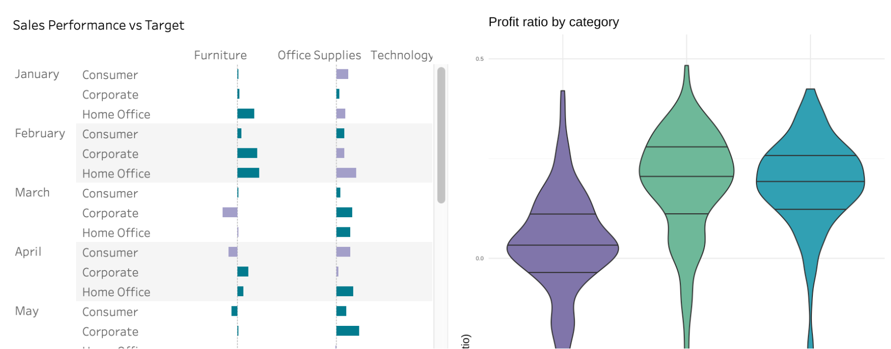
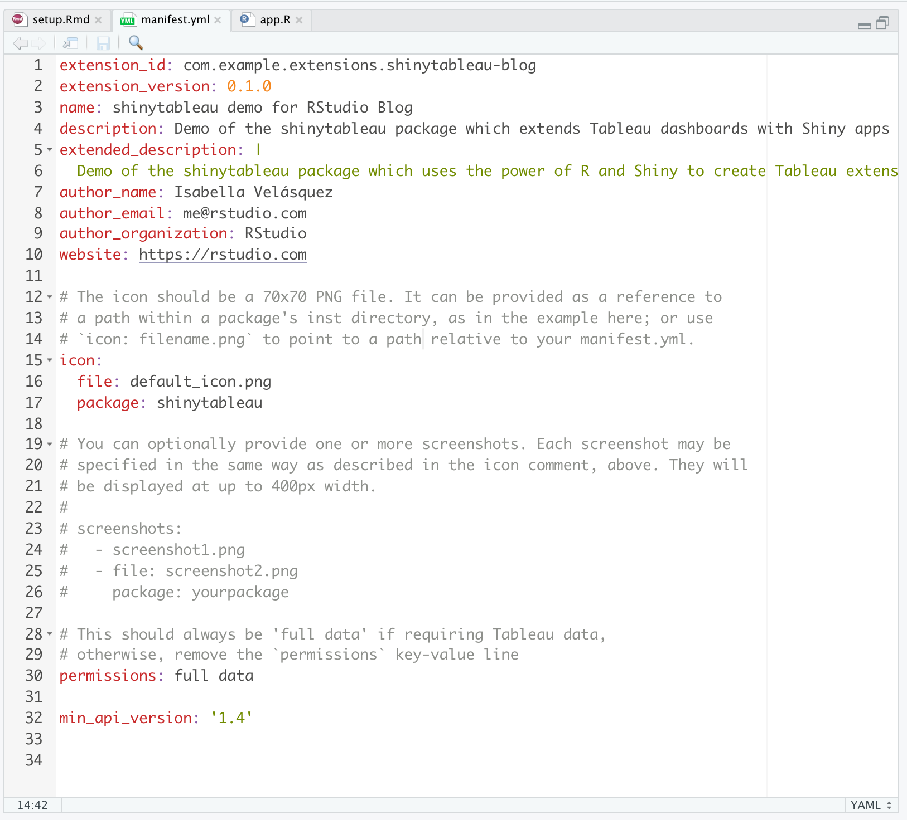
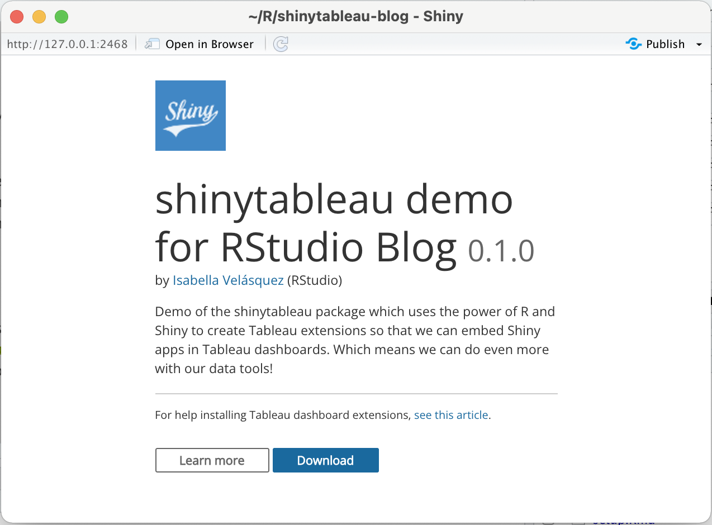
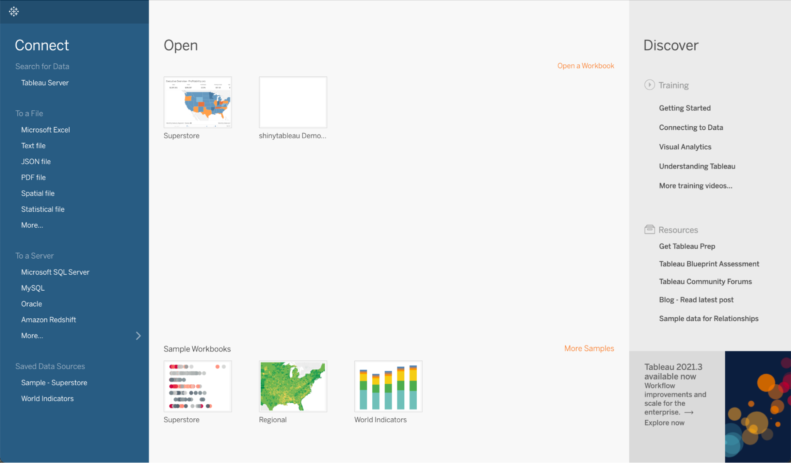
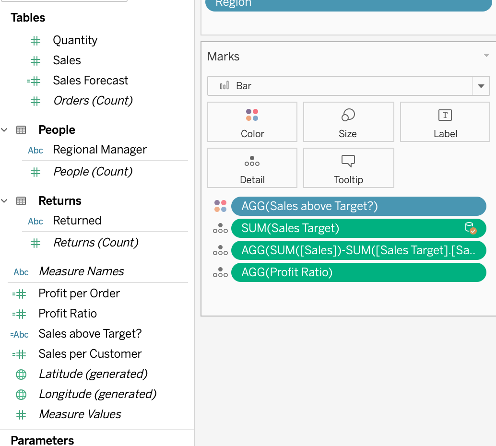

<sup>
Screenshot of a Tableau dashboard with a shinytableau extension
</sup>
  
At RStudio, we strive to help you <a href="https://blog.rstudio.com/2021/03/18/bi-and-data-science-the-tradeoffs/" target = "_blank" rel = "noopener noreferrer">combine the power of code-first data science with the other tools in your toolkit</a>. Many organizations rely on <a href="https://www.tableau.com/" target = "_blank" rel = "noopener noreferrer">Tableau</a> for creating data dashboards, but there may be moments where you wish you could take advantage of R’s powerful reporting and visualization capabilities as well.

With the experimental <a href="https://rstudio.github.io/shinytableau/index.html" target = "_blank" rel = "noopener noreferrer">shinytableau</a> package, you can use the power of R and Shiny to customize objects that you embed in your Tableau dashboards. This package opens up the possibility to include interactive features beyond Tableau’s native capabilities, allowing you to be more flexible in meeting your organization’s data needs.

## Embed Custom R Objects in a Tableau Dashboard



Is that a ggplot2 visualization in Tableau? With shinytableau, you can sit Tableau’s visualizations side-by-side with anything you can create in a Shiny application, including custom charts created with ggplot2. Since the Shiny app is embedded in Tableau, users of the dashboard won’t need to learn R or even realize they’re using a different tool.

## Configure Shiny Apps to “Talk” to Tableau

Say you want to interactively use your extension with Tableau, such as pulling data from a worksheet to populate your chart. You can use Shiny to create a friendly user interface for specifying settings for your extension. With the right configuration, your Shiny app and Tableau can interact so that you can tell a cohesive story in your Tableau dashboard.

<script src="https://fast.wistia.com/embed/medias/9zhoe1gnar.jsonp" async></script><script src="https://fast.wistia.com/assets/external/E-v1.js" async></script><div class="wistia_responsive_padding" style="padding:53.96% 0 0 0;position:relative;"><div class="wistia_responsive_wrapper" style="height:100%;left:0;position:absolute;top:0;width:100%;"><div class="wistia_embed wistia_async_9zhoe1gnar videoFoam=true" style="height:100%;position:relative;width:100%"><div class="wistia_swatch" style="height:100%;left:0;opacity:0;overflow:hidden;position:absolute;top:0;transition:opacity 200ms;width:100%;"></div></div></div></div>

## Deploy and Host Shiny Apps for Production

You can deploy shinytableau extensions like any other Shiny app, which allows you to use them in production. RStudio offers RStudio Connect and shinyapps.io as options to publish and host your Shiny apps. Read more on the <a href="https://rstudio.github.io/shinytableau/articles/deployment.html" target = "_blank" rel = "noopener noreferrer">Deployment and Hosting</a> page of the shinytableau documents.

## How to Use shinytableau

The authors of the shinytableau package, Joe Cheng, Richard Iannone, and Javier Luraschi, wrote a <a href="https://rstudio.github.io/shinytableau/articles/shinytableau.html" target = "_blank" rel = "noopener noreferrer">great tutorial on getting started with shinytableau</a>. We highly recommend going through the tutorial to get a full understanding of the components of shinytableau, how they work together, and why each step is needed.

Here, we’ll break down the main steps of creating the authors’ `ggviolin` extension and how to embed it in Tableau’s <a href="https://www.tableau.com/solutions/gallery/superstore" target = "_blank" rel = "noopener noreferrer">Superstore sample workbook</a>. Note that the violin plot in the videos has an applied palette and theme while the violin plot in the tutorial does not. Like any ggplot2 visualization, you can customize the plot to look how you would like!

Let's begin in your RStudio console.

**1\. Start a <a href="https://support.rstudio.com/hc/en-us/articles/200526207-Using-Projects" target = "_blank" rel = "noopener noreferrer">new RStudio project</a>**

**2\. Install packages**

Install your required packages. In addition to the packages you need for your Shiny app, you will also need remotes and shinytableau.

 ```{{r}}
install.packages("remotes")
remotes::install_github("rstudio/shinytableau")
```

**3\. Edit the `manifest.yml` file**

Once shinytableau is installed, run the code below to open the `manifest.yml` file. Edit the metadata to fit your extension. See an example in the <a href="https://github.com/rstudio/shinytableau/blob/7790a566dcef9092863ad231fd58ba14596a6300/inst/examples/ggviolin/manifest.yml" target = "_blank" rel = "noopener noreferrer">shinytableau Github repository</a>.

```{{r, eval = FALSE}}
shinytableau::yaml_skeleton()
```



**4\. Create the shinytableau extension Shiny app**

The next step is to create the extension. In addition to creating a Shiny app, you also need to configure the app so that it can interact with Tableau. This is the most technical part of the whole workflow and the tutorial details how to do this thoughtfully and in detail.

You can use the `ggviolin` app code in the <a href="https://github.com/rstudio/shinytableau/blob/7790a566dcef9092863ad231fd58ba14596a6300/inst/examples/ggviolin/app.R" target = "_blank" rel = "noopener noreferrer">shinytableau Github repository</a> as an example. Save this file as `app.R` in your project.

**5\. Run the app and download the `.trex` file**

Run the `app.R` file and a dialogue box will appear. Click “Download” to download a `.trex` file, which is what Tableau will use to create the extension.



Now, let’s move to Tableau. Be sure to leave your Shiny app running in RStudio! Otherwise, the connection will be lost and Tableau will not be able to open the extension.

**6\. Open the Superstore sample workbook in Tableau**

The Superstore workbook should be available under Sample Workbooks:



If you want to create the same violin plots as you see in the images in this post, go to the “Performance" workbook. Under "Measure Names", you can find "Profit Ratio". Drag “Profit Ratio” under “Marks”.



**7\. Create the dashboard and load .trex file**

Go to “Dashboard” then “New Dashboard”. In the new dashboard, drag the “Performance” workbook to where it says “Drop Sheets Here”, and then drag the “Extension” object to the dashboard. The "Add an Extension" box will automatically open.

Click “Access Local Extensions”, which will open a window. Navigate to and open your .trex file. Tableau will ask if you agree to open the extension. Click "OK" and your extension will appear in the dashboard.

<script src="https://fast.wistia.com/embed/medias/glqjbeolmq.jsonp" async></script><script src="https://fast.wistia.com/assets/external/E-v1.js" async></script><div class="wistia_responsive_padding" style="padding:60.42% 0 0 0;position:relative;"><div class="wistia_responsive_wrapper" style="height:100%;left:0;position:absolute;top:0;width:100%;"><div class="wistia_embed wistia_async_glqjbeolmq videoFoam=true" style="height:100%;position:relative;width:100%"><div class="wistia_swatch" style="height:100%;left:0;opacity:0;overflow:hidden;position:absolute;top:0;transition:opacity 200ms;width:100%;"></div></div></div></div>

**8\. Configure the extension**

The Shiny app is in Tableau, but it doesn't know what data to use. The next step is configuring the extension so that it uses the "Performance" worksheet data to render the violin plot.

Click the triangle button of the extension object, then go to “Configure”. This will open a dialogue box created in the Shiny app.

Fill out the form. Give it a title, choose the “Performance” worksheet, and select “Category” as the dimension and “AGG(Profit Ratio)” as the measure.

<script src="https://fast.wistia.com/embed/medias/gwzb58ff56.jsonp" async></script><script src="https://fast.wistia.com/assets/external/E-v1.js" async></script><div class="wistia_responsive_padding" style="padding:55.83% 0 0 0;position:relative;"><div class="wistia_responsive_wrapper" style="height:100%;left:0;position:absolute;top:0;width:100%;"><div class="wistia_embed wistia_async_gwzb58ff56 videoFoam=true" style="height:100%;position:relative;width:100%"><div class="wistia_swatch" style="height:100%;left:0;opacity:0;overflow:hidden;position:absolute;top:0;transition:opacity 200ms;width:100%;"></div></div></div></div>

When you click “OK”, you will see the violin plot populate in the extension object. Congratulations! With the shinytableau package, you created a Tableau dashboard extension using R and Shiny.

### Conclusion

Using the power of R and Shiny, you can combine your available tools to create insightful dashboards. The shinytableau package is still experimental and <a href="https://community.rstudio.com/?_ga=2.14181236.216058284.1634563605-1803916348.1631026563" target = "_blank" rel = "noopener noreferrer">we would love your feedback</a> on what you hope to see from the package.

### Learn More

We recommend reviewing the <a href="https://rstudio.github.io/shinytableau/articles/shinytableau.html?_ga=2.118303690.216058284.1634563605-1803916348.1631026563" target = "_blank" rel = "noopener noreferrer">tutorial</a> for shinytableau to learn more about how to customize it to your needs.

Looking for other ways of leveraging the power of R and Python with Tableau? Last week, we announced <a href="https://blog.rstudio.com/2021/10/12/rstudio-connect-2021-09-0-tableau-analytics-extensions/" target = "_blank" rel = "noopener noreferrer">support for Tableau Analytics Extensions on RStudio Connect</a>, which allows you to create calculated fields in workbooks that can execute R and Python scripts outside of the Tableau environment.

<strong>Learn more about leveraging business intelligence tools like Tableau alongside open source data science at our RStudio Community Enterprise Meetup on <a href="https://www.meetup.com/RStudio-Enterprise-Community-Meetup/events/281209187/" target = "_blank" rel = "noopener noreferrer">Leveraging R & Python in Tableau with RStudio Connect</a> on Friday, October 29, 2021.</strong>
