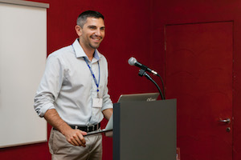

We are looking for our next [Enterprise Advocate](https://hire.withgoogle.com/public/jobs/rstudiocom/view/P_AAAAAACAAADFZoly7Lojez?trackingTag=rStudioBlog) to join the RStudio team. See what [Pete Knast](https://www.linkedin.com/in/peter-knast-808828b/), Global Director of New Business, has to say about working at RStudio and the Enterprise Advocate role. 

_When did you join RStudio and what made you interested in working here?_

I joined in early 2014. I was excited by RStudio since I love helping people and being an open source company RStudio seemed like a great way to reach a lot of people and get to assist with numerous interesting use cases. 

_What types of projects do you work on?_

I get to work on the front lines corresponding directly with our customers. Since my focus is new business this means I am helping open source users take the next step in their use of R. Sometimes this means helping IT organizations understand how RStudio can integrate with corporate security/authentication protocols and sometimes it involves showing off various Shiny applications. The types of projects always vary which keeps me on my toes.  

_What do you enjoy about working at RStudio?_

One would be that my colleagues are not only extremely smart but very genuine so there are always fun conversations in and outside of work.  Another big reason would be the various use cases I get to play a part in. Since each customer has a different application area or industry I never get bored when I learn about how RStudio offerings are being applied.

_What types of qualities do you look for when hiring an Enterprise Advocate?_

Two words that come to mind are humble and smart.  Also since RStudio is so popular but our company is small we have a high volume of customers to connect with so high energy is also a must. If you enjoy solving problems not only will you find the role a good fit but you will have the chance to help bring solutions to large corporations and assist in resolving issues that can even cure diseases.

_What are the goals for someone new to this role?_

To establish themselves in the r and data science community as a trusted consultant.  When you wake up from a dream that involves R you have made it. :) 

If you think you or someone you know might be a good fit for this role and want to know more, check it out [here](https://hire.withgoogle.com/public/jobs/rstudiocom/view/P_AAAAAACAAADFZoly7Lojez?trackingTag=rStudioBlog).

