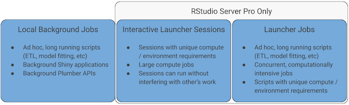
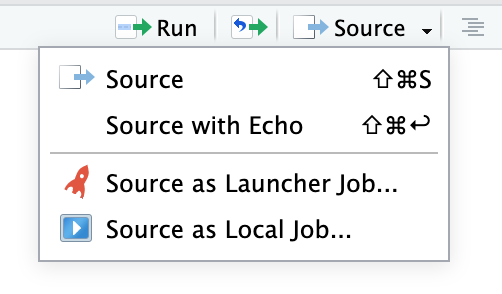

<i>Photo by <a style="color: #000000;" href="https://unsplash.com/@uncle_rickie">Richard Gatley</a> on <a style="color: #000000;" href="https://unsplash.com/photos/La5V_Qr6h3A">Unsplash</a></i>

Data science leaders have embraced the work-from-home era created by COVID-19. Most data science teams have continued their work either using their company laptops or server-based IDEs such as RStudio Server. However, these home workers often run into the limitations of their laptops when they:

-   **Run long-lived programs:** Machine learning models and simulations frequently run for hours or days on laptops.
-   **Demand lots of memory:** Training models, parameter tuning, or working with complex datasets (such as genomic data) often require more RAM than even the most tricked-out laptop has.
-   **Need specialized architectures:** Some machine learning libraries perform best on GPUs or with optimized system architectures that are not available on most laptops.

## Embrace Server-Based Data Science Development

The key to freeing data scientists from laptop limitations is to embrace server-based development, as we noted in a prior post, <a href="https://blog.rstudio.com/2020/05/12/equipping-wfh-data-science-teams/" target="_blank" rel="noopener noreferrer">Equipping Work From Home Data Science Teams</a>. Providing data scientists with access to a server-based IDE like RStudio Server can give them more processors, cores, memory, and architecture options than would be available on their laptops. Additionally, with <a href="https://rstudio.com/products/rstudio-server-pro/" target="_blank" rel="noopener noreferrer">RStudio Server Pro</a>, data scientists can go even further by launching interactive or batch sessions on SLURM and Kubernetes clusters.

As shown in Figure 1, RStudio offers three ways for data scientists to take advantage of centralized resources and escape the limitations of their laptops:

-   **Local background jobs:** In any version of RStudio, data scientists can run an R script in the background. This is especially helpful in RStudio Server, where the task has access to more resources, and you don't have to worry about shutting off the laptop or a Windows update interrupting the process.

-   **Interactive Launcher sessions on RStudio Server Pro:** RStudio Server Pro adds the ability for a data scientist to start an interactive session on a Kubernetes or SLURM cluster, giving them the full power of RStudio, but with code executing in these unique and powerful environments. These interactive sessions are useful for exploratory data analysis and debugging.
-   **RStudio Server Pro Launcher jobs:** Finally, data scientists can execute ad-hoc, long-running scripts and programs on clusters using Launcher and let them run without any further console interaction. This approach can be particularly useful for model training, ETL jobs, and other workloads that may run for hours or days. Running these workloads in a batch-oriented mode allows the data scientist to work on other projects without being blocked waiting for results to arrive.

<table>
<tr>
<th scope="col"></th>
<th scope="col">RStudio Server</th>
<th scope="col">Interactive Launcher Sessions on RStudio Server Pro</th>
<th scope="col">Launcher Jobs on RStudio Server Pro</th>
</tr>
<tr>
<th scope="row">Typical RAM</th>
<td>Tens to hundreds of gigabytes</td>
<td>Multiple terabytes</td>
<td>Multiple terabytes</td>
</tr>
<th scope="row">Typical Processor Cores</th>
<td>Tens</td>
<td>Hundreds to Thousands</td>
<td>Hundreds to Thousands</td>
</tr>
<th scope="row">Typical Jobs</th>
<td>Routine analyses</td>
<td>Interactive tasks requiring large compute, GPUs, or RAM such as exploratory data analysis</td>
<td>Batch tasks like parameter tuning, ETL, or model training and scoring</td>
</tr>
<tr>
<th scope="row">Setup required</th>
<td>RStudio Server install</td>
<td>RStudio Server Pro + Cluster add-in</td>
<td>RStudio Server Pro + Cluster add-in</td>
</tr>
<tr>
<th scope="row">Limitations</th>
<td>Server Resources</td>
<td>Best for interactive work, not parallel tasks</td>
<td>Jobs kicked off manually, limited job feedback</td>
</tr>
</table>

Figure 3: Three Ways to Expand Data Science Computational Resources Using RStudio Pro and Launcher.

## Central Servers Improve Data Scientist Productivity

Data scientists benefit from using RStudio Server and RStudio Server Pro for their analysis because:

-   **Unblock the data scientist from waiting for long-lived jobs:** Instead of going out for a cup of coffee while waiting to fit their model to a large training set, data scientists can run the model fitting in the background and work on other code while waiting for it to complete.
-   **Free the data scientist from having to shoehorn their analysis onto a small platform:** Laptop memory and processor limitations often force data scientists to sample their data or recode their models to run in a smaller footprint. By providing access to servers that have many times the resources of their laptops, data scientists can use their full data sets to fit complete models.
-   **Allow data scientists more flexibility and make IT happy:** Data scientists are able to use more flexible resources and server architectures such as access to GPUs. Server-based development is also a great benefit for IT professionals who are able to see expanded use of the platforms they've built and reduced costs through elastic compute.

## For More Information About Background and Cluster Jobs

To learn more about the new Launcher capabilities built into RStudio:

- <a href="https://rstudio.com/resources/rstudioconf-2019/rstudio-job-launcher-changing-where-we-run-r-stuff/" target="_blank" rel="noopener noreferrer">Darby Hadley's rstudio::conf video</a> where he demonstrates using both background and cluster jobs using Launcher from his IDE.
- <a href="https://solutions.rstudio.com/examples/jobs-overview/" target="_blank" rel="noopener noreferrer">A text overview of the launching system</a> showing example workloads and how they are launched from the IDE.
- <a href="https://blog.rstudio.com/2019/03/14/rstudio-1-2-jobs/" target="_blank" rel="noopener noreferrer">The RStudio Server 1.2 preview blog post by Jonathan McPherson</a> where he provides details on how the launching system works.

If you'd like to try out RStudio Server Pro for your team, you can learn how to download an evaluation copy from the <a href="https://rstudio.com/products/rstudio-server-pro/" target="_blank" rel="noopener noreferrer">RStudio Server Pro</a> product page.

