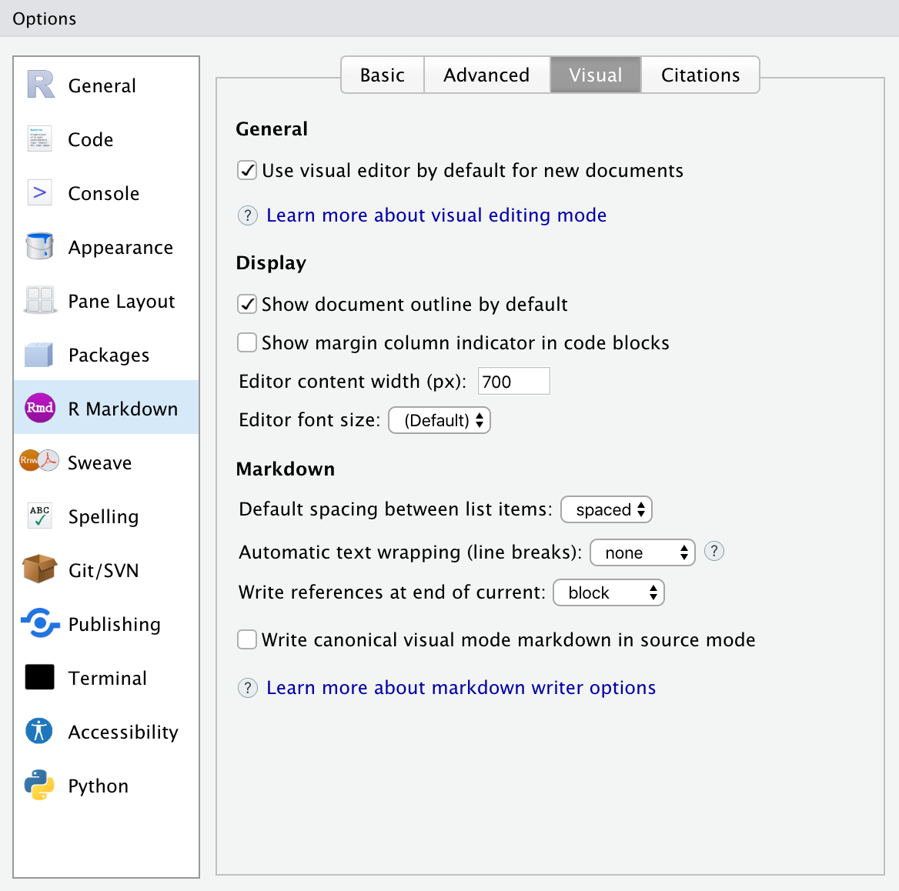

<a href="https://www.rstudio.com/blog/announcing-rstudio-1-4/" target = "_blank">RStudio 1.4</a> was released in January 2021 and switched to calendar-based versioning as of 2021.09. Starting with 1.4, the IDE includes a visual markdown editor that works on any markdown-based document, such as `.md` or `.Rmd` files. Visual editing mode provides a better experience when writing reports and analyses. You can see changes in real-time and preview what your document looks like without re-knitting.

In addition, the visual markdown editor provides extensive support for citations, scientific and technical writing features, outline navigation, and more.

In this blog post, we’d like to show how to use the visual markdown editor and highlight some features that you should know.

* [How to get started with the visual markdown editor](#get-started-with-the-visual-markdown-editor)
* [How to create content in the visual markdown editor](#create-content-in-the-visual-markdown-editor)
* [How to edit content in visual editing mode](#edit-content-in-visual-editing-mode)

## Get Started With the Visual Markdown Editor

To switch into the visual mode for a markdown document:

* In RStudio v2022.02, click the "Visual" button located on the left side of the editor toolbar.
* In earlier versions, click the compass icon located on the right side of the editor toolbar.

Alternatively, use the <kbd>⇧</kbd> + <kbd>⌘</kbd> + <kbd>F4</kbd> keyboard shortcut.

<script src="https://fast.wistia.com/embed/medias/am9337b81b.jsonp" async></script><script src="https://fast.wistia.com/assets/external/E-v1.js" async></script><div class="wistia_responsive_padding" style="padding:57.29% 0 0 0;position:relative;"><div class="wistia_responsive_wrapper" style="height:100%;left:0;position:absolute;top:0;width:100%;"><div class="wistia_embed wistia_async_am9337b81b videoFoam=true" style="height:100%;position:relative;width:100%">&nbsp;</div></div></div>
<center><i><caption>Switching into the visual markdown editor mode</caption></i></center>

You can customize various editor settings. Go to Tools \-\> Global Options \-\>  R Markdown \-\> Visual to choose your options, such as:

* Whether your new documents use the visual markdown editor by default.
* Whether the document outline shows by default.
* How to wrap text in the document.

<center>

</center>
<center><i><caption>Editor options</caption></i></center>

## Create Content in the Visual Markdown Editor

### How to embed rich media

Once in visual editing mode, you can paste rich content (tables, images, some formatting, etc.) into a document and match it in the source document. 

<script src="https://fast.wistia.com/embed/medias/opxbr5wnre.jsonp" async></script><script src="https://fast.wistia.com/assets/external/E-v1.js" async></script><div class="wistia_responsive_padding" style="padding:33.54% 0 0 0;position:relative;"><div class="wistia_responsive_wrapper" style="height:100%;left:0;position:absolute;top:0;width:100%;"><div class="wistia_embed wistia_async_opxbr5wnre videoFoam=true" style="height:100%;position:relative;width:100%">&nbsp;</div></div></div>
<center><i><caption>Dragging and dropping an image into a document in visual editing mode</caption></i></center>

### How to use keyboard and markdown shortcuts

The visual mode supports both standard keyboard shortcuts (e.g., <kbd>⌘</kbd>  + <kbd>B</kbd> for bold) and markdown syntax.

<script src="https://fast.wistia.com/embed/medias/yvzc3efjr2.jsonp" async></script><script src="https://fast.wistia.com/assets/external/E-v1.js" async></script><div class="wistia_responsive_padding" style="padding:50.42% 0 0 0;position:relative;"><div class="wistia_responsive_wrapper" style="height:100%;left:0;position:absolute;top:0;width:100%;"><div class="wistia_embed wistia_async_yvzc3efjr2 videoFoam=true" style="height:100%;position:relative;width:100%">&nbsp;</div></div></div>
<center><i><caption>Italicizing and bolding text with markdown and keyboard shortcuts</caption></i></center>

Here are some commonly used shortcuts:

Command | Keyboard Shortcut | Markdown Shortcut
-- | -- | --
Bold | ⌘ B | **bold**
Italic | ⌘ I | *italic*
Code | ⌘ D | `code`
Link | ⌘ K | <href>
Heading 1 | ⌥⌘ 1 | #
Heading 2 | ⌥⌘ 2 | ##
Heading 3 | ⌥⌘ 3 | ###
R Code Chunk | ⌥⌘ I | ```{{r}}

Check out more on the <a href="https://rstudio.github.io/visual-markdown-editing/shortcuts.html" target = "_blank">Editing Shortcuts page</a> of the Visual R Markdown site.

### How to use the catch-all shortcut to insert anything

You can also use the catch-all <kbd>⌘</kbd> + <kbd>/</kbd> shortcut to insert headings, comments, symbols, and more.

<script src="https://fast.wistia.com/embed/medias/0ytilauj0j.jsonp" async></script><script src="https://fast.wistia.com/assets/external/E-v1.js" async></script><div class="wistia_responsive_padding" style="padding:57.08% 0 0 0;position:relative;"><div class="wistia_responsive_wrapper" style="height:100%;left:0;position:absolute;top:0;width:100%;"><div class="wistia_embed wistia_async_0ytilauj0j videoFoam=true" style="height:100%;position:relative;width:100%">&nbsp;</div></div></div>

### How to use the editor toolbar

The editor toolbar includes buttons for common commands to edit formatting or insert content.

<script src="https://fast.wistia.com/embed/medias/pw2tuib05h.jsonp" async></script><script src="https://fast.wistia.com/assets/external/E-v1.js" async></script><div class="wistia_responsive_padding" style="padding:50.63% 0 0 0;position:relative;"><div class="wistia_responsive_wrapper" style="height:100%;left:0;position:absolute;top:0;width:100%;"><div class="wistia_embed wistia_async_pw2tuib05h videoFoam=true" style="height:100%;position:relative;width:100%">&nbsp;</div></div></div>
<center><i><caption>Inserting a table using the editor toolbar</caption></i></center>

## Edit content in visual editing mode

The visual markdown editor also provides efficient tools to edit and customize content.

### How to edit a table's rows, columns, and alignment

Right-click on a table in your document. You can set the alignment, add or delete rows and columns, add a header, and more.

<script src="https://fast.wistia.com/embed/medias/p1zdt2pggj.jsonp" async></script><script src="https://fast.wistia.com/assets/external/E-v1.js" async></script><div class="wistia_responsive_padding" style="padding:50.63% 0 0 0;position:relative;"><div class="wistia_responsive_wrapper" style="height:100%;left:0;position:absolute;top:0;width:100%;"><div class="wistia_embed wistia_async_p1zdt2pggj videoFoam=true" style="height:100%;position:relative;width:100%">&nbsp;</div></div></div>
<center><i><caption>Adding a row and aligning a column</caption></i></center>

### How to change an image's height, width, and aspect ratio

Once you have an image in your document, you can edit the size and aspect ratio with the visual markdown editor. Click on the image and a small window will appear. Edit the numbers to change the height, width, and aspect ratio.

<script src="https://fast.wistia.com/embed/medias/yagn8fs2vi.jsonp" async></script><script src="https://fast.wistia.com/assets/external/E-v1.js" async></script><div class="wistia_responsive_padding" style="padding:61.25% 0 0 0;position:relative;"><div class="wistia_responsive_wrapper" style="height:100%;left:0;position:absolute;top:0;width:100%;"><div class="wistia_embed wistia_async_yagn8fs2vi videoFoam=true" style="height:100%;position:relative;width:100%">&nbsp;</div></div></div>

## Learn More

The visual markdown editor has many other features for efficient report writing.

* Check out more information on the <a href="https://rstudio.github.io/visual-markdown-editing/" target = "_blank">Visual R Markdown website</a>.
* Download the <a href="https://rstudio.com/products/rstudio/download/" target = "_blank">latest RStudio IDE version</a> to try out the editor.
* Watch Tom Mock live code in visual editing mode in his webinar, <a href="https://youtu.be/WkF7nqEYF1E" target = "_blank">R Markdown Advanced Tips to Become a Better Data Scientist & RStudio Connect</a>.
