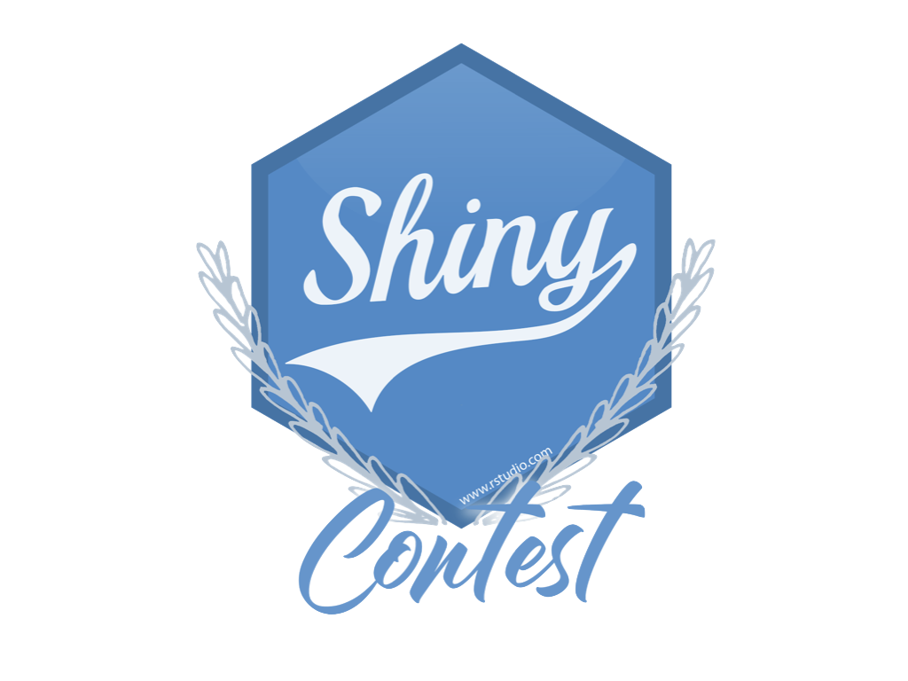
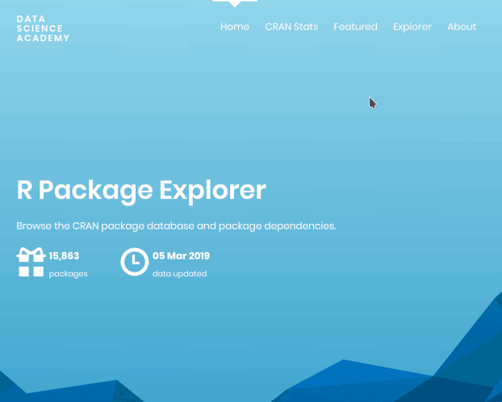

Back in January we [announced the first Shiny contest](https://blog.rstudio.com/2019/01/07/first-shiny-contest/). The time 
has come to share the results with you!

First and foremost, we were overwhelmed (in the best way possible!) 
by the 136 submissions! Reviewing all these submissions was incredibly 
inspiring and humbling. We really appreciate the time and effort each contestsant 
put into building these apps, as well as submitting them as a fully reproducible 
artifacts via RStudio Cloud.

Let's start with a few stats about the contest submissions: 

- There were 136 submissions from 122 unique app developers! 
- Approximately 92% of these developers submitted one entry for the contest and approximately 7% submitted two entries.
- There was one developer who submitted three entries and one developer who 
submitted five! 

And here is a look at the growth of submissions over time...

So many of these apps were quite complex, very well-designed, and fun to interact 
with. Saying that selecting winners was difficult would be the biggest understatement 
of the year! But we promised to do it, so we did! Below we list the honorable 
mentions, runners up, and last but not least, the winners of the first Shiny contest.

Before we get to them though, a quick point of claerification: we had promised two 
winners, one in the novice and one in the open category. However since we didn't 
ask developers to self select into these categories it was very difficult to place  
apps into these categories post-hoc. So instead we picked four winners in 
various categories. At the end of the post we also discuss how this experience 
will help shape the definitions of winning categories in the next Shiny contest.

Over the next week we will be getting in touch with all the winners, runners up,
and honorable mentions to arrange delivery of their awards and to highlight 
their submissions on the Shiny User Showcase.

## Winners

The four winners, presented here in no particular order, have won the following:

- One year of shinyapps.io Basic plan
- All hex/RStudio stickers we can find
- Any number of RStudio t-shirts, books, and mugs (worth up to $200)
- Special & persistent recognition by RStudio in the form of a winners page, 
and a badge that'll be publicly visible on your RStudio Community profile
- Half-an-hour one-on-one with a representative from the RStudio Shiny team 
for Q&A and feedback

### Most technically impressive: [iSEE](https://kevinrue.shinyapps.io/isee-shiny-contest/)

iSEE (interactive SummarizedExperiment Explorer) by [Kevin Rue](https://community.rstudio.com/u/kevinrue), [Charlotte Soneson](https://community.rstudio.com/u/csoneson), [Federico Marini](https://community.rstudio.com/u/federicomarini), [Aaron Lun](https://github.com/LTLA) 
and  is designed for interactive
exploration of high-throughput biological data sets. The deeper we dove into 
this app, the more impressed we were at its feature set. The data-visual-selection 
controls in each panel were well presented, and the dynamic, directional 
crosslinking feature is something we haven’t seen before. And it can even 
generate a reproducible R script!

- Interact with [the app](https://kevinrue.shinyapps.io/isee-shiny-contest/) on shinyapps.io
- [RStudio Community post](https://community.rstudio.com/t/shiny-contest-submission-isee-interactive-and-reproducible-exploration-and-visualization-of-genomics-data/25136) to find out more about it
- Reproduce the app on [RStudio Cloud](https://rstudio.cloud/project/230765)
- View the code on [GitHub](https://github.com/kevinrue/isee-shiny-contest)

### Best design: [69 Love Songs: A Lyrical Analysis](https://committedtotape.shinyapps.io/sixtyninelovesongs/)

This app by [David Smale](https://community.rstudio.com/u/committedtotape/) is a 
lyrical analysis of the three-volume concept album by the Magnetic 
Fields containing (yep, you guessed it) 69 love songs. We fell in love with the 
look of this app, and really appreciated that the font and colours used in the 
app have been chosen to match the album artwork. You don’t have to be a fan of 
the Magnetic Fields to appreciate the care and attention to detail that went 
into each panel!

- Interact with [the app](https://committedtotape.shinyapps.io/sixtyninelovesongs/) on shinyapps.io
- Read the [RStudio Community post](https://community.rstudio.com/t/shiny-contest-submission-lyrical-analysis-of-69-love-songs-by-magnetic-fields/25202) and the [blog post](https://davidsmale.netlify.com/portfolio/69-love-songs/) to find out more about the motivation, design decisions, and technical details
- Reproduce the app on [RStudio Cloud](https://rstudio.cloud/project/245439)

### Most Fun: [Hex Memory Game](https://dreamrs.shinyapps.io/memory-hex/)

A brave handful of people have built small games in Shiny. It’s always impressive 
to us when people pull that off at all, but we haven’t seen one that works as well 
as Hex Memory Game created by [pvictor](https://community.rstudio.com/u/pvictor/). 
Not only that, but the code is super clean and easy to reason about.

- Interact with [the app](https://dreamrs.shinyapps.io/memory-hex/) on shinyapps.io
- Read the [RStudio Community post](https://community.rstudio.com/t/shiny-contest-submission-hex-memory-game/25336) to find out more about the app and technical highlights
- Reproduce the app on [RStudio Cloud](https://rstudio.cloud/project/250892)
- View the code on [GitHub](https://github.com/dreamRs/memory-hex)

### The "Awww" Award: [Pet Records](https://jennadallen.shinyapps.io/pet-records-app/)

Think you're a good pet owner? This app by [Jenna Allen](https://community.rstudio.com/u/jallen1006/) will make you think again! 
Jenna, who describes herself as a digital nomad traveling with two dogs, Layla 
and Lloyd, has built this app for keeping track of her dogs' medical and vaccine 
records. The timeline visualizations in the app are extremely effective, and the 
amount you can drill down -- all the way to vaccine certificates and exam notes 
in PDF format! -- is very impressive.

- Interact with [the app](https://jennadallen.shinyapps.io/pet-records-app/) on shinyapps.io
- Read the [RStudio Community post](https://community.rstudio.com/t/shiny-contest-submission-an-app-to-visualize-and-share-my-dogs-medical-history/21511) and the [blog post](https://www.jennadallen.com/post/a-shiny-app-to-visualize-and-share-my-dogs-medical-history/) to find out more about the app's design and technical highlights
- Reproduce the app on [RStudio Cloud](https://rstudio.cloud/project/168716) (Note 
that for any images and documents stored in the app author's S3 bucket, you'll 
see "Error: Forbidden (HTTP 403)" on the RStudio Cloud version since credentials 
are not shared.)
- View the code on [GitHub](https://github.com/jennaallen/dog_days)

## Runners up

The following six apps are our runners up, and once again presented here in 
no particular order. Congratulations to the developers who have won the 
following:

- One year of shinyapps.io Basic plan
- All hex/RStudio stickers we can find
- Any number of RStudio t-shirts, books, and mugs (worth up to $200)

### A Virtual Lab for Teaching Physiology

If we were judging solely by ambition of vision, this submission by 
[David Granjon](https://community.rstudio.com/u/DGranjon) would have to be our 
winner! The centerpiece of this app is a strikingly detailed visNetwork, 
but the patient simulator idea is interesting as well.

- This submission includes two apps that can be accessed via the [Apps.Physiol page](https://rinterface.com/AppsPhysiol.html)
  - [Entry level app](https://davidgranjon.shinyapps.io/entry_level/)
  - [Virtual patient simulator](https://davidgranjon.shinyapps.io/virtual_patient_v2/)
- Read the [RStudio Community post](https://community.rstudio.com/t/shiny-contest-submission-a-virtual-lab-for-teaching-physiology/25348) to find out more about the motivation behind and design details 
of the apps
- Reproduce the app on [RStudio Cloud](https://rstudio.cloud/project/257646)
- View the code on [GitHub](https://github.com/DivadNojnarg/CaPO4Sim)

### ScotPHO Online Profiles Tool

This app by Jaime Villacampa, Zsanett Bahor, and Vicky Elliott was created 
to help people living and working in Scotland explore how geographical areas 
have changed over time or how they compare to other areas, across a range of 
indicators of health and wider determinants of health. The app is pretty complicated, 
but no more than it has to be with such a sprawling dataset behind it. Each part 
of the app has a carefully curated set of options that expose lots of power 
without being totally overwhelming. The context-sensitive Definition button 
and pervasive “Download data”/“Save chart” options are nice touches as well.

- Interact with [the app](https://scotland.shinyapps.io/ScotPHO_profiles_tool/) on shinyapps.io
- Read the [RStudio Community post](https://community.rstudio.com/t/shiny-contest-submission-shiny-app-for-exploring-scottish-public-health-data-within-local-areas/25560) post 
- Reproduce the app on [RStudio Cloud](https://rstudio.cloud/project/256533)
- View the code on [GitHub](https://github.com/ScotPHO/scotpho-profiles-tool)

### tidytuesday.rocks

If you haven’t heard of #TidyTuesday, you're missing out on one of the most 
dynamic virtual events in the R community. The tidytuesday.rocks app by 
[Neal Grantham](https://community.rstudio.com/u/nsgrantham/) is a tastefully 
minimalist interface for exploring previous weeks' datasets and community 
submissions for visualizations.

- Interact with [the app](https://nsgrantham.shinyapps.io/tidytuesdayrocks/) on shinyapps.io
- Read the [RStudio Community post](https://community.rstudio.com/t/shiny-contest-submission-tidytuesday-rocks-an-interactive-catalogue-of-tidytuesday-tweets-from-2018/25205) post 
- Reproduce the app on [RStudio Cloud](https://rstudio.cloud/project/246977)
- View the code on [GitHub](https://github.com/nsgrantham/tidytuesdayrocks)

### CRAN Explorer

There are plenty of Shiny apps for exploring CRAN metadata, but none of them look 
as striking as this one by [nz-stefan](https://community.rstudio.com/u/nz-stefan)! 
This is a really nice example of HTML Template usage; the separation between the 
R UI and the raw HTML UI is extremely clean.

- Interact with [the app](https://nz-stefan.shinyapps.io/cran-explorer/) on shinyapps.io
- Read the [RStudio Community post](https://community.rstudio.com/t/shiny-contest-submission-cran-explorer/25669) post 
- Reproduce the app on [RStudio Cloud](https://rstudio.cloud/project/258634)
- View the code on [GitHub](https://github.com/nz-stefan/cran-explorer)

### The Shiny LEGO mosaic creator

This app by [Eric Nantz](https://community.rstudio.com/u/rpodcast) is just fun!
Upload any (relatively small) image and within seconds this app will design a 
LEGO mosaic for you, complete with a list of required bricks and build instructions!

- Interact with [the app](https://rpodcast.shinyapps.io/shinylego) on shinyapps.io
- Read the [RStudio Community post](https://community.rstudio.com/t/shiny-contest-submission-the-shiny-lego-mosaic-creator/25648) post 
- Reproduce the app on [RStudio Cloud](https://rstudio.cloud/project/257906)
- View the code on [GitHub](https://github.com/rpodcast/shinylego)

### A Dashboard for Conference Tweets

We have fond memories of rstudio::conf 2019, but nostalgia isn’t the only thing 
going for this dashboard by [Garrick Aden-Buie](https://community.rstudio.com/u/grrrck/). 
There are a lot of great tweets we missed the first time around, and we added 
some new follows. We also loved the “Top Emoji” plot (spoiler: the top emoji was `r emo::ji("exploding_head")`!).

- Interact with [the app](https://gadenbuie.shinyapps.io/tweet-conf-dash/) on shinyapps.io
- Read the [RStudio Community post](https://community.rstudio.com/t/shiny-contest-submission-a-dashboard-for-conference-tweets/25745) post 
- Reproduce the app on [RStudio Cloud](https://rstudio.cloud/spaces/12362/project/258314)
- View the code on [GitHub](https://github.com/gadenbuie/tweet-conf-dash)

## Honorable mentions

Remember how we said earlier that there so many gems among the submissions and 
how it was so difficult to choose between them? Yeah, it was! The following 
twenty-one apps are the honorable mentions. The developers of these apps will 
receive one year of shinyapps.io Basic Plan and one RStudio t-shirt.

We have linked to the RStudio Community post for each of the submissions where 
you can read more about each app, interact with it, and reproduce it in RStudio 
Cloud.

- [Exploring large hospital data for better use of antimicrobials](https://community.rstudio.com/t/24743)
- [ShinyMRI - View MRI images in Shiny](https://community.rstudio.com/t/23995)
- [National Hockey League Play-by-Play App](https://community.rstudio.com/t/23831)
- [Reimagining NYC Neighborhoods with NewerHoods](https://community.rstudio.com/t/25624)
- [Voronoys - Understanding voters' profile in Brazilian elections](https://community.rstudio.com/t/25586)
- [Career Path Exploration Tool](https://community.rstudio.com/t/25371)
- [Identifying real estate investment opportunities](https://community.rstudio.com/t/25278)
- [ctmmweb - a web app to analysis Animal tracking data](https://community.rstudio.com/t/22892)
- [Tetris-like game using Nanopore Flongle screenshots as starting fields](https://community.rstudio.com/t/20997)
- [The OCR Handwriting Game](https://community.rstudio.com/t/25637)
- [Stock Portfolio Monitor](https://community.rstudio.com/t/25746)
- [Interactive isochrone mapper for anywhere in the world!](https://community.rstudio.com/t/25738)
- [Real time public transport info for Dublin, Ireland](https://community.rstudio.com/t/25654)
- [ubeRideR - A shiny app to visualise Uber data](https://community.rstudio.com/t/25639)
- [Climate indicators and their effects on health at the small area level in Barcelona](https://community.rstudio.com/t/25605)
- [Animated leaflet to view NYC metro entries with Shiny](https://community.rstudio.com/t/25747)
- [Sentify - Spotify musical sentiment visualization](https://community.rstudio.com/t/25207)
- [Impact Replays - Relive the CFL Highlights and Play-by-Play](https://community.rstudio.com/t/24001)
- [Utah Lake Water Quality Profile Dashboard](https://community.rstudio.com/t/23256)
- [Create Visual Abstracts for Original Research](https://community.rstudio.com/t/21530)
- [Radio DJ Playlist Analyzer](https://community.rstudio.com/t/21418)

## Next Shiny contest

The first Shiny contest was not only fun to review, but we also learned a lot 
about how to structure it next time around. (Oh yeah, there will be a next time!)
Our plan is to pre-identify clear categories for winners and announce them at the 
beginning of the contest. We're pretty sure you will wow us again, and develop 
apps that are awe-inspiring and don't fit into any of the categories we outlined, 
and we'll want to update things again for the third round of the contest, but 
c'est la vie! We will also plan better for a high number of submissions 
so that we can turn around the review quicker (thank you for your patience this 
time around!). 

