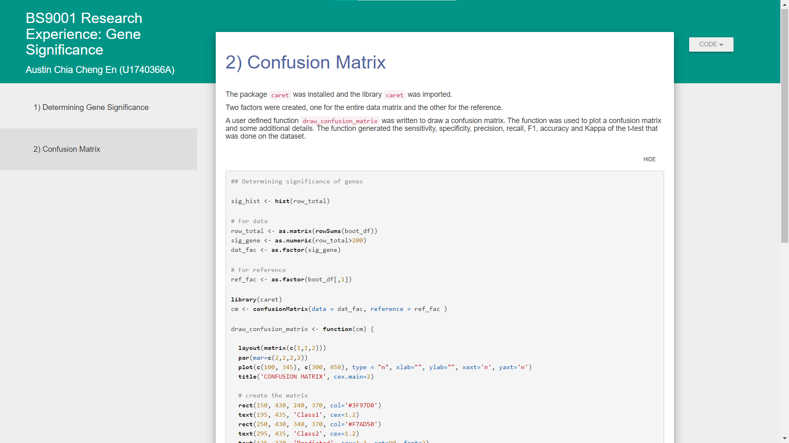
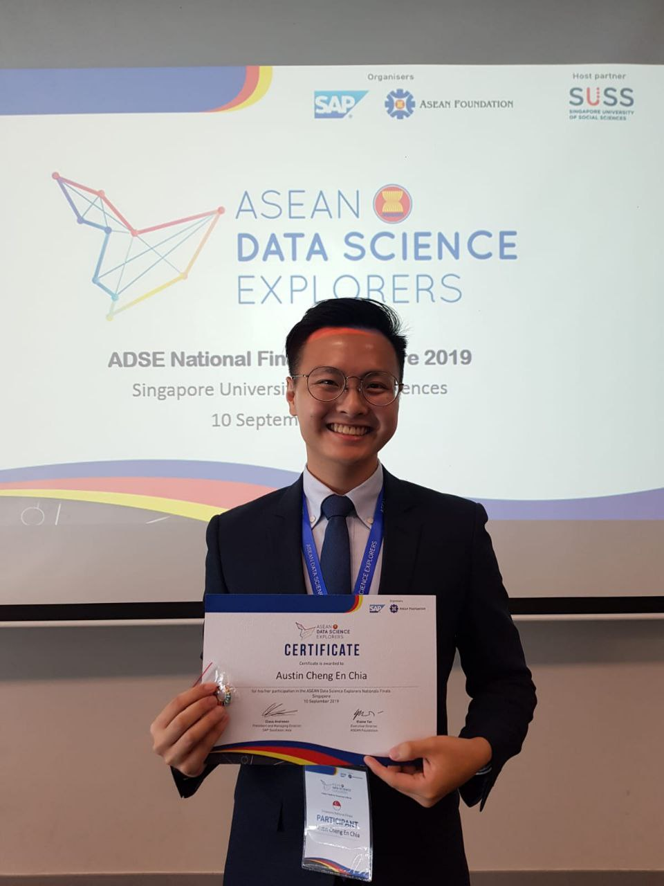
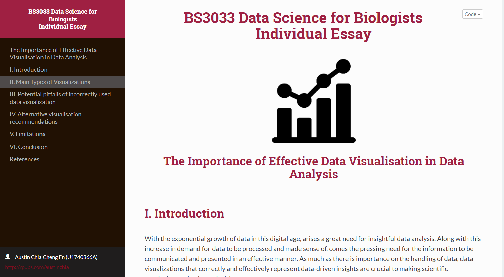
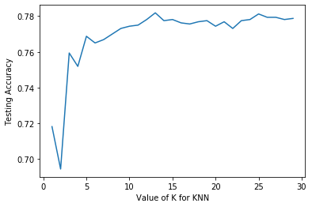
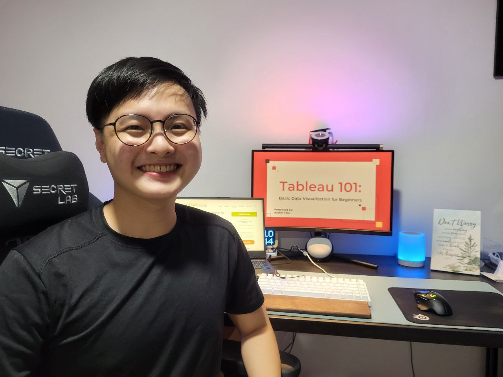

Austin Chia is the Founder of <a href="https://anyinstructor.com/" target = "_blank">Any Instructor</a>, where he writes about tech, analytics, and software. After breaking into data science without a tech degree, he seeks to help others learn more about data science and analytics. He has previously worked as a data scientist at a healthcare research institute and a data analyst at a health-tech startup. Get in touch on <a href="https://www.linkedin.com/in/austin-chia/" target = "_blank">LinkedIn</a> or <a href="https://github.com/austinchia" target = "_blank">GitHub</a>.

It was the start of spring in 2019 and I was in my sophomore year of college. I had just finished up all my basic biology modules, but **I knew the path of biology wasn't for me**.

That's when I heard all about the <a href="https://www.globenewswire.com/en/news-release/2022/06/07/2457482/0/en/With-27-5-CAGR-Healthcare-Analytics-Market-to-Surpass-Around-USD-80-21-Billion-by-2028.html" target = "_blank">fast-growing</a> data science and healthcare analytics field. It sounded like a perfect blend of my two interests: biology and programming!

**And so my data science journey began...**

In this blog post, I'll share my journey from studying biology to becoming a healthcare data analyst. I'll also share some of the things I've learned along the way and practical steps on how you can make the transition into data science – if you're not sure where to begin. Please check out this <a href="https://anyinstructor.com/recommended-resources/" target = "_blank">resource guide</a> if you want more information on any of these steps.

## **My Data Science Journey from Biology to Healthcare Analytics**

### **1. Familiarizing With Data**

My first taste of data analysis was when I got involved with analyzing web traffic data from a digital marketing internship. It was then that I realized that I really loved analyzing patterns!

With my newfound interest in data, I took things into my own hands to source the best learning resources in data and I wolfed down any helpful content I could find!

**Here are some of the types of free content I used (and still use to this day):**

* Data analytics blogs
* Data analytics YouTube channels

However, there was one significant hurdle that was standing in my way – the **huge skill gap** between my basic knowledge and the data science field.

It was then that I knew what I had to overcome next. Based on all the free resources I found, I quickly realized that I had to build up data skills on essential technical tools as soon as possible.

**Here are some tools I found that were essential to a career in data science:**

* Python
* R
* Excel
* SQL
* Tableau

Most sources online said that R programming was one of the key statistical languages used in biological research. With this knowledge, I formulated my next plan: to learn the R programming language.

#### **What I Learned:**

**Identify areas/tools/skills to learn** – and follow them up with a clear action plan. Tackle each of them one by one, based on existing experiences you've had.

### **2. Learning Programming**

This was the toughest uphill battle I had before entering data science.

Just like any other person without coding experience, I was stumped on where to begin. I tried out several free online courses on R but soon gave up because they were just too tough for an introduction.

This was when I stumbled upon a "Data Analyst in R" boot camp within my local area! It was summer break and I signed myself up immediately.

This boot camp covered several key topics I wanted to learn:

* Basic programming
* Using `apply()` functions in R
* Using the tidyverse packages

Most of the skills taught were using RStudio Desktop, which has been the industry-standard R IDE. The built-in integrations to CRAN help documentation plus having the ability to view my environment variables at a glance were a major help to my learning.

To accelerate my learning, I also concurrently took on a **biomedical data science research internship** at Nanyang Technological University, Singapore. I combined my experience in biology with my (newfound) R programming skills to work on a research project on schizophrenia.

**This was a major breakthrough for me!**

Through the course of the internship, I picked up an essential biological data analysis package – <a href="https://bioconductor.org/" target = "_blank">Bioconductor</a>. To better show my data and code, I also learned R Markdown for my project presentations.

<i><caption>I used the rmdformats package to create a nice markdown presentation for my code</caption></i>

Although I knew a little more about R and the associated packages it has, I still hungered for more: to go deeper as well as explore other tools in data science.

<i><caption>I also got to participate in a competition/hackathon along the way!</caption></i>

#### **What I Learned:**

**Having a basic understanding of technical skills is very important**, especially in a tech role in data analytics. Taking boot camps or courses can help lay a good foundation for you while you develop your knowledge. These foundations will provide a good platform for you to build your skills. 

Coding practice platforms like <a href="https://www.stratascratch.com/" target = "_blank">StrataScratch's practice questions</a> and <a href="https://mode.com/sql-tutorial/" target = "_blank">Mode's SQL tutorials</a> are among the few I've tried and found to be very helpful!

### **3. Adapting My Learning to Data Science**

My next focus was to gain as much exposure to data science as possible, even while taking my biology major! I took on a module, "Data Science for Biologists", where I learned biostatistics and introductory machine learning.

**Of course, there's more R programming along with it!**

And through the course of that college semester, I worked on several data science projects that boosted my confidence in R. I learned more about data visualization and writing simple Protein Motif Search algorithms.

 

<i><caption>I used R Markdown for one of the essay assignments in the module</caption></i>

In addition, I ended that module with a final project on machine learning in another programming language I've always wanted to try –-- Python. My project mates and I created a simple recommender model using Spotify data for our final project.

<i><caption>I used K-Nearest Neighbors to predict recommended songs based on genre</caption></i>

Shortly after I entered the world of Python, I soon realized that Excel was an equally important tool that I had to master for my portfolio, even if I wasn't planning to get into data analytics.

Therefore, in my next **medical services internship**, I created a project using Google Sheets (similar to Excel) to manage inventory!

By this point, I was pretty sure that an analytics job would be the path I wanted to take. With my knowledge of biology, I naturally looked for opportunities in healthcare, especially since the pandemic had just hit the world.

#### **What I Learned:**

**Keep learning and advancing your skillset** – whether through online courses, certificates, or simply reading data science articles online. 

The field is ever-changing – so it's crucial to educate yourself continuously. Make sure you <a href="https://justjooz.com/best-artificial-intelligence-certifications/" target = "_blank">keep learning</a> about machine learning and artificial intelligence.

Apprenticeships are also a good idea since they provide a comprehensive education compared to shorter, cheaper courses.

### **4. Exploring Healthcare Analytics**

My next step in this data science journey is another crucial one – a **data analytics internship** at a health-tech startup! During my internship, I picked up more tools for my data stack, such as Python, Excel, SQL, Tableau, and NoSQL databases.

At the same time, I also started **documenting my learnings** from all the various data analytics skills on my blog, <a href="https://anyinstructor.com/" target = "_blank">Any Instructor</a>. I also explored bioinformatics modules within my course to learn more tools like Bash and R.

While I tackled daily tasks at my internship, I decided to hone my skills further by registering for online certificates like the <a href="https://grow.google/certificates/data-analytics/#?modal_active=none" target = "_blank">Google Data Analytics Professional Certificate</a>. This certificate wasn't easy, but it taught me more than just technical skills in R and SQL, but also how to process and present data to stakeholders well.

**All that effort wasn't for nothing, though!**

Through my past internships and projects in data mining, I landed a full-time healthcare data analyst position at my internship placement company! During my work as a data analyst, my Python programming proficiency increased rapidly from all the projects I was given.

I later on also moved on to a bioinformatics data science position, where I worked on large biological datasets for eye research. This was where I challenged myself with learning more bioinformatics R packages while applying machine learning to protein data.

#### **What I Learned:**

**Explore your interest in the data science field that works for you!** Mine may be healthcare analytics but there are many other data science niches out there that you can consider exploring, such as <a href="https://dashthis.com/blog/8-marketing-analytics-platforms-to-simplify-your-data-analysis-processes/" target = "_blank">marketing analytics</a> and finance.

If you're not sure about what area you want to focus on, take on as many projects and internships as possible to gain more exposure! You'll never know until you try.

### **5. Giving Back to the Community**

If there's one thing that will really help in your own data science journey, it would be by **creating content to give back to the community**. You have no idea how much I've gained just from contributing back!

I started getting onto LinkedIn groups to share my experiences with fellow data science enthusiasts. The process of interviewing for data analyst and data scientist roles wasn't easy and I was glad to share my advice with them.

With the same desire to help others, I moved on to **giving workshops** on various topics in data while writing helpful content on my blog to data science learners (who were just like me 3 years ago!).

<i><caption>Giving my first Tableau data visualization workshop</i>

Helping others through blogging has really helped me too, as it allows me to **keep my skills sharp** while also meeting new friends in the data science community. This blog post is another great example!

#### **What I Learned:**

**Don't forget to give back to the community** once in a while. It can be through simple things like answering questions on Quora or LinkedIn or conducting workshops for beginners. We all have to start somewhere and your effort will definitely be appreciated!

You can start by **documenting your learning journey**! It helps to have a portfolio of past projects and work experiences to show when you're job hunting or networking with people in the industry. Writing a blog or on any online data science platform can really help with that.

## **Wrapping Up**

That's pretty much my story on how I went from a **biology student to a healthcare data analyst to a bioinformatics data scientist**. It hasn't been an easy journey so far, but it's definitely been a fun and rewarding one (and it has only just begun)!

**To sum up my data science journey, here are the key lessons I learned along the stages:**

1. Identify key skills and have a clear action plan
2. Master the basics of programming
3. Keep learning and advancing your skillset
4. Explore your interest in data science
5. Give back to the community

I'm still learning new things every day and I hope my story has inspired you to start your own data science journey! If you have any questions, feel free to connect with me on <a href="https://www.linkedin.com/in/austin-chia/" target = "_blank">LinkedIn</a>.

If there's one thing that I want you to take away from this story, it's that your data science journey is what **YOU** make of it. There's no one-size-fits-all solution and the best way to learn is by doing. So go out there and create something amazing!

**To end off, here's a quote to inspire you:**

> The expert at anything was once a beginner.
>
>– Helen Hayes

All the best!
