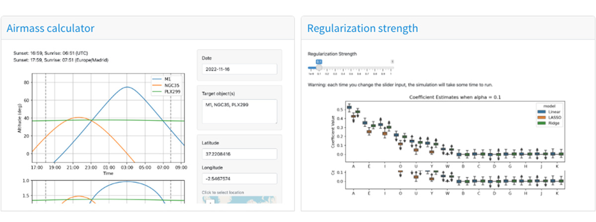

<a href="https://shiny.rstudio.com/" target="blank">Shiny</a> is a framework that makes it easy to build interactive web applications without requiring traditional web development skills. Since its introduction ten years ago for R, Shiny has made it possible for R users to communicate with a much broader audience—and now Shiny is available for Python! Python users can now use Shiny to create interactive data-driven web applications by writing Python code.

Shiny for Python is currently in alpha. We’d love for you to try it out and <a href="https://github.com/rstudio/py-shiny/issues" target="blank">give us your feedback</a>.

To see what Shiny for Python can do, take a look at the interactive examples in the <a href="https://shiny.rstudio.com/py/gallery/" target="blank">Gallery</a>.

<h2>Try Out Shiny for Python </h2>

You can start writing Shiny applications right in your web browser, without installing Shiny on your computer! 

To get going, visit the <a href="https://shiny.rstudio.com/py/docs/get-started.html" target="blank">Get Started</a> page. You can also see some interactive examples from shinylive.io (and more) on our YouTube playlist:

<iframe class="zodiac-iframe" width="560" height="315" src="https://www.youtube.com/embed/videoseries?list=PL9HYL-VRX0oTJtI1dWaT9T827fe7OqFhC" title="YouTube video player" frameborder="0" allow="accelerometer; autoplay; clipboard-write; encrypted-media; gyroscope; picture-in-picture" allowfullscreen></iframe>

## Deployment Options

After you’ve created a Shiny application, you’ll want to make it available to the world. You can deploy Shiny for Python apps to:

  * <a href="https://www.shinyapps.io/" target="blank">shinyapps.io</a>: RStudio’s managed hosting service
  * <a href="https://www.rstudio.com/products/shiny/download-server/" target="blank">Shiny Server Open Source</a>: A free, open-source server platform.
  * <a href="https://www.rstudio.com/products/connect/" target="blank">RStudio Connect</a>: Our professional data science publishing platform that you can host on your own servers
  * Or other hosting services that support FastAPI.

Learn more about deploying Shiny for Python applications <a href="https://shiny.rstudio.com/py/docs/deploy.html" target="blank">in its documentation</a>.

## Shinylive

One of the really cool new things about Shiny for Python is that it can run **without Python on the server**. Instead of running Python on the server, it can run Python in the user’s web browser. We’re calling this <a href="https://shiny.rstudio.com/py/docs/shinylive.html" target="blank">Shinylive</a>. Our interactive online documentation and examples are deployed using Shinylive.

How does Shinylive work? It uses the magic of WebAssembly, which is a binary format that can run inside of web browsers. Shinylive runs on <a href="https://shiny.rstudio.com/py/docs/shinylive.html" target="blank">Pyodide</a>, which is a version of Python compiled to WebAssembly. Because Python runs inside of the user’s browser instead of on a server, you deploy Shinylive applications to any web hosting service.

---

### Additional Resources

  * Check out the <a href="https://www.youtube.com/playlist?list=PL9HYL-VRX0oTJtI1dWaT9T827fe7OqFhC" target="blank">Shiny for Python playlist</a> on YouTube.
  * Visit the <a href="https://www.shinyapps.io/" target="blank">documentation website</a>, which includes:
    * <a href="https://shiny.rstudio.com/py/gallery/" target="blank">Shiny for Python gallery</a>
    * <a href="https://shinylive.io/py/examples/" target="blank">Shiny for Python examples</a>
  * Editor support:
    * <a href="https://marketplace.visualstudio.com/items?itemName=rstudio.pyshiny" target="blank">An extension</a> is available for VS Code users.
    * The RStudio IDE will support Python apps in the upcoming release
    * Shiny for Python works great in <a href="https://www.rstudio.com/products/workbench/" target="blank">RStudio Workbench’s</a> JupyterLab and VS Code sessions.
  * Watch Joe Cheng introduce Shiny for Python at his <a href="https://www.rstudio.com/conference/2022/keynotes/past-future-shiny/" target="blank">rstudio::conf 2022 keynote</a>. 
