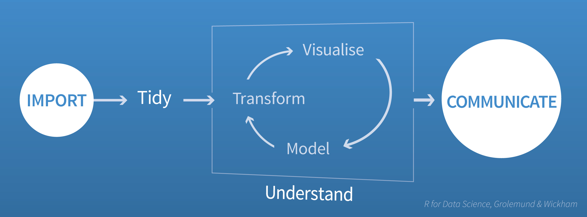

## The Root Problem: We Don't All Speak the Same Language

Organizations across the modern business world recognize the critical importance of Data Science for competitive advantage. That recognition has driven Glassdoor to rate Data Scientist as [one of the 25 top paying jobs in America in 2020](https://www.glassdoor.com/List/Highest-Paying-Jobs-LST_KQ0,19.htm). 

However, many organizations struggle to put these data scientists’ knowledge to work in their businesses where they can actually have an impact on success. We hear data scientists say, “The business can’t really tell us what they want, so they waste a lot of our time.” And in return, business people often say, “Our data scientists are really smart, but the applications they build too often fall short of what we’re looking for.”  

The problem here is that data scientists and business people speak very different languages. Specifically, they struggle to understand each other around:  

  * **data.** When a business person thinks about data associated with the business, they often are thinking about data that they can see in Web pages or spreadsheets. Data scientists, on the other hand, are usually looking for data that they can access using an Application Programming Interface or API.
  * **process.** When business people think about the process for analysis, they tend to think in people-centric terms along the lines of “Becky takes the order, and then transmits that data to George.” Data scientists, on the other hand, usually think of process as a series of automated programs that works without people.
  * **results.** Data scientists think of a result as an analysis running and producing correct output. Business people see a result as something that has an effect on the organization’s (usually financial) metrics. These are rarely the same thing, at least in the first version of a data science project.  

Both points of view are valid – they just aren’t the same, which creates a communications gap.

## Iterative Development Can Overcome the Communications Gap

*"An approximate answer to the right question is worth a great deal more than a precise answer to the wrong question."* --John Tukey

### Astellas’ Aymen Waqar discusses the analytics communications gap:

&nbsp;

These communications gaps are part of a larger challenge of defining (and refining) the problem. While your business stakeholder might believe they have a clear definition of the problem they are trying to solve, they may not understand whether the data is available, how complex the modeling might be or how long building a model on large data might take, or what adjacent problems might be potentially more valuable and/or far simpler to solve. So, before starting the development process, the data scientist and the business stakeholder must explore and discuss the problem in enough detail to create a realistic development plan. And while data scientists and business people may struggle to understand each other’s words, they usually can agree if they can just see a working model. The difficult part is getting to that working model.

## A Commonly Used Data Exploration Process Can Help

One way to get to agreement is to break down the project into simpler pieces and get agreement on each piece before moving on to the next. Garrett Grolemund and Hadley Wickham propose the following process below in their book [*R for Data Science*](https://r4ds.had.co.nz). This process isn’t specific to any technology such as R or Python. Rather it’s a way to get your data scientist and business sponsor to come to consensus on what question they are attacking.

The four steps are

  1. **Import**. Identify the data you plan to use, and focus first on importing that data so you can work with it.
  2. **Tidy**. Now that you have the data in hand, reshape and manipulate the data into a form that your analysis tools can easily work with.
  3. **Understand**. This step is where your data scientists should be interacting most with sponsors by turning the data into visuals and models, and getting feedback about whether they satisfy the business needs.
  4. **Communicate**. Once you have consensus on what you’re building, this is where you simplify and polish the result so that everyone will understand the result.

## Four Recommendations For Applying This Process

Many data scientists (or at least those who have read *R for Data Science*) use this type of process for doing analysis. However, fewer think of using it as a communications tool to ensure they are answering the proper business questions. You can help your data scientists apply this approach; encourage them to:

- **Schedule check-ins at each step.** Before you begin, set up regular check-ins with your business sponsors. Ideally, these should roughly correspond with the development phases listed above to ensure that everyone is in sync before moving on to the next phase.
- **Use rapid prototyping tools and languages.** R and Python are the tools of choice for most data scientists because they are well-suited to the type of iterative development process being described here. Both languages speed development and have excellent visualization tools which will help drive consensus.
- **Document progress using public documents.** Use a single Google Docs file to record each meeting and to record decisions. Don’t start a new document with each meeting, but simply prepend the date and the most recent meeting notes at top. By the time the project is done, you’ll have a record of the entire process from beginning to end which will help plan future projects.
- **Defer performance concerns until you have an agreed result.** Too many projects get bogged down designing for full-scale deployment before they actually know what they are building. Instead, develop a prototype that everyone agrees is the right idea, and then revise it to scale up when you decide to put it into production. This approach simplifies early decision-making and doesn’t waste precious project time on premature optimizations.

Once the application satisfies both your data scientists and business stakeholders, you’ll want to share the finished application with the wider business community. One of the easiest ways to do this is through *RStudio Connect*, which can help you rapidly refine your content during the prototyping phase, and share it widely and consistently in the production phase. We will talk more about that in our next blog post. Meanwhile, to learn more about how Connect can add push-button publishing, scheduled execution of reports, and flexible security policies to your team’s data science work, please visit the [RStudio Connect product page](https://rstudio.com/products/connect/).

