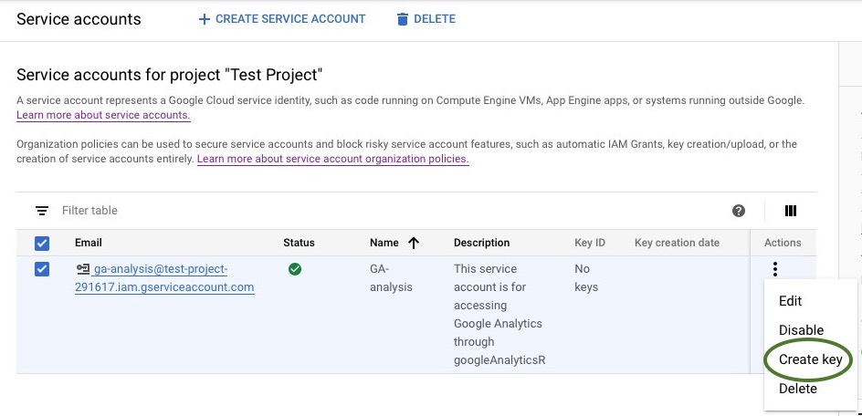
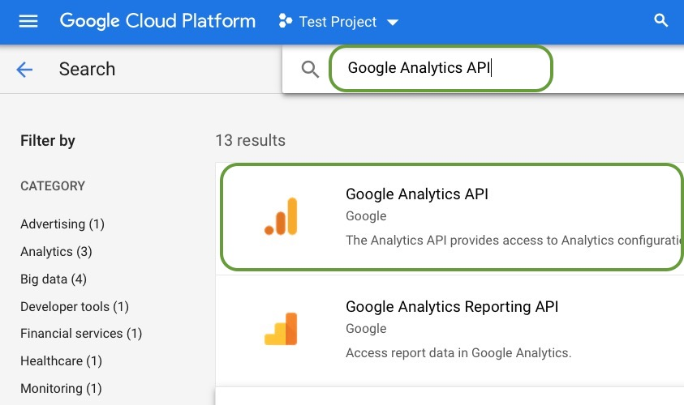
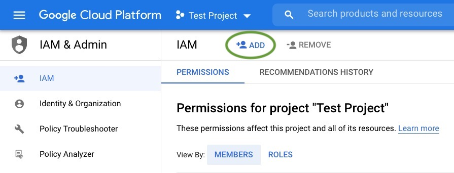
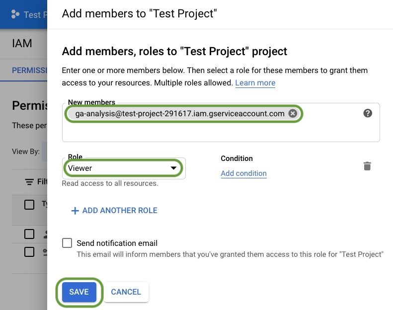
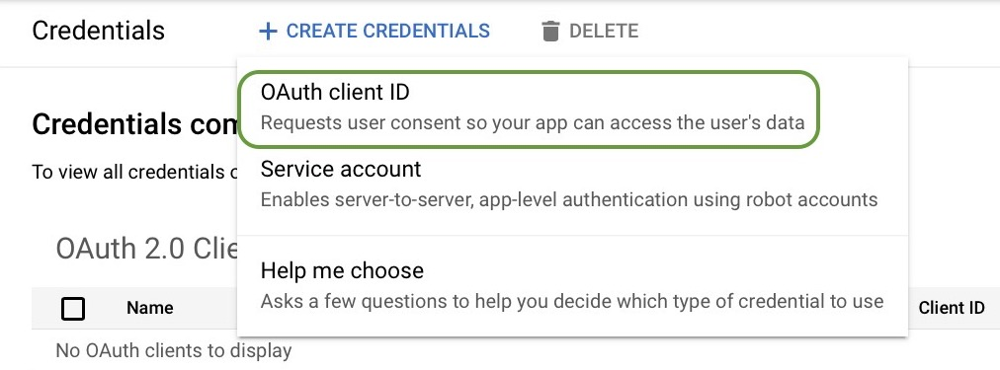
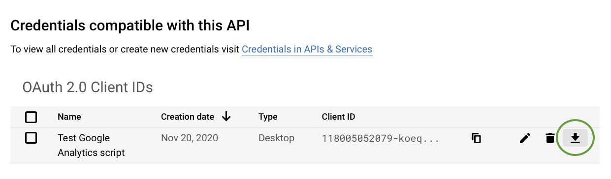

```{=html}
<style type="text/css"> 
img.screenshot { border: 0.5px solid #888; padding: 3px; background-color: #eee;}
</style>
```

This week, I'm taking a break from our regular blog content to write about some of the nitty-gritty data science we do within RStudio. Specifically, I'm going to address a question I was asked soon after joining the blogging team:

> Which of your blog articles received the most views in the first 15 days they were posted?

I have access to Google Analytics for the blog, and it's a powerful tool for understanding the flow of visitors through our web site. Nevertheless, the web interface makes it very difficult to compare 15- and 30-day windows of traffic that we need to evaluate blog posts. And given my need to report on the success of the blog to our stakeholders, this turned into a very tedious manual chore.

## This Sounds Like A Job For Code-Based Data Science

If you've been reading our blog over the past few months, we've been writing about how we like to use <a href="https://blog.rstudio.com/2020/11/17/an-interview-with-lou-bajuk/" target="_blank" rel="noopener noreferrer">code-based data science</a> to hide complexity and improve reproducibility. I decided that our tedious process for extracting Google Analytics data posed a great opportunity to practice what we preach and build a custom dashboard in R that will:

1.  **Download raw Google Analytics visitor data locally for analysis.** Google provides fairly easy access to sampled visitor data through its Application Programming Interface (API), but I wanted to use the full data set.
2.  **Give stakeholders a simple graphical interface to interact with the data.** I wanted to hide the complexity available in the Google Analytics user interface and give stakeholders one-click access to blog metrics. I also to give them a way to interact with and drill into the data. This also meant writing the code in such a way that it could run in production on a server.
3.  **Provide measurements of blog post viewership over their first 15 days of availability.** Blog posts receive most of their traffic immediately after being posted and then experience a long-tail of diminishing visits. To properly compare the popularity of blog posts, we had to aggregate their metrics over fixed windows of time beginning on their posting dates.

While it took a few weeks to get the first dashboard working, we now regularly use these R-based dashboards to measure our blog post effectiveness. However, the process of getting the Google Analytics API working was tricky enough that I thought others might find documentation of the process useful. 

To achieve this goal, I'll address each of these steps listed above in its own blog post over the coming weeks. I'll provide both code and screen shots along the way as well.

## Getting Started: How To Download Data From Google Analytics

Before we begin, I want to start with a few caveats:

1.  **Google APIs often change over time.** The approach I'm showing you works with <a href="https://developers.google.com/analytics/devguides/reporting/core/v4/" target="_blank" rel="noopener noreferrer">Version 4 of the Google Analytics API</a>. Google APIs often change over time, and I can't guarantee that the code I show will work months or years from now.
2.  **R isn't one of the official Google languages listed in their documentation.** I use the excellent <a href="https://code.markedmondson.me/googleAuthR/" target="_blank" rel="noopener noreferrer">`googleAnalyticsR`</a> package written by Mark Edmondson in my dashboard, but Google only officially documents Java, Python, and PHP interfaces.
3.  **This may not be the most efficient or best solution.** I hope readers who find simpler, easier, or better methods of authorizing the use Google Analytics API will document their methods as well. I encourage you to share them with the RStudio community using the googleAnalyticsR tag at <a href="https://community.rstudio.com/tag/googleanalyticsr" target="_blank" rel="noopener noreferrer">https://community.rstudio.com/tag/googleanalyticsr</a>.

With all that said, the dashboards that use this API provide insights into our blog use that would require a great deal of manual work to reproduce using the GA web interface.

### Install These Packages If You Don't Have Them Already

While the finished dashboards use 16 different R packages, the essential ones I use are:

-   `gargle`. This package helps us set up our Google Analytics (henceforth abbreviated as GA) authorization and credentials.
-   `googleAnalyticsR`. This essential package allows us to download the raw visitor data using the Google Analytics API.
-   `flexdashboard`. This package allows us to present the results in a simple Web interface using R Markdown.
-   `reactable`. This package allows users of the dashboard to browse, search, reorder, and interact with the data presented.

All of these packages are available for download at CRAN using `install.packages()`.

You should also create an R project for your dashboard at this time. We will need a place to store our Google Analytics credentials, and having a project ready to store them will keep things organized.

### Google Analytics credentials: The secrets to success

***

**IMPORTANT UPDATE**: Mark Edmonston, the author `googleAnalyticsR`, has created a new version of his package that eliminates the need for OAUTH credentials when running on a server. Once that update is available on CRAN, I'll update this post to document the simpler process of only submitting service account credentials. In the meantime, all the code shown here works; it just does more authentication than is required.

***

I want to begin by talking about what I found to be one of the most challenging pieces of the entire project: Creating, authorizing, and applying Google Analytics credentials. It's not hugely difficult, but it does have a lot of steps you must get right before you can get any data.

Here's a high-level overview of what we'll need to get the visitor data for our Google Analytics dashboard. To use the Google Analytics API, we need to present two types of credentials that represent:

1.  **The user represented by the client:** The API only provides service on behalf of an authorized *user*. Most people are pretty familiar with this type of authorization; it's the equivalent of logging into Google with an email address and password. The trick in this case is that the email address we'll use will be one Google creates for our particular client.
2.  **The client requesting service:** The API requires that we authorize and provide credentials for each *client* making requests. In our case, our client will be an R program, which is considered a desktop client. We'll request a *service account* to represent this our R program and allow direct server-to-server interactions without human interaction.

For any of this to work, the author of the dashboard has to be an authorized user of Google Analytics. You can test this by going to the <a href="https://analytics.google.com" target="_blank" rel="noopener noreferrer">Google Analytics Home page (analytics.google.com)</a>. If you are an authorized user, you'll see the web dashboard. If you aren't, you'll get an error message and will have to ask for access from your Google Analytics Administrator. Keep the contact information for your Google Analytics administrator handy; we'll need that information again later.

We must perform six steps to download data using the GA API. We need to:

-   <a href="#step1">Step 1:</a> Request a service account from Google.
-   <a href="#step2">Step 2:</a> Download the service account key and securely store its JSON file.
-   <a href="#step3">Step 3:</a> Enable API access to your project.
-   <a href="#step4">Step 4:</a> Add your service account credentials to your project.
-   <a href="#step5">Step 5:</a> Create and download your project’s OAUTH credentials from Google. This step will no longer be required after the new version of `googleAnalyticsR` is available on CRAN (see Important Update notice at the beginning of this section)
-   <a href="#step6">Step 6:</a> Submit both pieces of information to the Google Analytics API and make a test data request.

I'll walk you through each step individually in the following sections. For readers not interested in the gory details, you can skip ahead to <a href="#conclusion">the conclusion of this piece</a> where I'll recap what we got out of this process and what the next steps are.

<h3 id="step1">
Step 1: Request a service account from Google
</h3>

Google has written <a href="https://developers.google.com/analytics/devguides/reporting/core/v4/authorization" target="_blank" rel="noopener noreferrer">a comprehensive document on how to do API authentication</a>. Because we want to build a stand-alone dashboard, we're going to use the service account option, which Google describes this way:

> Service accounts are useful for automated, offline, or scheduled access to Google Analytics data for your own account. For example, to build a live dashboard of your own Google Analytics data and share it with other users.

This sounds like exactly what we want, so let's use that option. It will take a few sub-steps, but they are fairly straightforward. Jenny Bryan has written a nice overview about how this process works as part of her <a href="https://gargle.r-lib.org/articles/get-api-credentials.html" target="_blank" rel="noopener noreferrer">gargle package</a>; the description of service accounts is at the bottom of the page.

To create your service account, you should:

1. **Go to <a href="https://console.cloud.google.com/cloud-resource-manager" target="_blank" rel="noopener noreferrer">https://console.cloud.google.com/cloud-resource-manager</a> and click on _Create Project_** (see figure below). While you could also use the <a href="https://console.developers.google.com/start/api?id=analytics&credential=client_key" target="_blank" rel="noopener noreferrer">web-based Google setup tool</a> recommended by the Google document, I find that using the cloud resource manager page referenced above simplifies naming your project something other than "My Project".


2.  **Give your project a name.** Here, we've named our project *Test Project.* Click *Create* once you've entered a name.


3.  **Click on *Go to project settings* on the Google Cloud Dashboard project card.** Usually the new project's card will be at the top left of the page and should have the project name and number. You'll now go to your project settings page to create a service account to access this project.


4.  **Select _Create Service Account_.** You now have a project created, but you don't yet have a Google user account that can be used with that project. We'll create that on the *Service Account Details* screen.


5.  **Give your service account a name.** The name will automatically populate the Service Account ID field. **Record the full Service Account ID generated somewhere; we'll need to register that account with your Google Analytics administrator.** It's also a good idea to provide a long description of what you intend to do with this account. When you've finished with filling in these fields, click *Create.*


This completes the creation of our service account.

<h3 id="step2">
Step 2: Download the service account key
</h3>

1.  **Now that your service account exists, download your key from the three vertical dots menu.** Once your account is created, the dashboard will take you back to the *Service Accounts* page as shown below.


2.  **Create your private service account key**. Make your browser window wide enough to see the *Actions* menu with the three vertical dots. Click on those 3 vertical dots, and you'll see a pop-up menu. Click on *Create key.*



3.  **Select JSON as your key format.** The `googleAnalyticsR` package requires the key to be in JSON format. Once you've selected that format, click *Create.*


4.  **Store the downloaded key in a folder within your R project.** I typically create a folder in my dashboard project named *.secrets* where I keep such keys.


At this point, you have the service key credentials you need to make requests. However, we still have a couple more steps to do before we can use the API.

<h3 id="step3">Step 3: Enable API access to your project</h3>

The fact you have a valid service key is not enough to start making requests. You still need to enable the API from the Google Dashboard. To do this you:

1.  **Go to <a href="https://console.cloud.google.com/apis" target="_blank" rel="noopener noreferrer">https://console.cloud.google.com/apis</a> as shown in the screenshot below and then click on _Enable APIs and Services_.**


2.  **Search for and click on the Google Analytics API.**



3.  **Click on _Enable_ to make the API for your project active.**


Sadly, the fact you have a valid service key is not enough to start making requests yet. We still need to authorize the user account with GA.

<h3 id="step4">Step 4: Add your service account user credentials to your project</h3>

You now need to add the email associated with that key to the list of authenticated project users. To do this, we're going to return to the Cloud Resource Manager pane at <a href="https://console.cloud.google.com/cloud-resource-manager" target="_blank" rel="noopener noreferrer">https://console.cloud.google.com/cloud-resource-manager</a>.

Please note that for many Google Analytics configurations, **only GA administrators may add new members to a project.** If that is the case for you, you'll will not see the screens shown below. Instead, you must contact your GA administrator and ask them to add your service account email to the project with Viewer rights.

If you do have the appropriate permissions, however, perform the following 3 tasks:

1.  **Click on the _IAM_ selection on the left-hand-side menu and select _ADD_ from the top submenu** as shown below:



2.  **Add your service account user to the project.** Enter the email address for your service account, select *Viewer* as the role, and click *Save* as shown below.



3.  **Verify that your service account email has now been added** by observing it in the list of members for this project.


<h3 id="step5">
Step 5: Create and download your project's OAUTH credentials from Google
</h3>

While you may be questioning why you ever started this seemingly endless project at this point, fear not; we're almost done. All that remains to do is to create and download the OAUTH credentials for your service key.

Now if you're anything like me, you're probably thinking "Wait a minute, I created a service key to bypass all this OAUTH complexity. Why do I need an OAUTH project file now?" I'm glad you asked; it's because Google:

-   **Gathers API statistics on a per-project basis.** Google needs to know what project to aggregate your Google Analytics API calls under for reporting and accounting purposes.
-   **Needs to defend against excessive API calls.** Because you are accessing the API from a computer program, Google has to defend its API against infinite loops and automated attacks. Should Google detect excessive API calls associated with your project, it can throttle its responses to you without affecting other users.

You don't actually need a project client ID for debugging purposes because the `GoogleAnalyticsR` package has a default project associated with it. However, this project ID is shared among all programs using the package, and you may find your API calls denied because too many users are actively using the package. You can avoid this issue entirely by setting your own project client ID as shown below.

In my opinion, acquiring an OAuth 2.0 client ID for a service account is poorly documented on the Google API dashboard, in the Google documentation, and in the `GoogleAnalyticsR` package. I found this process difficult to reproduce for our test project even though I'd been through it for my own dashboards. With that said, it's fairly straightforward if you start in the proper place as shown below:

1.  **Go to the site <a href="https://console.developers.google.com/apis/api/analyticsreporting.googleapis.com/" target="_blank" rel="noopener noreferrer">https://console.developers.google.com/apis/api/analyticsreporting.googleapis.com/</a>.** Please note that this is not the Google Cloud API dashboard we went to in Step 3; this is the Google Analytics Report API dashboard. You probably will have no OAuth 2.0 client IDs shown. Click on *+ CREATE CREDENTIALS* at the top of the page.


2.  **Select _OAuth client ID_** as the credential you wish to create.



3.  **Select *Desktop app* as the application type and enter your a name for your client.** I chose the name "Test Google Analytics script."


4.  **Click *OK* to acknowledge the ID being created**, which will return you to the Google Analytics dashboard.


5.  **Click the down arrow button next to your new Client ID to download the client ID JSON file.** I typically put this file into my *.secrets* folder where I also keep my service account private key.



<h3 id="step6">
Step 6: Submit both pieces of information to the Google Analytics API and make a test data request.
</h3>

While this multi-step process which may have seemed like something out of *Lord of the Rings*, you now should have all the credentials and permission to make API requests to Google Analytics. So let's write code to fetch one day's Google Analytics data for the rstudio.com site.

```{r include=TRUE, echo=TRUE, eval=FALSE}
library(googleAnalyticsR)
library(dplyr)
library(ggplot2)
library(lubridate)
library(reactable)
library(stringr)

## First, authenticate with our client OAUTH credentials from step 5 of the blog post.
googleAuthR::gar_set_client(json = "secrets/oauth-account-key.json")

## Now, provide the service account email and private key
ga_auth(email = "ga-analysis@test-project-291617.iam.gserviceaccount.com",
        json_file = "secrets/service-account-key.json")

## At this point, we should be properly authenticated and ready to go. We can test this
## by getting a list of all the accounts that this test project has access to. Typically,
## this will be only one if you've created your own service key. If it isn't your only
## account, select the appropriate viewId from your list of accounts.

my_accounts <- ga_account_list()
my_id <- my_accounts$viewId     ## Modify this if you have more than one account

## Let's look at all the visitors to our site. This segment is one of several provided
## by Google Analytics by default.

all_users <- segment_ga4("AllTraffic", segment_id = "gaid::-1")

## Let's look at just one day.

ga_start_date <- today()
ga_end_date <- today()

## Make the request to GA
data_fetch <- google_analytics(my_id,
                               segments = all_users,
                               date_range = c(ga_start_date, ga_end_date),
                               metrics = c("pageviews"),
                               dimensions = c("landingPagePath"),
                               anti_sample = TRUE)

## Let's just create a table of the most viewed posts

most_viewed_posts <- data_fetch %>% 
  mutate(Path = str_trunc(landingPagePath, width=40)) %>% 
  count(Path, wt=pageviews, sort=TRUE)
head(most_viewed_posts, n=5)
```

Assuming you have the appropriate permissions, client ID, and service key, you should get a result that looks similar to this one I pulled from the rstudio.com web site.

|     | Path                                     |      n|
|-----|------------------------------------------|------:|
| 1   | rstudio.cloud/index.html                 |  22173|
| 2   | rstudio.com/index.html                   |  18240|
| 3   | rstudio.com/products/rstudio/download... |  16120|
| 4   | www.shinyapps.io/admin/index.html        |   8327|
| 5   | support.rstudio.com/hc/en-us/articles... |   7486|

<h2 id="conclusion">
Wrapping Up Our First Custom Google Analytics Script
</h2>

While many of the details of the Google Analytics API may seem elaborate and arcane, I want to emphasize some of the main ideas behind this process:

-   **You don't have to settle for what the Google Analytics user interface gives you.** The GA UI contains many general-purpose analytical views. However, if your organization wants to manage to web metrics that its interface doesn't provide, the GA API and custom code allows you to create your own web metrics from raw GA data.
-   **Two credentials unlock your ability to create your own web analytics.** While the setup process to access the GA API seems complicated, it really boils down to agreeing on two basic credentials: one for the user authorizing the request and the other for the client program running it.
-   **Once you can download your own GA data, you can apply ordinary R code to understand it.** While the Google Analytics UI may take you days to learn, once you can download the raw GA data, you can return to R and Python tools to wrangle that data into the web characteristics you want to measure. Best of all, once that code is written, you can hand it to others who don't have to understand anything about GA or its APIs. Your program becomes a useful tool instead of just a big toolbox.

This post has focused entirely on getting authorized to download Google Analytics data. The next post will focus on how to create a flex dashboard for stakeholders to interact with the data. The last post in this series will show how to create windowed views of this data and public a self-contained dashboard that can be used on demand from RStudio Connect.

## To Learn More

This post only focused on using `GoogleAnalyticsR` to download data through the GA API, but the package is capable of much much more. I highly recommend taking a look at <a href="http://code.markedmondson.me/googleAnalyticsR/index.html" target="_blank" rel="noopener noreferrer">the extensive package documentation</a> and its <a href="https://github.com/MarkEdmondson1234/googleAuthR" target="_blank" rel="noopener noreferrer">github repository</a> as well as <a href="https://code.markedmondson.me" target="_blank" rel="noopener noreferrer">author Mark Edmondson's blog</a>.
