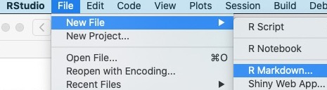

<sup>Photo by <a href="https://unsplash.com/@abiglow?utm_source=unsplash&amp;utm_medium=referral&amp;utm_content=creditCopyText">Alan Biglow</a> on <a href="https://unsplash.com/s/photos/tesla-dashboard?utm_source=unsplash&amp;utm_medium=referral&amp;utm_content=creditCopyText">Unsplash</a> </sup>

```{=html}
<style type="text/css"> 
img.screenshot { border: 0.5px solid #888; padding: 5px; background-color: #eee;}
</style>
```
Back in November, I took readers step by step through the somewhat long process of <a href="https://blog.rstudio.com/2020/11/27/google-analytics-part1/" target="_blank" rel="noopener noreferrer">authenticating and downloading Google Analytics web site data into R</a>. This post will be much simpler; I'm going to walk you through creating a dashboard showing blog post popularity using the `flexdashboard` package.

Before we go there, however, I want to re-emphasize a correction that we made to the original credentials post. Mark Edmonston, the author of the terrific `googleAnalyticsR` package, has created a new version of his package that eliminates the need for OAUTH credentials when running on a server. Once that update is available on CRAN, I'll update this post to document the simpler process of only submitting service account credentials. In the meantime, though, we'll continue using both OAUTH and service account credentials.

## Where to Find The Code and Data

All the code and data presented in this post is in a GitHub repository at <a href="https://github.com/rstudio/a-flexdashboard-for-google-analytics/" target="_blank" rel="noopener noreferrer">https://github.com/rstudio/a-flexdashboard-for-google-analytics</a> in the *Part2* folder. The code from Part 1 of this blog series is also available in the *Part1* folder; however, users should be aware that they'll need to provide their own authentication secrets for that code to work. My previous article, <a href="https://blog.rstudio.com/2020/11/27/google-analytics-part1/" target="_blank" rel="noopener noreferrer">Custom Google Analytics Dashboards with R: Downloading Data</a>, provides detailed instructions for how to obtain those credentials.

To make it easy for readers to reproduce this dashboard, I've constructed a synthetic set of Google Analytics data named *clickbait\_GA\_data.csv* for a hypothetical blog at the address *clickbait.com*. At the time of this writing, that domain was currently for sale and therefore shouldn't be confused with any real blog. While the synthetic traffic comes from the Google Analytics log from an actual blog, the titles and URLs of all the articles are made up (although I wish I could find out the *3 Ways That Birds Are Confused About Bacon*). The dataset contains more than 32,000 visits and 105,000 page views conducted over one month.

# Creating Our Dashboard

So let's begin building our dashboard. To do this, we're going to open a new `flexdashboard` R file. We do that by selecting File \> New File \> R Markdown.... as shown below.



We next select From Template \> Flex Dashboard.


That selection yields a new file which looks like this:


If you *knit* that file, you end up with this output in your Preview window.


The preconfigured template has provided us with window panes in which to put our Google Analytics graphs and tables. We simply have to fill them in!

Our process for building our Google Analytics (GA) dashboard will go like this:

1.  Read in the Google Analytics data in the setup chunk of our document.
2.  Use `dplyr` and `ggplot2` to create a graph of pageviews by day for Chart A.
3.  Build a table of the top 10 most popular titles in Chart B using the `reactable` package.
4.  Delete the R Markdown code for Chart C.

So let's build this dashboard.

## Reading in the Data

We begin our dashboard by reading in the data from Google Analytics. <a href="https://blog.rstudio.com/2020/11/27/google-analytics-part1/" target="_blank" rel="noopener noreferrer">In our last post</a>, we built code to authenticate and read in the GA data using the Google Analytics API. In a production dashboard, we would put that code in the setup section here. 

However, because we have our synthetic data in a .csv file, reading in the data will be a much simpler process. We will simply load the libraries we intend to use, apply the *read\_csv* function from the `readr` package to our dataset, and put all of this in the *setup* chunk of our R Markdown file as shown below. I've shown the first few lines of the output to provide a sense of what that content looks like.

```{r setup, message=FALSE}
library(flexdashboard)
library(readr)
library(ggplot2)
library(dplyr)
library(reactable)

gadata <- read_csv("./data/clickbait_GA_data.csv")
show(gadata %>% head(7))

```

## Plotting Blog Traffic by Day

With the GA data in a tibble, we can use `dplyr` to group and sum the page views by day and then plot the data over time with `ggplot2`. This code will go in the R chunk under the heading *Chart A*.

```{r, message=FALSE}

theme_set(theme_minimal())

gadata_by_day <- gadata %>% 
  group_by(date) %>% 
  summarize(pagesums = sum(pageviews))

g <- ggplot(gadata_by_day, aes(x = date, y = pagesums)) +
  geom_point(color = "blue") +
  geom_line(color = "blue") +
  scale_x_date() +
  labs(x = "", y = "", title = "")
show(g)
```

## Building a Table of the Most Popular Results

We'd also like to present a table of the most popular blog posts on our blog. We could do this with a variety of packages such as `kable` or `DT`, but for this example, we'll use the `reactable` package. `Reactable` gives users interactive features such as the ability to search and sort the table. All this is done using client-side Javascript, which makes the table interactive without requiring server involvement.

We can compute and display the most popular blog posts by inserting this code into the chunk under *Chart B*. We added arguments to change the column names, specify the widths of the columns, and permit scrolling, searching, and striping just to make it prettier. Those could have been omitted if we weren't fussy about the formatting.

```{r,  message=FALSE}

gadata_most_popular <- gadata %>% 
  count(pageTitle, wt = pageviews, sort=TRUE) %>% 
  head(10)

## For those who aren't as comfortable with the options in count, the following
## code would also work
# gadata_most_popular <- gadata %>% 
#   group_by(pageTitle) %>% 
#   summarize(n = sum(pageviews)) %>% 
#   arrange(desc(n))

reactable(gadata_most_popular,
           columns = list(pageTitle     = colDef(name = "Title",
                                            align = "left", 
                                            maxWidth = 250),
                          n             = colDef(name = "Page Views",
                                             maxWidth = 100)),
            pagination = FALSE,
            searchable = TRUE,
            striped = TRUE)
```

## The Final Result

Finally, we change the heading of our R Markdown code to have a meaningful title, rename the headings from Chart A and Chart B to something more reasonable, delete the heading and chunk for Chart C, and add some explanatory text about what our dashboard is about. Our finished dashboard R Markdown code should look like the code in <a href="https://github.com/rstudio/a-flexdashboard-for-google-analytics/blob/main/Part2/dashboard1.Rmd" target="_blank" rel="noopener noreferrer">dashboard1.Rmd</a>

When we knit the results, we see this:


If we have access to an RStudio Connect server, we can publish this dashboard to that server by clicking the *Publish* button at the top right of the Viewer window. On the RStudio Connect server, we can schedule the dashboard to regularly download and analyze the Google Analytics data and allow others to interact with it. We can literally go from a desktop R Markdown document to a dashboard running in production for others to see in just a few clicks.

# Conclusions

This post shows how:

1. **A little R Markdown code can create a Google Analytics dashboard.** Overall, the process of creating this dashboard is not really any more difficult than creating a report in R Markdown. The `flexdashboard` framework uses the same headings and code chunk structure as a regular R Markdown document. This means that we don't have to learn a new language to build our dashboard.
2. **Flexdashboard allows us to exploit other tools we already know.** The R Markdown template for `flexdashboard` provides visual containers into which we can drop code that uses other packages that we know such as `ggplot2`, `dplyr`, and `reactable`. Again, we don't have to learn new and unfamiliar tools to create our dashboard.
3. **We can publish our dashboard and add new features incrementally.** For organizations with an RStudio Connect server, we can put our dashboard into scheduled production with only a few clicks. Any time we wish to add another insight or plot to our dashboard, we simply change the R Markdown document on our desktop and republish the result.

However, while we've successfully created a simple Google Analytics dashboard, we haven't tackled the question that kicked off this series of blog posts, namely:

> Which of your blog articles received the most views in the first 15 days they were posted?

That's the question we'll tackle in part 3 of this series, where we'll derive the dates of publication for our blog posts and create a dashboard that ranks blog posts on the basis of a 15-day window of visitors. This approach will ensure that we don't favor older blog posts that have just had more time to gather views.

## For More Information

If you would like to learn more about some of the packages and products we've used, we recommend:

- <a href="https://rmarkdown.rstudio.com/flexdashboard/" target="_blank" rel="noopener noreferrer">flexdashboard: Easy interactive dashboards for R</a>, a web site that gives a broad overview of the many capabilities of the `flexdashboard` package.
- <a href="https://rmarkdown.rstudio.com" target="_blank" rel="noopener noreferrer">R Markdown</a>, RStudio's web site that describes the many ways you can use R Markdown to create reports, slides, web sites, and more.
- <a href="https://rstudio.com/products/connect/" target="_blank" rel="noopener noreferrer">RStudio Connect</a>, RStudio's publishing platform for R and Python, which provides push-button publishing from the RStudio IDE, scheduled execution of reports, and a host of other production capabilities.


