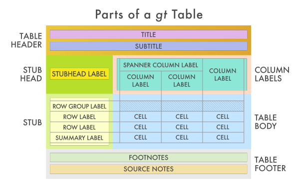

```{r load_packages, echo=FALSE, include=FALSE}
library(tidyverse)
library(gt)
```

We are extremely excited to have our first release of the **gt** package available in CRAN! The name **gt** is short for "grammar of tables" and the goal of **gt** is similar to that of **ggplot2**, serving to not just to make it easy to make specific tables, but to describe a set of underlying components that can be recombined in different ways to solve different problems.

If you ever need to make beautiful customized *display* tables, I think you'll find **gt** is up to the task. You can install **gt** 0.2 from CRAN with:

```{r install_gt, eval=FALSE}
install.packages("gt")
```

For an initial release, it's pretty big! There are so many ways to structure a table, apply formatting and annotations, and style it just the way you want. Currently **gt** renders tables to the HTML output format (and has the ability to export to image files). We plan to also support the LaTeX and RTF output formats in the near future.

The [website for the **gt** package](https://gt.rstudio.com) has walkthrough articles for getting started and a [function reference section](https://gt.rstudio.com/reference/index.html) with plenty of examples and images to show you how the table output is meant to appear.

## Let's get acquainted with our model of a table

We decided to formalize the parts of a table---and give them names---so that we have some language to act on. The larger components of a table (roughly from top to bottom) include the *table header*, the *column labels*, the *stub* and *stub head*, the *table body*, and the *table footer*. Within each of these components, there may be subcomponents (e.g., the *table header* contains a *title* and *subtitle*, the *table body* contains individual *cells*, etc.). Understanding how the parts fit together will make more sense with this diagram:

<p align="center"></p>

Learning new vocabulary is definitely a pain, but we believe it's worthwhile. Like **ggplot2**, the new words take some getting used to, but we believe learning them will improve your ability to analyze and understand existing tables, and then successfully recreate them in **gt**.

## Examples with the `exibble` dataset

The `exibble` dataset is included in **gt** and its *raison d'etre* is to be a small dataset (8 rows and 9 columns) with different column types for experimenting with formatting. It fits easily on a single screen when printed as a tibble and rendered as a **gt** table, making it easy to see the results of our **gt** experimentation.

```{r exibble_print, paged.print=FALSE}
exibble
```

### A simple table

Let's use that dataset to make the 'Hello, World!' of **gt** tables:

```{r table_1_code, eval=FALSE}
exibble %>% gt()
```

<br>

Just like how the `ggplot()` function is the entry point to **ggplot2** plots, the [`gt()`](https://gt.rstudio.com/reference/gt.html) function serves as the first function to call for making **gt** tables.

### Formatting data in columns

The `exibble` dataset is blessed with an array of column types. This makes it a snap to experiment with **gt**'s collection of `fmt_*()` functions, which format the input data values.

Let’s test as many formatter functions as possible. Here's the plan:

- have `num` display numbers with exactly 2 decimal places using [`fmt_number()`](https://gt.rstudio.com/reference/fmt_number.html) 
- show nicely formatted dates in `date` using `date_style` `6` (the `m_day_year` style) with [`fmt_date()`](https://gt.rstudio.com/reference/fmt_date.html)
- format the 24-h time values in `time` to `time_style` `4` (the `hm_p` style) with [`fmt_time()`](https://gt.rstudio.com/reference/fmt_time.html)
- make the datetimes in `datetime` formatted as such with the [`fmt_datetime()`](https://gt.rstudio.com/reference/fmt_datetime.html) function
- transform the `currency` column with [`fmt_currency()`](https://gt.rstudio.com/reference/fmt_currency.html) to show us values in the euro currency (`currency = "EUR"`)

Phew! Here's the code and the corresponding **gt** table:

```{r table_2_code, eval=FALSE}
exibble %>%
  gt() %>%
  fmt_number(columns = vars(num), decimals = 2) %>%
  fmt_date(columns = vars(date), date_style = 6) %>%
  fmt_time(columns = vars(time), time_style = 4) %>%
  fmt_datetime(columns = vars(datetime), date_style = 6, time_style = 4) %>%
  fmt_currency(columns = vars(currency), currency = "EUR")
```

<br>

As can be seen, entire columns had formatting applied to them in very specific ways. There is some finer control available as well. We can style a subselection of rows in any given column and there are quite a few ways to specify the target rows (e.g., row indices, row names in the stub, conditional statement based on column data, etc.).

This only scratches the surface of what is possible in formatting the *table body*, there are more `fmt_*()` functions. If they don't exactly suit your needs you can use the general [`fmt()`](https://gt.rstudio.com/reference/fmt.html) function and provide your own transformation function. 

### A table with a *header* and a *footer*

We can add components to the table. Let's include a *header* with a title and subtitle, and, a *footer* with a source note. These parts are added with the [`tab_header()`](https://gt.rstudio.com/reference/tab_header.html) and [`tab_source_note()`](https://gt.rstudio.com/reference/tab_source_note.html) functions.

```{r table_3_code, eval=FALSE}
exibble %>%
  gt() %>%
  tab_header(
    title = md("This is the `exibble` dataset in **gt**"),
    subtitle = "It is one of six datasets in the package"
  ) %>%
  tab_source_note(md("More information is available at `?exibble`."))
```

<br>

Adding new parts to the table is typically done by using a few `tab_*()` functions. Notice that we could style our text using Markdown with the included [`md()`](https://gt.rstudio.com/reference/md.html) function.

### Adding a *stub* and organizing rows into *row groups*

The `exibble` dataset has the `row` and `group` columns, which were purposefully included for experimentation with the table *stub* and with *row groups*. Rather than explaining those components at length, let's revise the above code so that these columns are used to create those components:

```{r table_4_code, eval=FALSE}
exibble %>%
  gt(rowname_col = "row", groupname_col = "group") %>%
  tab_header(
    title = md("This is the `exibble` dataset in **gt**"),
    subtitle = md("We can use the `row` and `group` columns to structure the table")
  ) %>%
  tab_source_note(md("More information is available at `?exibble`."))
```

<br>

This change effectively gives us row labels in a separate area to the left (the *stub*), and, row group labels above each grouping of rows. This is great for data that naturally falls into groupings. And worry not, if the initial order isn't what you expected or wanted, the [`row_group_order()`](https://gt.rstudio.com/reference/row_group_order.html) function can be used to reorder the groupings.

### Using *spanner column labels*

Just as with the *stub*, we can create groupings of columns with *spanner column labels* that encompass one or more columns. The [`tab_spanner()`](https://gt.rstudio.com/reference/tab_spanner.html) function makes this possible. By providing a `label` and a selection of `columns` the new label is placed above those columns and the associated horizontal rule will span across. Should the `columns` not be adjacent to each other, [`tab_spanner()`](https://gt.rstudio.com/reference/tab_spanner.html) will automatically gather them together.

```{r table_5_code, eval=FALSE}
exibble %>%
  gt(rowname_col = "row", groupname_col = "group") %>%
  tab_spanner(label = "Dates and Times", columns = matches("date|time")) %>%
  tab_header(
    title = md("This is the `exibble` dataset in **gt**"),
    subtitle = md("We can use the `tab_spanner()` function to organize and label columns")
  ) %>%
  tab_source_note(md("More information is available at `?exibble`."))
```

<br>

### More... so much more

It's really not possible to explore much of what **gt** can do in a short blog post. You can do many more useful things like inserting footnotes, modifying text, borders, and fills, and, adding summary rows. Here's an example of how the `pizzaplace` dataset can look with a little **gt** code (not shown here but [available in this gist](https://gist.github.com/rich-iannone/1da1ae7a7203958a0c5b1bd1d4b24017)):

```{r table_6, eval=FALSE, echo=FALSE}
pizzaplace %>%
  mutate(type = case_when(
    type == "chicken" ~ "chicken (pizzas with chicken as a major ingredient)",
    type == "classic" ~ "classic (classical pizzas)",
    type == "supreme" ~ "supreme (pizzas that try a little harder)",
    type == "veggie" ~ "chicken (pizzas without any meats whatsoever)",
  )) %>%
  mutate(size = factor(size, levels = c("S", "M", "L", "XL", "XXL"))) %>%
  dplyr::group_by(type, size) %>%
  dplyr::summarize(
    sold = n(),
    income = sum(price)
  ) %>%
  gt(rowname_col = "size") %>%
  tab_header(title = md("&#127829; Pizzas Sold in 2015 &#127829;")) %>%
  fmt_number(
    columns = vars(sold),
    decimals = 0,
    use_seps = TRUE
  ) %>%
  fmt_currency(
    columns = vars(income),
    currency = "USD"
  ) %>%
  cols_align(align = "right", columns = TRUE) %>%
  data_color(
    columns = vars(sold, income),
    colors = scales::col_numeric(
      palette = paletteer::paletteer_d(
        palette = "ggsci::red_material"
      ) %>% as.character(),
      domain = NULL
    ),
    alpha = 0.8
  ) %>%
  summary_rows(
    groups = TRUE,
    columns = vars(sold),
    fns = list(TOTAL = "sum"),
    formatter = fmt_number,
    decimals = 0,
    use_seps = TRUE
  ) %>%
  summary_rows(
    groups = TRUE,
    columns = vars(income),
    fns = list(TOTAL = "sum"),
    formatter = fmt_currency,
    currency = "USD"
  ) %>%
  grand_summary_rows(
    columns = vars(sold),
    fns = list(`GRAND TOTAL` = "sum"),
    formatter = fmt_number,
    decimals = 0,
    use_seps = TRUE
  ) %>%
  grand_summary_rows(
    columns = vars(income),
    fns = list(`GRAND TOTAL` = "sum"),
    formatter = fmt_currency,
    currency = "USD"
  ) %>%
  tab_footnote(
    footnote = "The pizza category with the highest total sales.",
    locations = cells_row_groups("classic (classical pizzas)")
  ) %>%
  tab_footnote(
    footnote = md("Custom sizes for **The Greek** pizza."),
    locations = cells_stub(c("XL", "XXL"))
  ) %>%
  tab_footnote(
    footnote = md("This is a new record. Truly, 2015 was a **great** year for the `pizzaplace`."),
    locations = cells_grand_summary(columns = vars(sold))
  ) %>%
  tab_options(
    summary_row.background.color = "#ACEACE80",
    grand_summary_row.background.color = "#990000",
    row_group.background.color = "#FFEFDB80",
    heading.background.color = "#EFFBFC",
    column_labels.background.color = "#EFFBFC",
    stub.background.color = "#EFFBFC",
    table.font.color = "#323232",
    table_body.hlines.color = "#989898",
    table_body.border.top.color = "#989898",
    heading.border.bottom.color = "#989898",
    row_group.border.top.color = "#989898",
    row_group.border.bottom.style = "none",
    stub.border.style = "dashed",
    stub.border.color = "#989898",
    stub.border.width = "1px",
    summary_row.border.color = "#989898",
    table.width = "60%"
  ) %>%
  opt_all_caps()
```

<br>

Getting started with **gt** can be a risk-free experience with the **gt Test Drive**. Hit the button below to be transported to an **RStudio Cloud** project with examples galore:

<p align="center">
<a href="https://rstudio.cloud/project/779965">

</a>
</p>

To make it easy to experiment with making **gt** tables, we included [six datasets](https://gt.rstudio.com/articles/gt-datasets.html) in the package: `countrypops`, `sza`, `gtcars`, `sp500`, `pizzaplace` (your favorite), and `exibble`. Strangely enough, each of these datasets is celebrated with a circular logo.

<p align="center"></p>

(Each of these datasets has a unique story in the world of **gt** so the deluxe graphics are warranted.)

While we're only getting started on this package we feel things are really coming along. But sure to visit and engage with us at the [**gt** issue tracker](https://github.com/rstudio/gt/issues). We want to hear of any bugs, usage questions, or great ideas you might have to make this package better. Thanks!

