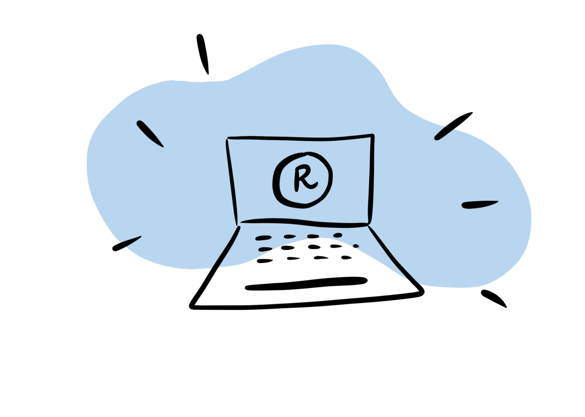

Photo by <a href="https://unsplash.com/@corina?utm_source=unsplash&utm_medium=referral&utm_content=creditCopyText">corina ardeleanu</a> on <a href="https://unsplash.com/?utm_source=unsplash&utm_medium=referral&utm_content=creditCopyText">Unsplash</a>

We recently announced Academy, a new educational experience that my colleagues and I have been building for teams to learn data science in the most efficient way possible. If you've been meaning to learn R, you can try Academy for yourself as an individual enrollee through this summer's <a href="https://www.rstudio.com/conference/2022/workshops/intro-to-tidyverse/" target = "_blank">rstudio::conf's workshop, Introduction to the Tidyverse</a>.

Academy gets all learners up and running with data science quickly – whether you're new to R or new to programming. I'm a data science educator on the team, and for the past couple years we've been working on designing custom curricula, mentoring data scientists, and building a premier learning platform. I'd like to share what I think makes this training experience the way learning *should be*.

Consider learning a language – whether spoken or coded – to master it,  you need: 

* **Real-world practice.** This has to happen from the start. You need to _apply_ facts to develop a lasting skill. This means working on tasks that encourage you to experiment, make mistakes, and then course-correct. 

* For a practice regimen to be successful, you need a system in place that allows you to get **frequent, meaningful feedback** so that the challenges you tackle are fruitful and not overwhelming.

* And lastly, if you want any of the data science skills that you learn to stick, you have to ensure that the cycle of real-world **practice and feedback happens repeatedly and consistently** over a long period of time. If you don't use it, you lose it!

Academy brings the best of these elements together into a single training experience that more closely resembles a data science **apprenticeship.** Here are the key pillars: 

1. **Projects**

Everything in Academy is centered on applying new skills to a data science **project**. As a learner, your project is built to be relevant to your specific industry, and it's designed to teach you the very skills that you'll need in your day-to-day work. Each project walks you through a full cycle of  data analysis –  from importing the data to publishing a final report of your findings.

How do you learn what you need to complete the project? This brings us to…

2. **Lessons**

We have written a library of interactive lessons that cover data science fundamentals. You'll work through a set of lessons each week asynchronously, completing dynamic exercises along the way.  Each exercise has customized feedback, specific to your answers. Going through Academy lessons feels more like a conversation – you explore, experiment with code, and then get explanations and next steps to try.

3. **Project milestones**

After completing lessons, you're ready to take on the project milestone. Milestones are bite-sized pieces of a larger data science project. They contain an artifact, like a plot or table that's been made using the project data. 

You'll get one week to apply the skills you've learned in lessons and recreate the milestone. But you have a second milestone task, too – you'll extend the project milestone by modifying it or adding to it, often using something new about R that you've explored on your own – i.e., using something *not* in the lessons. This part is especially important because it's how you practice teaching yourself new R skills – a skill in and of itself that must be learned to become a competent coder.

Each week you'll receive new milestones that build on each other and add to your data science repertoire.

Milestones can be open-ended assignments, and you might think that this could run the risk of overwhelming the beginner data scientist.  To remedy this, we provide the next piece of Academy.

4. **Mentor access**

In order to ensure that you feel well-supported and guided throughout the open-ended aspects of the project (and throughout the apprenticeship, in general), you'll have the opportunity to meet weekly with an Academy mentor over a Zoom call. The mentor provides tailored advice about what you're doing well or what you could improve --- much like a personal trainer would.

But this is only one of the sources of support you receive…

5. **Group sessions**

You'll also have accountability and social support from peer groups at group sessions. As an Academy student, you go through the apprenticeship in small groups, usually 5-7 peers from your company.

Each week, you meet all together to take turns presenting their project work and customizations from the week. This is an opportunity to learn new things and get feedback from one another. This small-group setting makes the learning experience more personal, social, and unique.

6. **Daily Practice**

The final pillar of Academy is daily practice. To keep up the regular cycle of practice and feedback to build long-lasting skills, we are developing an extensive library of practice drills. And we make it easy to squeeze in some practice and regularly drill the concepts you most need to review.  

All of these pieces are what make Academy a tailored and effective training experience for learning data science. 

How can you try out Academy? If you're part of a corporate team, you can get in touch by visiting our <a href="https://www.rstudio.com/academy/" target = "_blank">homepage</a>. But if you're an individual who wants to skill up,  there's currently only one way to participate: this year, we're offering a special opportunity to enroll through the <a href="https://www.rstudio.com/conference/2022/workshops/intro-to-tidyverse/" target = "_blank">rstudio::conf(2022) workshops</a>. The Introduction to the Tidyverse workshop will be taught as a 6-week Academy course, with two in-person days during the conference. 

It's an exciting time to be learning data science and we're excited that Academy can now be a part of your coding journey! Hope to work with you soon!
