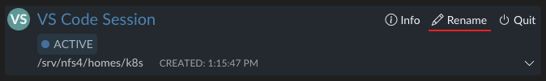
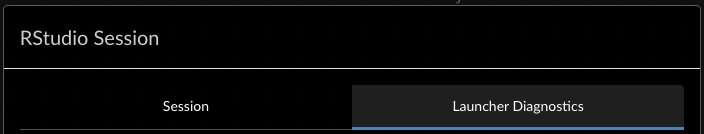
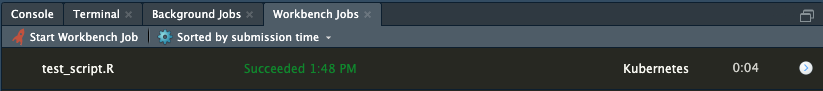
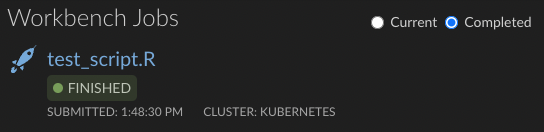
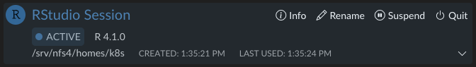
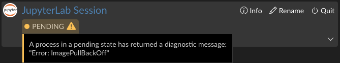
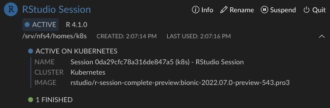
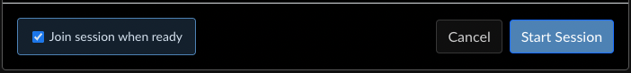
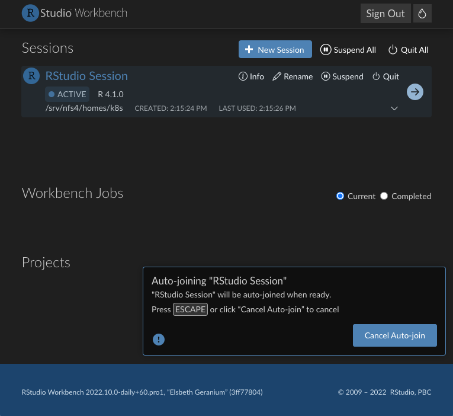

## Where it all began

Sometimes it takes just a passing comment to inspire a mountain of change. For this effort, it began with a discussion focused around addressing "confusing status differences on the homepage." A greater collection of issues was also identified as being caused by these "status differences." As we began to dig deeper into making the necessary changes that would resolve this user experience problem, we noticed that other changes would be required in order to properly address it.

We set out to solve several critical goals with this project:

* Improve consistency between statuses wherever the homepage presents them to the user
* Update the back end to provide a reliable and responsive source of truth for session information
* Refine the session creation process to allow for more predictable session launches
* Rename ambiguous or imprecise usages of the term "Job(s)" that could be confused with other features in the IDE or even the Homepage itself

## The Back End

The server received several major improvements to its communication with both the Homepage and sessions. Most notably, the server now tracks the session status explicitly, and updates it directly. Before this change, the Homepage would "assemble" a session's status based on several attributes, which would occasionally display unexpected results in edge cases. With the new approach, the Homepage displays exactly what the server reports.

Sessions now send an update to the server when they become active, which makes it possible to know with much greater accuracy when the session has become ready to use. We have leveraged this to vastly improve the [auto-join](#auto-join) functionality for new sessions.

Additionally, changes made to _how_ and _when_ we store session metadata also made it possible to rename VS Code and Jupyter sessions (or any other non-R session).

## The Front End

### Renamed Elements

Throughout the IDE and the Homepage, mentions of "Jobs" have been carefully renamed in order to create a clear distinction between their functionality and their associations. 

The "Jobs" tab in the session information modal has been renamed to "Launcher Diagnostics" to better illustrate that these are processes running via the Launcher in support of the session itself. A "Job" better describes a unit of work launched from the IDE.

In the IDE, all instances of "Local Jobs" are now called "Background Jobs." The term "background" clarifies how and where the job is running in relation to the R session itself.

In the IDE and on the Homepage, we have made references to "Jobs" consistent with each other. In the IDE, "Launcher Jobs" are now called "Workbench Jobs" to make their association with the Workbench system clearer. On the Homepage, the section that was previously titled "Jobs" is now titled "Workbench Jobs."

Now, when you run a Workbench job, an entry appears in the "Workbench Jobs" section on the Homepage, as expected.

### Status Indicator

The status indicators throughout the Homepage have been changed to share visual consistency and use more apparent colors. For the session entries on the Homepage, a tool tip has been added on hover that shows a brief description of that status.

This tool tip will also display diagnostic messages, if applicable, when the session is pending. You no longer have to open the session information and check the Launcher Diagnostics tab in order to see why the session is stuck in a "pending" state.

### Information and UI Feedback

With our back end communication changes, the homepage is more responsive to launcher process status updates, and it will now try to obtain the session status as soon as it observes a launcher process status change. For operations like launching sessions, in which the session quickly (or slowly depending on server capacity) progresses through multiple statuses, you can now see these on the Homepage. For VS Code and Jupyter sessions, the entire launch sequence is now visible.

User-initiated actions like "Suspend" or "Quit" provide immediate visual feedback while the server performs the operation remotely. When you click on either, there is no delay between the action and the response. Once the Homepage receives the updated status from the server, it can then sync its own state with the state reported by the server.

A drop-down section has been added to session entries which quickly summarizes the launcher processes associated with that session. For sessions in the "Active" state, we show a more detailed list. Clicking any of these entries will automatically open the "Info" modal and scroll to the most recent corresponding process in the "Launcher Diagnostics" tab.

### Auto Join

Another important change was the re-design of the auto-join functionality when launching sessions. Previously, this was enabled by default, but only when the session launched within a specific time window. For Local Launcher, this often worked, but for the Slurm or Kubernetes plugins, for which session launches can take many minutes depending on server and network conditions, this led to confusing behavior. Sometimes you would be taken into your new session, other times you would be left on the homepage.

We have provided an opt-in option (enabled by default) in the launcher dialog that gives you the ability to either automatically join a session when it becomes active, or stay on the Homepage. When auto-join is enabled, an arrow indicator will appear that clearly marks the pending session. 

There is no time limit for this; a session will be joined once it reports that it is ready after any length of time, unless the user cancels the pending auto-join with the `Escape` key or by clicking "Cancel Auto-join" in the pop-up. The pop-up will transition from a blue "Info" to a yellow "Warning" after 10 seconds, and eventually to a red "Critical" after 30 seconds. For Kubernetes setups, this is likely to occur when pulling images.

These features are available in the newest version of Workbench included in version 2022.07.01 "Spotted Wakerobin." Installing the upgrade on your servers will bring these improvements to your users whenever they next log in to Workbench. In the coming months, Workbench will be re-branded with our new company name, so keep an eye out for that as well!
