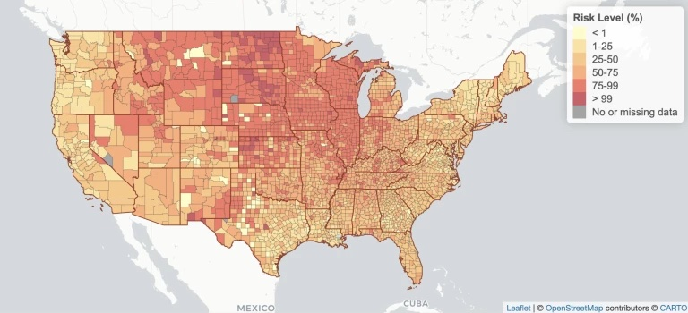

<a href="https://www.youtube.com/watch?v=BmpnfLLrr4w." target="_blank">Full GA Tech Spotlight Video on YouTube</a>

Data visualization is fundamentally an act of communication. While many discussions focus on the technical aspects of creating visualizations, communicating your insights in a clear, relevant and accessible way is essential.

The Georgia Institute of Technology team shared some key lessons, based on their experience building the <a href = "https://covid19risk.biosci.gatech.edu/" target="_blank">COVID-19 Event Risk Assessment Planning Tool.</a> These lessons apply to visualizations across many different industries and use cases, whether you are communicating to a handful of executives at your company or out to the world.

* Make sure that you **have a specific question in mind.** What is the question that your app will answer? Think about who your audience is going to be and what they would use this for. For the COVID-19 Event Risk Assessment Planning Tool this question was “what is the risk level of attending an event, given the event size and location?”   
* **View your audience through a lens of empathy.** Think about metrics that people can really get a grip on and visualize. For example, the risk of attending a local event with 100 people in your own town vs. communicating this as cases per 100,000 people. If you want to communicate something that’s critical to the public, put it in the right terms. 
* **Balance the straightforwardness** of your visualization. You don’t have to anticipate every single question. With every feature or piece of information included, ask yourself if this supports your overall point?  
* **Keep the lines of communication open** with your users. If you share a visualization, make sure that people have a clear way to contact you (email, Twitter, LinkedIn) with questions or feedback. Their team made an intentional effort to be available for local news particularly. They were responsive to the kinds of decisions people were making and adjusted the app to match their needs with event sizes for example. 

In July 2020, Georgia Institute of Technology faculty, scientists, GIS specialists, and graduate students launched a tool that provided real-time, localized information on the estimated risk of COVID-19 exposure by attending an event. 

>“Over a year ago we had been concerned as early as March 2020 that there were generally underappreciated risks associated with attending even medium to small events. Given that cases were spreading, it was hard to figure out how many cases there really were. All these questions of whether or not the cases were being documented, (and we were fairly certain they were under ascertained, underdocumented) **we wanted to translate that in some way to communicate that out to the world** - individuals as well as decision makers”

>-Joshua Weitz PhD, Professor, Biological Sciences & Physics, Georgia Institute of Technology  

Their team presented this risk out to the world through an interactive Shiny application, which allowed users to determine their own risk of encountering someone with COVID at an event in their given location. 

<a href="https://www.youtube.com/watch?v=BmpnfLLrr4w." target="_blank">Full spotlight video</a> and <a href="https://covid19risk.biosci.gatech.edu/", target="_blank">COVID-19 Event Risk Assessment Planning Shiny App</a>

What if you were planning on having dinner at a restaurant with 20 people in Ontario, NY? A small wedding with 50 people in Teton, WY? Deciding to go back to your office?

The narrative became personal to the individual user by answering their specific question in a direct metric that they could not only understand but share with others.

In <a href="https://www.youtube.com/watch?v=BmpnfLLrr4w." target ="_blank">talking with the GA Tech team</a>, it was clear that their empathetic perspective of the audience and communication-focus was crucial to successfully sharing their insights with event planners, policy makers, various news outlets and individuals - adding up to ultimately over *8 million* unique users around the world. 

Thank you so much to the team at GA Tech for sharing their story with me:   

* **Joshua Weitz PhD**, Professor, Biological Sciences & Physics, Georgia Institute of Technology
* **Aroon Chande PhD**, Scientific Advisor at the Applied Bioinformatics Laboratory
* **Clio Andris PhD**, Assistant Professor, City and Regional Planning & Interactive Computing, Georgia Institute of Technology
* **Stephen Beckett PhD**, Research Scientist, Biological Sciences, Georgia Institute of Technology
* **Seolha Lee**, Graduate Research Assistant, City and Regional Planning, Georgia Institute of Technology
* **Quan Nguyen**, Undergraduate Research Assistant, Biological Sciences, Georgia Institute of Technology

Source: GA Tech,<a href="https://covid19risk.biosci.gatech.edu/", target="_blank"> COVID-19 Event Risk Assessment Planning Tool</a>

I’ve included a few other helpful communication resources below:  

* **John Burn-Murdoch** | RStudio Conference Keynote | <a href="https://www.youtube.com/watch?v=L5_4kuoiiKU" target = "_blank">Reporting on and visualising the pandemic</a> 
* **Sophie Beiers** | RStudio Conference Talk | <a href="https://www.rstudio.com/resources/rstudioglobal-2021/trial-and-error-in-data-viz-at-the-aclu/" target ="_blank">Trial and error in data vis at the ACLU<a> 
* **Charlotta Früchtenicht, Diego Saldana, Mark Baille, Marc Vandemeulebroecke** | Webinar | <a href="https://www.rstudio.com/resources/webinars/effective-visualizations-for-data-driven-decisions/?_ga=2.39720929.395829809.1631126074-1690468391.1610381620" target="_blank">Effective Visualizations for Credible, Data-Driven Decision Making Presented by Novartis and Roche</a>
* **Jason Milnes** | Blog Post | <a href="https://blog.rstudio.com/2020/04/16/effective-visualizations-for-credible-data-driven-decision-making/" target="_blank">Effective Visualizations for Credible, Data-Driven Decision Making</a>

