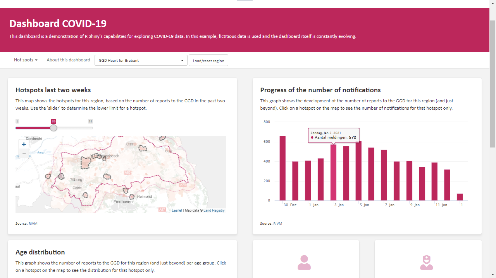
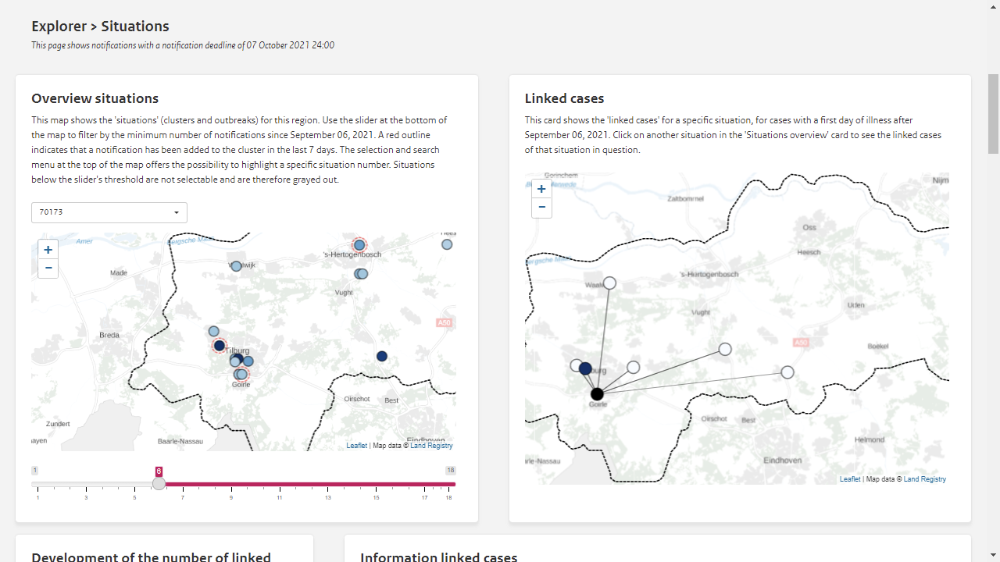
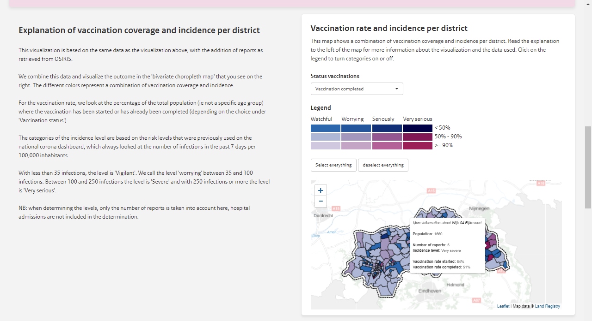
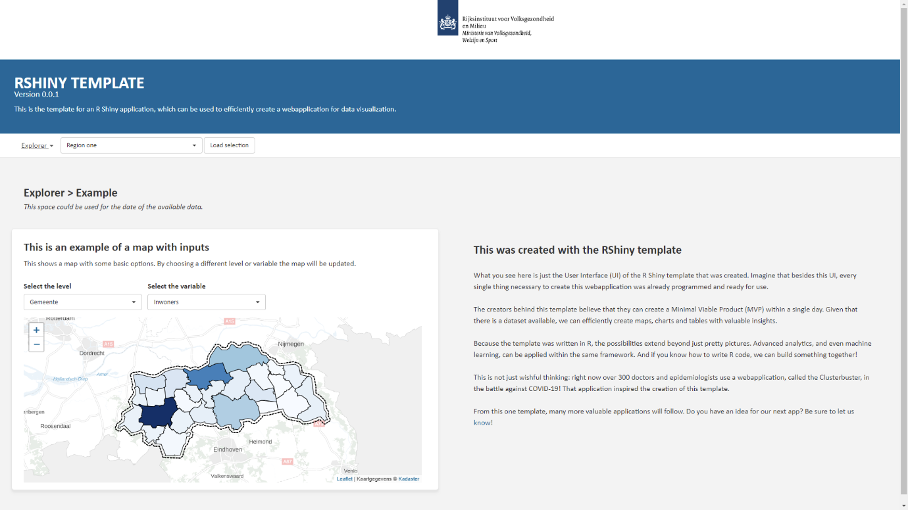

As 2020 closed, Eveline Geubbels, former COVID-19 Surveillance Coordinator at the Dutch National Institute for Public Health and the Environment (RIVM), faced an important question: How can we help the public health doctors and epidemiologists that work within the 25 Dutch regional health services gain insight into clusters of COVID-19 cases?

Now ten months into 2021, RIVM has an answer. For the past seven months, a Shiny web application called the Clusterbuster has been providing valuable information to hundreds of doctors and epidemiologists on the facts and figures surrounding COVID-19 on a daily basis.

##  First Steps in Creating a Valuable (and Safe) Application Fast

Eveline tasked Sjoerd Wierenga, a recently hired data scientist, to help RIVM answer this question. Sjoerd learned that the organization had experience with R and Shiny and was working on providing secure access to their applications. His advice was to move forward with creating a COVID-19 web app with these tools. Together with his colleague Jossy van den Boogaard, a medical epidemiologist, they quickly set up an advisory board made up of doctors and epidemiologists to outline further development.

> "At that time, the COVID control teams at the MHSs [Municipal Health Services] were struggling with keeping an eye on newly developing clusters in the midst of the ever-increasing COVID-19 caseload. The members of the advisory board were therefore keen to create a tool that could help them with tracking (and tackling) clusters."

> ---Jossy van den Boogaard

Team Clusterbuster recruited more data scientists within a few weeks. Senior Data Scientist Job Spijker tackled one of the major prerequisites in getting an application into production safely and efficiently: creating a deployment stack for the application and the data.

> "Because we were working with sensitive data, we preferred to use on-premise solutions. Thanks to the open-source nature of many RStudio products, it was a breeze to implement our own stack on the institute's infrastructure."

> ---Job Spijker

At the same time, many others were working behind the scenes doing risk analysis, privacy assessments, infrastructure buildouts, and much more. After a couple of months, everything seemed to fall into place. Thanks to the advisory board, the team was confident that they were sharing valuable insights. With the help of supporting staff from legal, IT, and others, they could proceed knowing that they could share the insights in a safe and responsible way.

<caption>
*The first prototype for a COVID-19 Shiny application by Sjoerd Wierenga, which was hosted on shinyapps.io. This screen shot shows synthetic data. The text in the image was translated from the original Dutch using Google Translate.*
</caption>

With the major prerequisites met and the outcomes of weekly advisory board meetings to guide them, the team created a Shiny web application that quickly generated valuable insights.

## Scaling Up Impact

> "We operate with the philosophy that the impact we generate is a function of both quality and volume. So: numbers matter!"

> --- Sjoerd Wierenga

The application was developed for (and partly by) professionals with a background in infectious disease control. In March, the first group of around 30 professionals received access to the application. The group grew to 200 over the following months. At the time of writing, Team Clusterbuster provides access to close to 400 doctors, epidemiologists, and other front-line professionals, and they add new users almost every day.

Because the team operates with the philosophy that the impact they generate is a function of both quality and volume, these numbers matter! More users continue to request access to the application to:

1. Draw insights from new data
2. Create custom visualizations
3. Incorporate user feedback

Let's look at how the team achieved each of these goals.

**1. Draw insights from new data**

The Clusterbuster app has evolved with the pandemic. The team started off visualizing only reported cases, but as the pandemic spread, they added new data such as the geographical distribution of clusters. In the last couple of months, the team has also incorporated data from the Dutch National COVID-19 Immunization Program.

 <caption> *A dashboard page displaying the geographical distribution of linked cases for a given situation. This screen shot shows synthetic data. The text in the image was translated from the original Dutch using Google Translate.* </caption>

**2. Create custom visualizations**

The Clusterbuster combines reliable data sources and visualizes them in new ways. One visualization combined the vaccination rate and the number of reported infections with an interactive bivariate geographical representation. This visualization allowed epidemiologists to gain insight into which neighborhoods lagged behind in vaccinations while potentially being at risk because of an increase in reported cases.

> "By using R Shiny, we had a lot of flexibility in creating insights. We weren't limited to off-the-shelf functionality --- we could be as creative as our coding skills allowed! Linking visualizations and allowing for a lot of interactivity really helped with making the advisory board's ideas come to life."

> --- Jolien ten Velden

<caption>
*Showing a combination of the vaccination rate and reported cases with a bivariate choropleth map. This screen shot shows synthetic data. The text in the image was translated from the original Dutch using Google Translate.*
</caption>

**3. Incorporate user feedback**

Team Clusterbuster put a lot of thought into realizing an application that users actually want to use. In addition, they often received feedback on user friendliness and overall look of the app. This resulted in word of mouth being the biggest driver of more professionals seeking authorization.

Thanks to the work of Marjanne Plasmans, who created a separate Shiny application to track the usage of the Clusterbuster, the team knows that the application is being accessed hundreds of times each week. One of the users, a Public Health Doctor for the MHS VGGM, describes how the application helps them in monitoring COVID-19:

> "The Clusterbuster is very useful in maintaining an overview of clusters and outbreaks. We use certain visualizations to track where cases are on the rise, and how this relates to specific concerns. For example: for our daily reports we use the Clusterbuster's insights to monitor outbreaks in areas with a relatively low vaccination coverage, or clusters in nursing homes that require our attention."

> ---Patrick van Schelven

## Future Developments

Job Spijker takes pride in what he and his colleagues achieved during the COVID-19 crisis: implementing the technology to make Shiny applications available for professionals while complying with strict privacy regulations. Using this experience, Job, Sjoerd, and their colleague William Schuch are actively creating templates and procedures to facilitate efficient creation of future applications.

The development team plans to update Clusterbuster to adapt to the evolution of the pandemic. More options will be added in the upcoming months to help with the (hopefully) final push in the battle against COVID-19. While the team keeps on improving the application and providing access to more authorized users, they also philosophize about the post COVID-19 potential.

> "By using open source software and a code first approach we can drastically reduce the 'production costs' of valuable insights. This is, in my view, one of the key aspects in achieving more data driven public policy making."

> ---Sjoerd Wierenga

<caption>
*The template is based on the Clusterbuster, making it possible to create new ‘Clusterbusters’ quickly and easily.*
</caption>

Finally, the team is actively having conversations about making the code open source. This could facilitate co-creation of future applications, something the RIVM has <a   href="https://www.werkenvoornederland.nl/organisaties/ministerie-van-volksgezondheid-welzijn-en-sport/via-open-source-keken-slimste-developers-mee-bij-het-maken-van-corona-app" target = "_blank" rel = "noopener noreferrer">recently experienced </a>. The team considers it a way of giving back to the open source community, without which the Clusterbuster would not have existed in the first place.

We at RStudio would like to thank the following professionals for their time in developing this post:

-   Sjoerd Wierenga, Data Scientist and Team Lead, Centre for Infectious Disease Control, RIVM
-   Jossy van den Boogaard, Medical Epidemiologist, Centre for Infectious Disease Control, RIVM
-   Job Spijker, Senior Data Scientist, Environment and Safety, RIVM
-   Jolien ten Velden, Data Scientist and Researcher, GGD Hart voor Brabant
-   William Schuch, Geo Information Specialist, Mathematics, Data and GIS, RIVM
-   Marjanne Plasmans, Researcher, Public Health and Health Services, RIVM
-   Patrick van Schelven, Public Health Doctor, VGGM
