<caption>
Photo by <a href="https://unsplash.com/@clayton_cardinalli" target="_blank" rel="noopener noreferrer">Clayton Cardinalli</a> on <a href="https://unsplash.com/?utm_source=unsplash&utm_medium=referral&utm_content=creditCopyText">Unsplash</a>
</caption>
<br>
<br>
<div class="lt-gray-box">
This is a guest post from Taylor Rodgers, Senior Data Scientist and project lead at PKGlobal. He's written extensively on data science topics, including the book *<a href="https://www.taylorrodgers.com/store/p4/how-to-manage-successful-data-team.html" target = "_blank" rel = "noopener noreferrer">Data Work: A Jargon-Free Guide to Managing Successful Data Teams</a>*. His next book, *<a href="https://www.taylorrodgers.com/store/p5/beginner-r-programming-plain-english.html" target = "_blank" rel = "noopener noreferrer">R Programming in Plain English</a>*, is also available for free in beta.
</div>

### Introduction

At <a href="https://pkglobal.com/" target = "_blank" rel = "noopener noreferrer">PKGlobal</a>, we had a manufacturing client that wanted a Shiny app for their engineers and plant workers. This Shiny app would allow their employees, none of whom are data scientists or machine learning experts, to use a machine learning algorithm with over 60 inputs to make a prediction. The prediction would allow them to use less material and significantly cut down on costs. (We're talking tens of thousands of dollars a week!)

This posed a challenge though. How do you democratize an ML model to manufacturing workers with so many parameters?

The solution was a Shiny app with an intuitive interface. One that presented the parameters in roughly the same way they would see them on the factory floor and allowed them multiple options for how they inputed those values.

This project wound up using Shiny's amazing strength and flexible functionality. Packages, such as shinyMatrix and plotly, provided the end-user the ability to determine their manufacturing inputs the way they wanted. Specific Shiny functions, such as `observeEvent` and `reactive`, ensured these methods could communicate with one another without the "wonkiness" that happens with less flexible tools, such as PowerBI or Tableau.

*Please note that much of this code is based on online resources, such as Carson Sievert's Stack Overflow <a href="https://stackoverflow.com/questions/47280032/draggable-line-chart-in-r-shiny" target = "_blank" rel = "noopener noreferrer">comment</a> and Hadley Wickham's <a href="https://mastering-shiny.org/" target = "_blank" rel = "noopener noreferrer">Mastering Shiny</a>, as well as package-specific documentation. This article simply ties these resources together to teach you how to use them and why they work.*

### So What Did This Tool Look Like?

Our client gave us their blessing to showcase this Shiny functionality, but they did request that we not share the details on what the model predicted or their company name.
                                                                                  We can, however, reveal what these inputs looked like. If you look below, you'll see an animation showcasing this functionality.

<center> 
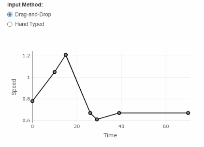{width=50%}
</center>

There are a lot of details here, so let me break them out one-by-one.

Within the application, we showed a time-series plot with seven points. Each point represents an input (speed) at a given time in the manufacturing process. All points were required in the final algorithm.

<center>
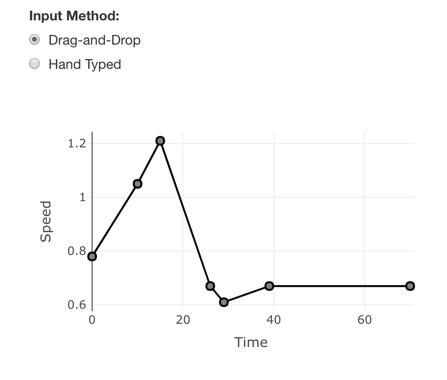{width=50%}
</center> 

The user can drag and drop these plots, which then changed the output on the algorithm. (The algorithm isn't included in this demo.)

Most users liked this option for inputting parameters. However, some wanted to get more specific. They wanted to *hand type* their inputs. That's why we gave them the option to toggle to a `matrixInput`.

<center> 
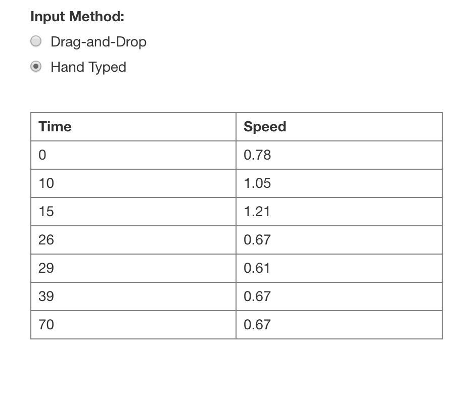{width=50%}
</center>

And here's where things started to get complicated.

We had to ensure both input methods would sync up with one another. For example, if the end-user altered point 2 on the drag-and-drop plot, then that same value must appear on the matrix input. You can see this on the GIF below. I move point 2 on the graph and we find that same value appears on the matrix. When we change point 2 on the matrix, the graph updates to reflect that change.

<center> 
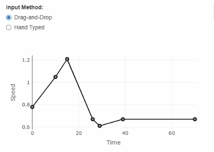{width=50%}
</center>
  
These input methods also had to account for user error. The algorithm had specific rules the user had to follow. The first and last time x-axis value had to be 0 and 70, respectively. We had to find a way to enforce those rules to make sure the algorithm worked correctly. 

So to recap, we needed an app that would accomplish the following:
  
1. Allow the user to drag-and-drop plot points to feed an algorithm
2. Allow the user to hand type those same points into a matrix that would feed an algorithm
3. Ensure the plot and the matrix would match one another
4. Ensure that the user couldn't break the app by not following "the rules"

Believe it or not, there was even more functionality included. We actually had *six* of these plot / matrix combos. We also had to show the nearest neighbor, depending on which tab the user selected. And that wasn't all either. We also had to give the ability to select a different nearest neighbor without breaking the functionality we built!
  
I won't cover those additional features in this how-to document. The good news is that they are largely an extension of the topics we'll cover in the article below.

### What Packages and Functions Did This App Use?

Delivering this functionality required the following packages:
  
```{r packages_required, eval = FALSE}
install.packages("shiny")
install.packages("tidyverse")
install.packages("plotly")
install.packages("shinyMatrix")
```

We made heavy use of the functions `observeEvent` and `reactive`. I suggest reviewing this <a href="https://shiny.rstudio.com/articles/reactivity-overview.html" target = "_blank" rel = "noopener noreferrer">article</a> on the subject to better understand the concept. You don't need to be an expert on these functions, though. My article below will provide a good demo on how to use them.

### Building the UI

Down below, you'll see the "skeleton" of the app we'll build. This will include the packages, data sets, and UI that you'll need. I also include three table outputs that will help illustrate how the app handles the values within the `matrixInput` and `reactiveValue` functions.

To get started, go into RStudio and create a new Shiny app. Paste the code below into the app.R file of your Shiny app:
  
<details>
<summary>app.R</summary>
```{r step_one, eval = FALSE}
### Load packages
library(shiny)
library(tidyverse)
library(plotly)
library(shinyMatrix)

### Define default matrix
rateInputs_m <-
  matrix(
    c(0, 10, 15, 26, 29, 39, 70, 0.78, 1.05, 1.21, 0.67, 0.61, 0.67, 0.67),
    nrow = 7,
    ncol = 2,
    dimnames = list(NULL, c("Time", "Speed"))
  )

### Define UI
ui <- fluidPage(
  titlePanel("Plotly and Shiny Matrix Input Demonstration"),
  
  column(
    4,
    radioButtons(
      "toggleInputSelect",
      "Input Method:",
      choices = c("Drag-and-Drop" = "dragDrop", "Hand Typed" =
                    "handTyped")
    ),
    br(),
    conditionalPanel(condition = "input.toggleInputSelect=='dragDrop'",
                     plotlyOutput("speed_p", height = "250px")),
    conditionalPanel(
      condition = "input.toggleInputSelect=='handTyped'",
      matrixInput(
        "rateInputs_mi",
        value = rateInputs_m,
        class = "numeric",
        row = list(names = FALSE)
      )
    )
  ),
  column(8,
         tabsetPanel(
           id = "tabs",
           tabPanel(
             "Algorithm Tab",
             value = "algorithmOutput",
             column(3, br(),
                    tags$h4("Original Values"),
                    tableOutput("table1")),
             column(3, br(),
                    tags$h4("Matix Inputs"),
                    tableOutput("table2")),
             column(3, br(),
                    tags$h4("Reactive Values"),
                    tableOutput("table3"))
           )
         ))
)


### Define server logic
server <- function(input, output, session) {
  output$table1 <- renderTable({
    rateInputs_m
  })
  
  output$table2 <- renderTable({
    input$rateInputs_mi
  })
  
  output$table3 <- renderTable({
    req(rv$time)
    data.frame(rv$time, rv$speed)
  })
  
  # Creating Reactive Values
  rv <- reactiveValues()
  
}

### Run the application
shinyApp(ui = ui, server = server)
```
</details>

If you run the app, you may notice that altering the matrix input on the left-hand side only changes the table labeled "Matrix Inputs." The "original" table is the one defined at the beginning of the app.R script. shinyMatrix uses those inputs, but starts to function as its own object once the app runs. 

You can see this demonstrated below. Notice that we change the speed in the third row and only the value updates on the "Matrix Input" table on the right.

<center> 
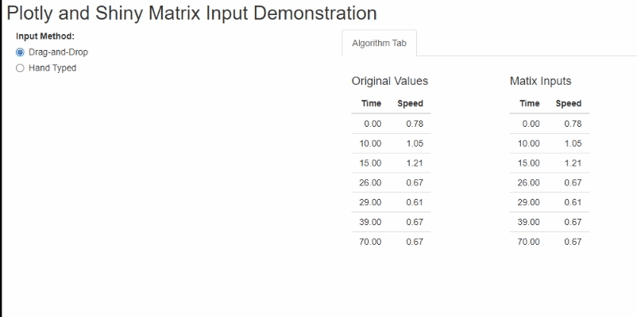{width=70%}
</center>

This is an important distinction to make. We'll end up adding a third object that will operate in the background. Like the shinyMatrix, this will also use the original matrix defined at the beginning of our app, but become independent later.

One other thing I want you to notice are the conditional panels (`conditionalPanel`) in the UI script.

```{r step_three, eval=FALSE}
conditionalPanel(condition = "input.toggleInputSelect=='dragDrop'",
                 plotlyOutput("speed_p", height = "250px")),
conditionalPanel(
  condition = "input.toggleInputSelect=='handTyped'",
  matrixInput(
    "rateInputs_mi",
    value = rateInputs_m,
    class = "numeric",
    row = list(names = FALSE)
  )
)), 
```

These conditional panels make it possible to toggle back and forth between the two input methods we'll use later in the app.

### Building the Plotly Drag-and-Drop Inputs

Now that we have our UI, we can add to our server function. Within this server function, we'll build a set of smaller functions that will coordinate with one another to produce the functionality we want. These functions include `reactiveValues`, `renderPlotly`, and `observeEvent`.

* `reactiveValues` stores a list of values that we'll use as both a source and destination in the other two functions.

* `renderPlotly` allows us to display a plotly graph within our application and will use the reactive values as its data.

* `observeEvent` observes the end-user as they interact with the application. We will use this function to update the reactive value list, but only if the user updates the matrix input or moves a point on the plotly graph.

If you look below, you can see how these will interact. We store the original matrix inputs in the reactive value function. The user can update either the plotly graph or the matrix input. We'll have two event observation functions that will update the reactive values with the new inputs.

<center> 
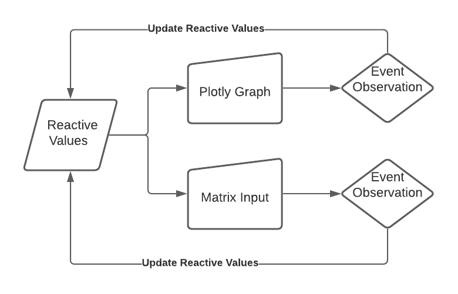{width=50%}
</center>

This graph is a somewhat simplistic representation of the steps we'll be programming. But overall, it highlights what we'll be working towards.

### Creating the Reactive Values

The first thing we'll add is the reactive value function. I already have an empty reactive function in the app.R script shared earlier. Go ahead and adjust the `rv` object to match what you see below.

```{r step_four, eval=FALSE}
# Creating Reactive Values
rv <- reactiveValues(
  time=rateInputs_m[,1],
  speed=rateInputs_m[,2]
)
```

In this function, we pulled the `rateInputs_m` matrix defined at the top of our app.R script and assigned each column to its respective name. So column one (`rateInputs_m[,1]`) is time and column two (`rateInputs_m[,2]`) is speed. The functions we'll add later will call upon this reactive value list, rather than the original `rateInputs_m` matrix.

If you run the app, you should see values populate in the "Reactive Values" table on the far right.

<center> 
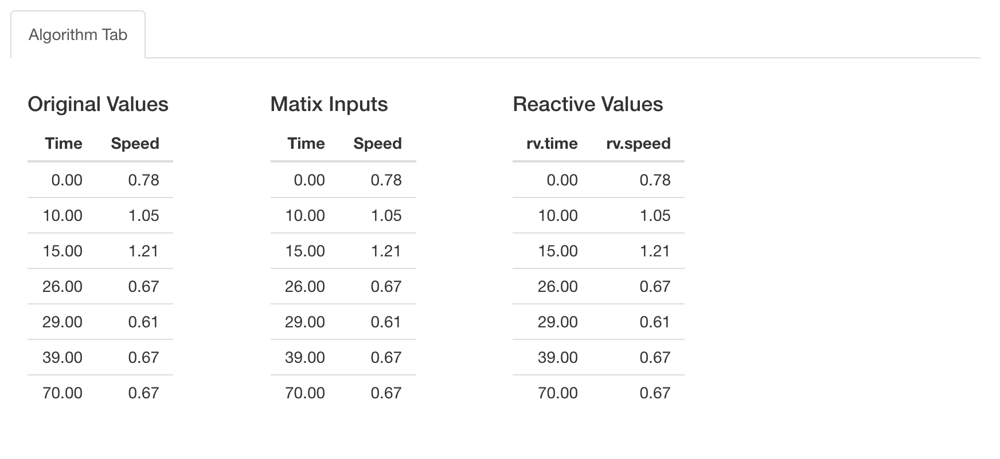{width=70%}
</center>

These values won't change yet, but it's important to note we now have three matrices in the background: the original matrix, the shinyMatrix, and now these reactive values.

There are a few other nuances I want to point out as well.

First, pay close attention to the parentheses `(...)` surrounding the `reactiveValues` function in the code above. If you read the documentation (`?reactiveValues`), this function operates more like a list.

That means using the `({...})` notation will prevent this reactive value list from working. Instead, we'll need to use `(...)` notation.

The second thing is the use of the `=` sign rather than `<-` to assign object names. Normally, you could assign object names with `<-`, but since these are not individual objects *per se*, but items within a list-like function, we'll need to use the equal `=` sign. 

The third thing is the use of `,` between each list item. Unlike the reactive functions with a Shiny app, this must be comma-separated.

### Creating the renderPlotly Function

Next we'll add our reactive function for plotly. We start with the `renderPlotly` function:
  
```{r step_five, eval=FALSE}
# Speed 1's Plot and Table and Feedback
output$speed_p <- renderPlotly({
  
})
```

We'll need to alter this later, but to start, let's just add the full `plot_ly` function to see what it looks like:
  
```{r step_six, eval=FALSE}
# Speed 1's Plot and Table and Feedback
output$speed_p <- renderPlotly({
  plot_ly() %>%
    add_lines(x = rv$time,
              y = rv$speed,
              color = I("black")) %>%
    layout(
      xaxis = list(title = "Time"),
      yaxis = list(title = "Speed"),
      showlegend = FALSE
    )
})
```

This will plot the reactive values defined earlier. We can see that we add lines for the x-axis and y-axis, which are `rv$time` and `rv$speed` respectively. We also do some minor formatting items with the `layout` function.

Now here's where things start to get tricky. If you remember, we want the end-user to drag-and-drop these plot points to determine how they feed into the algorithm. And we'll need to ensure the reactive value list updates with the new values after they move one of those points.

Let's first add the ability to move the plot points. We can do this with the `config` function, as seen below:

```{r step_seven, eval=FALSE}
# Speed 1's Plot and Table and Feedback
output$speed_p <- renderPlotly({
  plot_ly() %>%
    add_lines(x = rv$time,
              y = rv$speed,
              color = I("black")) %>%
    layout(
      xaxis = list(title = "Time"),
      yaxis = list(title = "Speed"),
      showlegend = FALSE
    ) %>%
    config(edits = list(shapePosition = TRUE),
           displayModeBar = FALSE)
})
```

If we try to run the app now, we still wouldn't be able to move the lines on the plot. The reason is that we only allowed for "shapes" to be moved on the plot. We still need to create our shapes.

If you look at the code below, you can see I added a function called `map2`. We can include these shapes by adding it to the `layout` function near the bottom.

```{r step_eight, eval=FALSE}
# Speed 1's Plot and Table and Feedback
output$speed_p <- renderPlotly({
  speed_c <- map2(
    rv$time,
    rv$speed,
    ~ list(
      type = "circle",
      xanchor = .x,
      yanchor = .y,
      x0 = -4,
      x1 = 4,
      y0 = -4,
      y1 = 4,
      xsizemode = "pixel",
      ysizemode = "pixel",
      fillcolor = "grey",
      line = list(color = "black")
    )
  )
  
  plot_ly() %>%
    add_lines(x = rv$time,
              y = rv$speed,
              color = I("black")) %>%
    layout(
      xaxis = list(title = "Time"),
      yaxis = list(title = "Speed"),
      showlegend = FALSE,
      shapes = speed_c
    ) %>%
    config(edits = list(shapePosition = TRUE),
           displayModeBar = FALSE)
})
```

Within the `map2` function, I defined a list of arguments that will create the circles we can move. This then maps those arguments to both `rv$time` and `rv$speed`, the values from our reactive value list.

By referencing this object in the `layout` function near the bottom of this script, we will see those points appear on our Shiny application.

There's one last thing to add to the `plot_ly` function before moving forward. We will want to observe interactions on this plot by the end-user. For that reason, we need to give it a "name" that we can reference later. So we'll add the argument `source="speed_s"` and you can see that in the final code for this section below:
  
```{r step_nine, eval=FALSE}
# Speed 1's Plot and Table and Feedback
output$speed_p <- renderPlotly({
  speed_c <- map2(
    rv$time,
    rv$speed,
    ~ list(
      type = "circle",
      xanchor = .x,
      yanchor = .y,
      x0 = -4,
      x1 = 4,
      y0 = -4,
      y1 = 4,
      xsizemode = "pixel",
      ysizemode = "pixel",
      fillcolor = "grey",
      line = list(color = "black")
    )
  )
  
  plot_ly(source = "speed_s") %>%
    add_lines(x = rv$time,
              y = rv$speed,
              color = I("black")) %>%
    layout(
      shapes = speed_c,
      xaxis = list(title = "Time"),
      yaxis = list(title = "Speed"),
      showlegend = FALSE
    ) %>%
    config(edits = list(shapePosition = TRUE),
           displayModeBar = FALSE)
  
})
```

Now let's run the app and move the dots around. The lines don't move with the dots, do they?

That's because the app doesn't know how to respond when we move a plot point. It's not updating the reactive list we made earlier. That's where the `observeEvent` function comes in handy.

### Creating the observeEvent for Plotly

Within Shiny, we can use either the `observeEvent` or `observe` functions to see how the end-user interacts with the app. Those functions can then make adjustments to the app, based on what code we add. 

As you can imagine, they have a wide-range of uses and they are something I suggest you get very good at doing if you want to build more Shiny apps. 

You can use both functions in relatively similar ways, but I like the `observeEvent` function myself.

Let's create our `observeEvent` function. Take the code below and add it to your `server` function in the Shiny app.

```{r step_ten, eval=FALSE}
observeEvent(event_data(event = "plotly_relayout", source = "speed_s"), {
  
})
```

Now there's two things I want you to pay attention to here. The first is the `event_data` function. This is a plotly function and allows us to specify which plotly event we want to observe. 

In this example, we want to know whether a "plotly_relayout" event occurred and whether it came from the plotly graph called "speed_s". If you recall, we had named the plotly graph we created earlier as "speed_s".

The second thing I want you to notice is where I placed the `event_data` function. I placed it between the first `(` and the first `{`. By placing the `event_data` function at this location and using "speed_s" as the source, the `observeEvent` function will proceed if there's an event associated with "speed_s". It will then execute the code enclosed within the `{...}` brackets.

Now with that out of the way, we can start filling in the interior of this `observeEvent` function. We'll add the same `event_data()` as earlier and we'll then sub-select specific values from it.

```{r step_eleven, eval=FALSE}
observeEvent(event_data(event = "plotly_relayout", source = "speed_s"), {
  # Speed 1 Event Data
  speed_ed <-
    event_data("plotly_relayout", source = "speed_s")
  speed_sa <-
    speed_ed[grepl("^shapes.*anchor$", names(speed_ed))]
})
```

There's two steps here. The first is determining the actual event data. I provide an example of what this looks like below:

<center> 
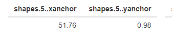{width=50%}
</center>

The problem with this function is sometimes it will display events unrelated to the ones we want. For example, sometimes it'll record a user adjusting the range on the plot, like you see below:
  
<center> 
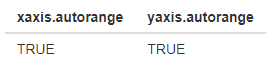{width=50%}
</center>

`speed_sa` helps us overcome this problem. It will only includes events with the word "shapes" in its column header. When it does include that word, the values will be the same as the `speed_ed` object above it.

<center> 
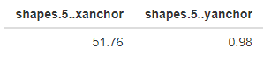{width=50%}
</center>

After we pull the new shape points, we need to do some additional data transformations. If you recall, we're updating the reactive values. However, there's seven rows we could update. How will Shiny know which row to update? 

The good news is that our event data includes a numeric value associated with the shape the user moved. Unfortunately, that value does not correspond to the row number. If you have seven values, like our app does, it will begin the count at zero. So instead of 1 through 7, we have 0 through 6. We can account for this by merely extracting the number from the column name and adding a 1 to it.

```{r step_twelve,eval=FALSE}
observeEvent(event_data(event = "plotly_relayout", source = "speed_s"), {
  # Speed 1 Event Data
  speed_ed <-
    event_data("plotly_relayout", source = "speed_s")
  speed_sa <-
    speed_ed[grepl("^shapes.*anchor$", names(speed_ed))]
  speed_ri <-
    unique(readr::parse_number(names(speed_sa)) + 1)
  
})
```

We'll also want to pull the new values associated with the new location of the plot points. That's what the `speed_pts <- as.numeric(speed_sa)` code added below accomplishes.

```{r step_twelve_two,eval=FALSE}
observeEvent(event_data(event = "plotly_relayout", source = "speed_s"), {
  # Speed 1 Event Data
  speed_ed <-
    event_data("plotly_relayout", source = "speed_s")
  speed_sa <-
    speed_ed[grepl("^shapes.*anchor$", names(speed_ed))]
  speed_ri <-
    unique(readr::parse_number(names(speed_sa)) + 1)
  speed_pts <- as.numeric(speed_sa)
  
})
```

Now we get to the fun part! We'll need to include some extra logic to take into account some of the rules we want in place.

The first rule is that we want to re-sort the dot plots. The second is to ensure that the x-axis value for the first and last point are always 0 and 70, respectively.

<center> 
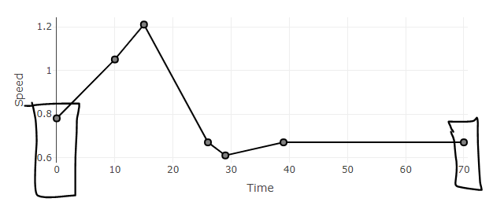{width=50%}
</center>

While there are probably several ways to implement these two rules, I found it easier to make a matrix to serve as a temporary home for our values. I could then alter this matrix the way I needed to ensure these rules stayed in place and limit the amount of "wonkiness" in the application.

To start this process, look at the additional lines of code I added below. You'll see the new matrix called "temp_matrix." All this does is record the values from the reactive values list and puts it in the temporary matrix.

```{r step_thirteen,eval=FALSE}
observeEvent(event_data(event = "plotly_relayout", source = "speed_s"), {
  # Speed 1 Event Data
  speed_ed <-
    event_data("plotly_relayout", source = "speed_s")
  speed_sa <-
    speed_ed[grepl("^shapes.*anchor$", names(speed_ed))]
  speed_ri <-
    unique(readr::parse_number(names(speed_sa)) + 1)
  speed_pts <- as.numeric(speed_sa)
  
  # Speed 1 Point Updates
  temp_matrix <-
    matrix(
      c(round(rv$time, 2), round(rv$speed, 2)),
      nrow = 7,
      ncol = 2,
      dimnames = list(NULL, c("Time", "Speed"))
    )
  temp_matrix[speed_ri, 1] <- round(speed_pts[1], 2)
  temp_matrix[speed_ri, 2] <- round(speed_pts[2], 2)
  
})
```

We then update the temporary matrix with the new values. We use "speed_ri", which is the "row index," to determine the proper row to update. We then use `speed_pts[1]` and `speed_pts[2]` to update the temporary matrix values with their new values for the x and y axis.

Next, we want to re-sort the values. Remember, these are time values and we want them sorted in order of seconds. If we don't, the model inputs may be in the incorrect order. And we also want to ensure the first and last value are 0 and 70, respectively.

```{r step_fourteen,eval=FALSE}
observeEvent(event_data(event = "plotly_relayout", source = "speed_s"), {
  # Speed 1 Event Data
  speed_ed <-
    event_data("plotly_relayout", source = "speed_s")
  speed_sa <-
    speed_ed[grepl("^shapes.*anchor$", names(speed_ed))]
  speed_ri <-
    unique(readr::parse_number(names(speed_sa)) + 1)
  speed_pts <- as.numeric(speed_sa)
  
  # Speed 1 Point Updates
  temp_matrix <-
    matrix(
      c(round(rv$time, 2), round(rv$speed, 2)),
      nrow = 7,
      ncol = 2,
      dimnames = list(NULL, c("Time", "Speed"))
    )
  temp_matrix[speed_ri, 1] <- round(speed_pts[1], 2)
  temp_matrix[speed_ri, 2] <- round(speed_pts[2], 2)
  temp_matrix <-
    temp_matrix[order(temp_matrix[, 1], decreasing = FALSE), ]
  temp_matrix[1, 1] <- 0
  temp_matrix[7, 1] <- 70
  
})
```

After we do that, we want to update the reactive value list with these new values found in the temporary matrix.

```{r step_fifteen,eval=FALSE}
observeEvent(event_data(event = "plotly_relayout", source = "speed_s"), {
  # Speed 1 Event Data
  speed_ed <-
    event_data("plotly_relayout", source = "speed_s")
  speed_sa <-
    speed_ed[grepl("^shapes.*anchor$", names(speed_ed))]
  speed_ri <-
    unique(readr::parse_number(names(speed_sa)) + 1)
  speed_pts <- as.numeric(speed_sa)
  
  # Speed 1 Point Updates
  temp_matrix <-
    matrix(
      c(round(rv$time, 2), round(rv$speed, 2)),
      nrow = 7,
      ncol = 2,
      dimnames = list(NULL, c("Time", "Speed"))
    )
  temp_matrix[speed_ri, 1] <- round(speed_pts[1], 2)
  temp_matrix[speed_ri, 2] <- round(speed_pts[2], 2)
  temp_matrix <-
    temp_matrix[order(temp_matrix[, 1], decreasing = FALSE), ]
  temp_matrix[1, 1] <- 0
  temp_matrix[7, 1] <- 70
  
  # Update reactive values
  rv$time <- round(temp_matrix[, 1], 2)
  rv$speed <- round(temp_matrix[, 2], 2)
})
```

With this code in place, we should now be able to move the dots on the plotly graph. Go ahead and try on your app!

Pay close attention to which tables on the right are changing. If you'll notice, only the reactive value list is changing.

<center> 
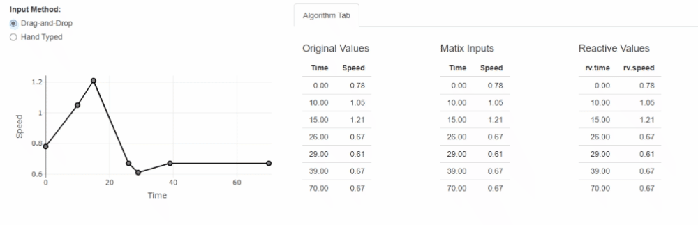{width=100%}
</center>

### Building the shinyMatrix Inputs

If you recall, we wanted to provide our end-user the ability to toggle back and forth between the drag-and-drop plot and the ability to hand type their inputs.

<center> 
{width=50%}
</center>

So if they want to visualize how speed changes overtime, they can use the plotly graph. If they want to input precise values, they can hand type them.

Fortunately, there's a great package out there called shinyMatrix that allows this.

So how do we add this?

Well, if you look at the UI script, you'll notice that I had included an input called `matrixInput`.

```{r step_fifteen_two,eval=FALSE}
matrixInput(
  "rateInputs_mi",
  value = rateInputs_m,
  class = "numeric",
  row = list(names = FALSE)
)
```

This function actually works pretty good on its own, but we need to do more. Currently, the new values you can type into the matrix only apply to itself. If we run the app, we'll notice that the reactive values (which is what the plotly graph uses) does not update. And rules, such as the first and last value must equal 0 and 70, do not apply either.

<center> 
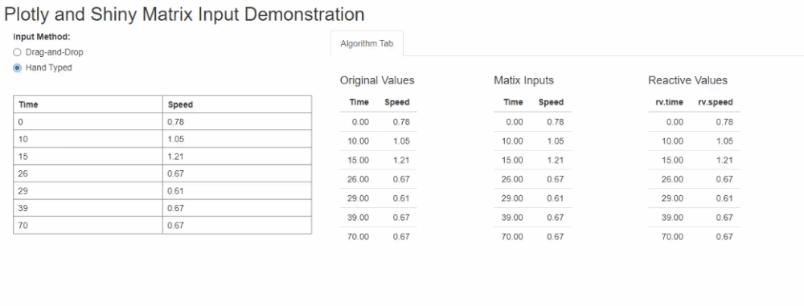{width=70%}
</center>

We'll need to add an additional `observeEvent()` function to update the reactive value list, similar to how we did the plotly relayout.

```{r step_sixteen,eval=FALSE}
observeEvent(req(input$rateInputs_mi &
                   input$toggleInputSelect == "handTyped"),
             {
               
             })
```

We will add a Boolean statement to this event observation between the first `(` and the first `{`. Much like our other event observation function, this will only continue in certain instances. The user will need to select both the "Hand Type" option in the UI and change the matrix input for this function to continue.

It may not be clear now why this is important, but later on, we'll be adding to our earlier `observeEvent` function for the "plotly_relayout" events. We want to prevent these two event observations from competing with one another. Adding these statements between the `(` and `{` ensures these functions only proceeds at the right moment.

Now let's actually add our code! 
  
This one is a lot easier to write. The shinyMatrix package makes it a relatively straight forward process to make updates. 

First, we'll take all the values in the `rateInputs_mi` matrix (the shinyMatrix input in the UI) and assign it to a "temp matrix." Please note, it is important to include the full matrix code below for it to register with the plotly graph. This is done for the same reasons as we did with the plotly. We want to ensure the end-user follows the rules required for the algorithm input. 

```{r step_seventeen, eval=FALSE}
observeEvent(req(input$rateInputs_mi &
                   input$toggleInputSelect == "handTyped"),
             {
               temp_matrix <-
                 matrix(
                   input$rateInputs_mi,
                   nrow = 7,
                   ncol = 2,
                   dimnames = list(NULL, c("Time", "Speed"))
                 )
               temp_matrix[1, 1] <- 0
               temp_matrix[7, 1] <- 70
               temp_matrix <-
                 temp_matrix[order(temp_matrix[, 1], decreasing = FALSE), ]
               
             })
```

As you can see in the code above, we force the first and last value to be 0 and 70, respectively. We also re-order the speed values from least to highest.

Next, we'll update the reactive value list.

```{r step_eighteen, eval=FALSE}
observeEvent(req(input$rateInputs_mi &
                   input$toggleInputSelect == "handTyped"),
             {
               temp_matrix <-
                 matrix(
                   input$rateInputs_mi,
                   nrow = 7,
                   ncol = 2,
                   dimnames = list(NULL, c("Time", "Speed"))
                 )
               temp_matrix[1, 1] <- 0
               temp_matrix[7, 1] <- 70
               temp_matrix <-
                 temp_matrix[order(temp_matrix[, 1], decreasing = FALSE), ]
               
               rv$time <- temp_matrix[, 1]
               rv$speed <- temp_matrix[, 2]
               
             })
```

But there's one more thing we need to do. 

Normally with shinyMatrix, we don't need to worry about updating the shinyMatrix with new values. It usually does that itself. But in this case, the end-user may have entered 71 for the last time value. If you look at the script above, we changed that value back to 70. That changes only applies to the reactive value list though! We need to make sure the shinyMatrix updates too.

As seen in the GIF below, we are able to change the first and last value to something other than 0 and 70. I can also change the order of the values. While the reactive list on the far right changes, the table for the shinyMatrix does not. You can replicate this yourself in the app currently.

<center> 
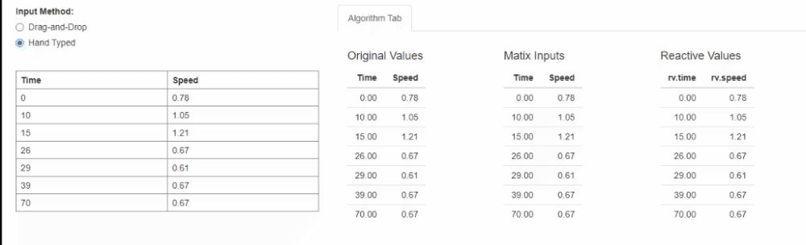{width=100%}
</center>
  
To fix this, we update the matrix input with the reactive values. You can see this with the `updateMatrixInput` function below:
  
```{r step_nineteen,eval=FALSE}
observeEvent(req(input$rateInputs_mi &
                   input$toggleInputSelect == "handTyped"),
             {
               temp_matrix <-
                 matrix(
                   input$rateInputs_mi,
                   nrow = 7,
                   ncol = 2,
                   dimnames = list(NULL, c("Time", "Speed"))
                 )
               temp_matrix[1, 1] <- 0
               temp_matrix[7, 1] <- 70
               temp_matrix <-
                 temp_matrix[order(temp_matrix[, 1], decreasing = FALSE), ]
               
               rv$time <- temp_matrix[, 1]
               rv$speed <- temp_matrix[, 2]
               
               updateMatrixInput(session, "rateInputs_mi", temp_matrix)
               
             })
```

Now try the same experiment before! It works right? If you look below, you can see that we can no longer "break the rules". The matrix corrects itself.

<center> 
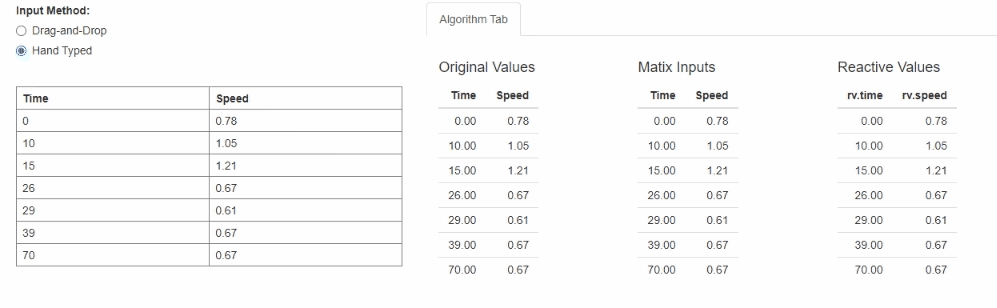{width=70%}
</center>
  
But we're still not done! We still need to ensure the plotly graph talks back to the matrixInput and vice versa!

### How to Make These Inputs Options Work Together

When running your earlier experiment, you may have noticed the plotly graph doesn't seem to change the matrix input.

We had programmed the second event observation function to update the plotly graph on the first tab. We did not program it to work the other way... yet!
  
This is an easy change to make. All you need to do is add the same `updateMatrixInput` function to your `observeEvent()` function for the plotly graph. Here's the full code below:

```{r step_twenty,eval=FALSE}
observeEvent(event_data(event = "plotly_relayout", source = "speed_s"), {
  # Speed 1 Event Data
  speed_ed <-
    event_data("plotly_relayout", source = "speed_s")
  speed_sa <-
    speed_ed[grepl("^shapes.*anchor$", names(speed_ed))]
  speed_ri <-
    unique(readr::parse_number(names(speed_sa)) + 1)
  speed_pts <- as.numeric(speed_sa)
  
  # Speed 1 Point Updates
  temp_matrix <-
    matrix(
      c(round(rv$time, 2), round(rv$speed, 2)),
      nrow = 7,
      ncol = 2,
      dimnames = list(NULL, c("Time", "Speed"))
    )
  temp_matrix[speed_ri, 1] <- round(speed_pts[1], 2)
  temp_matrix[speed_ri, 2] <- round(speed_pts[2], 2)
  temp_matrix <-
    temp_matrix[order(temp_matrix[, 1], decreasing = FALSE), ]
  temp_matrix[1, 1] <- 0
  temp_matrix[7, 1] <- 70
  
  # Update reactive values
  rv$time <- round(temp_matrix[, 1], 2)
  rv$speed <- round(temp_matrix[, 2], 2)
  
  updateMatrixInput(session, "rateInputs_mi", temp_matrix)
})
```

And with that last addition, these two input methods should work together. Give your app a preview and see if that's the case!
  
The complete app should look something like this:

<details>
  <summary>Final app.R</summary>
```{r step_twenty_one, eval=FALSE}
### Load packages
library(shiny)
library(tidyverse)
library(plotly)
library(shinyMatrix)

### Define default matrix
rateInputs_m <-
  matrix(
    c(0, 10, 15, 26, 29, 39, 70, 0.78, 1.05, 1.21, 0.67, 0.61, 0.67, 0.67),
    nrow = 7,
    ncol = 2,
    dimnames = list(NULL, c("Time", "Speed"))
  )

### Define UI
ui <- fluidPage(
  titlePanel("Plotly and Shiny Matrix Input Demonstration"),
  
  column(
    4,
    radioButtons(
      "toggleInputSelect",
      "Input Method:",
      choices = c("Drag-and-Drop" = "dragDrop", "Hand Typed" =
                    "handTyped")
    ),
    br(),
    conditionalPanel(condition = "input.toggleInputSelect=='dragDrop'",
                     plotlyOutput("speed_p", height = "250px")),
    conditionalPanel(
      condition = "input.toggleInputSelect=='handTyped'",
      matrixInput(
        "rateInputs_mi",
        value = rateInputs_m,
        class = "numeric",
        row = list(names = FALSE)
      )
    )
  ),
  column(8,
         tabsetPanel(
           id = "tabs",
           tabPanel(
             "Algorithm Tab",
             value = "algorithmOutput",
             column(3, br(),
                    tags$h4("Original Values"),
                    tableOutput("table1")),
             column(3, br(),
                    tags$h4("Matix Inputs"),
                    tableOutput("table2")),
             column(3, br(),
                    tags$h4("Reactive Values"),
                    tableOutput("table3"))
           )
         ))
)


### Define server logic
server <- function(input, output, session) {
  output$table1 <- renderTable({
    rateInputs_m
  })
  
  output$table2 <- renderTable({
    input$rateInputs_mi
  })
  
  output$table3 <- renderTable({
    req(rv$time)
    data.frame(rv$time, rv$speed)
    
  })
  
  # Creating Reactive Values
  rv <- reactiveValues(time = rateInputs_m[, 1],
                       speed = rateInputs_m[, 2])
  
  # Speed 1's Plot and Table and Feedback
  output$speed_p <- renderPlotly({
    speed_c <- map2(
      rv$time,
      rv$speed,
      ~ list(
        type = "circle",
        xanchor = .x,
        yanchor = .y,
        x0 = -4,
        x1 = 4,
        y0 = -4,
        y1 = 4,
        xsizemode = "pixel",
        ysizemode = "pixel",
        fillcolor = "grey",
        line = list(color = "black")
      )
    )
    
    
    plot_ly(source = "speed_s") %>%
      add_lines(x = rv$time,
                y = rv$speed,
                color = I("black")) %>%
      layout(
        shapes = speed_c,
        xaxis = list(title = "Time"),
        yaxis = list(title = "Speed"),
        showlegend = FALSE
      ) %>%
      config(edits = list(shapePosition = TRUE),
             displayModeBar = FALSE)
    
  })
  
  
  observeEvent(event_data(event = "plotly_relayout", source = "speed_s"), {
    # Speed 1 Event Data
    speed_ed <- event_data("plotly_relayout", source = "speed_s")
    speed_sa <-
      speed_ed[grepl("^shapes.*anchor$", names(speed_ed))]
    speed_ri <- unique(readr::parse_number(names(speed_sa)) + 1)
    speed_pts <- as.numeric(speed_sa)
    
    # Speed 1 Point Updates
    temp_matrix <- matrix(
      c(round(rv$time, 2), round(rv$speed, 2)),
      nrow = 7,
      ncol = 2,
      dimnames = list(NULL, c("Time", "Speed"))
    )
    temp_matrix[speed_ri, 1] <- round(speed_pts[1], 2)
    temp_matrix[speed_ri, 2] <- round(speed_pts[2], 2)
    temp_matrix <-
      temp_matrix[order(temp_matrix[, 1], decreasing = FALSE), ]
    temp_matrix[1, 1] <- 0
    temp_matrix[7, 1] <- 70
    
    # Update reactive values
    rv$time <- round(temp_matrix[, 1], 2)
    rv$speed <- round(temp_matrix[, 2], 2)
    
    updateMatrixInput(session, "rateInputs_mi", temp_matrix)
    
  })
  
  observeEvent(req(input$rateInputs_mi &
                     input$toggleInputSelect == "handTyped"),
               {
                 temp_matrix <-
                   matrix(
                     input$rateInputs_mi,
                     nrow = 7,
                     ncol = 2,
                     dimnames = list(NULL, c("Time", "Speed"))
                   )
                 temp_matrix[1, 1] <- 0
                 temp_matrix[7, 1] <- 70
                 temp_matrix <-
                   temp_matrix[order(temp_matrix[, 1], decreasing = FALSE), ]
                 
                 rv$time <- temp_matrix[, 1]
                 rv$speed <- temp_matrix[, 2]
                 
                 updateMatrixInput(session, "rateInputs_mi", temp_matrix)
                 
               })
  
}

### Run the application
shinyApp(ui = ui, server = server)
```
</details>

See the app on [RStudio Connect](https://colorado.rstudio.com/rsc/connect/#/apps/14a2ce4f-4248-4c05-ac80-8e7db0d7d6de/access).

### Things to Remember

If there's one thing I hope you learned from this tutorial, it's that Shiny apps are powerful tools. Data scientists can build applications that allow engineers, manufacturers, and plant workers to use machine learning to improve results and save money. Shiny provides endless ways to provide this service in a flexible and intuitive way for the end user. The only hard part is the programming. Learn to invest the time in learning observation and reactive functions. Find new and novel ways to use existing packages, such as plotly and shinyMatrix, to build something cool.

**Watch Taylor's R in Manufacturing talk here:**

<script src="https://fast.wistia.com/embed/medias/ozwqigkag9.jsonp" async></script><script src="https://fast.wistia.com/assets/external/E-v1.js" async></script><div class="wistia_responsive_padding" style="padding:56.25% 0 0 0;position:relative;"><div class="wistia_responsive_wrapper" style="height:100%;left:0;position:absolute;top:0;width:100%;"><div class="wistia_embed wistia_async_ozwqigkag9 videoFoam=true" style="height:100%;position:relative;width:100%"><div class="wistia_swatch" style="height:100%;left:0;opacity:0;overflow:hidden;position:absolute;top:0;transition:opacity 200ms;width:100%;"></div></div></div></div>
