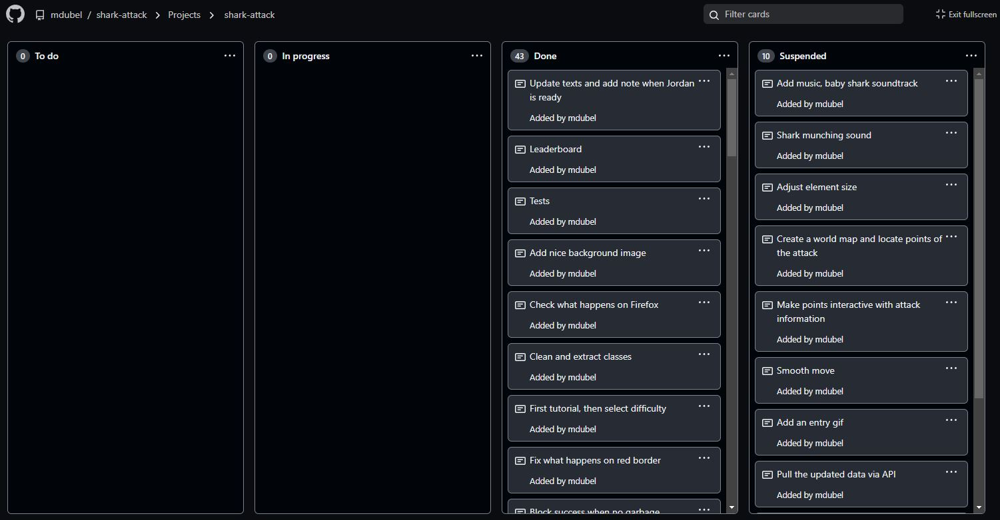
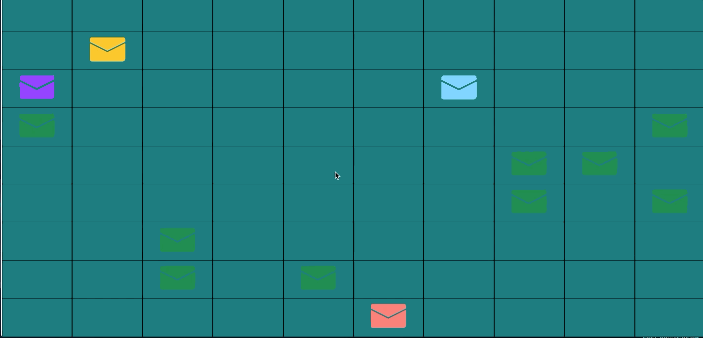

This is a guest post from Marcin Dubel, a 2021 Shiny Contest Grand Prize winner and Software Engineer at <a href="https://appsilon.com/" target = "_blank">Appsilon</a>, a Full Service RStudio Partner.

RStudio’s 4th annual Shiny Contest is just around the corner. As a winner of last year’s contest with <a href="https://community.rstudio.com/t/shark-attack-shiny-contest-submission/104695" target = "_blank">Shark Attack</a>, I thought I’d share my methods for building a quality app. I break down the success of an application into three pillars: the Idea, the Impression, and the Process. Paying attention to detail in each will lead to a good result. Slack on one and you risk the top prize. 

Whether you’re submitting to the contest or seeking to improve real-world skills, I hope you’ll find something in this article to improve your Shiny applications. 

## Idea

### Topic

Usually, when working on a Shiny application, the idea and content are predefined in the project. However, in a contest, you are free to select your own subject. But this freedom of choice and opportunity brings about a new set of challenges! Coming up with yet another classic dashboard won’t be innovative enough. Don’t hold back. Because the winners of these contests don’t get to that virtual podium by doing the same old tried and true dashboard. This is your chance to be creative. To bring an intriguing app concept to the table.

Let’s be realistic here. Don’t expect to sit down, think for a minute, and churn out the groundbreaking topic and mechanics for your application. Dedicate a lot of time to this step. Search what interests you and look for inspiration. Be flexible! Try different ideas with quick proof of concepts and check how you envision the future development of this application. Feel free to abandon the initial work if you don’t think it’ll pan out to an interesting project. Don’t let the sunk cost fallacy hold you back. 

### Data

A crucial part of any Shiny application is the underlying data. I’d advise being careful with this: collecting, cleaning, maintaining, checking, and updating the data might be a tough or tedious task. It’ll likely consume most of your time and although the effect of this work is not easily visible to most, it’ll pay off in the end.

Of course, this doesn’t apply to all cases. I can imagine datasets so unique, interesting, and clean that it could be worth it to build contest apps around them. Whenever you are considering an app like this, adjust your plans to this additional risk factor.

For example, take a look at the Global Shark Attack data table below. This is a unique dataset, but frankly, it’s hard to look at and some of the data is missing. 

<iframe src="https://public.opendatasoft.com/explore/embed/dataset/global-shark-attack/table/?disjunctive.country&disjunctive.area&disjunctive.activity&static=false&datasetcard=false" width="680" height="400" frameborder="0"></iframe>

After all the hard work of handling that data, you really need to ensure you have a good way to present it. Starting with a quick mock dataset is worthwhile to validate the app's purpose. Simply presenting data on the dashboard usually isn’t enough and won’t get you very far. Take advantage of a Shiny applications' greatest power: interactivity. Let users dig down, explore, and find surprises in the data. Users will make their own impression of your app as they play around with it. 

## Impression

### Make them care

Even the most interesting dataset won’t be given a second glance if presented as a giant table. You should think about adding some level of purposeful, insightful interactivity. Give users a reason to interact with the application. Make sure that your topic is engaging and makes users want to stick around longer. Don’t just give the user a button, give them a reason to click it. 

Remember, you only make a first impression once. So the key selling point of the application should be displayed upfront and easily accessible. Don’t hide it somewhere in the depths of the code. Also remember to make applications intuitive, so that the users don’t get lost. Introducing some help or descriptions is always welcome.

### Visuals - Design over features

Nothing makes a better impression than a beautiful app. And that first impression is so important. Having a set of bonus features is great if you have the time, but don’t sacrifice your UI. Humans are visual creatures and users will unconsciously rate your application in the first few seconds based on how visually appealing it is. If you’re facing a time crunch, it might be even worth sacrificing some extra features to polish the overall style of the application.

## Process

### All in time - a step by step approach

To keep your work organized, write down tasks in a planner. I used a Github project connected to my repository. Whenever I had an idea for a single feature of the application, I wrote it down and prioritized it. Prioritization is the key. You can’t afford to waste time on some minor, nice-to-have feature while your app is still not doing its main job. 

Another crucial rule you may know from big development projects: separate work into small, independent tasks. This allows you to implement some features while being stuck in another branch. Also, it helps to optimize the workday (e.g., dealing with quick and simple tasks when you don’t have much time).

### PoCs - Function before beauty

To avoid wasting too much time, start your work with a Proof of Concept – the minimal application that checks if key technical challenges can be overcome. If it doesn’t work, you still have enough time to turn around and change the scope. If the plan is impossible or too complicated to implement, you need to cut your losses.

Here you can see an early PoC of Shark Attack. I needed to test if ‘key capturing’ was possible and would work in the way I imagined.

Even when working on a proof of concept, I recommend keeping good programming practices in place. If your application grows bigger you won’t have time to pay tech debt and it’ll slow your progress in the long run. 

### Test early and often

Remember, you know your app inside and out. But the users and judges will enter it for the first time. And fresh eyes tend to uncover unintuitive, redundant, or missing features. They might use the app in an altogether different way than you expect. Don’t wait till the last minute to show your progress to a fresh audience. You need to have enough time to implement the feedback that you receive. 

And I don’t mean some sophisticated user feedback collection sessions - just show the app’s current state to your friends or family and ask for honest opinions. If you’re unfamiliar with user tests, you can learn more with this <a href="https://appsilon.com/user-tests-build-better-shiny-apps-with-effective-user-testing/" target = "_blank">tutorial on User Tests</a>.

## Summary

Most importantly, to build an award-winning app - have fun! It’s an exciting challenge, with no external pressure or firm restrictions. The RStudio Shiny Contest is an opportunity to engage in creative learning and gives you a platform to share your hard work. 

There are a lot of strong submissions and contestants are getting more creative with each year. Frankly, it’s an honor just to be a part of the contest and share with the community. Don’t get me wrong, it’s nice to win. But seeing what others are doing and how far Shiny can go is the ultimate prize for the Shiny community. 

If you’re interested in achieving more with Shiny, be sure to sign-up for the <a href="https://appsilon.com/appsilon-shiny-conference-2022-announcement/" target = "_blank">Appsilon Shiny Conference (27-29 April 2022)</a>. Join the R Shiny community as we welcome keynote talks and guest speakers who specialize in R and Shiny - including Diane Beldame of ThinkR, Eric Nantz of the R-Podcast, and many more! Discover recent advancements in R Shiny technology, network and collaborate with the global Shiny dev community, and share your open source packages and Shiny apps at the <a href="https://appsilon.com/2022-appsilon-shiny-conference/" target = "_blank">Appsilon Shiny Conference</a>. 

