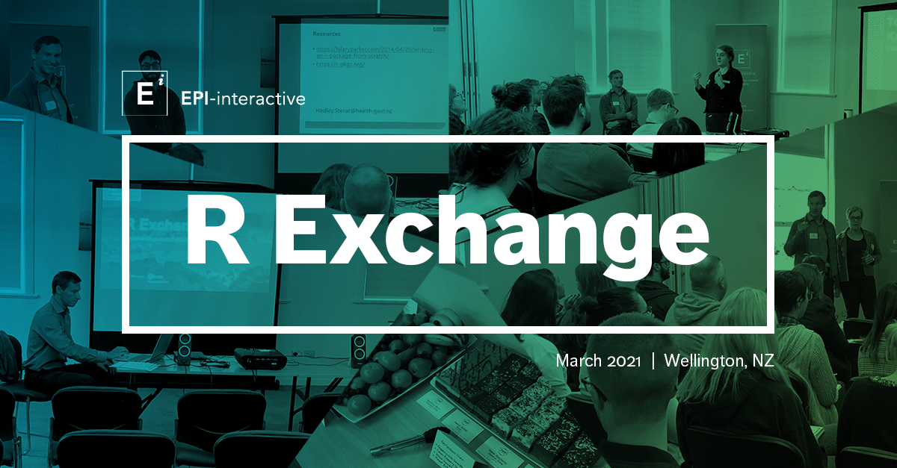
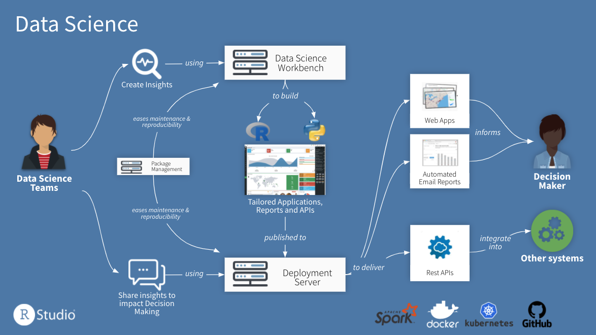
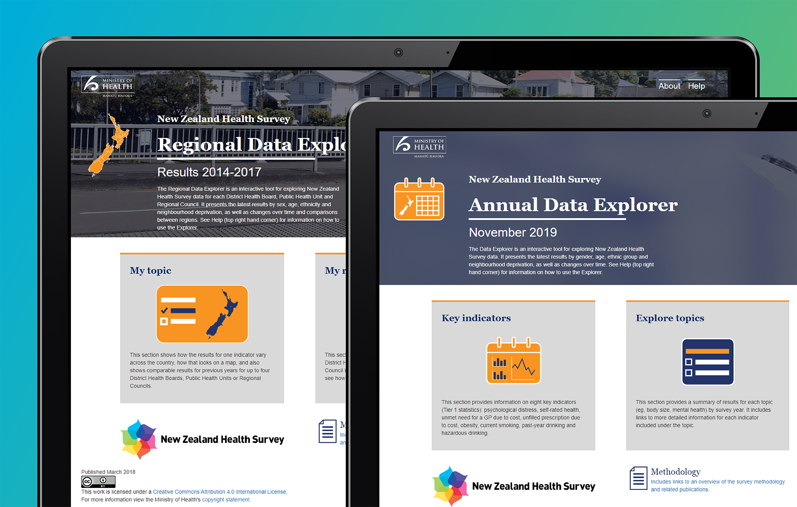
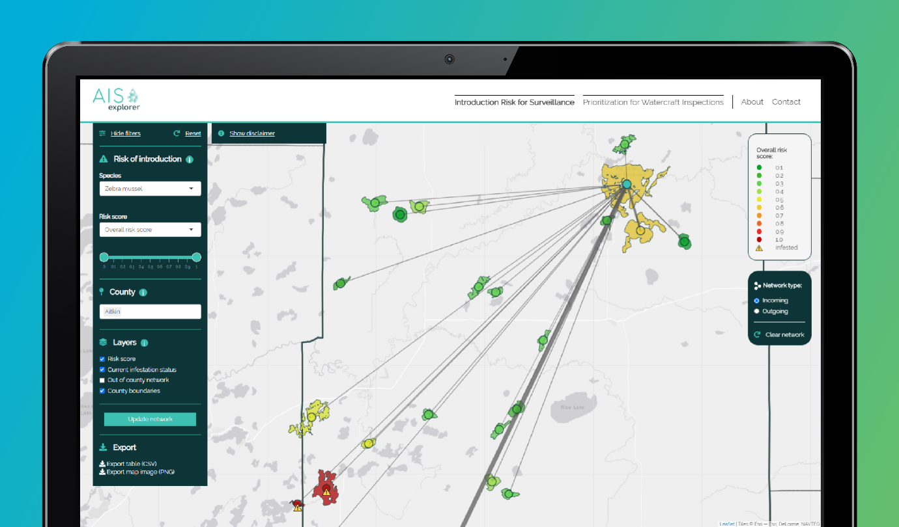
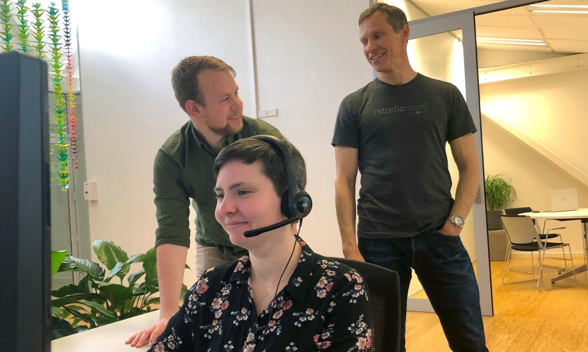

<i>This is a guest post from Uli Muellner, Director of IT & Learning, at <a href="https://www.epi-interactive.com/" target="_blank" rel="noopener noreferrer">Epi-Interactive</a>, a Full Service RStudio Partner.</i>

<b>Kia ora koutou</b>,

In March we were fortunate to run a face-to-face event in Wellington, New Zealand, bringing people together to discuss how they use R in their organisation to analyse and share data. It felt special to be able to do that, hence we wanted to share some of the highlights with you all. Thanks to our presenters from Statistics NZ, the New Zealand Ministry of Health, the Cancer Control Agency, and RStudio for supporting this event. See the full agenda <a href="https://www.epi-interactive.com/events/r-exchange/" target="_blank" rel="noopener noreferrer">here</a>. 

Here is what we learned:

<h2>1. We are all in the same boat</h3>

While the stories we heard from different organisations highlighted the diversity of how R is being used, there seem to be common challenges that reach across the board. Often organisations start their R journey with employees innovating in their respective field or there are obvious pain-points to tackle, like tedious manual reporting or the limitations of proprietary tools like Excel. However, once R grows within organisations, isolated solutions often hit a wall when IT gets involved and a more structured approach is required to address systemic issues such as data security.  

One strategy to overcome those obstacles successfully is to get the IT department on board early and build up an infrastructure where code development and publishing can be centralised and better controlled. As Josiah Parry from RStudio mentioned in his talk, the start-up mantra “fail fast, fail early, fail often” doesn’t always apply, for example, to government agencies who can’t fail on issues such as data security and privacy standards. This is where RStudio professional products can help as they facilitate the establishment of R in a controlled environment, for example by

<ul>
  <li>Managing a curated set of R packages with version control (<i><a href="https://www.rstudio.com/products/package-manager/" target="_blank" rel="noopener noreferrer">RStudio Package Manager</a></i>)</li>
  <li>Providing a dedicated server-based development environment for analysts and data scientists (<i><a href="https://www.rstudio.com/products/rstudio-server-pro/" target="_blank" rel="noopener noreferrer">RStudio Server Pro</a></i>) or </li>
  <li>Offering a publishing platform that provides access to outputs for a wider internal and external audience, e.g. via R Shiny dashboards, Markdown documents, scheduled reports or APIs (<i><a href="https://www.rstudio.com/products/connect/" target="_blank" rel="noopener noreferrer">RStudio Connect</a></i>).</li>
</ul>

<small><i>Diagram courtesy of RStudio</i></small>

While a centralised controlled environment is considered a key success factor, users were keen to be able to continue to try out novel approaches, e.g. by using a sandbox or experimental environment. This would allow for a proof-of-concept or prototyping, where some of the approaches may or may not be transitioned into production.

<h2>2. Change comes from within</h3>

Innovation was there in the room with us. Hearing battle stories from our colleagues really showcased the impact people can have by customising R to their specific needs. For example, while it is ideal to maintain a consistent appearance and behaviour across several different Shiny apps within an organisation, this is not always easy to achieve as different people might be involved in app development and code is commonly duplicated or difficult to maintain and update. We heard from one of our speakers how creating an R package containing styles, reference data, and documentation can serve as a single point of reference for any number of R Shiny apps and allows a team to easily update and maintain key facets of style and function.  From a user point of view a consistent look and feel can establish trust and make dashboards easier to understand and navigate. Think about the “Don’t make me think” principle established by Steve Krug about web usability, where people should be able to accomplish tasks as easily and directly as possible. A consistent interface across all apps within an organisation can greatly contribute to this goal.

 
 

<small><i>Screenshot: Ministry of Health. 2020. Annual Data Explorer 2019/20: New Zealand Health Survey [Data File]. URL: https://minhealthnz.shinyapps.io/nz-health-survey-2019-20-annual-data-explorer/ (Accessed 07/04/2021)</i></small>

<h2>3. The opportunities are huge</h2>

While saying this to the audience of this blog feels like preaching to the choir this event showcased yet again how analysis, data science, and interactive dashboards that are code-based can be used to inform and engage stakeholders and connect data with real-world decision making. It was inspiring to see this in action during the talk on reporting of performance indicators to improve health service delivery and how R-driven reporting can make a difference in getting the message out there. It was easy to observe that R supports transparency and reproducibility, as it is open source, and features such as package creation and literate programming are readily available. These characteristics are becoming increasingly important for organisations that rely on the trust of their stakeholders, that might be both producers and consumers of the data. It was truly exciting to hear our speakers and participants’ vision on what the future here holds.

<small><i>Screenshot: University of Minnesota. 2021. AIS Explorer 2021 [Data File]. URL: https://www.aisexplorer.umn.edu/ (Accessed 08/04/2021)</i></small>

<h3>About Epi-interactive</h3>
While we are based at the bottom of the world in New Zealand’s windswept and creative capital (Lord of the Rings anyone?) we work across the globe. Here is how you can connect.

<h4>Learn from our Shiny Ninjas</h4>
Keen to build and extend your R Shiny skills in a fun and interactive online environment?  Then the 2021 Edition of our R Shiny Masterclass Series might be for you.
Delivered online in May and June 2021 we offer an Introduction and Advanced Class (8 sessions each).

<a href="https://www.epi-interactive.com/events/r-shiny-masterclass-series/" target="_blank" rel="noopener noreferrer">Find out more and register on our website</a>

<h4>Stay in touch</h4>
<ul>
  <li>Contact us on <a href="mailto:info@epi-interactive.com" target="_blank" rel="noopener noreferrer">info@epi-interactive.com</a> if you would like to discuss your project idea with us.</li>
  <li>Follow us on <a href="https://epi-interactive.us9.list-manage.com/track/click?u=36f9ab1413fd9ff644e6cffc7&id=cfbe387558&e=8357c5dc58" target="_blank" rel="noopener noreferrer">LinkedIn</a> for news and updates. </li>
  <li>Learn more about <a href="https://www.epi-interactive.com/work/" target="_blank" rel="noopener noreferrer">our work </a>.</li>
  <li>Subscribe to our <a href="http://eepurl.com/hvjVpb" target="_blank" rel="noopener noreferrer">mail list</a>.</li>
</ul>

