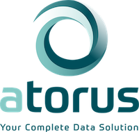

<small><i>Photo by <a href="https://unsplash.com/photos/IFpQtennlj8" target="_blank" rel="noopener noreferrer">@cdc</a> on Unsplash</i></small>

<i>This is a guest post from Mike Stackhouse, Chief Innovation Officer, at <a href="https://www.atorusresearch.com/" target="_blank" rel="noopener noreferrer">Atorus Research</a>, a Full Service RStudio Partner, about an upcoming joint webinar <a href="https://www.rstudio.com/registration/incorporating-r-into-your-clinical-legacy-workflows/" target="_blank" rel="noopener noreferrer">Incorporating R into your Clinical Legacy Workflows</a></i>.

Organizations with legacy clinical workflows have much to gain by automating routine functions and sharing critical information in richer and more interactive forms. When organizations look to adopt new programming languages, such as R and Python, to tackle these improvements, they run into a number of challenges. 

There are many questions that have to be addressed such as: How do we migrate legacy workflows over to new programming languages? And with this migration, how do we upskill a workforce to use these new tools? 

Throughout my career, I have seen these challenges first hand. My entry into the world of data analytics started as a statistical programming intern working in the world of clinical research and using the language SAS®. Like many others, I fell into programming as a career – and this was the first time I had ever even touched a programming language. 

Along the journey of learning how to program, I also was exposed to learning the ins and outs of clinical research itself. The pharmaceutical industry is highly regulated and organizations have strict policies in place governing the process for data analysis and the quality control/assurance of that analysis. Furthermore, there are many data standards within industry including CDISC’s SDTM, ADaM, and define.xml. These pieces together lead to fairly standardized programming processes and associated tools within an organization. Working at a clinical research organization (CRO), I had the opportunity to see several different implementations of largely the same processes. 

At a certain point, my interest in programming drove me to explore other languages outside of SAS®. I found Python and R – and a new sense of freedom. I could automate routine functions I was doing manually, create rich reports to share information, and make web-based interfaces to dynamically let users visualize the data. I had new tools in my tool belt that could not only change the way I did my job, but the way I shared information – most importantly with non-technical users. 

Unfortunately, adopting these tools is not as simple as a lift and shift. Legacy processes in clinical research have decades of precedent, with highly standardized workflows and utilities built to suit an organization’s needs. Furthermore, programming in clinical research tends to be monolithic; SAS® is the language available and thus SAS® is the language that’s used. In light of this, many programmers in industry have only used and only know how to use SAS® - and having to pick up a new language can be scary, especially when you have years of experience in the one you know.

On June 22nd, we’ll be teaming up with GSK’s Michael Rimler to talk about these topics.  In the webinar, we’ll be discussing:

- Open-source R packages developed specifically for clinical research workflows
- Open-source development within pharma and embracing a collaborative paradigm
- Upskilling existing SAS® programmers in pharma to learn R and open-source languages, and how Atorus can help

## Register for the webinar 

You can sign up for the June 22nd webinar here: <a href="https://www.rstudio.com/registration/incorporating-r-into-your-clinical-legacy-workflows/" style="display: inline !important;" target="_blank" rel="noopener noreferrer">Incorporating R into your Clinical Legacy Workflows</a>

### About Atorus Research 

Atorus Research helps organizations on their journey to R by guiding you down the proper paths to explore, embrace, and ultimately embed R and the power of open-source tools within your teams. We deliver the answers to your questions to how to safely migrate existing processes and adopt new technologies, while remaining compliant within the regulatory environment. 

