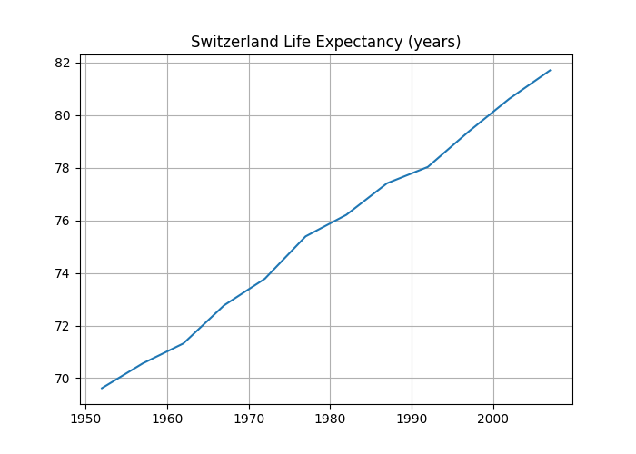

<sup>Photo by <a href="https://unsplash.com/@mark_crz?utm_source=unsplash&amp;utm_medium=referral&amp;utm_content=creditCopyText">Mark Cruz</a> on <a href="https://unsplash.com/s/photos/ice-cream-cones?utm_source=unsplash&amp;utm_medium=referral&amp;utm_content=creditCopyText">Unsplash</a></sup>

The TIOBE Company just published the July edition of its <a href="https://www.tiobe.com/tiobe-index/" target="_blank" rel="noopener noreferrer">TIOBE Programming Community Index</a> of programming language popularity. R users will be pleased to see that R is now ranked as the 8th most popular programming language as shown in the screenshot below, having risen 12 positions since July of last year.

<figure>

<figcaption>Figure 1: TIOBE Language Rankings showing R as the 8th Most Popular Language</figcaption>
</figure>

While we at RStudio are pleased to see R climbing the TIOBE charts, what we're going to focus on this month is all the other languages, both on this list and not, that data science teams also use to do their jobs. We're going to focus on **interoperability** with R, and how it helps data science teams get more value of all their organization's analytic investments.

If you're a regular reader of this blog, you may already know that the RStudio IDE supports Python (you can read more at <a href="https://rstudio.com/solutions/r-and-python/" target="_blank" rel="noopener noreferrer">R & Python: A Love Story</a>. What's less well-known, however, is that when you write code in R Markdown within the IDE, you may also embed:

- **SQL code** for accessing databases,
- **BASH code** for shell scripts,
- **C and C++ code** using the `Rcpp` package,
- **STAN code** for doing statistical modeling,
- **Javascript** for doing web programming,
- **and many more languages**. You can find a complete list of the many platforms supported in the language engines chapter of the book, <a href="https://bookdown.org/yihui/rmarkdown/language-engines.html" target="_blank" rel="noopener noreferrer">R Markdown: The Definitive Guide</a>.

If you're wondering how this could work, I've created a very simple example R Markdown document that demonstrates how languages can work together. It creates an in-memory database of `gapminder` data, queries it using SQL, prints the result of the query in R, plots the result using `matplotlib` in Python and saves the result as an image, and then prints the size of the image in BASH.

<pre class="markdown">
<code>
---
title: "Multilingual R Markdown"
authors: "Carl Howe, RStudio"
date: "7/6/2020"
output: html_document
---
```{{r setup, include=FALSE, echo = TRUE}}
knitr::opts_chunk$set(echo = TRUE, collapse = TRUE)
library(tidyverse)
library(rlang)
library(reticulate)
library(RSQLite)
library(DBI)
library(gapminder)
reticulate::use_python("/usr/local/bin/python3", required = TRUE)
```

```{{r gm_db_setup}}
gapminder_sqllite_db <- dbConnect(RSQLite::SQLite(), ":memory:")
dbWriteTable(conn = gapminder_sqllite_db,"gapminder", gapminder)
country <- "Switzerland"
```

## use R variable `country` in SQL query
```{{sql connection = gapminder_sqllite_db, output.var="gmdata"}}
SELECT * FROM gapminder WHERE country = ?country
```

## Access results of SQL query in R
```{{r}}
head(gmdata, 5)
##       country continent year lifeExp     pop gdpPercap
## 1 Switzerland    Europe 1952   69.62 4815000  14734.23
## 2 Switzerland    Europe 1957   70.56 5126000  17909.49
## 3 Switzerland    Europe 1962   71.32 5666000  20431.09
## 4 Switzerland    Europe 1967   72.77 6063000  22966.14
## 5 Switzerland    Europe 1972   73.78 6401400  27195.11
```

## Plot in Python and save result as .png
```{{python}}
import matplotlib.pyplot as plt
plt.plot(r.gmdata.year, r.gmdata.lifeExp)
plt.grid(True)
plt.title("Switzerland Life Expectancy (years)")
plt.savefig("./SwitzerlandLifeExp.png")
```

## Show size of Python plot using BASH
```{{bash}}
ls -l SwitzerlandLifeExp.png
## -rw-r--r--  1 chowe  staff  26185 Jul  7 17:26 SwitzerlandLifeExp.png
```
</code></pre>

<figure>

<figcaption>Figure 2: Resulting Python Plot of Switzerland Life Expectancy</figcaption>
</figure>

Throughout the month of July, we'll be devoting several articles to how RStudio supports interoperability and the benefits interoperability brings to data science teams. We encourage you to look for those subsequent posts this month. Meanwhile, to learn more about how interoperability improves the productivity of data science teams and some of the many platforms that RStudio supports, we recommend the following resources:

- <a href="https://rstudio.com/resources/rstudioconf-2019/new-language-features-in-rstudio/" target="_blank" rel="noopener noreferrer">**New language features in RStudio**</a>: This rstudio::conf 2019 video by developer Jonathan McPherson talks about how the RStudio IDE dramatically improves support for many languages frequently used alongside R in data science projects, including SQL, D3, Stan, and Python. 
- <a href="https://rstudio.com/resources/webinars/r-python-a-data-science-love-story/" target="_blank" rel="noopener noreferrer">**R & Python: A Data Science Love Story**</a>: This webinar with RStudio's Lou Bajuk and Sean Lopp discusses how RStudio's toolchain supports the use of both R and Python, including support for Jupyter notebooks.
- <a href="https://rstudio.com/resources/rstudioconf-2019/ursa-labs-and-apache-arrow-in-2019/" target="_blank" rel="noopener noreferrer">**Ursa Labs and Apache Arrow**</a>. In this rstudio::conf 2019 video, Wes McKinney talks about Ursa Labs' work with Apache Arrow is dramatically speeding data sharing between R, Python, and other data science environments.


