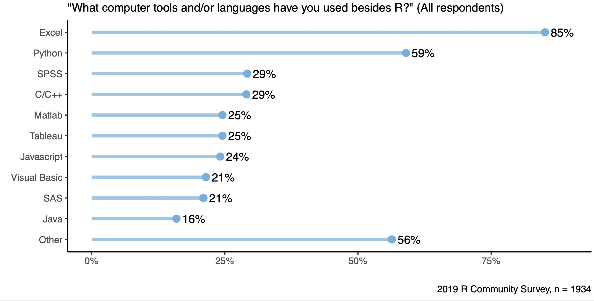
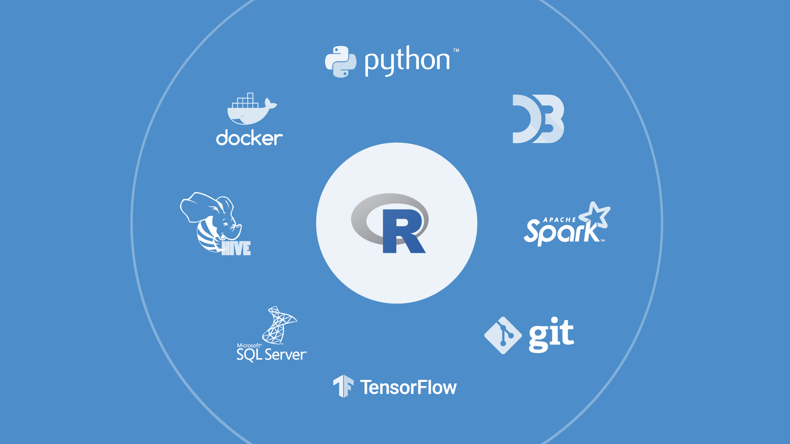

Photo by <a href="https://unsplash.com/@federize?utm_source=unsplash&utm_medium=referral&utm_content=creditCopyText" target="_blank" rel="noopener noreferrer">Federico Beccari</a> on <a href="https://unsplash.com/s/photos/connection?utm_source=unsplash&utm_medium=referral&utm_content=creditCopyText" target="_blank" rel="noopener noreferrer">Unsplash</a>

### The Challenges of Complexity and Underutilization

Organizations typically have multiple different environments and frameworks to support their analytic work, with each tool providing specialized capabilities or serving different audiences. These usually include: 

*   **Spreadsheets** created in Excel or Google Sheets,
*   **Data science tools** including R, Python, SPSS, SAS, and many others,
*   **BI tools** such as Tableau or PowerBI,
*   **Data storage and management frameworks** including databases and Spark clusters,
*   **Job management clusters** such as Kubernetes and Slurm.

For example, in our most recent R Community Survey, we asked what tools and languages respondents used besides R. The results shown in Figure 1 illustrate the wide variety of tools that may be present in an organization.

<figure>

<figcaption>Figure 1: Respondents we surveyed use a wide variety of tools in addition to R.</figcaption>
</figure>

These tools and frameworks provide flexibility and power but can also have two unpleasant, unintended consequences: **productivity-undermining complexity** for various stakeholders and **underutilization of expensive analytic frameworks**.

The stakeholders in the organization experience these consequences because:

*   **Data scientists require multiple environments to get their work done.** If data scientists have to leave their native tools to access other things they need such as a Spark cluster or a database, they have to switch contexts and remember how to use systems they might only rarely touch. Often, this means they won’t fully exploit the data and other resources available, or they waste time learning and relearning various systems, APIs, languages, and interfaces. 
*   **Data science leaders worry about productivity.** When their teams struggle in this way, these leaders worry that their teams aren’t delivering the full value that they could. This inefficiency can make it more difficult to defend budgets and hire additional team members when needed. These leaders may also face criticism from other departments demanding to know why the data science team isn’t fully utilizing expensive BI deployments or powerful computing resources.
*   **IT spends time and money supporting underutilized resources.** Analytic infrastructures such as Spark or Kubernetes require considerable resources to set up and maintain. If these resources are being underutilized, IT will question their lack of ROI and whether they should continue to maintain them. These questions can lead to uncomfortable internal friction between departments, particularly depending on who requested the investments in the first place and what expectations were used to justify them. 

<figure>

<figcaption> Figure 2: Interoperability is a key strength of the R ecosystem.</figcaption>
</figure>

### Teams Need Interoperable Tools

Interoperable systems that give a data scientist direct access to different platforms from their native tools can help address these challenges. Everyone benefits from this approach because:

*   **Data scientists keep working in their preferred environment.** Rather than constantly switching between different tools and IDEs and interrupting their flow, data scientists can continue to work in the tools and languages they prefer. This makes the data scientist more productive and reduces the need to keep switching contexts.
*   **Data science leaders get more productivity from their teams.** When teams are more productive, they deliver more value to their organization. Delivered value helps them justify more training, tools, and team members. Easier collaboration and reuse of each other’s work further increases productivity. For example, if a data scientist who prefers R can easily call the Python script developed by a colleague from their preferred language, they avoid reimplementing the same work twice.
*   **Teams make better use of IT resources.** Since it is easier for data scientists to use the frameworks and other infrastructure IT has put in place, they use those resources more consistently. This higher utilization helps the organization achieve the expected ROI from these analytic investments.

## Encouraging Interoperability

Interoperability is a mindset more than technology. You can encourage interoperability throughout your data science team with four initiatives:

1.  **Embrace open source software.** One of the advantages of open source software is the wide community providing specialized packages to connect to data sources, modeling frameworks, and other resources. If you need to connect to something, there is an excellent chance someone in the community has already built a solution. For example, as shown in Figure 2, the R ecosystem already provides interoperability with many different environments. 
2.  **Make the data natively accessible.** Good data science needs access to good up-to-date data. Direct access to data in the data scientist’s preferred tool, instead of requiring the data scientist to use specialized software, helps the data scientist be more productive and makes it easier to automate a data pipeline as part of a data product. Extensive resources exist to help, whether your data is in <a href="https://db.rstudio.com/" target="_blank" rel="noopener noreferrer">databases</a>, <a href="https://spark.rstudio.com/" target="_blank" rel="noopener noreferrer">Spark clusters</a>, or elsewhere.  
3.   **Provide connections to other data science or ML tools.** Every data scientist has a preferred language or tool, and every data science tool has its unique strengths. By providing easy connections to other tools, you expand the reach of your team and make it easier to collaborate and benefit from the work of others. For example, the <a href="https://rstudio.github.io/reticulate/" target="_blank" rel="noopener noreferrer">reticulate</a> package allows an R user to call Python in a variety of ways, and the <a href="https://tensorflow.rstudio.com/" target="_blank" rel="noopener noreferrer">Tensorflow package</a> provides an interface to large-scale TensorFlow machine learning applications.
4.   **Make your compute environments natively accessible.** Most data scientists aren’t familiar with job management clusters such as Kubernetes and Slurm and often struggle to use them. By making these environments available directly from their native tools, your data scientists are far more likely to use them. For example, <a href="https://rstudio.com/products/rstudio-server-pro/" target="_blank" rel="noopener noreferrer">RStudio Server Pro</a> allows a data scientist to run a script on a Kubernetes or Slurm cluster directly from within their familiar IDE.

Eric Nantz, a Research Scientist at Eli Lilly and Company, spoke at rstudio::conf 2020 about the importance of interoperability in R:

## Learn more about Interoperability

In future posts, we will expand on this idea of Interoperability, with a particular focus on teams using R and Python, and how open source data science can complement BI tools. 

If you’d like to learn more about Interoperability, we recommend these resources:

*   <a href="https://blog.rstudio.com/2020/07/07/interoperability-july/" target="_blank" rel="noopener noreferrer">In this recent blog post</a>, we introduced the idea of interoperability with an example of calling multiple different languages from the RStudio IDE.
*   <a href="https://rstudio.com/about/customer-stories/brown-forman/" target="_blank" rel="noopener noreferrer">In this recent customer spotlight</a>, Paul Ditterline, Manager Data Science at Brown-Forman, describes how RStudio products helped their data science team “turn into application developers and data engineers without learning any new languages or computer science skills.”
*   <a href="https://solutions.rstudio.com/production/integrations/" target="_blank" rel="noopener noreferrer">This article</a> describes how RStudio products integrate with many different frameworks, including databases, Spark, Kubernetes, Slurm, Git, etc.
*   <a href="https://rstudio.com/solutions/r-and-python/" target="_blank" rel="noopener noreferrer">R and Python, a Love Story</a> shows how RStudio products helped bilingual data science teams collaborate more productively, and have a greater impact on their organization.
*   At rstudio::conf 2020, George Kastrinakis from Financial Times <a href="https://rstudio.com/resources/rstudioconf-2020/building-a-new-data-science-pipeline-for-the-ft-with-rstudio-connect/" target="_blank" rel="noopener noreferrer">presented a case study</a> on building a new data science pipeline, using R and RStudio Connect. 

