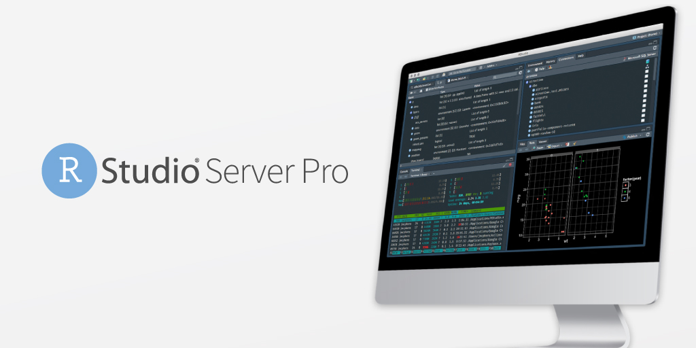

We are excited to announce the general availability of RStudio Server Pro 1.2, and to introduce RStudio Server Pro Standard and RStudio Server Pro Enterprise.

RStudio customers have made it clear to us that the future of data analysis is moving to a more elastic and flexible computational model. RStudio Server Pro now allows you to execute R processes remotely, and introduces new packaging and pricing to reflect this new trend.

 
<a href="https://rstudio.youcanbook.me" button type="button"  style= "padding: 12px 20px; border: none; font-size: 12px; border-radius: 3px; cursor: pointer; background-color: #4c83b6; color: #fff; box-shadow: 0, 1px, 3px, 0px, rgba(0,0,0,0.10);">Contact Sales</a>&emsp;
<a href="https://www.rstudio.com/products/rstudio-server-pro/" button type="button"  style= "padding: 12px 20px; border: none; font-size: 12px; border-radius: 3px; cursor: pointer; background-color: #4c83b6; color: #fff; box-shadow: 0, 1px, 3px, 0px, rgba(0,0,0,0.10);">Learn More</a>&emsp;
<a href="https://www.rstudio.com/products/rstudio-server-pro/evaluation/" button type="button"  style= "padding: 12px 20px; border: none; font-size: 12px; border-radius: 3px; cursor: pointer; background-color: #4c83b6; color: #fff; box-shadow: 0, 1px, 3px, 0px, rgba(0,0,0,0.10);">Try a 45 Day Evaluation</a>
  

### New RStudio Server Pro Features

The most significant new feature of RStudio Server Pro is Launcher, the long-awaited capability to separate the execution of R processes from the server where RStudio Server Pro is installed. Launcher allows you to run RStudio sessions and ad-hoc R scripts within your existing cluster workload managers, so you can leverage your current infrastructure instead of provisioning load balancer nodes manually. Now organizations that want to use Kubernetes or other job managers can run interactive sessions or batch jobs remotely and scale them independently.

[Learn more about Launcher here](https://solutions.rstudio.com/launcher/overview/).

Other [features exclusive to RStudio Server Pro 1.2 include](https://blog.rstudio.com/2018/11/05/rstudio-rsp-1.2-features/) improved R version management and enhanced configuration reload.

In addition, RStudio Server Pro has all of the new features of the new RStudio v1.2
  * [SQL](https://blog.rstudio.com/2018/10/02/rstudio-1-2-preview-sql/): live feedback on your SQL queries and autocompletion
  * [Custom Theme Support](https://blog.rstudio.com/2018/10/29/rstudio-ide-custom-theme-support/): tune the editor colors exactly the way you like them
  * [D3 Visualization Support](https://blog.rstudio.com/2018/10/05/r2d3-r-interface-to-d3-visualizations/): create and preview web-native D3 visualizations
  * [Reticulated Python Support](https://blog.rstudio.com/2018/10/09/rstudio-1-2-preview-reticulated-python/): an embedded Python session with a REPL and autocompletion
  * [Stan Support](https://blog.rstudio.com/2018/10/16/rstudio-1-2-preview-stan/): including syntax highlighting, compilation, and document outlines
  * [Plumber Support](https://blog.rstudio.com/2018/10/23/rstudio-1-2-preview-plumber-integration/): create and interact with R APIs, and publish them to RStudio Connect
  * ... [and more](https://www.rstudio.com/blog/rstudio-1-2-preview-the-little-things/).

### New Named User Packaging and Pricing for RStudio Server Pro

Effective today, RStudio is introducing RStudio Server Pro Standard and RStudio Server Pro Enterprise. Standard and Enterprise are priced per user, and include the remote Launcher feature. Existing RStudio Server Pro customers may upgrade to Standard or Enterprise to take advantage of the remote Launcher feature, or continue to purchase RStudio Server Pro without Launcher under their current terms. 

**RStudio Server Pro Standard for smaller teams - an affordable place to start**

RStudio Server Pro Standard is more affordable for smaller teams. Instead of $9,995 per year at a minimum, RStudio Server Pro Standard is now only $4,975 per year for 5 users on a single server. Additional Named Users are $995 each per year. Additional “Staging” servers for testing and “High Availability” servers for load balancing user sessions are optional. SMB, Academic, Volume, or Bundle discounts may apply.

**RStudio Server Pro Enterprise for larger teams - unrestricted servers**

RStudio Server Pro Enterprise eliminates restrictions on servers for larger teams. Containerized IT infrastructure using tools such as Docker and Kubernetes are increasingly popular. Larger teams often need more development, staging, production, and high availability servers and find license key management troublesome. RStudio Server Pro Enterprise starts at only $11,950 per year, allowing up to 10 Named Users to use the software on as many servers as needed. Additional Named Users are $1,195 each per year. SMB, Academic, Volume, or Bundle discounts may apply.

The table below summarizes our new pricing and packages for RStudio Server Pro; visit [RStudio Pricing on our website](https://www.rstudio.com/pricing/) to learn more.

RStudio Server Pro 1.2 Packaging and Pricing

|Package|Annual Price|Named Users|Launcher|License Type|Server Licenses|
|:-----------|:-----------|:-----------|:-----------|:-----------|:-----------|
|RStudio Server Pro Enterprise|$11,995|10|Yes|Named User|Unrestricted. Additional Named Users $1,195 each|
|RStudio Server Pro Standard|$4,975|5|Yes|Named User per Server|One included. Staging and high availability servers available for additional charge. Additional Named Users $995 each|
|RStudio Server Pro*|$9,995|Unlimited||Per Server|One. Staging servers available for additional charge.|

***RStudio Server Pro per server licensing is available only to existing RStudio Server Pro customers who have purchased prior to May 2019.**

For questions about RStudio Server Pro, RStudio Server Pro Standard, or RStudio Server Pro Enterprise, please contact [sales@rstudio.com](mailto:sales@rstudio.com) or your customer success representative.

**Additional information is also available on our Support FAQ**

  * [Why did RStudio choose Named User packaging and pricing for RStudio Server Pro?](https://support.rstudio.com/hc/en-us/articles/360022558754#named_user)
  * [Why is Launcher only available in RStudio Server Pro Standard and Enterprise?](https://support.rstudio.com/hc/en-us/articles/360022558754#launcher)
  * [How do current customers upgrade to RStudio Server Pro Standard or Enterprise?](https://support.rstudio.com/hc/en-us/articles/360022558754#upgrades)
