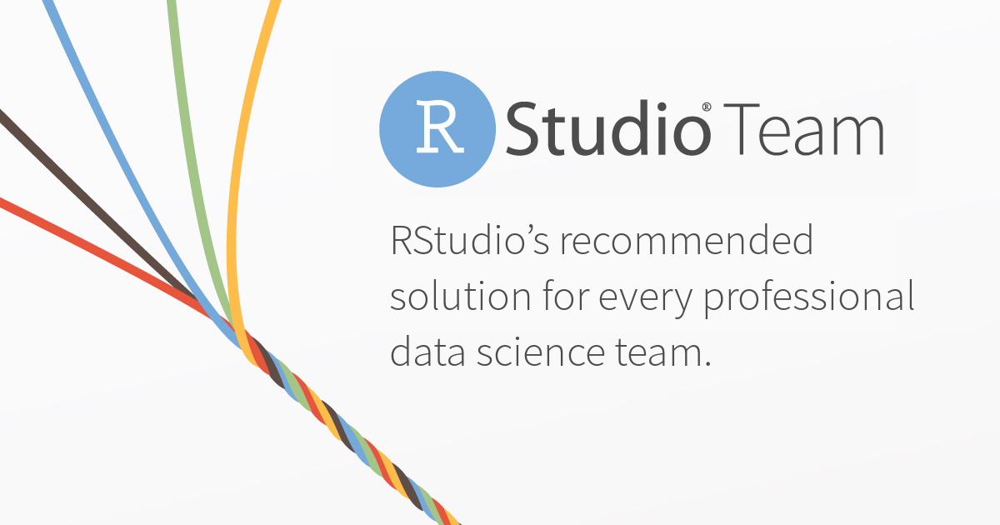

RStudio is excited to announce RStudio Team, a new software bundle that makes it easier and more economical to adopt our commercially licensed and supported professional offerings.  

RStudio Team includes RStudio Server Pro, RStudio Connect, and RStudio Package Manager. With RStudio Team, your data science team will be properly equipped to analyze data at scale using R and Python; manage R packages; and create and share plots, Shiny apps, R Markdown documents, REST APIs (with plumber), and even Jupyter Notebooks, with your entire organization. 

 
<a href="https://rstudio.youcanbook.me" button type="button"  style= "padding: 12px 20px; border: none; font-size: 12px; border-radius: 3px; cursor: pointer; background-color: #4c83b6; color: #fff; box-shadow: 0, 1px, 3px, 0px, rgba(0,0,0,0.10);">Contact Sales</a>&emsp;
<a href="https://www.rstudio.com/pricing/" button type="button"  style= "padding: 12px 20px; border: none; font-size: 12px; border-radius: 3px; cursor: pointer; background-color: #4c83b6; color: #fff; box-shadow: 0, 1px, 3px, 0px, rgba(0,0,0,0.10);">Configure your own RStudio Team</a>&emsp;
<a href="https://www.rstudio.com/quickstart-vm" button type="button"  style= "padding: 12px 20px; border: none; font-size: 12px; border-radius: 3px; cursor: pointer; background-color: #4c83b6; color: #fff; box-shadow: 0, 1px, 3px, 0px, rgba(0,0,0,0.10);">Evaluate RStudio Team QuickStart VM</a>&emsp;
<a href="https://www.rstudio.com/products/team/" button type="button"  style= "padding: 12px 20px; border: none; font-size: 12px; border-radius: 3px; cursor: pointer; background-color: #4c83b6; color: #fff; box-shadow: 0, 1px, 3px, 0px, rgba(0,0,0,0.10);">Learn More</a>
  

### RStudio Team Standard and RStudio Team Enterprise
RStudio Team is available in two configurations: Standard and Enterprise.

||RStudio Team Standard|RStudio Team Enterprise|
|:-----------|:-----------|:-----------|
|Number of [RStudio Server Pro Users](https://www.rstudio.com/products/rstudio-server-pro/)|5+|10+|
|Number of [RStudio Connect Users](https://www.rstudio.com/products/connect/)|20+|100+|
|RStudio [Package Manager Version](https://www.rstudio.com/products/package-manager/)|Base or Standard|Enterprise|
|Number of Key Activations|One per product*|Unrestricted|
|Staging or High Availability Servers|Optional Purchase|Included|

**RStudio Team Standard - an affordable place to start for smaller teams**

Team Standard fits the needs and budgets of smaller businesses and data science departments. For 5 RStudio Server Pro users and 20 RStudio Connect users sharing RStudio Package Manager Base, RStudio Team Standard starts at $22,000 per year. SMB and Academic discounts can further reduce the starting price, ensuring that every professional data science team can afford to start out with the right solution.

**RStudio Team Enterprise - unrestricted servers for larger deployments**

Team Enterprise has it all. For 10 RStudio Server Pro users and 100 RStudio Connect users sharing RStudio Package Manager Enterprise, RStudio Team Enterprise starts at $58,000, including all development, production, staging, high-availability, and disaster-recovery servers you require. With RStudio Team Enterprise, servers are unrestricted so you can deploy the professional data science configuration your teams need and support the virtualized IT infrastructure your organization wants. SMB, Academic, and volume discounts also apply.

### Visit our pricing page to get your estimate for RStudio Team

RStudio Team is a new bundled offering from RStudio that combines RStudio Server Pro, RStudio Connect, and RStudio Package Manager products. Now organizations using the open-source ecosystems of Python and R have what they need to analyze data effectively and inform critical business decisions across the enterprise with convenience, simplicity, and savings. Visit our [pricing page](https://www.rstudio.com/pricing/) to estimate your own price for RStudio Team. Except for a few RStudio Team Standard options, all you need to provide is the number of RStudio Server Pro users you want and the number of RStudio Connect users you will have. For most scenarios, we will estimate your total price on the spot. Please contact us at [sales@rstudio.com](mailto:sales@rstudio.com) to discuss your unique circumstances or to get a formal price quote.

