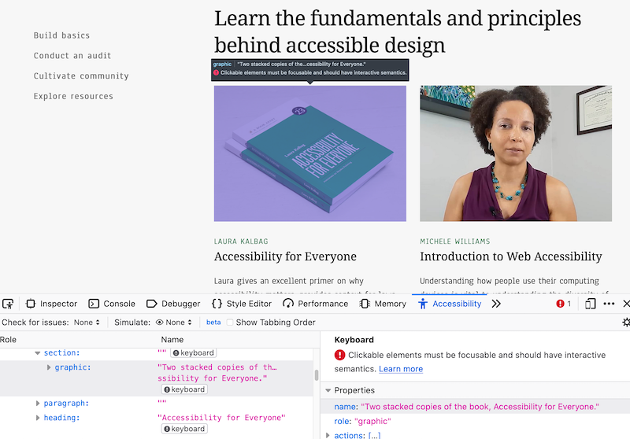
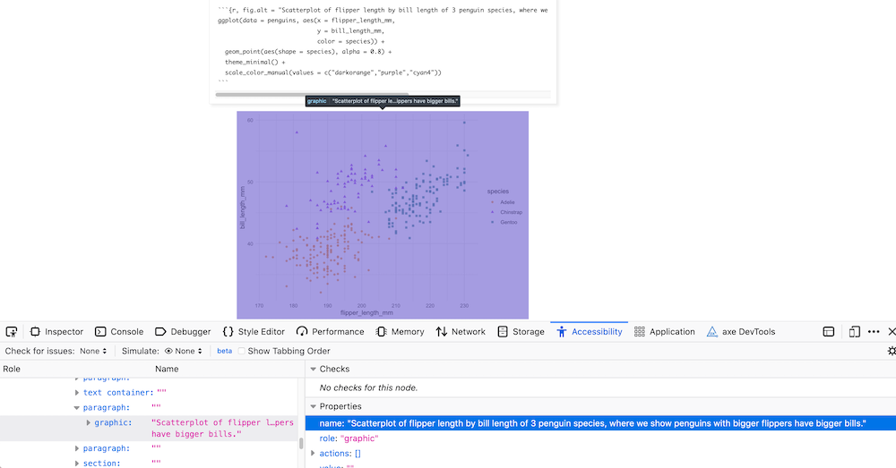
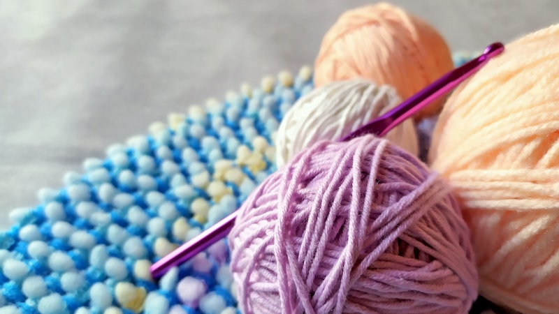

```{r include=FALSE}
knitr::opts_chunk$set(warning=FALSE, message=FALSE, fig.retina=2)
```


We are happy to share that **knitr** (<https://yihui.org/knitr/>) version 1.32 is now on CRAN. **knitr** is a package that executes all code embedded within an `.Rmd` file, and prepares the code output to be displayed within the R Markdown output document. 

|                                       Latest release                                       |
|:------------------------------------------------------------------------------------------:|
|  |

You can install the latest version from CRAN:

``` r
install.packages("knitr")
```


The latest version of the package includes an important new chunk option to add [alternative text](https://www.w3schools.com/tags/att_img_alt.asp) to figures produced in code chunks. This improves the accessibility of your knitted HTML outputs, and in the rest of this post, we wanted to show users how to effectively use this new code chunk option.

First of all, what is alt text? Here is the definition of alt text from [Webaim](https://webaim.org/techniques/alttext/):

> It is read by screen readers in place of images allowing the content and function of the image to be accessible to those with visual or certain cognitive disabilities.
>
> It is displayed in place of the image in browsers if the image file is not loaded or when the user has chosen not to view images.
> 
> It provides a semantic meaning and description to images which can be read by search engines or be used to later determine the content of the image from page context alone.

Here is an example from the [a11y project website](https://www.a11yproject.com/):

```{r, fig.alt = "Screenshot of accessibility details for an image on a11yproject.com.", echo=FALSE, out.width="90%", fig.align="center"}

```

You can see that the alt text for the image highlighted in purple says:

> "Two stacked copies of the book, Accessibility for Everyone."


This works well, but what about adding alt text for figures you produce with code? Previously, with code chunks that produced figures, knitr used the figure caption to create the alt text, and there was no way to create a caption and alt text for figures separately. This [feature](https://github.com/rstudio/rmarkdown/issues/1867) was originally requested by [Dr. Mine Dogucu](https://mdogucu.ics.uci.edu/). 

Why would you want to provide different caption and alt text for figures? As [JooYoung Seo pointed out](https://github.com/rstudio/rmarkdown/issues/1867#issuecomment-716200288), figure captions are used for relatively concise figure titles, whereas image alt text is intended to deliver more descriptive text-based information for assistive technologies like screen readers. Moreover, a screen reader will read both the caption and alt text, so using the same text for both can be frustrating to the user^[See <https://www.brandeis.edu/web-accessibility/understanding/images-alt-text.html>]. 

## How to add alt text 

You can now set the alt text using the new knitr code chunk option `fig.alt` for HTML-based R Markdown output (we explain below what happens with [other output formats](#limitations)). We'll use data from the [palmerpenguins package](https://github.com/allisonhorst/palmerpenguins) to illustrate usage with a [ggplot2](https://ggplot2.tidyverse.org/) plot.

```{r}
# install packages to run locally
# install.packages("palmerpenguins")
# install.packages("ggplot2")

library(palmerpenguins)
library(ggplot2)
```

Here is a scatterplot to start:


````
```{r, fig.alt = "Scatterplot of flipper length by bill length of 3 penguin species, where we show penguins with bigger flippers have bigger bills."}`r ''`
`r paste(knitr::knit_code$get('penguins'), collapse = '\n')`
```
````

```{r, penguins, echo=FALSE, fig.alt = "Scatterplot of flipper length by bill length of 3 penguin species, where we show penguins with bigger flippers have bigger bills.", fig.path = "figures/"}
ggplot(data = penguins, aes(x = flipper_length_mm,
                            y = bill_length_mm,
                            color = species)) +
  geom_point(aes(shape = species), alpha = 0.8) +
  scale_color_manual(values = c("darkorange","purple","cyan4")) 
```

Here is a visual check of the alt text that a screen reader could access, using "Inspect Accessibility Properties" in Firefox:



You may use your browser inspector to check that the alt text is set properly. Browsers have specific Accessibility inspectors, for example:

-   Firefox: [Accessibility Inspector](https://developer.mozilla.org/en-US/docs/Tools/Accessibility_inspector "Firefox's Accessibility Inspector website")

-   Chrome: [Accessibility features reference](https://developer.chrome.com/docs/devtools/accessibility/reference/ "Chrome's Accessibility features reference")

This chunk option can take either a single string or a vector of strings as input as well, if a code chunk produces more than one plot. For example: 

````
```{r, fig.alt = c("Informative alt text for plot 1", "Informative alt text for plot 2")}`r ''`
plot1
plot2
```
````

## Combining figure captions and alt text

By default, if you do not provide the `fig.alt` chunk option, the text in the figure caption provided by the `fig.cap` chunk option will be used as the alt text. You do not *have* to use `fig.cap` to use `fig.alt`- you may use each chunk option in isolation, but they will also work together. 

````
```{r fig.cap="Bigger flippers, bigger bills", fig.alt = "Scatterplot of flipper length by bill length of 3 penguin species, where we show penguins with bigger flippers have bigger bills."}`r ''`
ggplot(data = penguins, aes(x = flipper_length_mm,
                            y = bill_length_mm,
                            color = species)) +
  geom_point(aes(shape = species), alpha = 0.8) +
  scale_color_manual(values = c("darkorange","purple","cyan4")) 
```
````

```{r penguins, echo=FALSE, fig.cap="Bigger flippers, bigger bills", fig.alt = "Scatterplot of flipper length by bill length of 3 penguin species, where we show penguins with bigger flippers have bigger bills.", , fig.path = "figures/"}
```

## Reusing alt text across chunks

Since `fig.alt` was introduced in an earlier knitr release (v1.31), it gave us the opportunity to get and respond to feedback from early adopters. One [feature requested by Dr. Mine Çetinkaya-Rundel](https://github.com/yihui/knitr/issues/1959) was to make it possible to reuse alt text across code chunks. Many knitr users reuse code chunks using `ref.label` as a [chunk option](https://bookdown.org/yihui/rmarkdown-cookbook/reuse-chunks.html), and it would be nice for `fig.alt` (and other chunk options) to "come along for the ride" with the code.

Let's look at an example. Do you remember the penguins plot above? We can add a name to the code chunk so that we can reuse it later:


````
```{r penguins, fig.alt = "Scatterplot of flipper length by bill length of 3 penguin species, where we show penguins with bigger flippers have bigger bills.", fig.cap = "Bigger flippers, bigger bills"}`r ''`
# plotting code here 
```
````

Elsewhere in your document, if you'd like to show the same plot, you can use `ref.label='chunk_label'` as a chunk option with an empty chunk. With **knitr** 1.32, if you'd like to show the same plot *with the same chunk options*, you can combine `ref.label='chunk_label'` and `opts.label = TRUE` to carry over the chunk options when reusing the chunk. It does not matter if the code chunks referenced are before or after the code chunk that uses `ref.label`. An early code chunk can reference a chunk later in the same document.

For example, this empty chunk:

````
```{r ref.label = 'penguins', opts.label = TRUE}`r ''`
```
````

Produces this plot:

```{r penguins, opts.label = TRUE, , fig.path = "figures/"}
```

By setting `opts.label = TRUE`, the plot and all its chunk options were carried over, including the caption and alt text. Without it, only the code chunk would have been reused. You can also override any of the previously used chunk options by setting them again in this new code chunk. For example, we can change the `fig.cap`:

````
```{r ref.label = 'penguins', opts.label = TRUE, fig.cap = "Penguin plot, take 3"}`r ''`
```
````

Produces this plot:

```{r penguins, opts.label = TRUE, fig.cap = "Penguin plot, take 3", , fig.path = "figures/"}
```

By adding `fig.cap`, we have overridden the figure caption initially set in the original chunk.

To find out more, you may take a look at the [new knitr example](https://github.com/yihui/knitr-examples/blob/master/121-ref-label.Rmd). If you are not familiar with these options, you can find the documentation for knitr options at <https://yihui.org/knitr/options/>. To learn more about saving and reusing sets of chunk options with knitr, you can read more about `opts.label` and options templates in the [R Markdown cookbook](https://bookdown.org/yihui/rmarkdown-cookbook/opts-template.html). The special value `opts.label = TRUE` shown above means `opts.label = ref.label`, i.e., to inherit chunk options from chunks referenced by the `ref.label` option.

## Alt text for static images

For static images, you can include a figure caption using Markdown syntax:

``` {.markdown}

```

By default, this activates the [implicit_figures](https://pandoc.org/MANUAL.html#images) extension from Pandoc with output formats like `html_document`. This will lead to the same text being used for both captions and alt text. Setting [`fig_caption: FALSE`](https://bookdown.org/yihui/rmarkdown/r-code.html#figures) in the YAML of your `html_document` would prevent the caption if you only wanted to set the alt text. However, then you cannot have figure captions. Unfortunately, Pandoc does not yet offer a way to differentiate between figure captions and alt text. To work around this limitation, the `fig.alt` code chunk option can be used with `knitr::include_graphics`:

    ```{r, fig.alt = "Crochet (not knitting!) needle with colorful yarn", out.width="25%"}`r ''`
    
    ```

```{r, fig.alt = "Crochet (not knitting!) needle with colorful yarn", out.width="25%", echo=FALSE}

```


## Limitations

There is one major limitation to this feature, which is that it is currently limited to HTML-based output formats. We mentioned earlier that the default behavior is to use the figure caption provided by the `fig.cap` chunk option if you do not provide the `fig.alt` chunk option. This is true still for non-HTML based output formats like Word `.docx` documents: they will only respect `fig.cap`. You can follow this [issue on GitHub](https://github.com/yihui/knitr/issues/1967) to see our progress toward addressing this limitation in a future release.

## Alt text resources

You may learn more about how to write more informative alt text for data visualization in this [Nightingale article](https://medium.com/nightingale/writing-alt-text-for-data-visualization-2a218ef43f81).

Some additional resources:

+ [Using alt text properly, from the a11yproject](https://www.a11yproject.com/posts/2013-01-14-alt-text/ "Using alt text properly - a11yproject").
+ [WGBH Guide Guidelines for describing STEM images](https://www.wgbh.org/foundation/ncam/guidelines/guidelines-for-describing-stem-images)
+ [Diagram Center Accessible Images](http://diagramcenter.org/making-images-accessible.html)
+ [Diagram Center Accessible Math Tricks and Tips](http://diagramcenter.org/accessible-math-tools-tips-and-training.html)

Sincere thanks to [Liz Hare](http://www.doggenetics.com/) for recommending [these and other resources on Twitter](https://twitter.com/DogGeneticsLLC/status/1375267373586976769?s=20), and to [Silvia Canelón](https://silvia.rbind.io/) for sharing them with us.


## Acknowledgements

This latest release introduces numerous new features and bug fixes as well. You can read the [release notes](https://github.com/yihui/knitr/releases) to review all of the changes. A big thanks to the other 55 contributors who helped with the previous two knitr releases by discussing problems, proposing features, and contributing code in the [**knitr** repo on Github](https://github.com/yihui/knitr):

[&#x0040;abhsarma](https://github.com/abhsarma), [&#x0040;alusiani](https://github.com/alusiani), [&#x0040;andrew-fuller](https://github.com/andrew-fuller), [&#x0040;apreshill](https://github.com/apreshill), [&#x0040;arencambre](https://github.com/arencambre), [&#x0040;aschersleben](https://github.com/aschersleben), [&#x0040;atusy](https://github.com/atusy), [&#x0040;beanumber](https://github.com/beanumber), [&#x0040;Bisaloo](https://github.com/Bisaloo), [&#x0040;bounlu](https://github.com/bounlu), [&#x0040;cderv](https://github.com/cderv), [&#x0040;cpsievert](https://github.com/cpsievert), [&#x0040;cysouw](https://github.com/cysouw), [&#x0040;davidwales](https://github.com/davidwales), [&#x0040;deb-m](https://github.com/deb-m), [&#x0040;dmenne](https://github.com/dmenne), [&#x0040;dmurdoch](https://github.com/dmurdoch), [&#x0040;egoipse](https://github.com/egoipse), [&#x0040;ekatko1](https://github.com/ekatko1), [&#x0040;elbersb](https://github.com/elbersb), [&#x0040;englianhu](https://github.com/englianhu), [&#x0040;GitHunter0](https://github.com/GitHunter0), [&#x0040;gsrohde](https://github.com/gsrohde), [&#x0040;hermandr](https://github.com/hermandr), [&#x0040;iago-pssjd](https://github.com/iago-pssjd), [&#x0040;iMarcello](https://github.com/iMarcello), [&#x0040;jamarav](https://github.com/jamarav), [&#x0040;jangorecki](https://github.com/jangorecki), [&#x0040;jimhester](https://github.com/jimhester), [&#x0040;jooyoungseo](https://github.com/jooyoungseo), [&#x0040;julieinsan](https://github.com/julieinsan), [&#x0040;karoliskoncevicius](https://github.com/karoliskoncevicius), [&#x0040;kbvernon](https://github.com/kbvernon), [&#x0040;kmcbest](https://github.com/kmcbest), [&#x0040;knokknok](https://github.com/knokknok), [&#x0040;krivit](https://github.com/krivit), [&#x0040;ktrutmann](https://github.com/ktrutmann), [&#x0040;LTLA](https://github.com/LTLA), [&#x0040;matthewgson](https://github.com/matthewgson), [&#x0040;mine-cetinkaya-rundel](https://github.com/mine-cetinkaya-rundel), [&#x0040;MonteShaffer](https://github.com/MonteShaffer), [&#x0040;msgoussi](https://github.com/msgoussi), [&#x0040;muschellij2](https://github.com/muschellij2), [&#x0040;NickCH-K](https://github.com/NickCH-K), [&#x0040;phargarten2](https://github.com/phargarten2), [&#x0040;rasyidstat](https://github.com/rasyidstat), [&#x0040;rcst](https://github.com/rcst), [&#x0040;rnorberg](https://github.com/rnorberg), [&#x0040;rundel](https://github.com/rundel), [&#x0040;StephenGerry](https://github.com/StephenGerry), [&#x0040;thompsonsed](https://github.com/thompsonsed), [&#x0040;tomschenkjr](https://github.com/tomschenkjr), [&#x0040;TTT12-dumb-dumb](https://github.com/TTT12-dumb-dumb), [&#x0040;XiangyunHuang](https://github.com/XiangyunHuang), and [&#x0040;yihui](https://github.com/yihui).

```{r include=FALSE, eval=FALSE}
usethis::use_tidy_thanks(repo_spec = "yihui/knitr", from = "v1.30", to = "v1.32")
```
