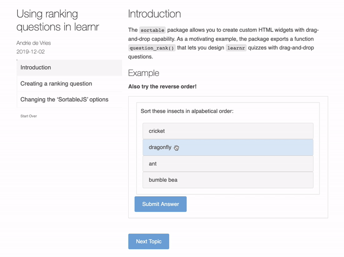

<blockquote>
<p class="body-md-regular body-sm-regular">
Please note that the information presented in this post reflects the package as it stood when initially released, and may now be outdated. For the most up-to-date information, kindly refer to <https://rstudio.github.io/learnr/>.
</p>
</blockquote>

[`learnr`](https://rstudio.github.io/learnr/) 0.10.0 has [been released](https://cran.r-project.org/package=learnr)! In this version of `learnr`, quiz questions have been expanded to allow for more question types.  [Text box](https://learnr-examples.shinyapps.io/quiz_question/#section-basic-question-types) quiz questions have been implemented natively within `learnr` and ranking questions have been implemented using the [`sortable`](https://rstudio.github.io/sortable/) package.

[
  
](https://andrie-de-vries.shinyapps.io/sortable_tutorial_question_rank/)

The [`learnr` R package](https://rstudio.github.io/learnr/) makes it easy to turn any [R Markdown](http://rmarkdown.rstudio.com) document into an interactive tutorial. Tutorials consist of content along with interactive components for checking and reinforcing understanding. Tutorials can include any or all of the following:

1. Narrative, figures, illustrations, and equations.

2. Code exercises (R code chunks that users can edit and execute directly).

3. Quiz questions.

4. Videos (supported services include YouTube and Vimeo).

5. Interactive Shiny components.

Tutorials automatically preserve work done within them, so if a user works on a few exercises or questions and returns to the tutorial later they can pick up right where they left off.

## Example

Test out the latest [interactive demo](https://andrie-de-vries.shinyapps.io/sortable_tutorial_question_rank/) of `sortable`'s ranking quiz question.
```{{r}}
learnr::run_tutorial("question_rank", "sortable")
```

<iframe width="100%" height="800" src="https://andrie-de-vries.shinyapps.io/sortable_tutorial_question_rank/" frameborder="0" style="border: 1.1px solid black"></iframe>

# Highlights

## New quiz questions

I am excited to announce that quiz questions are now mini shiny applications.  This opens the door to new and extendable question types, such as text box and ranking questions.  The [`sortable` R package](https://rstudio.github.io/sortable/) (an `htmlwidgets` wrapper around the drag-and-drop [`Sortable.js`](https://sortablejs.github.io/Sortable/)) has already implemented ranking questions using the new `learnr` quiz question API.  Thank you [Kenton Russell](https://twitter.com/timelyportfolio) for originally pursuing `sortable` and [Andrie de Vries](https://twitter.com/RevoAndrie) for connecting the two packages.

Please see [`learnr::run_tutorial("quiz_question", "learnr")`](https://learnr-examples.shinyapps.io/quiz_question/) for more information.

## Available tutorials

A new function, `available_tutorials()`, has been added. When called, this function will find all available tutorials in every installed R package.  If a `package` name is provided, only that package will be searched.  This functionality has been integrated into `run_tutorial` if a user provides a wrong tutorial name or forgets the package name.

Please see `?learnr::available_tutorials` for more information.

## Better pre-rendering

Using the latest `rmarkdown`, `learnr` tutorials are now agressively pre-rendered.  For package developers, please do not include the pre-rendered HTML files in your package as users will most likely need to recompile the tutorial. See [`learnr`'s `.Rbuildignore`](https://github.com/rstudio/learnr/blob/1b9ac06d2c4b052a60ce6f24ffc9c7af13294a59/.Rbuildignore#L18) for an example.


## Deploying dependencies not found

If your `learnr` tutorial contains _broken_ code within exercises for users to fix, the CRAN version of `packrat` will not find all of your dependencies to install when the tutorial is deployed. To deploy tutorials containing exercise code with syntax errors, install the development version of `packrat`. This version of `packrat` is able to find dependencies per R chunk, allowing for _broken_ R chunks within the tutorial file.

```{{r}}
remotes::install_github("rstudio/packrat")
```

## Breaking changes

`learnr` 0.10.0 includes some non-backward-compatible bug fixes involving a the browser's local storage.  It is possible that the browser's local storage will have a "cache miss" and existing users will be treated like new users.


# `learnr` change log


## New features

* Quiz questions are implemented using shiny modules (instead of htmlwidgets). ([#194](https://github.com/rstudio/learnr/pull/194))

* Aggressively rerender prerendered tutorials in favor of a cohesive exercise environment ([#169](https://github.com/rstudio/learnr/issues/169), [#179](https://github.com/rstudio/learnr/pull/179), and [rstudio/rmarkdown#1420](https://github.com/rstudio/rmarkdown/pull/1420))

* Added a new function, `safe`, which evaluates code in a new, safe R environment. ([#174](https://github.com/rstudio/learnr/pull/174))

## Minor new features and improvements

* Added the last evaluated exercise submission value, `last_value`, as an exercise checker function argument. ([#228](https://github.com/rstudio/learnr/pull/228))

* Added tabset support. ([#219](https://github.com/rstudio/learnr/pull/219) [#212](https://github.com/rstudio/learnr/issues/212))

* Question width will expand to the container width. ([#222](https://github.com/rstudio/learnr/pull/222))

* Available tutorial names will be displayed when no `name` parameter or an incorrect `name` is provided to `run_tutorial()`. ([#234](https://github.com/rstudio/learnr/pull/234))

* The `options` parameter was added to `question` to allow custom questions to pass along custom information.  See `sortable::sortable_question` for an example. ([#243](https://github.com/rstudio/learnr/pull/243))

* Missing package dependencies will ask to be installed at tutorial run time. (`@isteves`, [#253](https://github.com/rstudio/learnr/issues/253))

* When questions are tried again, the existing answer will remain, not forcing the user to restart from scratch. ([#270](https://github.com/rstudio/learnr/issues/270))

* A version number has been added to `question_submission` events.  This will help when using custom storage methods. ([#291](https://github.com/rstudio/learnr/pull/291))

* Tutorial storage on the browser is now executed directly on `indexedDB` using `idb-keyval` (dropping `localforage`).  This change prevents browser tabs from blocking each other when trying to access `indexedDB` data. ([#305](https://github.com/rstudio/learnr/pull/305))

## Bug fixes

* Fixed a spurious console warning when running exercises using Pandoc 2.0. ([#154](https://github.com/rstudio/learnr/issues/154))

* Added a fail-safe to try-catch bad student code that would crash the tutorial. ([`@adamblake`](https://github.com/adamblake), [#229](https://github.com/rstudio/learnr/issues/229))

* Replaced references to `checkthat` and `grader` in docs with [gradethis](https://github.com/rstudio-education/gradethis) ([#269](https://github.com/rstudio/learnr/issues/269))

* Removed a warning created by pandoc when evaluating exercises where pandoc was wanting a title or pagetitle. [#303](https://github.com/rstudio/learnr/pull/303)

