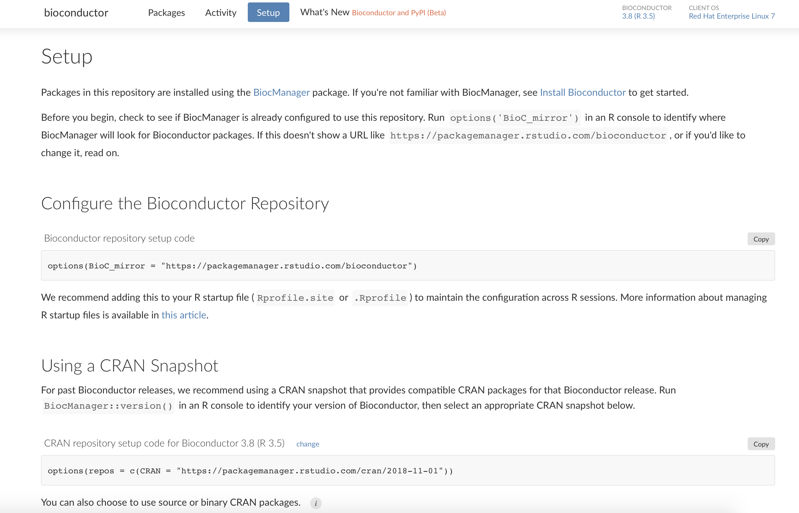

Packages are the heart of open source data science, but we know they
aren't always easy. Data scientists need access to ever-evolving tools
to do their best work, and IT needs to understand the risk of new
software while providing a stable environment for reproducible work.
[RStudio Package Manager](https://rstudio.com/products/package-manager)
helps teams work together to accomplish these goals. Today we are
excited to announce a greatly expanded focus, enabling teams to realize
these benefits across languages and ecosystems by adding support for
Bioconductor, beta support for Python packages from PyPI, and new
options for managing historical CRAN snapshots.

Ready to start? Visit the [RStudio Public Package
Manager](https://packagemanager.rstudio.com), a free and hosted service,
or [evaluate Package
Manager](https://rstudio.com/products/package-manager) for use within
your organization.

## Bioconductor

1.2.0 adds [first class support for
Bioconductor](https://docs.rstudio.com/rspm/1.2.0/admin/getting-started/configuration/#quickstart-bioconductor),
an ecosystem of R packages used in the life sciences. This release makes
it possible for data scientists in regulated or restricted environments
to install and manage Bioconductor, even in environments without direct
internet access. Teams can access Bioconductor packages using the
`BiocManager` client, or they can use `install.packages`. Bioconductor
packages can be combined with local packages and CRAN packages
seamlessly. Package Manager also makes Bioconductor analyses more
reproducible, by helping combine a Bioconductor release with a
corresponding CRAN snapshot. You no longer have to manually manage
incompatibilities between older Bioconductor releases and rolling CRAN
updates.

## Beta Support for PyPI

This release adds [beta support for mirroring Python
packages](https://docs.rstudio.com/rspm/1.2.0/admin/getting-started/configuration/#quickstart-pypi-packages)
from PyPI. By adding PyPI support, we intend to make it much easier for
multilingual teams to work together, and mitigate the challenges IT
organizations face in maintaining their own PyPI mirrors. One exciting
capability of Package Manager's PyPI support is the addition of PyPI
snapshots, enabling teams to time travel in Python just like they can in
R. You can also search for Python packages explore documentation, and
track package downloads. Package Manager is fully compatible with `pip`
and tools like `virtualenv` and `pyenv`.

PyPI support is in Beta. We hope you will try the feature and give us
your feedback, but please be cautious about integrating with production
systems. There are a few known limitations we will be addressing: adding
the option to share local Python packages and enabling fully air-gapped
users.

## Historic CRAN Snapshots

In this release, we've made [significant improvements for teams
navigating
CRAN](https://docs.rstudio.com/rspm/1.2.0/admin/getting-started/configuration/#quickstart-cran).
It is now possible to have granular control over which CRAN snapshots
are available, allowing administrators to present CRAN as it existed on
certain days. This addition unlocks new management strategies. For
instance, you can provide regular updates, but always stay one week
behind the latest changes.

More granular snapshot access also makes it easier to start using
Package Manager. Many teams have an existing set of packages they
installed from MRAN or a package library they created when they
installed R, and now you can easily recreate the same set in Package
Manager.

When compatible, we've also enabled date-based URLs, making it more
intuitive for data scientists to install packages from an understood
point in time.

These changes all extend to curated subsets of CRAN as well, so that
admins can provide approved packages from any point in time.

There are many additional improvements and bug fixes in this release,
please review the [full release
notes](https://docs.rstudio.com/rspm/news).

> #### Upgrade Planning
>
> Upgrading to 1.2.0 from 1.1.6 is a major upgrade. The upgrade will be
> automatic, but we recommend reviewing the release notes and ensuring
> the new desired capabilities are applied along with any relevant
> upgrades to storage requirements. If you are upgrading from an earlier
> version, be sure to consult the release notes for the intermediate
> releases, as well.

#### New to RStudio Package Manager?

[Download](https://rstudio.com/products/package-manager/) the 45-day
evaluation today to see how RStudio Package Manager can help you, your
team, and your entire organization access and organize R packages. Or
take a look at the free [Public Package
Manager](https://packagemanager.rstudio.com).

 To stay up to date with new releases of RStudio products, as well as information on minor updates, patches, and potential security notifications, we encourage you to subscribe to the Product Information email list at https://rstudio.com/about/subscription-management/
